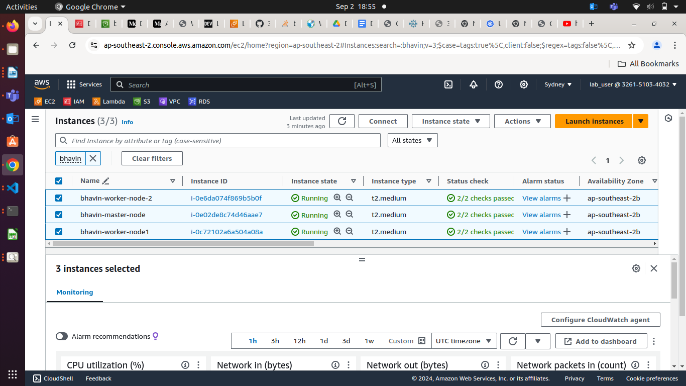

### **Project: Modular E-Commerce Application Deployment with S3 Integration**
**Project Duration:** 8 Hours

**Project Overview:** In this project, participants will deploy a modular e-commerce application using AWS services and DevOps tools. The application will be set up to fetch static assets from an S3 bucket. Participants will use Terraform to manage infrastructure as code with modularization, Docker for containerization, Kubernetes for orchestration, and Helm for deployments. The goal is to create a scalable, maintainable solution that integrates various AWS services and DevOps practices.

**Project Objectives:**

1. **Modular Infrastructure:** Use Terraform to create and manage modular infrastructure components.
1. **Static Asset Storage:** Store and fetch static assets from an S3 bucket.
1. **Containerization:** Package the application using Docker.
1. **Orchestration:** Deploy the application on Kubernetes.
1. **CI/CD Pipeline:** Automate the build and deployment process using Jenkins.
1. **Configuration Management:** Use Ansible for configuration management.
1. **Deployment:** Deploy the application using Helm charts.
1. **AWS Resources:** Utilize AWS EC2 free tier instances for deployment.
### **Project Tasks and Timeline**
**1. Set Up AWS EC2 Instances (30 Minutes)**

- Launch three EC2 instances of type t2.micro (1 master node, 2 worker nodes) within the free tier.
- Configure security groups to allow necessary ports (e.g., 22 for SSH, 80 for HTTP, 443 for HTTPS).
- SSH into the instances and prepare for Kubernetes installation.

**2. Create and Configure S3 Bucket (30 Minutes)**

- Create an S3 bucket to store static assets (e.g., product images, stylesheets).
- Upload sample static files to the S3 bucket.
- Configure bucket policy to allow read access for the application.

**3. Set Up Kubernetes Cluster (60 Minutes)**

- **On Master Node:**
  - Install Kubeadm, Kubelet, and Kubectl.
  - Initialize the Kubernetes cluster using Kubeadm.
  - Set up a network plugin (e.g., Calico, Flannel).
- **On Worker Nodes:**
  - Join worker nodes to the master node.


- **Verify Cluster:** Deploy a sample application (e.g., Nginx) to ensure the cluster is functional.

**4. Modularize Infrastructure with Terraform (60 Minutes)**

- **Create Terraform Modules:**
  - **Network Module:** Define VPC, subnets, and security groups.
  - **Compute Module:** Define EC2 instances for Kubernetes nodes.

**modules/nodes/main.tf**

```hcl
data "aws_vpc" "default" {
    id = "vpc-05c614e04b16b60c7"
}

# To use My IP as CIDR block
data "http" "myip" {
  url = "https://ipv4.icanhazip.com/"
}


resource "aws_instance" "master" {
    ami = var.ami
    instance_type = var.instance_type
    vpc_security_group_ids = [aws_security_group.master_sg.id]
    # subnet_id = var.pub_sub_id
  
    key_name = "bhavin-tf-key-${terraform.workspace}"

    tags = {
        Name = var.master_node_name
    }

}
resource "aws_security_group" "master_sg" {
    name = var.master_sg_name
    vpc_id = data.aws_vpc.default.id
    # subnet_id     = var.pub_sub_id

    ingress {
        from_port = var.ssh.from_port
        to_port = var.ssh.to_port
        protocol = "tcp"
        cidr_blocks = ["${chomp(data.http.myip.response_body)}/32"]

    }
    ingress {
        from_port = var.http.from_port
        to_port = var.http.to_port
        protocol = "tcp"
        cidr_blocks = var.cidr_blocks
    }
    ingress {
        from_port = var.https.from_port
        to_port = var.https.to_port
        protocol = "tcp"
        cidr_blocks = var.cidr_blocks
    }

# Allow ports for Master Node
    ingress {
        from_port = var.api_server.from_port
        to_port = var.api_server.to_port
        protocol = "tcp"
        cidr_blocks = var.cidr_blocks
    }
    ingress {
        from_port = var.etcd.from_port
        to_port = var.etcd.to_port
        protocol = "tcp"
        cidr_blocks = var.cidr_blocks
    }
    ingress {
        from_port = var.kubelet.from_port
        to_port = var.kubelet.to_port
        protocol = "tcp"
        cidr_blocks = var.cidr_blocks
    }
    ingress {
        from_port = var.schedular.from_port
        to_port = var.schedular.to_port
        protocol = "tcp"
        cidr_blocks = var.cidr_blocks
    }
    ingress {
        from_port = var.controller.from_port
        to_port = var.controller.to_port
        protocol = "tcp"
        cidr_blocks = var.cidr_blocks
    }

# OutBound Rule
    egress {
        from_port = 0
        to_port = 0
        protocol = "-1"
        cidr_blocks = var.cidr_blocks
    }
  
}

# Generate SSH Key
resource "aws_key_pair" "tf-key-pair" {
    key_name = "bhavin-tf-key-${terraform.workspace}"
    public_key = tls_private_key.rsa.public_key_openssh
}
resource "tls_private_key" "rsa" {
    algorithm = "RSA"
    rsa_bits = 4096
}
resource "local_file" "tf-key" {
    content = tls_private_key.rsa.private_key_pem
    filename = "bhavin-tf-key-${terraform.workspace}.pem"
    file_permission = 0400
}

# Create 2 Worker Node
resource "aws_instance" "worker" {
    count = length(var.worker_node_name)
    ami = var.ami
    instance_type = var.instance_type
    vpc_security_group_ids = [aws_security_group.worker_sg.id]

    key_name = "bhavin-tf-key-${terraform.workspace}"

    tags = {
        Name = var.worker_node_name[count.index]
    }
}

# Create SG for Worker Node

resource "aws_security_group" "worker_sg" {
    name = var.worker_sg_name
    vpc_id = data.aws_vpc.default.id

    ingress {
        from_port = var.ssh.from_port
        to_port = var.ssh.to_port
        protocol = "tcp"
        cidr_blocks = ["${chomp(data.http.myip.response_body)}/32"]

    }
    ingress {
        from_port = var.http.from_port
        to_port = var.http.to_port
        protocol = "tcp"
        cidr_blocks = var.cidr_blocks
    }
    ingress {
        from_port = var.https.from_port
        to_port = var.https.to_port
        protocol = "tcp"
        cidr_blocks = var.cidr_blocks
    }

# Allow worker Node ports
   ingress {
        from_port = var.api_server.from_port
        to_port = var.api_server.to_port
        protocol = "tcp"
        cidr_blocks = var.cidr_blocks
    }
    ingress {
        from_port = var.kubelet.from_port
        to_port = var.kubelet.to_port
        protocol = "tcp"
        cidr_blocks = var.cidr_blocks
    }
    ingress {
        from_port = var.nodeport.from_port
        to_port = var.nodeport.to_port
        protocol = "tcp"
        cidr_blocks = var.cidr_blocks
    }

# Create OutBound Rule
    egress {
        from_port = 0
        to_port = 0
        protocol = "-1"
        cidr_blocks = var.cidr_blocks
    }

}
```

**modules/nodes/variable.tf**
```hcl
variable "ami" {
  type = string
}
variable "instance_type" {
  type = string
}
variable "master_sg_name" {
  type = string
}

variable "ssh" {
    type = object({
      from_port = number
      to_port = number
    })
    default = {
      from_port = 22
      to_port = 22
    }

}

variable "cidr_blocks" {
    default = ["0.0.0.0/0"]
  
}

variable "http" {
    type = object({
      from_port = number
      to_port = number
    }) 
    default = {
      from_port = 80
      to_port = 80
    }
}

variable "https" {
    type = object({
      from_port = number
      to_port = number
    })
    default = {
      from_port = 443
      to_port = 443
    }
}

# Master Node allow ports

variable "api_server" {
    type = object({
      from_port = number
      to_port = number
    })
    default = {
      from_port = 6443
      to_port = 6443
    }
  
}
variable "etcd" {
    type = object({
      from_port = number
      to_port = number
    })
    default = {
      from_port = 2379
      to_port = 2380
    }
  
}
variable "kubelet" {
    type = object({
      from_port = number
      to_port = number
    })
    default = {
      from_port = 10250
      to_port = 10250
    }
}
variable "schedular" {
    type = object({
      from_port = number
      to_port = number
    })
    default = {
      from_port = 10259
      to_port = 10259
    }
  
}
variable "controller" {
    type = object({
      from_port = number
      to_port = number
    })
    default = {
      from_port = 10257
      to_port = 10257
    }
  
}

# Give Master Node Name
variable "master_node_name" {
    type = string 
}

# worker node
variable "worker_node_name" {
    type = list(string)

}
variable "worker_sg_name" {
    type = string
}

# worker node sg
variable "nodeport" {
    type = object({
      from_port = number
      to_port = number
    })
    default = {
      from_port = 30000
      to_port = 32767
    }
  
}
```

**Configure root main.tf file** 

```hcl
module "nodes" {
    source = "./modules/nodes"
    ami = "ami-0892a9c01908fafd1"
    instance_type = "t2.medium"
    master_sg_name = "bhavin-master-sg"
    master_node_name = "bhavin-master-node"

    worker_sg_name = "bhavin-worker-sg"
    worker_node_name = ["bhavin-worker-node1", "bhavin-worker-node-2"]    

    
}
```

**OutPut Infrastructure created**

  - Nodes Created



  - Worker Node SG


  - Master Node SG


  - 

  - **Storage Module:** Define S3 bucket for static assets.
- **Main Configuration:**
  - Create a main.tf file to utilize the modules and provision the entire infrastructure.
- **Initialize and Apply:**
  - Run terraform init, terraform plan, and terraform apply to provision the infrastructure.

**5. Containerize the Application with Docker (60 Minutes)**

- **Dockerfile:** Write Dockerfile for the e-commerce application.

```Dockerfile
FROM nginx:1.21-alpine


COPY index.html /usr/share/nginx/html/index.html

EXPOSE 80

ENTRYPOINT ["nginx", "-g", "daemon off;"]
```

**write index.html to fetch static files from S3 Bucket**

```html
<!DOCTYPE html>
<html>
<head>
    <meta charset="UTF-8">
    <meta name="viewport" content="width=device-width, initial-scale=1.0">
    <title>Custom Page form s3</title>
</head>
<body>
    <h1>Loading content from S3...</h1>
    </img>
</body>
</html>
```

- **Build Docker Image:** Build Docker images using the Dockerfile.

```
docker build -t "username/image_name" .
```


**Run docker image on locally**

```
docker run -d -p 82:80 "username/imagename"
```


**Ensure Your docker container is serve static containt from S3**


- **Push to Registry:** Push Docker images to a Docker registry (e.g., Docker Hub, Amazon ECR).
```
docker push "username/imagename"
```

**6. Configure Ansible for Application Deployment (30 Minutes)**

- **Ansible Playbooks:** Write playbooks to configure Kubernetes nodes and deploy the application.
- **Test Playbooks:** Run Ansible playbooks to ensure correct configuration.

**7. Set Up Jenkins for CI/CD (60 Minutes)**

- **Deploy Jenkins:** Deploy Jenkins on Kubernetes using a Helm chart.
- **Configure Pipeline:**
  - Create a Groovy pipeline script in Jenkins for CI/CD.
  - The pipeline should include stages for:
    - **Source Code Checkout:** Pull code from the Git repository.
    - **Build Docker Image:** Build Docker images from the Dockerfile.
    - **Push Docker Image:** Push Docker image to Docker registry.
    - **Deploy to Kubernetes:** Use Helm charts to deploy the Docker image to Kubernetes.

**8. Deploy the Application with Helm (60 Minutes)**

- **Create Helm Charts:** Define Helm charts for the e-commerce application deployment.
  - Include configuration to fetch static files from the S3 bucket.

**Ensure Your both worker node has joined to the Master node**


**Setup Helm Chart first time**

```
curl https://baltocdn.com/helm/signing.asc | gpg --dearmor | sudo tee /usr/share/keyrings/helm.gpg > /dev/null
sudo apt-get install apt-transport-https --yes
echo "deb [arch=$(dpkg --print-architecture) signed-by=/usr/share/keyrings/helm.gpg] https://baltocdn.com/helm/stable/debian/ all main" | sudo tee /etc/apt/sources.list.d/helm-stable-debian.list
sudo apt-get update
sudo apt-get install helm
```

**Create Helm Chart Project**
```
helm create myapp
```

**Project structure should be like this**
```
myapp/
├── charts
├── Chart.yaml
├── templates
│   ├── deployment.yaml
│   ├── _helpers.tpl
│   ├── hpa.yaml
│   ├── ingress.yaml
│   ├── NOTES.txt
│   ├── serviceaccount.yaml
│   ├── service.yaml
│   └── tests
│       └── test-connection.yaml
└── values.yaml
```

**Edit values.yaml file to use variable in deployment file**
**values.yaml**
```yml
# Edit blow sections.
replicaCount: 1

image:
  repository: bhavin1099/app
  pullPolicy: IfNotPresent
  # Overrides the image tag whose default is the chart appVersion.
  tag: "latest"

service:
  type: NodePort
  port: 80
  NodePort: 30001

# AutoScaling bydefault off
# Replicaset is default 1
```

**service.yaml**
```yml
apiVersion: v1
kind: Service
metadata:
  name: {{ include "myapp.fullname" . }}
  labels:
    {{- include "myapp.labels" . | nindent 4 }}
spec:
  type: {{ .Values.service.type }}
  ports:
    - port: {{ .Values.service.port }}
      targetPort: http
      protocol: TCP
      name: http
  selector:
    {{- include "myapp.selectorLabels" . | nindent 4 }}
```

**Create package of your helm chart**
```
cd myapp/
helm  package .
mv myapp.zip ../
cd ..
```

**Deploy app by helm**
```
helm install "chartname" "directory of chart"
helm install myapp ./myapp.zip
```


- **Install Helm Charts:** Deploy the application to Kubernetes using Helm charts.
- **Verify Deployment:** Ensure the application is running correctly and fetching static files from S3.

**Ensure Your Apps is Deployed**


**Ensure NodePort Service is created**


**After deployed ensure in which nodes your apps is deployed**
```
kubectl get pods -o wide
```

**We need to forward traffic form NodePort to our local port**
```
kubectl port-forward svc/service-name "nodeport:local-port"

kubectl port-forward svc/myapp 32493:80
```


Search private ip of above into your aws account worker node


**That is worker-node-1 , copy that nodes public ip and search on browser**
```
ip:"port assing by nodeport"
```
**Ensure your worker node SG has opened NodePort range 3000-32767**


**9. Clean Up Resources (30 Minutes)**

- **Terminate Resources:** Use Terraform to destroy all provisioned infrastructure by running terraform destroy.
### **Deliverables**
1. **Git Repository:** Contains application code, Dockerfiles, Helm charts, Ansible playbooks, and Terraform configurations.
1. **S3 Bucket:** Configured and populated with static assets.
1. **Kubernetes Cluster:** Functional Kubernetes cluster with the e-commerce application deployed.
1. **Docker Images:** Built and pushed Docker images.
1. **Terraform Modules:** Modular Terraform configurations for infrastructure provisioning.
1. **Ansible Configuration:** Ansible playbooks for environment and application configuration.
1. **Jenkins CI/CD Pipeline:** Automated pipeline for continuous integration and deployment.
1. **Helm Deployments:** E-commerce application deployed using Helm charts, integrating with S3 for static files.
1. **Clean-Up:** Termination of all AWS resources after project completion.

