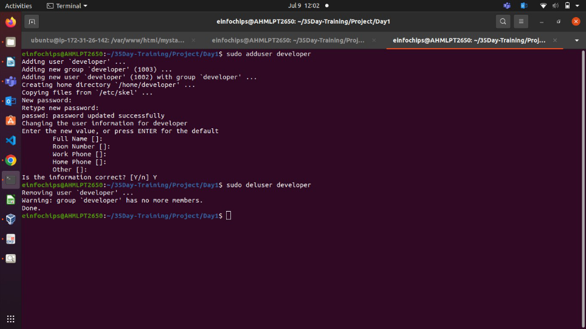

**35 Days Training Day 1 Project**

Project Breakdown

Part 1: Creating and Editing Text Files (20 minutes)

Scenario: You are tasked with documenting the configurations and settings for a new server.

You'll use different text editors to create and update these documents. 1. Using Nano Create a file server\_config.txt using Nano:

nano server\_config.txt

○

Add the following content:

Server Name: WebServer01

IP Address: 192.168.1.100

OS: Ubuntu 20.04

**Using Vi**

Edit the same file with Vi:

vi server\_config.txt 

￿ 

Append the following text: 

Installed Packages: Apache, MySQL, PHP 

￿ 

- Save and exit (Esc, :wq). 

**Using Vim** 

Further edit the file with Vim: 

vim server\_config.txt 

￿ 

Add the following text: 

Configuration Complete: Yes Save and exit (Esc, :wq). 

**Part 2: User & Group Management (20 minutes)**

**Scenario:** You need to set up user accounts and groups for a new team joining the project.

**1. Adding/Removing Users**

**Add a new user developer :** sudo adduser developer

**Remove the user developer :** sudo deluser developer

**Managing Groups**

**Create a group devteam :**

sudo groupadd devteam

**Add the user developer to the devteam group:**

sudo usermod -aG devteam developer

**Remove the user developer from the devteam group:** sudo gpasswd -d developer devteam

**Part 3: File Permissions Management (20 minutes)**

**Scenario:** Ensure that only the appropriate users have access to specific files and directories.

**Understanding File Permissions**

View permissions for server\_config.txt : ls -l server\_config.txt

**Changing Permissions and Ownership**

Change permissions to read/write for the owner and read-only for others: chmod 644 server\_config.txt

Verify the change: ls -l server\_config.txt

Change the owner to developer and the group to devteam : sudo chown developer:devteam server\_config.txt

￿

Verify the change: ls -l server\_config.txt

**Creating and Deploying a Static Website with Apache2**

**Preparation (5 minutes)**

- Ensure you have access to a Linux environment (e.g., virtual machines, EC2 instances, or local installations) with sudo privileges.

**Activity Breakdown**

**Part 1: Installing Apache2 (5 minutes)**

1. **Update Package Lists**

Open the terminal and run: sudo apt update

2. **Install Apache2**

Install Apache2 by running: sudo apt install apache2

3. **Start and Enable Apache2**

Start the Apache2 service: sudo systemctl start apache2

Enable Apache2 to start on boot: sudo systemctl enable apache2

**Verify Installation**

- Open a web browser and navigate to http://your\_server\_ip . You should see the Apache2 default page.

My Ec2 Instance Public IP was 65.2.137.210.

**Part 2: Creating the Website (10 minutes) Navigate to the Web Directory**

Change to the web root directory: cd /var/www/html

**2. Create a New Directory for the Website**
