# Jenkins Pipeline Project
#### Overview:
###### Create Pipeline for if first Project get success with stable means , if it will successfully Build and generate Artifacts, then Second Project will be triggered and Build. Using **Private Repo** only.

##### We have Project for Compile and Test. We have POM.xml for that.

#### Step 1:- Create Job for Compile
##### 1.1 Create FreeStyle Project for Compile.

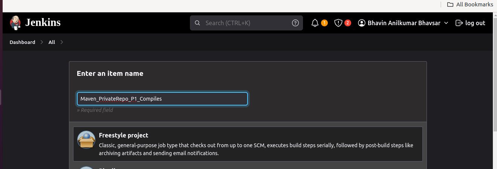

##### 1.2 Go to Source Code Management Section
##### 1.3 Enter Your Private Git Repo URL.
##### 1.4 If you want to Build Project using Private Repo You required Your Git Username and password. In Password Enter Your Git Token. If not then generate.

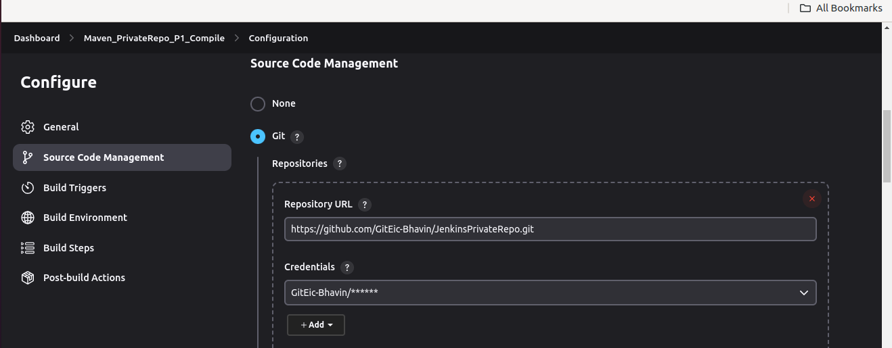

##### 1.5 See How to Give Git Credential for Private Repo

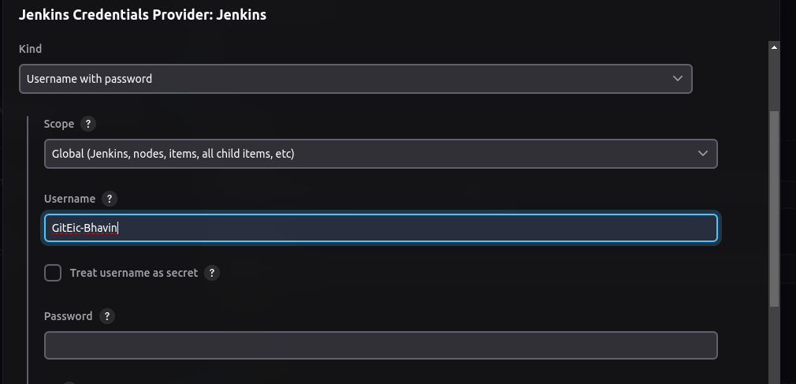

##### 1.6 Enter Git Branch In which Your code is available.

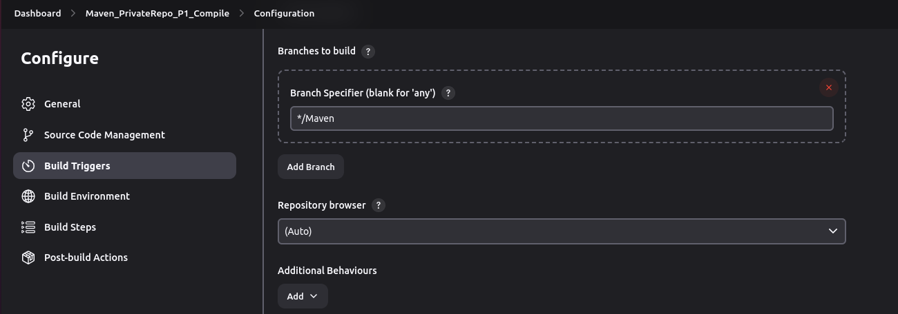

##### 1.7 Now, Go to Build Step for Perform compile type goal.
##### This goal is defined in POM.xml file
##### in POM.xml file goal is defined for compile and test.
##### If i run compile goal then Maven will look for all dependencies in this POM.xml file and Install it to make compile file.

##### 1.8 If you want to receive an email while a job get failed or not build as stable then refer below steps.

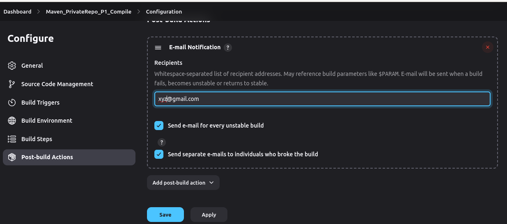

##### 1.9 Click on Apply and Save.

##### 1.10 To Build a job click on Build Now Option.

#### Step 2:- Create Job for Test.
##### Perform same step above. Just change from compile to test.

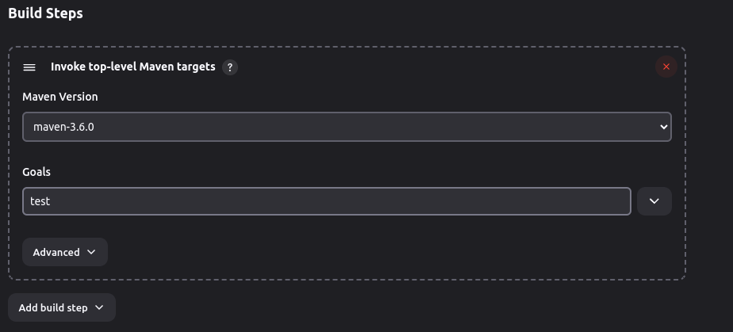

##### Click on Apply and Save then Build Now to Build a job.

##### NOTE: In my case, POM.xml has defined various dependencies which support both maven 3.6.0 and maven 9.0.0
##### To use this maven version i install this mannually.

#### Step 3:- Create Pipeline for If first Project successfully Build then second Project should Trigger and Build.

##### Follow Steps from 1.1 to 1.7 
##### Go to Post Build Action
##### Choose second Project which should trigger after first Project Build Successfully.
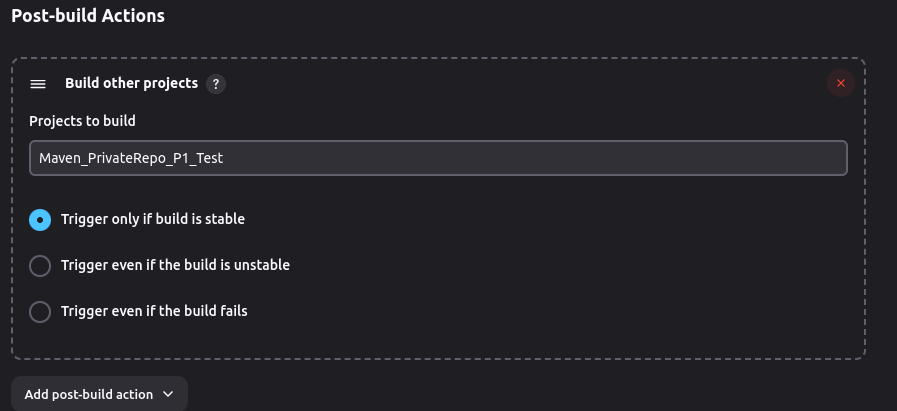

##### Option:-1  Trigger after if build is stable.
###### Build is stable -- Last Project is build with Artifact.

##### Option:-1 Trigger even if the build is unstable
###### Build is unstable -- Last Project is build but does not create Artifact. which means Last Project does not build successfully.

#### Option:-3 Trigger even if the build fails
###### Build fails -- Suppose if last project have 4 steps to build.
###### If any steps dont build and stuck or get error, then Jenkins will be stopped from that step and remains step would not perform.

##### Now, Click on Save and Build Now.
##### Here, First P1_Compile will Build.
##### If P1_Compile will build successfully then second Project P1_Test will Triggered and Build.
##### You can add Number of Project one by one in above step for **Post Build Action**.

#### If you have Number of Project and Jobs and want to See its flow graphycally , You can do it by Pipeline View Feature.

###### To use this feature we required Plugin called Build Pipeline Plugin.
###### Bydefault Jenkins does not installe this plugin. we have to mannually install plugin.

##### To Install Pulgin Build Pipeline follow below steps
Go to Manage Jenkins > Plugin > Available Plugin.
Search for Build Pipeline.

Install it and choose restart Option.

##### Go to New view Option
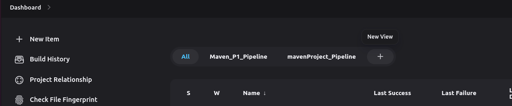

##### Crate Pipeline View
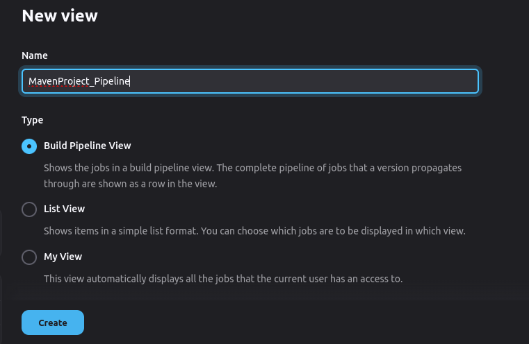

##### Go to Pipeline and Select Initial job. that is Compile

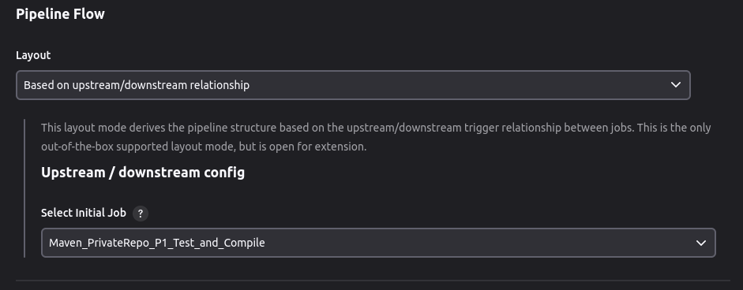

##### Go to Trigger Option and choose below Option

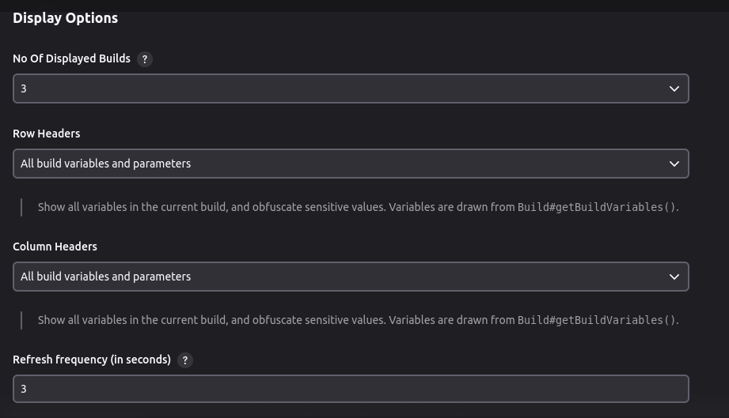

##### Go to Display Option.

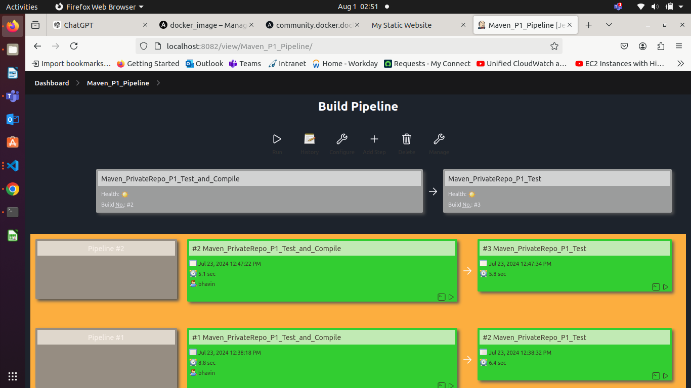