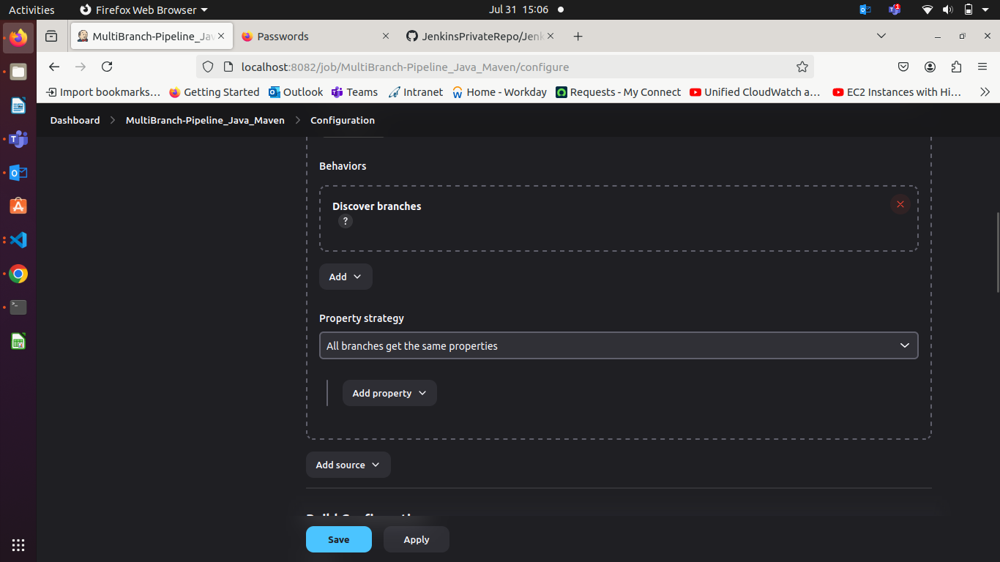

### **Project is from Page 15**

### **1\. Global Environment Variables**

When you define environment variables globally in Jenkins (via `Manage Jenkins` \> `Configure System`), they are available to all jobs and pipelines running on the Jenkins instance. These variables are fetched by Jenkins and injected into the pipeline’s environment.

**How It Works**:

* **Configuration**: You define global environment variables in the Jenkins global configuration page.  
* **Pipeline Access**: In the `Jenkinsfile`, you can access these variables directly by their names. Jenkins resolves these names to their values during runtime.

**Example**: If you define `MAVEN_HOME` globally:

* Name: `MAVEN_HOME`  
* Value: `/usr/local/maven`

In the `Jenkinsfile`:

`sh "${env.MAVEN_HOME}/bin/mvn clean install"`

Jenkins replaces `${env.MAVEN_HOME}` with `/usr/local/maven`.

### **2\. Environment Variables in Pipeline Job Configuration**

When you define environment variables within a specific pipeline job’s configuration:

* **Configuration**: You add environment variables under the job configuration or in the pipeline's `environment` block.  
* **Pipeline Access**: These variables are available only to that specific job or pipeline.

**Example in Pipeline Job Configuration**: If you define `DEPLOY_SERVER` and `DEPLOY_PATH` in the pipeline configuration:

* Name: `DEPLOY_SERVER`  
* Value: `your-server`  
* Name: `DEPLOY_PATH`  
* Value: `/path/to/deploy`

In the `Jenkinsfile`:

`sh "scp target/${env.APP_NAME}.jar user@${env.DEPLOY_SERVER}:${env.DEPLOY_PATH}"`

### **Multi-Branch Pipelines**

A Multi-Branch Pipeline in Jenkins is a powerful feature that allows you to automatically create and manage Jenkins pipelines for multiple branches in a repository. This setup is highly useful for projects with multiple branches like development, feature, and production branches. Each branch can have its own pipeline configuration based on the `Jenkinsfile` present in that branch.

#### **Key Features**

1. **Automatic Branch Discovery**: Jenkins automatically discovers branches with a `Jenkinsfile` in your repository and creates pipeline jobs for them.  
1. **Branch-Specific Pipelines**: Each branch can have its own pipeline configuration, allowing you to customize the CI/CD process per branch.  
1. **PR and Merge Requests**: Jenkins can handle pull requests or merge requests, running pipelines on code changes before merging.

### **Use Cases**

#### **1\. Feature Branches**

**Use Case**: Run tests and builds for feature branches to ensure code quality before merging into the main branch.

**Example `Jenkinsfile`**:

`pipeline {`  
    `agent any`

    `stages {`  
        `stage('Checkout') {`  
            `steps {`  
                `git url: 'https://github.com/your-repo/your-project.git', branch: env.BRANCH_NAME`  
            `}`  
        `}`

        `stage('Build') {`  
            `steps {`  
                `script {`  
                    `echo "Building feature branch: ${env.BRANCH_NAME}"`  
                    `withMaven(maven: 'Maven-3.9.0') {`  
                        `sh 'mvn clean package'`  
                    `}`  
                `}`  
            `}`  
        `}`

        `stage('Test') {`  
            `steps {`  
                `script {`  
                    `echo "Running tests on feature branch: ${env.BRANCH_NAME}"`  
                    `withMaven(maven: 'Maven-3.9.0') {`  
                        `sh 'mvn test'`  
                    `}`  
                `}`  
            `}`  
        `}`  
    `}`

    `post {`  
        `always {`  
            `echo 'Pipeline finished.'`  
        `}`  
        `success {`  
            `echo 'Pipeline succeeded.'`  
        `}`  
        `failure {`  
            `echo 'Pipeline failed.'`  
        `}`  
    `}`  
`}`

**Explanation**: This pipeline checks out the code from a feature branch, builds it using Maven, and runs tests. Each feature branch will trigger this pipeline automatically when changes are pushed.

#### **2\. Development Branches**

**Use Case**: Run integration tests and static analysis tools on development branches to ensure code quality and integration before moving to staging or production.

**Example `Jenkinsfile`**:

`pipeline {`  
    `agent any`

    `stages {`  
        `stage('Checkout') {`  
            `steps {`  
                `git url: 'https://github.com/your-repo/your-project.git', branch: env.BRANCH_NAME`  
            `}`  
        `}`

        `stage('Build') {`  
            `steps {`  
                `script {`  
                    `echo "Building development branch: ${env.BRANCH_NAME}"`  
                    `withMaven(maven: 'Maven-3.9.0') {`  
                        `sh 'mvn clean package'`  
                    `}`  
                `}`  
            `}`  
        `}`

        `stage('Integration Test') {`  
            `steps {`  
                `script {`  
                    `echo "Running integration tests on development branch: ${env.BRANCH_NAME}"`  
                    `withMaven(maven: 'Maven-3.9.0') {`  
                        `sh 'mvn verify'`  
                    `}`  
                `}`  
            `}`  
        `}`

        `stage('Static Analysis') {`  
            `steps {`  
                `script {`  
                    `echo "Performing static analysis on development branch: ${env.BRANCH_NAME}"`  
                    `sh 'mvn pmd:pmd'`  
                `}`  
            `}`  
        `}`  
    `}`

    `post {`  
        `always {`  
            `echo 'Pipeline finished.'`  
        `}`  
        `success {`  
            `echo 'Pipeline succeeded.'`  
        `}`  
        `failure {`  
            `echo 'Pipeline failed.'`  
        `}`  
    `}`  
`}`

**Explanation**: This pipeline is set up for development branches and includes additional stages for integration testing and static analysis.

#### **3\. Master/Production Branch**

**Use Case**: Deploy code from the master branch to production after successful builds and tests.

**Example `Jenkinsfile`**:

`pipeline {`  
    `agent any`

    `stages {`  
        `stage('Checkout') {`  
            `steps {`  
                `git url: 'https://github.com/your-repo/your-project.git', branch: env.BRANCH_NAME`  
            `}`  
        `}`

        `stage('Build') {`  
            `steps {`  
                `script {`  
                    `echo "Building production branch: ${env.BRANCH_NAME}"`  
                    `withMaven(maven: 'Maven-3.9.0') {`  
                        `sh 'mvn clean package'`  
                    `}`  
                `}`  
            `}`  
        `}`

        `stage('Deploy') {`  
            `when {`  
                `branch 'master'`  
            `}`  
            `steps {`  
                `script {`  
                    `echo "Deploying to production from branch: ${env.BRANCH_NAME}"`  
                    `sh 'deploy.sh'`  
                `}`  
            `}`  
        `}`  
    `}`

    `post {`  
        `always {`  
            `echo 'Pipeline finished.'`  
        `}`  
        `success {`  
            `echo 'Pipeline succeeded.'`  
        `}`  
        `failure {`  
            `echo 'Pipeline failed.'`  
        `}`  
    `}`  
`}`

**Explanation**: This pipeline specifically deploys code from the master branch. The `when` directive ensures that the deploy step is executed only for the master branch.

#### **4\. Pull Request Branches**

**Use Case**: Run a pipeline for pull requests to validate code changes before they are merged into the main branches.

**Example `Jenkinsfile`**:

`pipeline {`  
    `agent any`

    `stages {`  
        `stage('Checkout') {`  
            `steps {`  
                `git url: 'https://github.com/your-repo/your-project.git', branch: env.CHANGE_BRANCH`  
            `}`  
        `}`

        `stage('Build') {`  
            `steps {`  
                `script {`  
                    `echo "Building pull request branch: ${env.CHANGE_BRANCH}"`  
                    `withMaven(maven: 'Maven-3.9.0') {`  
                        `sh 'mvn clean package'`  
                    `}`  
                `}`  
            `}`  
        `}`

        `stage('Test') {`  
            `steps {`  
                `script {`  
                    `echo "Running tests on pull request branch: ${env.CHANGE_BRANCH}"`  
                    `withMaven(maven: 'Maven-3.9.0') {`  
                        `sh 'mvn test'`  
                    `}`  
                `}`  
            `}`  
        `}`  
    `}`

    `post {`  
        `always {`  
            `echo 'Pipeline finished.'`  
        `}`  
        `success {`  
            `echo 'Pipeline succeeded.'`  
        `}`  
        `failure {`  
            `echo 'Pipeline failed.'`  
        `}`  
    `}`  
`}`

**Explanation**: This pipeline handles pull requests, checking out the branch associated with the pull request (`CHANGE_BRANCH`), building it, and running tests.

### **Multi-Branch Pipeline for a Simple Java Maven Project**

#### **1\. Setup the Project Repository**

Let's assume you have a Git repository with a Java Maven project. Here’s a simple example of the project structure:

`my-java-app/`  
`├── pom.xml`  
`└── src`  
    `└── main`  
        `└── java`  
            `└── com`  
                `└── example`  
                    `└── App.java`

**`pom.xml`**

`<?xml version="1.0" encoding="UTF-8"?>`  
`<project xmlns="http://maven.apache.org/POM/4.0.0"`  
         `xmlns:xsi="http://www.w3.org/2001/XMLSchema-instance"`  
         `xsi:schemaLocation="http://maven.apache.org/POM/4.0.0 http://maven.apache.org/POM/4.0.0/maven-4.0.0.xsd">`  
    `<modelVersion>4.0.0</modelVersion>`  
    `<groupId>com.example</groupId>`  
    `<artifactId>my-java-app</artifactId>`  
    `<version>1.0-SNAPSHOT</version>`  
    `<properties>`  
        `<maven.compiler.source>1.8</maven.compiler.source>`  
        `<maven.compiler.target>1.8</maven.compiler.target>`  
    `</properties>`  
`</project>`

**`App.java`**

`package com.example;`

`public class App {`  
    `public static void main(String[] args) {`  
        `System.out.println("Hello, Maven!");`  
    `}`  
`}`

#### **2\. Create Branches**

Create different branches to demonstrate the multi-branch pipeline functionality:

`cd my-java-app`  
`git init`  
`git add .`  
`git commit -m "Initial commit"`  
`git branch feature-branch-1`  
`git branch feature-branch-2`  
`git checkout feature-branch-1`  
`# Modify App.java for feature-branch-1`  
`echo "System.out.println(\"Feature Branch 1!\");" > src/main/java/com/example/App.java`  
`git add src/main/java/com/example/App.java`  
`git commit -m "Update App.java in feature-branch-1"`  
`git push -u origin feature-branch-1`

`git checkout feature-branch-2`  
`# Modify App.java for feature-branch-2`  
`echo "System.out.println(\"Feature Branch 2!\");" > src/main/java/com/example/App.java`  
`git add src/main/java/com/example/App.java`  
`git commit -m "Update App.java in feature-branch-2"`  
`git push -u origin feature-branch-2`

#### **3\. Create a Jenkinsfile**

Create a `Jenkinsfile` in the root of your repository. This file defines how Jenkins will build and test your application.

**`Jenkinsfile`**

`pipeline {`  
    `agent any`  
    `stages {`  
        `stage('Build') {`  
            `steps {`  
                `echo 'Building the Java application...'`  
                `sh 'mvn clean package'`  
            `}`  
        `}`  
        `stage('Test') {`  
            `steps {`  
                `echo 'Running tests...'`  
                `// Add your test commands here if you have tests`  
            `}`  
        `}`  
    `}`  
    `post {`  
        `success {`  
            `echo 'Build and test succeeded!'`  
        `}`  
        `failure {`  
            `echo 'Build or test failed!'`  
        `}`  
    `}`  
`}`

#### **4\. Configure Jenkins**

1. **Install Required Plugins** Ensure Jenkins has the following plugins installed:  
   * **Git Plugin**: To pull code from Git repositories.  
   * **Pipeline Plugin**: To support pipeline jobs.  
   * **Multi-Branch Pipeline Plugin**: To support multi-branch pipelines.  
1. **Create a Multi-Branch Pipeline Job**  
   * Go to Jenkins Dashboard.  
   * Click on `New Item`.  
   * Enter a name for your job (e.g., `MyJavaApp-MultiBranch`).  
   * Select `Multi-branch Pipeline` and click `OK`.  
1. **Configure the Multi-Branch Pipeline Job**  
   * **Branch Sources**:  
     * Add a source for your Git repository.  
     * Configure the repository URL and credentials (if required).  
   * **Build Configuration**:  
     * Jenkins will automatically scan branches for `Jenkinsfile` and create a pipeline for each branch.  
1. **Set Up Webhooks (Optional but Recommended)**  
   * To trigger builds automatically when code is pushed to the repository, configure a webhook in your Git repository that points to your Jenkins server.

#### **5\. Run and Monitor**

* Jenkins will scan your repository and create pipelines for each branch with a `Jenkinsfile`.  
* For each branch, Jenkins will execute the pipeline defined in `Jenkinsfile` and provide build statuses.

### **Understanding Docker Image Layers**

1. **Base Layer**: The starting point of your Docker image, typically an official or minimal base image (e.g., `alpine`, `ubuntu`).  
1. **Intermediate Layers**: Each instruction in your Dockerfile (e.g., `RUN`, `COPY`, `ADD`) adds a new layer on top of the previous ones.  
1. **Final Layer**: The result of the final instruction in your Dockerfile.

### **Optimizing Docker Image Layers**

**Choose a Small Base Image**: Start with a minimal base image like `alpine`, `scratch`, or other lightweight images instead of full-blown OS images like `ubuntu`.

`FROM alpine:latest`

1. 

**Combine Instructions**: Minimize the number of layers by combining multiple `RUN` commands into a single instruction. Use `&&` to chain commands together.

`# Less optimal`  
`RUN apt-get update`  
`RUN apt-get install -y package1`  
`RUN touch file1 && rm file1`  
`RUN apt-get install -y package2`

`# More optimal`  
`RUN apt-get update && apt-get install -y package1 package2 && rm -rf /var/lib/apt/lists/*`

1. 

**Clean Up Intermediate Files**: Remove temporary files and caches within the same `RUN` instruction to prevent them from being saved as layers.

`RUN apt-get update && \`  
    `apt-get install -y package1 package2 && \`  
    `rm -rf /var/lib/apt/lists/*`

1. 

**Use Multi-Stage Builds**: Multi-stage builds allow you to use a temporary image to build your application and then copy only the necessary artifacts to a smaller runtime image.

`# First stage`  
`FROM golang:alpine AS build`  
`WORKDIR /app`  
`COPY . .`  
`RUN go build -o myapp`

`# Second stage`  
`FROM alpine:latest`  
`WORKDIR /app`  
`COPY --from=build /app/myapp .`  
`CMD ["./myapp"]`

1. 

**Avoid Installing Unnecessary Packages**: Only install the packages and dependencies you need.

`RUN apt-get update && \`  
    `apt-get install -y --no-install-recommends package1 package2 && \`  
    `rm -rf /var/lib/apt/lists/*`

1. 

**Minimize the Number of Layers**: Each `RUN`, `COPY`, and `ADD` instruction creates a new layer. Minimize the number of these instructions.

`# Less optimal`  
`COPY . /app`  
`RUN cd /app && make`

`# More optimal`  
`COPY . /app && cd /app && make`

1. 

**Use `.dockerignore` File**: Similar to `.gitignore`, use `.dockerignore` to exclude files and directories that are not needed in the final image, reducing the context sent to the Docker daemon.  
plaintext  
Copy code  
`node_modules`  
`*.log`

1.   
1. **Optimize the Application**: Optimize your application itself to reduce its size, such as compressing assets and removing unnecessary files.

### **Example Dockerfile Optimization**

Before Optimization:

`FROM ubuntu:latest`  
`RUN apt-get update`  
`RUN apt-get install -y python3 python3-pip`  
`COPY . /app`  
`WORKDIR /app`  
`RUN pip3 install -r requirements.txt`  
`CMD ["python3", "app.py"]`

After Optimization:

`FROM python:3.9-slim`

`WORKDIR /app`  
`COPY requirements.txt .`  
`RUN pip install --no-cache-dir -r requirements.txt`  
`COPY . .`

`CMD ["python", "app.py"]`

### **Multi-Branch Project**

#### **Project Overview**

* Create a simple Java Maven project.  
* Version-control the project using Git with multiple branches.  
* Set up Jenkins multi-branch pipeline for automated build and deployment.  
* Utilize Jenkins environment variables in the Jenkinsfile.

#### **Project Objectives**

* Version-control using Git.  
* Jenkins multi-branch pipeline setup.  
    
    - Create MultiBranch Pipeline Job.
    - Give your git repo in Branch Source & if your git repo is Private then give credentials.
    

    - Choose property strategy as below to working on all branch.
    

    - Choose Jenkinsfile Path from git repo.
    

* Environment variable management using Jenkinsfile.

#### **Project Deliverables**

1. **Git Repository:**  
   * Local Git repository initialized.  
   * Branches: `development`, `staging`, and `production`.  
   * Repository pushed to remote Git server (e.g., GitHub, GitLab, Bitbucket).  
1. **Maven Project:**  
   * Simple Java Maven project created (`HelloWorld` application).  
   * `pom.xml` with dependencies and build configurations.  
1. **Jenkins Setup:**  
   * Multi-branch pipeline job configured in Jenkins.  
   * Jenkinsfile defining build and deployment steps.  
   ```groovy

      pipeline {
    agent any
       tools {
        maven 'maven-3.9.0'
        }

     stages {
        stage('Build') {
            steps {
               sh 'mvn clean install'
            }
        }

        stage('Test') {
            steps {
                sh 'mvn test'
            }
        }

        stage('Deploy') {
            steps {
                echo "Running App.java.... on ${BRANCH_NAME}"
                sh 'java src/main/java/com/example/App.java'
            }
        }

        stage('Archiveartifact') {
            steps {
                archiveArtifacts artifacts: '**/target/*.jar', allowEmptyArchive: true
            }
        }
        

    }

    post {
        // always {
        //     // Steps that always run after the pipeline finishes
        //     echo 'Cleaning up...'
        //     sh 'make clean'
        // }
        success {
            // Steps that run only if the pipeline succeeds
            echo 'Pipeline succeeded!'
        }
        failure {
            // Steps that run only if the pipeline fails
            echo 'Pipeline failed!'
        }
    }
  }
  
  
* Environment variables managed using Jenkins environment variable settings.

Build Status
  
