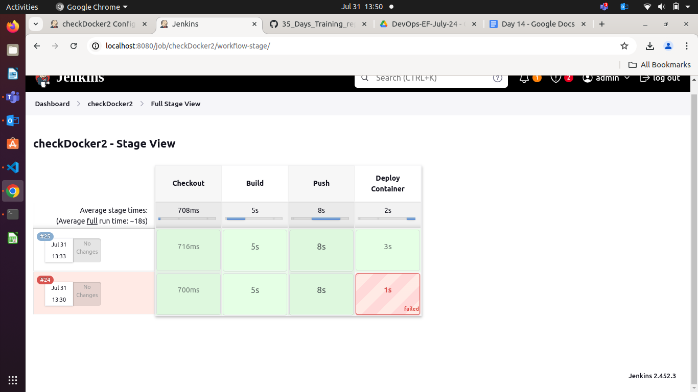

#### 

#### **Multi Branch Setup**

#### **Create a Jenkinsfile in the master Branch**

Jenkinsfile in the master branch:

pipeline {  
    agent any

    stages {  
        stage('Build') {  
            steps {  
                echo 'Building...'  
                // Add your build steps here  
            }  
        }  
        stage('Test') {  
            steps {  
                echo 'Testing...'  
                // Add your test steps here  
            }  
        }  
        stage('Deploy') {  
            steps {  
                echo 'Deploying...'  
                // Add your deploy steps here  
            }  
        }  
    }  
}

#### **3\. Configure a Multibranch Pipeline Job in Jenkins**

1. **Go to Jenkins Dashboard**: Click on New Item.  
1. **Create Multibranch Pipeline**: Enter a name for the job, select Multibranch Pipeline, and click OK.  
1. **Branch Sources**: Add your Git repository URL under Branch Sources.  
1. **Script Path**: Under Build Configuration, set the Script Path to Jenkinsfile.

### **Best Practices for Jenkinsfile**

### **Use Declarative Pipeline Syntax**

**Description:** The declarative pipeline syntax is more readable and provides a more structured way to define Jenkins pipelines.

**Use Case:**

* **Consistent Structure:** By using declarative syntax, teams can maintain a consistent structure across all Jenkinsfiles, making them easier to read and understand.

**Example:**

pipeline {  
    agent any  
    stages {  
        stage('Build') {  
            steps {  
                echo 'Building...'  
                // Add build steps here  
            }  
        }  
        stage('Test') {  
            steps {  
                echo 'Testing...'  
                // Add test steps here  
            }  
        }  
        stage('Deploy') {  
            steps {  
                echo 'Deploying...'  
                // Add deploy steps here  
            }  
        }  
    }  
}

* 

### **2\. Use Descriptive Stage and Step Names**

**Description:** Clearly name your stages and steps to describe their purpose. This makes the pipeline easier to understand at a glance.

**Use Case:**

* **Improved Readability:** When others view the Jenkinsfile or the pipeline logs, they can quickly understand what each part of the pipeline is doing.

**Example:**

pipeline {  
    agent any  
    stages {  
        stage('Compile Code') {  
            steps {  
                echo 'Compiling the source code...'  
                // Compilation steps  
            }  
        }  
        stage('Run Unit Tests') {  
            steps {  
                echo 'Executing unit tests...'  
                // Unit test steps  
            }  
        }  
        stage('Deploy to Production') {  
            steps {  
                echo 'Deploying the application to production...'  
                // Deployment steps  
            }  
        }  
    }  
}

* 

### **3\. Use Environment Variables**

**Description:** Define environment variables in your Jenkinsfile for values that may change or are reused multiple times.

**Use Case:**

* **Centralized Configuration:** Environment variables allow for centralized configuration, making it easier to update values without modifying multiple steps.

**Example:**

pipeline {  
    agent any  
    environment {  
        JAVA\_HOME \= '/usr/lib/jvm/java-11-openjdk'  
        APP\_ENV \= 'production'  
    }  
    stages {  
        stage('Setup') {  
            steps {  
                echo "Using Java from ${env.JAVA\_HOME}"  
                echo "Deploying to ${env.APP\_ENV} environment"  
            }  
        }  
        // Additional stages  
    }  
}

* 

### **4\. Use Shared Libraries**

**Description:** Move common code and functions into shared libraries to promote reuse and avoid duplication.

**Use Case:**

* **Code Reusability:** Shared libraries can be used to define common functions like deployment scripts or testing steps, which can be reused across multiple Jenkinsfiles.  
* **Example:**

**Library (vars/common.groovy):**

def deployApp(env) {  
    echo "Deploying to ${env} environment"  
    // Deployment logic  
}

* 

**Jenkinsfile:**

@Library('common-library') \_  
pipeline {  
    agent any  
    stages {  
        stage('Deploy') {  
            steps {  
                script {  
                    deployApp('production')  
                }  
            }  
        }  
    }  
}

* 

### **5\. Use Input Step for Manual Approval**

**Description:** Use the input step to require manual approval for critical stages like deploying to production.

**Use Case:**

* **Controlled Deployments:** Ensure that sensitive operations like production deployments require explicit approval from a responsible person.

**Example:**

pipeline {  
    agent any  
    stages {  
        stage('Deploy to Production') {  
            steps {  
                script {  
                    input message: 'Approve deployment to production?', ok: 'Deploy'  
                    echo 'Deploying to production...'  
                    // Deployment steps  
                }  
            }  
        }  
    }  
}

* 

### **6\. Use Post Actions for Cleanup and Notifications**

**Description:** Define post actions to handle notifications, cleanup, or other steps that should occur regardless of the pipeline result.

**Use Case:**

* **Consistent Cleanup:** Ensure that temporary files or resources are cleaned up and notifications are sent regardless of whether the build succeeded or failed.

**Example:**

pipeline {  
    agent any  
    stages {  
        stage('Build') {  
            steps {  
                echo 'Building...'  
                // Build steps  
            }  
        }  
    }  
    post {  
        success {  
            echo 'Build succeeded\!'  
            // Notification or other success steps  
        }  
        failure {  
            echo 'Build failed\!'  
            // Notification or other failure steps  
        }  
        always {  
            echo 'Cleaning up...'  
            // Cleanup steps  
        }  
    }  
}

* 

### **7\. Use Parameterized Pipelines**

**Description:** Define parameters in your Jenkinsfile to make the pipeline more flexible and configurable.

**Use Case:**

* **Dynamic Pipelines:** Allow different configurations or environments to be selected at runtime without modifying the Jenkinsfile.

**Example:**

pipeline {  
    agent any  
    parameters {  
        string(name: 'BRANCH\_NAME', defaultValue: 'main', description: 'Branch to build')  
        choice(name: 'DEPLOY\_ENV', choices: \['dev', 'staging', 'production'\], description: 'Deployment environment')  
    }  
    stages {  
        stage('Checkout') {  
            steps {  
                git branch: params.BRANCH\_NAME, url: 'https://github.com/example/repo.git'  
            }  
        }  
        stage('Deploy') {  
            steps {  
                echo "Deploying to ${params.DEPLOY\_ENV} environment"  
                // Deployment steps  
            }  
        }  
    }  
}

* 

### **8\. Utilize Stash and Unstash for Artifact Management**

**Description:** Use stash and unstash to share files between stages in the pipeline.

**Use Case:**

* **Artifact Management:** Pass build artifacts between stages without redoing the same work or relying on a shared workspace.

**Example:**

pipeline {  
    agent any  
    stages {  
        stage('Build') {  
            steps {  
                script {  
                    // Build steps  
                    stash includes: 'target/\*.jar', name: 'app-jar'  
                }  
            }  
        }  
        stage('Test') {  
            steps {  
                script {  
                    unstash 'app-jar'  
                    // Test steps using the stashed jar  
                }  
            }  
        }  
        stage('Deploy') {  
            steps {  
                script {  
                    unstash 'app-jar'  
                    // Deploy steps using the stashed jar  
                }  
            }  
        }  
    }  
}

* 

### **9\. Leverage Parallel Execution**

**Description:** Use the parallel step to run multiple tasks concurrently, reducing the overall build time.

**Use Case:**

* **Efficiency:** Speed up the pipeline by running independent tasks simultaneously, such as different test suites.

**Example:**

pipeline {  
    agent any  
    stages {  
        stage('Build') {  
            steps {  
                echo 'Building...'  
                // Build steps  
            }  
        }  
        stage('Test') {  
            parallel {  
                stage('Unit Tests') {  
                    steps {  
                        echo 'Running unit tests...'  
                        // Unit test steps  
                    }  
                }  
                stage('Integration Tests') {  
                    steps {  
                        echo 'Running integration tests...'  
                        // Integration test steps  
                    }  
                }  
            }  
        }  
    }  
}

* 

### **10\. Ensure Proper Error Handling**

**Description:** Use try-catch blocks within script steps to handle errors gracefully and ensure that proper cleanup or notifications occur.

**Use Case:**

* **Resilience:** Make the pipeline more robust by handling unexpected errors and providing meaningful feedback.

**Example:**

pipeline {  
    agent any  
    stages {  
        stage('Build') {  
            steps {  
                script {  
                    try {  
                        // Build steps that might fail  
                        echo 'Building...'  
                    } catch (Exception e) {  
                        echo "Build failed: ${e.message}"  
                        currentBuild.result \= 'FAILURE'  
                    }  
                }  
            }  
        }  
    }

* }

### **Distributing The Builds**

### **Configure the Slave Machine for Use with the Jenkins Master**

* Open the /etc/passwd file:

\[root@master\]$ vim /etc/passwd

* In the last line in the file (beginning with jenkins), change /bin/false to /bin/bash to allow the jenkins user a shell login.  
* Save and exit the file by pressing Escape followed by :x.  
* Change the password for the jenkins user:

\[root@master\]$ passwd jenkins

* Enter a password of your choice that you'll easily remember.  
* Switch to jenkins:

\[root@master\]$ su jenkins

* Change directory:

\[jenkins@master\]$ cd \~

* Generate a public/private RSA key pair:

\[jenkins@master\]$ ssh-keygen

* Log in to the slave server:

\[jenkins@master\]$ ssh cloud\_user@\<SLAVE\_PUBLIC\_IP\_ADDRESS\>

* Become root:

\[cloud\_user@slave\]$ sudo su

* Create a jenkins user:

\[root@slave\]$ useradd jenkins

* Create a password:

\[root@slave\]$ passwd jenkins

* Open the sudoers file:

\[root@slave\]$ visudo

* In the Defaults section, beneath root, add:

\#Here \#Jenkins is the username  
jenkins ALL=(ALL) NOPASSWD: ALL

* Save and exit the file by pressing Escape followed by :x.  
* Exit root:

\[root@slave\]$ exit

* See who you're logged in as:

\[cloud\_user@slave\]$ whoami

* You should see you're cloud\_user.  
* Switch to jenkins:

\[cloud\_user@slave\]$ su jenkins

* Enter the password you created.  
* Change directory:

\[jenkins@slave\]$ cd \~

* Enter exit twice to exit back to the master server.  
* See who you're signed in as:

whoami

* You should see you're jenkins.  
* As the jenkins user on the master server, copy the jenkins user's ssh keys to the slave server:

\[jenkins@master\]$ ssh-copy-id jenkins@\<SLAVE\_PUBLIC\_IP\_ADDRESS\>

* Run the following:

cat ./.ssh/id\_rsa

* Keep the output listed, as we'll need it for a later step.

### Run the Maven Build on the Remote Agent

* In a new browser tab, navigate to http://\<JENKINS\_MASTER\_SERVER\_PUBLIC\_IP\>:8080.  
* Click Manage Jenkins in the left-hand menu.  
* Click Nodes.  
* Click New Node.  
* Give it a name of slave1.  
* Select Permanent Agent.  
* Click Create.  
* For Remote root directory, enter /home/jenkins.  
* For Labels, enter slave1.  
* For Host, enter the slave server's public IP address.  
* Next to Credentials, click Add \> Jenkins.  
* Set the following values:  
  * Kind: SSH Username with private key  
  * Username: jenkins  
  * Private Key: Enter directly  
    * Copy the entire RSA key in the terminal (from dashes to dashes) and paste it into the Key window  
  * ID: jkey  
  * Description: jenkinsuser  
* Click Add.  
* Set Credentials to jenkins (jenkinsuser).  
* Click Save.  
* In the upper-left corner, click Jenkins \> New Item.  
* Enter an item name of mavenproject.  
* Select Freestyle project.  
* Click OK.  
* Set the following values:  
  * General  
    * Restrict where this project can be run: Check  
    * Label Expression: slave1  
  * Source Code Management  
    * Git: Check  
    * Repository URL: https://github.com/nkheria/content-cje-prebuild.git  
      * Click outside the box to make sure the red text goes away.  
  * Build  
    * Click Add build step \> Invoke top-level Maven targets.  
      * Goals: clean package  
    * Click Add build step \> Execute shell.  
      * Command: bin/makeindex  
  * Post-build Actions  
    * Click Add post-build action \> Archive the artifacts.  
      * Files to archive: index.jsp  
    * Click Advanced....  
      * Fingerprint all archived artifacts: Check  
      * Leave other default boxes checked.  
* Click Save.  
* In the upper-left corner, click Jenkins \> Manage Jenkins \> Global Tool Configuration.  
* In the Maven section, click Add Maven.  
* Give it the name M3.  
* Click Save.  
* In the upper-left corner, click Jenkins.  
* Click mavenproject.  
* Click Configure in the left-hand menu.  
* In the Build section, set Maven Version to M3.  
* Click Save.  
* Click Build Now in the left-hand menu.

**Project 01**

#### **Problem Statement:**

You are tasked with setting up a CI/CD pipeline using Jenkins to streamline the deployment process of a simple Java application. The pipeline should accomplish the following tasks:

1. **Fetch the Dockerfile**: The pipeline should clone a GitHub repository containing the source code of the Java application and a Dockerfile.  
1. **Create a Docker Image**: The pipeline should build a Docker image from the fetched Dockerfile.  
1. **Push the Docker Image**: The pipeline should push the created Docker image to a specified DockerHub repository.  
1. **Deploy the Container**: The pipeline should deploy a container using the pushed Docker image.

**Jenkinsfile**
```groovy        
    pipeline {
    agent any 
    //   tools {
    //     maven 'maven-3.9.0'
    //   }

    stages{
        stage('Checkout') {
            steps {
                git branch: 'training', url: 'https://github.com/GitEic-Bhavin/35_Days_Training_repo.git'
            }
        }
        stage('Build') {
            steps {
                script {
                    
                    withDockerRegistry(credentialsId: 'docker-cred') {
                        sh 'docker build -t bhavin1099/jenkins-app-java:v2 -f Project/Day14/Dockerfile .'                       
                 }
            
                    
                }
            } 
        }
        stage('Push') {
          steps {
              script {
                  withDockerRegistry(credentialsId: 'docker-cred') {
                    sh 'docker push bhavin1099/jenkins-app-java:v2'
                  }    
              }
            }
        }

        stage('Deploy Container'){
            steps{
                script{
                    withDockerRegistry(credentialsId: 'docker-cred') {
                        def runContainer = docker.image("bhavin1099/jenkins-app-java:v2").run('--name mynew-container -d')
                        
                    }
                }
            }
        }
    }
}
```

#### **Deliverables:**

1. **GitHub Repository**: A GitHub repository containing:  
   * The source code of a simple Java application.  
   * A Dockerfile for building the Docker image.  
1. **Jenkins Pipeline Script**: A Jenkinsfile (pipeline script) that:  
   * Clones the GitHub repository.  
   * Builds the Docker image.  
   * Pushes the Docker image to DockerHub.  
   * Deploys a container using the pushed image.  

  

1. **DockerHub Repository**: A DockerHub repository where the Docker images will be stored.  
1. **Jenkins Setup**:  
   * Jenkins installed and configured on a local Ubuntu machine.  
   * Required plugins installed (e.g., Git, Docker, Pipeline).  
1. **Documentation**: Detailed documentation explaining:  
   * How to set up the local Jenkins environment.  
   * Configuration steps for the pipeline.  
   * Instructions for verifying the deployment.

