### **Project is on last page**

### **Deploying a containerized app using Jenkins Pipeline**

### 

* ### Log in to the Jenkins instance in a new browser tab:   `<JENKINS_PUBLIC_IP_ADDRESS>:8080`

* ### Log in to the Jenkins server using the credentials provided to retrieve the temporary admin password for the Jenkins instance:   `ssh cloud_user@<JENKINS_PUBLIC_IP_ADDRESS>`

* ### From your `Cloud Server Jenkins Server` shell, copy the admin password and paste it into the `Administrator password` field to unlock Jenkins:

### `sudo cat /var/lib/jenkins/secrets/initialAdminPassword`

* ### 

* ### Click *Continue*.

* ### Close the *Customize Jenkins* screen by clicking the `X` at the top right corner.

* ### Jenkins is ready. Click *Start using Jenkins*.

* ### Using the `cloud_user` password, create a global Jenkins credential for the production server.

* ### Go to *Manage Jenkins* \> *Credentials*, then click *(global)*.

* ### Click *\+ Add Credentials*:

  * ### Kind: Username with password

  * ### Username: deploy

  * ### Password: \<CLOUD\_SERVER\_JENKINS\_PASSWORD\>

  * ### ID: webserver\_login

  * ### Description: Webserver Login

  * ### Click *Create*

* ### Create a global Jenkins credential for the Docker image registry (Docker Hub).

* ### Click *\+ Add Credentials*:

  * ### Kind: Username with password

  * ### Username: \<DOCKER\_HUB\_USERNAME\>

  * ### Password: \<DOCKER\_HUB\_PASSWORD\>

  * ### ID: docker\_hub\_login

  * ### Description: Docker Hub Login

  * ### Click *Create*

* ### **Note:** You will need a Docker hub account in order to use Docker Hub as an image registry.

* ### Configure a global property in Jenkins to store the production server IP by navigating to **Manage Jenkins** \> **System** and adding an environment variable under **Global properties**.

  * ### Name: prod\_ip

  * ### Value: \<PRODUCTION\_SERVER\_PUBLIC\_IP\_ADDRESS\>

  * ### Click *Save*

* ### Make a personal fork from the following GitHub repository:

### `https://github.com/ACloudGuru-Resources/cicd-pipeline-train-schedule-dockerdeploy`

* ### 

* ### Generate a new GitHub API key to allow Jenkins to access the forked repo by navigating to **Profile** \> **Settings** \> **Developer Settings** \> **Personal Access Tokens** \> **Tokens (classic)** \> **Generate new token (classic)**.

  * ### Note: Jenkins

  * ### Permissions: admin:repo\_hook

* ### Copy the GitHub token.

* ### In Jenkins, create a Multibranch Pipeline project named *train-schedule*.

* ### Under *Branch Sources*, add *GitHub*, then add *Jenkins* to configure your forked repository.

  * ### Kind: Username with password

  * ### Scope: Global

  * ### Username: \<GITHUB\_USERNAME\>

  * ### Password: \<YOUR\_GITHUB\_PERSONAL\_ACCESS\_TOKEN\>

  * ### ID: github\_key

  * ### Description: GitHub Key

  * ### Click *Add*

* ### Select the *GitHub Key* and paste your forked repository under *Repository HTTPS URL*:

  * ### `https://github.com/<YOUR_GITHUB_USER>/cicd-pipeline-train-schedule-dockerdeploy`

  * ### Click *Validate* to test your credentials

* ### Click **Save**.

### **Successfully deploy the train-schedule app to production as a Docker container using the Jenkins Pipeline.**

* ### Modify the Jenkinsfile in GitHub to build and push the Docker image to Docker Hub, and commit the changes. See [Jenkinsfile](https://raw.githubusercontent.com/ACloudGuru-Resources/cicd-pipeline-train-schedule-dockerdeploy/example-solution/Jenkinsfile)for reference, Replace *willbla* from the example file by your own Docker Hub username.

### `pipeline {`

###     `agent any`

###     `stages {`

###         `stage('Build') {`

###             `steps {`

###                 `echo 'Running build automation'`

###                 `sh './gradlew build --no-daemon'`

###                 `archiveArtifacts artifacts: 'dist/trainSchedule.zip'`

###             `}`

###         `}`

###         `stage('Build Docker Image') {`

###             `when {`

###                 `branch 'master'`

###             `}`

###             `steps {`

###                 `script {`

###                     `app = docker.build("<DOCKER_HUB_USERNAME>/train-schedule")`

###                     `app.inside {`

###                         `sh 'echo $(curl localhost:8080)'`

###                     `}`

###                 `}`

###             `}`

###         `}`

###         `stage('Push Docker Image') {`

###             `when {`

###                 `branch 'master'`

###             `}`

###             `steps {`

###                 `script {`

###                     `docker.withRegistry('https://registry.hub.docker.com', 'docker_hub_login') {`

###                         `app.push("${env.BUILD_NUMBER}")`

###                         `app.push("latest")`

###                     `}`

###                 `}`

###             `}`

###         `}`

###     `}`   

### `}`

* ### 

* ### In Jenkins, click **Build Now**.   **Note:** The initial build may take several minutes to complete.

* ### In Docker Hub, under Repositories, select the *train-schedule* app.

* ### Click the **Tags** tab to verify that the build was pushed successfully.

* ### In GitHub, modify the Jenkinsfile to include a stage that pushes the build to the production server, and commit the changes.

### `stage ('DeployToProduction') {`

###     `when {`

###         `branch 'master'`

###     `}`

###     `steps {`

###         `input 'Deploy to Production'`

###         `milestone(1)`

###         `withCredentials ([usernamePassword(credentialsId: 'webserver_login', usernameVariable: 'USERNAME', passwordVariable: 'USERPASS')]) {`

###             `script {`

###                 `sh "sshpass -p '$USERPASS' -v ssh -o StrictHostKeyChecking=no $USERNAME@${env.prod_ip} \"docker pull <DOCKER_HUB_USERNAME>/train-schedule:${env.BUILD_NUMBER}\""`

###                 `try {`

###                    `sh "sshpass -p '$USERPASS' -v ssh -o StrictHostKeyChecking=no $USERNAME@${env.prod_ip} \"docker stop train-schedule\""`

###                    `sh "sshpass -p '$USERPASS' -v ssh -o StrictHostKeyChecking=no $USERNAME@${env.prod_ip} \"docker rm train-schedule\""`

###                 `} catch (err) {`

###                     `echo: 'caught error: $err'`

###                 `}`

###                 `sh "sshpass -p '$USERPASS' -v ssh -o StrictHostKeyChecking=no $USERNAME@${env.prod_ip} \"docker run --restart always --name train-schedule -p 8080:8080 -d <DOCKER_HUB_USERNAME>/train-schedule:${env.BUILD_NUMBER}\""`

###             `}`

###         `}`

###     `}`

### `}`

* ### 

* ### In Jenkins, click **Build Now**.

* ### Once the build is complete, using a web browser, verify that the application has been deployed successfully.   `<PRODUCTION_SERVER_PUBLIC_IP_ADDRESS>:8080`

### 

### **Webhooks in Jenkins**

#### **Introduction to Webhooks**

Webhooks are automated messages sent from apps when something happens. They have a message, or payload, and are sent to a unique URL — essentially a web address of an application. Webhooks are used to trigger builds in Jenkins when an event occurs in a repository, such as a push or pull request.

#### **Step 1: Install the Necessary Plugins in Jenkins**

1. Go to Jenkins Dashboard \> Manage Jenkins \> Manage Plugins.  
1. Under the Available tab, search for and install the following plugins:  
   * GitHub Plugin  
   * Git Plugin

#### **Step 2: Create a New Jenkins Job**

1. From the Jenkins dashboard, click on "New Item."  
1. Enter a name for your job, select "Freestyle project," and click "OK."  
1. Configure your job:  
   * **Source Code Management**: Select Git and enter your repository URL.  
   * **Build Triggers**: Check the box "GitHub hook trigger for GITScm polling."  
   * **Build Steps**: Add build steps as needed (e.g., Execute shell, Invoke Ant, etc.).

#### **Step 3: Configure GitHub Repository**

1. Go to your GitHub repository and click on "Settings."  
1. In the left sidebar, click on "Webhooks."  
1. Click the "Add webhook" button.  
1. Configure the webhook:  
   * **Payload URL**: Enter your Jenkins server URL followed by `/github-webhook/` (e.g., `http://your-jenkins-url/github-webhook/`).  
   * **Content type**: Choose `application/json`.  
   * **Which events would you like to trigger this webhook?**: Choose "Just the push event."

#### **Step 4: Configure Jenkins to Integrate with GitHub**

1. Go to Jenkins Dashboard \> Manage Jenkins \> Configure System.  
1. Scroll down to the "GitHub" section and click "Add GitHub Server."  
1. Add your GitHub server details:  
   * **API URL**: `https://api.github.com`  
   * **Credentials**: Add your GitHub credentials (Personal access token recommended).  
1. Click "Test Connection" to ensure Jenkins can connect to GitHub.

#### **Step 5: Test the Webhook**

1. Make a commit to your GitHub repository and push it.  
1. Jenkins should automatically trigger a build based on the webhook configuration.

### **Example Scenario**

#### **Use Case Scenario: Continuous Integration for a Java Project**

**Project Requirement:** You are developing a Java application and want to ensure that every code change is automatically built and tested.

**Steps:**

1. **Jenkins Job Configuration:**  
   * Set up a Freestyle project.  
   * Under "Source Code Management," use your GitHub repository URL.  
   * In the "Build Triggers" section, select "GitHub hook trigger for GITScm polling."

Under "Build Steps," add a shell script to compile your Java code and run tests:

`#!/bin/bash`  
`echo "Building the Java Project..."`  
`mvn clean install`

*   
1. **GitHub Webhook Setup:**  
   * In your GitHub repository, add a webhook with the payload URL set to your Jenkins URL followed by `/github-webhook/`.  
   * Choose the "push" event to trigger the webhook.  
1. **Verification:**  
   * Make a change in your Java project and push it to the GitHub repository.  
   * The push event triggers the webhook, which notifies Jenkins.  
   * Jenkins picks up the change, triggers the build, compiles the code, and runs the tests.

#### **Benefits of Using Webhooks in Jenkins**

1. **Real-time Integration:** Webhooks provide real-time integration, ensuring that builds are triggered as soon as changes are pushed.  
1. **Automation:** Automates the build process, reducing the need for manual intervention.  
1. **Efficiency:** Increases efficiency by immediately testing new changes, allowing for faster feedback and quicker bug fixes.  
1. **Scalability:** Can be easily scaled to handle multiple repositories and complex workflows.

**Ansible**

Ansible is an open-source IT automation tool developed by Red Hat. It is used for configuration management, application deployment, task automation, and IT orchestration. Ansible uses a simple, human-readable language (YAML) to define automation jobs, which can be version-controlled and shared.

**Key Features:**

* **Agentless Architecture:** Ansible does not require any agent software to be installed on the managed nodes. It uses SSH for Unix-like systems and WinRM for Windows systems.  
* **Declarative Language:** Ansible uses YAML to define automation tasks in a straightforward, readable manner.  
* **Idempotent:** Ansible ensures that applying the same playbook multiple times will not cause unintended changes.

---

### **Benefits of Using Ansible**

**1\. Simplicity and Ease of Use:**

* **Human-Readable YAML Syntax:** Ansible uses a straightforward, declarative language that is easy to read and write.  
* **Minimal Setup:** Ansible is agentless and requires only SSH (or WinRM) access to the managed nodes, simplifying setup and reducing overhead.

**2\. Flexibility and Power:**

* **Broad Capabilities:** Ansible can handle a wide range of tasks, from configuration management and application deployment to network automation and security compliance.  
* **Extensibility:** Ansible can be extended with custom modules and plugins to suit specific needs.

**3\. Agentless Architecture:**

* **No Agent Installation:** Ansible’s agentless nature eliminates the need to install and manage additional software on the managed nodes.  
* **Reduced Resource Consumption:** Without agents, there’s less resource consumption on the managed nodes, improving overall efficiency.

**4\. Idempotency:**

* **Consistency:** Ansible ensures that applying the same playbook multiple times will not result in unexpected changes, maintaining consistency across systems.

**5\. Community and Support:**

* **Strong Community:** Ansible has a large, active community that contributes to its development and provides support.  
* **Commercial Support:** Red Hat offers enterprise support for Ansible through Ansible Tower (now part of Red Hat Ansible Automation Platform).

**6\. Integration and Orchestration:**

* **Integration with Other Tools:** Ansible integrates well with other tools and platforms, such as Jenkins, Docker, Kubernetes, and cloud providers.  
* **Orchestration Capabilities:** Ansible can orchestrate complex workflows and dependencies across multiple systems and environments.

---

### **Use Cases**

**1\. Configuration Management:**

* **Description:** Ansible can be used to manage and maintain system configurations across a fleet of servers.  
* **Example:** Ensuring all web servers have the same version of Apache installed and configured identically.

**Practical Use Case:**

`- hosts: webservers`  
  `tasks:`  
    `- name: Install Apache`  
      `yum:`  
        `name: httpd`  
        `state: present`  
      
    `- name: Configure Apache`  
      `template:`  
        `src: httpd.conf.j2`  
        `dest: /etc/httpd/conf/httpd.conf`  
      `notify:`  
        `- Restart Apache`  
    
  `handlers:`  
    `- name: Restart Apache`  
      `service:`  
        `name: httpd`  
        `state: restarted`

**2\. Application Deployment:**

* **Description:** Ansible can automate the deployment of applications, ensuring that all necessary steps are executed consistently.  
* **Example:** Deploying a Python web application across multiple servers.

**Practical Use Case:**

`- hosts: appservers`  
  `tasks:`  
    `- name: Install Python`  
      `yum:`  
        `name: python3`  
        `state: present`  
      
    `- name: Deploy application code`  
      `copy:`  
        `src: /path/to/app`  
        `dest: /var/www/app`  
      
    `- name: Install dependencies`  
      `pip:`  
        `requirements: /var/www/app/requirements.txt`

* 

**3\. IT Orchestration:**

* **Description:** Ansible can coordinate and manage complex workflows and dependencies between different systems and services.  
* **Example:** Orchestrating a multi-tier application deployment that includes database, backend, and frontend services.

**Practical Use Case:**

`- hosts: databases`  
  `tasks:`  
    `- name: Install MySQL`  
      `yum:`  
        `name: mysql-server`  
        `state: present`

`- hosts: backends`  
  `tasks:`  
    `- name: Deploy backend application`  
      `copy:`  
        `src: /path/to/backend`  
        `dest: /var/www/backend`

`- hosts: frontends`  
  `tasks:`  
    `- name: Deploy frontend application`  
      `copy:`  
        `src: /path/to/frontend`  
        `dest: /var/www/frontend`

**4\. Continuous Integration and Continuous Deployment (CI/CD):**

* **Description:** Ansible can be integrated with CI/CD pipelines to automate the build, test, and deployment processes.  
* **Example:** Automating the deployment of new code changes to a staging environment after successful builds.

**Practical Use Case:**

`- hosts: staging`  
  `tasks:`  
    `- name: Pull latest code from Git`  
      `git:`  
        `repo: 'https://github.com/example/app.git'`  
        `dest: /var/www/app`  
      
    `- name: Install dependencies`  
      `npm:`  
        `path: /var/www/app`  
        `state: present`  
      
    `- name: Restart application`  
      `service:`  
        `name: app`  
        `state: restarted`

**5\. Network Automation:**

* **Description:** Ansible can automate the configuration and management of network devices and services.  
* **Example:** Configuring routers, switches, and firewalls with standardized settings.

**Practical Use Case:**

`- hosts: routers`  
  `tasks:`  
    `- name: Configure router`  
      `ios_config:`  
        `lines:`  
          `- hostname Router1`  
          `- interface GigabitEthernet0/1`  
          `- ip address 192.168.1.1 255.255.255.0`  
      
`- hosts: switches`  
  `tasks:`  
    `- name: Configure switch`  
      `ios_config:`  
        `lines:`  
          `- hostname Switch1`  
          `- interface GigabitEthernet0/1`  
          `- switchport mode access`  
          `- switchport access vlan 10`

**6\. Security and Compliance:**

* **Description:** Ansible can ensure that systems adhere to security policies and compliance requirements by automating audits and enforcement of security settings.  
* **Example:** Ensuring that all servers have specific security settings enabled and are compliant with industry standards like PCI-DSS or HIPAA.

**Practical Use Case:**

`- hosts: all`  
  `tasks:`  
    `- name: Ensure firewall is enabled`  
      `service:`  
        `name: firewalld`  
        `state: started`  
        `enabled: true`  
      
    `- name: Apply security configurations`  
      `copy:`  
        `src: security.conf`  
        `dest: /etc/security/security.conf`  
      `notify:`  
        `- Restart security services`

  `handlers:`  
    `- name: Restart security services`  
      `service:`  
        `name: sshd`

        `state: restarted`

### **Core Components of Ansible**

**1\. Inventory**

**Definition:**

* The inventory in Ansible is a file that contains information about the systems you want to manage. This file can be static or dynamic and is crucial for identifying the hosts and groups of hosts.

**Static Inventory:**

* This is typically a file (in INI or YAML format) where the hosts are listed along with the groups they belong to.

**Dynamic Inventory:**

* This is a script or a plugin that fetches the inventory from external sources like cloud providers, databases, or other services.

**Use Case:**

* **Environment Management:** Imagine you have different environments for development, staging, and production. You can use an inventory to group the hosts accordingly and apply different configurations or updates to each group.

**Example:**

`[development]`  
`192.168.2.31 server01`  
`175.32.41.5 server02`  
`dev1.example.com`  
`dev2.example.com`

`[staging]`  
`stage1.example.com`  
`stage2.example.com`

`[production]`  
`prod1.example.com`  
`prod2.example.com`

**2\. Modules**

**Definition:**

* Modules are the building blocks of Ansible, responsible for executing tasks on the remote hosts. They perform various functions like installing software, managing services, and configuring files.

**Types:**

* **Core Modules:** These come with Ansible and cover a wide range of tasks.  
* **Custom Modules:** You can write your own modules to extend Ansible’s functionality.

**Use Case:**

* **Software Deployment:** Suppose you need to install and configure Apache web server on multiple hosts. You can use the `yum` module to install the software and the `service` module to manage the service state.

**Example:**

`- name: Install Apache`  
  `yum:`  
    `name: httpd`  
    `state: present`

`- name: Start Apache service`  
  `service:`  
    `name: httpd`  
    `state: started`

* 

**3\. Playbooks**

**Definition:**

* Playbooks are YAML files where you define a set of tasks to be executed on a group of hosts. They allow you to orchestrate multiple steps in a sequence.

**Use Case:**

* **Application Deployment:** Consider deploying a web application that requires setting up a database, installing web server software, and deploying the application code. A playbook can orchestrate these steps in the correct order.

**Example:**

`- hosts: webservers`  
  `tasks:`  
    `- name: Install Apache`  
      `yum:`  
        `name: httpd`  
        `state: present`  
      
    `- name: Deploy application code`  
      `copy:`  
        `src: /path/to/app`  
        `dest: /var/www/html/`  
      
    `- name: Start Apache service`  
      `service:`  
        `name: httpd`  
        `state: started`

* 

**4\. Roles**

**Definition:**

* Roles are a way to organize playbooks and other files to facilitate reuse and sharing. They allow you to break down complex playbooks into smaller, reusable components.

**Use Case:**

* **Reusable Configuration:** Suppose you have a standard configuration for setting up a database server. You can create a role for this configuration and reuse it across multiple projects.

**Example:**

`my_role/`  
`├── tasks/`  
`│   └── main.yml`  
`├── handlers/`  
`│   └── main.yml`  
`├── templates/`  
`└── files/`

* 

**5\. Templates**

**Definition:**

* Templates in Ansible use the Jinja2 templating language to create dynamic configuration files from static templates.

**Use Case:**

* **Dynamic Configuration Files:** If you need to generate configuration files that vary slightly between hosts (e.g., Apache virtual host configurations), you can use templates to dynamically generate these files.

**Example:**

`<VirtualHost *:80>`  
    `ServerName {{ inventory_hostname }}`  
    `DocumentRoot /var/www/{{ inventory_hostname }}`  
`</VirtualHost>`

* 

**6\. Handlers**

**Definition:**

* Handlers are tasks that are triggered by other tasks. They are typically used to restart services when a configuration file changes.

**Use Case:**

* **Service Reload:** When updating a configuration file, you often need to restart the corresponding service to apply the changes.

**Example:**

`- name: Copy Apache config`  
  `template:`  
    `src: apache.conf.j2`  
    `dest: /etc/httpd/conf/httpd.conf`  
  `notify:`  
    `- Restart Apache`

`handlers:`  
  `- name: Restart Apache`  
    `service:`  
      `name: httpd`  
      `state: restarted`

* 

**7\. Variables**

**Definition:**

* Variables allow you to store values that can be reused throughout your playbooks and templates.

**Use Case:**

* **Dynamic Configuration:** Use variables to pass different values to your tasks, making your playbooks more flexible and reusable.

**Example:**

`vars:`  
  `http_port: 80`

`tasks:`  
  `- name: Ensure Apache is listening on the correct port`  
    `lineinfile:`  
      `path: /etc/httpd/conf/httpd.conf`  
      `regexp: '^Listen '`  
      `line: 'Listen {{ http_port }}'`

* 

---

### 

### **Ansible Normal Playbook Example**

\---  
\- hosts: workstation  
  become: yes  
  tasks:  
  \- name: install git  
    yum:  
      name: git  
      state: latest"

**Example 2:**

\---  
\- hosts: web  
  become: yes  
  tasks:  
    \- name: install httpd  
      yum: name=httpd state=latest \#yum install httpd:latest

    \- name: start and enable httpd  
      service: name=httpd state=started enabled=yes 

    \- name: retrieve website from repo  
      get\_url: url=http://repo.example.com/website.tgz dest=/tmp/website.tgz

    \- name: install website  
      unarchive: remote\_src=yes src=/tmp/website.tgz dest=/var/www/html/

### **How Ansible Works**

**1\. Architecture Overview**

**Ansible Control Node:**

* The machine where Ansible is installed. This is where you run your playbooks from.

**Managed Nodes:**

* The systems you manage with Ansible. These can be physical servers, virtual machines, or cloud instances.

**How it Works:**

* **Inventory File:** The control node uses the inventory file to know which managed nodes to connect to.  
* **Playbooks:** You write playbooks on the control node, specifying tasks to be performed on the managed nodes.  
* **Modules:** When you run a playbook, Ansible connects to the managed nodes (typically via SSH) and executes the specified modules.  
* **Idempotency:** Ansible ensures that applying the same playbook multiple times will not cause unintended side effects.

**Use Case:**

* **Centralized Management:** In a large organization, you can manage hundreds of servers from a single control node, automating repetitive tasks and ensuring consistency.  
  * **Example Workflow:**  
    1. Create an inventory file listing your servers.  
    1. Write a playbook to install and configure software.  
    1. Run the playbook from the control node to apply the configuration across all listed servers.

### **Introduction to Ad-Hoc Commands**

**Definition:** Ad-hoc commands in Ansible are simple, one-time commands that are executed on the target machines without the need to write a playbook. They are useful for quick tasks, troubleshooting, and administrative actions.

**Use Cases:**

* **Quick System Checks:** Verify the status or configuration of systems without creating a full playbook.  
* **Troubleshooting:** Diagnose and fix issues on the fly.  
* **Administrative Tasks:** Perform administrative tasks like restarting services, managing files, and more, on multiple systems simultaneously.

**How to Run Ad-Hoc Commands:**

* Ad-hoc commands are run using the `ansible` command-line tool.

Basic syntax:  
bash  
Copy code  
`ansible <host-pattern> -m <module-name> -a "<module-arguments>"`  
---

### **Commonly Used Ad-Hoc Commands**

1. **Ping**  
   * **Description:** Checks the connectivity and availability of the target hosts.

**Command:**  
bash  
Copy code  
`ansible all -m ping`

1. **Shell**  
   * **Description:** Executes arbitrary commands on the remote hosts.

**Command:**

`ansible all -m shell -a "uptime"`

*   
1. **Copy**  
   * **Description:** Copies files from the local machine to the remote hosts.

**Command:**  
bash  
Copy code  
`ansible all -m copy -a "src=/path/to/local/file dest=/path/to/remote/file owner=$USER”`

1. **Command**  
   * **Description:** Runs a command on the remote hosts (similar to shell but without the shell environment).

**Command:**

`ansible all -m command -a "ls /var/log"`

1. **Service**  
   * **Description:** Manages services on the remote hosts.

**Command:**

`ansible all -m service -a "name=httpd state=started"`

1. **Yum**  
   * **Description:** Manages packages on systems using the Yum package manager.

**Command:**

`ansible all -m yum -a "name=httpd state=present"`

1. **Apt**  
   * **Description:** Manages packages on systems using the Apt package manager (Debian-based systems).

**Command:**

`ansible all -m apt -a "name=nginx state=present"`

1. **User**  
   * **Description:** Manages user accounts on the remote hosts.

**Command:**  
bash  
Copy code  
`ansible all -m user -a "name=johndoe state=present"`  
---

### **Practical Examples and Exercises**

**Exercise 1: Check Connectivity**

* **Objective:** Use the `ping` module to check if all hosts in the inventory are reachable.

**Command:**

`ansible all -m ping`

**Expected Output:**

* Each host should return a "pong" response if it is reachable.

---

**Exercise 2: Retrieve Uptime**

* **Objective:** Use the `shell` module to get the uptime of all hosts.

**Command:**

`ansible all -m shell -a "uptime"`

* 

**Expected Output:**

* The uptime of each host should be displayed, showing how long each system has been running.

---

**Exercise 3: Copy a File to Remote Hosts**

* **Objective:** Use the `copy` module to transfer a file from the local machine to all remote hosts.

**Command:**

`ansible all -m copy -a "src=/path/to/local/file dest=/path/to/remote/file"`

**Expected Output:**

* The specified file should be copied to the target path on each remote host.

---

**Exercise 4: List Directory Contents**

* **Objective:** Use the `command` module to list the contents of the `/var/log` directory on all hosts.

**Command:**

`ansible all -m command -a "ls /var/log"`

**Expected Output:**

* The contents of the `/var/log` directory should be displayed for each host.

---

**Exercise 5: Manage Services**

* **Objective:** Use the `service` module to start the Apache HTTP server on all hosts.

**Command:**

`ansible all -m service -a "name=httpd state=started"`

**Expected Output:**

* The Apache HTTP server should be started on each host.

---

**Exercise 6: Install a Package**

* **Objective:** Use the `yum` module to install the Apache HTTP server on all Red Hat-based systems.

**Command:**

`ansible all -m yum -a "name=httpd state=present"`

**Expected Output:**

* The Apache HTTP server should be installed on each Red Hat-based system.

---

**Exercise 7: Add a User**

* **Objective:** Use the `user` module to create a new user account on all hosts.

**Command:**

`ansible all -m user -a "name=johndoe state=present"`

**Expected Output:**

* A new user account named `johndoe` should be created on each host.

---

### **Practical Exercise Workflow**

1. **Setup:**  
   * Ensure Ansible is installed on the control node.  
   * Create an inventory file listing the target hosts.  
1. **Execution:**  
   * Run the provided ad-hoc commands to perform the exercises.  
1. **Verification:**  
   * Check the output of each command to verify the tasks were executed successfully.  
1. **Cleanup:**  
   * If necessary, perform any cleanup actions, such as removing test files or users created during the exercises.

### **Playbook**

A playbook in Ansible is a file, written in YAML format, that contains a series of tasks to be executed on remote hosts. Playbooks are used to automate repetitive tasks, configure systems, deploy applications, and orchestrate complex workflows.

**Components of a Playbook:**

1. **Hosts:** Specifies the target hosts or groups on which the tasks will be executed.  
1. **Tasks:** Defines individual actions to be performed, such as installing packages, copying files, or running commands.  
1. **Handlers:** Special tasks that are triggered by other tasks and are typically used to restart services.  
1. **Variables:** Values that can be used throughout the playbook to customize tasks and templates.  
1. **Roles:** Organizational units that group related tasks, handlers, variables, and templates, promoting reusability and modularity.

**Example Structure:**

`---`  
`- name: Example Playbook`  
  `hosts: webservers`  
  `vars:`  
    `http_port: 80`  
  `tasks:`  
    `- name: Ensure Apache is installed`  
      `yum:`  
        `name: httpd`  
        `state: present`

    `- name: Ensure Apache is running`  
      `service:`  
        `name: httpd`  
        `state: started`  
        `enabled: true`

    `- name: Copy the configuration file`  
      `template:`  
        `src: httpd.conf.j2`  
        `dest: /etc/httpd/conf/httpd.conf`  
      `notify:`  
        `- Restart Apache`

  `handlers:`  
    `- name: Restart Apache`  
      `service:`  
        `name: httpd`  
        `state: restarted`

---

### **Writing Your First Playbook**

**Step-by-Step Guide:**

1. **Create an Inventory File:**  
   * List the target hosts or groups of hosts.

`[webservers]`  
`web1.example.com`  
`web2.example.com`

1. **Create a Playbook File:**  
   * Write the playbook using YAML syntax.

`---`  
`- name: Install and Configure Apache`  
  `hosts: webservers`  
  `become: yes`

  `vars:`  
    `http_port: 80`

  `tasks:`  
    `- name: Ensure Apache is installed`  
      `yum:`  
        `name: httpd`  
        `state: present`

    `- name: Ensure Apache is running`  
      `service:`  
        `name: httpd`  
        `state: started`  
        `enabled: true`

    `- name: Copy the configuration file`  
      `template:`  
        `src: httpd.conf.j2`  
        `dest: /etc/httpd/conf/httpd.conf`  
      `notify:`  
        `- Restart Apache`

  `handlers:`  
    `- name: Restart Apache`  
      `service:`  
        `name: httpd`  
        `state: restarted`

1. **Create a Template File (Optional):**  
   * If using the `template` module, create a Jinja2 template file.

`# httpd.conf.j2`  
`Listen {{ http_port }}`  
`ServerName {{ inventory_hostname }}`

### **Running Playbooks and Understanding the Output**

**Running a Playbook:**

Use the `ansible-playbook` command to execute the playbook.

`ansible-playbook -i inventory playbook.yml`

**Example Command:**

`ansible-playbook -i inventory install_apache.yml`

**Understanding the Output:**

**PLAY:** Indicates the start of a play.

`PLAY [Install and Configure Apache] ******************************************`

**TASK:** Shows the task that is currently being executed.

`TASK [Ensure Apache is installed] *********************************************`

**OK:** The task has completed successfully.

`ok: [web1.example.com]`  
`ok: [web2.example.com]`

**CHANGED:** The task made changes to the system.

`changed: [web1.example.com]`  
`changed: [web2.example.com]`

**UNREACHABLE:** The host could not be reached.

`unreachable: [web1.example.com]`

**FAILED:** The task failed.

`failed: [web1.example.com] => {"changed": false, "msg": "Failure message"}`

**SKIPPING:** The task was skipped due to conditional logic.

`skipping: [web1.example.com]`

**PLAY RECAP:** Summary of the play’s execution.

`PLAY RECAP *********************************************************************`  
`web1.example.com            : ok=3    changed=1    unreachable=0    failed=0`  
`web2.example.com            : ok=3    changed=1    unreachable=0    failed=0`

**Practical Exercise:**

1. **Inventory File:**

Create a file named `inventory` with the following content:

`[webservers]`  
`web1.example.com`  
`web2.example.com`

1. **Playbook File:**

Create a file named `install_apache.yml` with the following content:

`---`  
`- name: Install and Configure Apache`  
  `hosts: webservers`  
  `become: yes`

  `vars:`  
    `http_port: 80`

  `tasks:`  
    `- name: Ensure Apache is installed`  
      `yum:`  
        `name: httpd`  
        `state: present`

    `- name: Ensure Apache is running`  
      `service:`  
        `name: httpd`  
        `state: started`  
        `enabled: true`

    `- name: Copy the configuration file`  
      `template:`  
        `src: httpd.conf.j2`  
        `dest: /etc/httpd/conf/httpd.conf`  
      `notify:`  
        `- Restart Apache`

  `handlers:`  
    `- name: Restart Apache`  
      `service:`  
        `name: httpd`  
        `state: restarted`

1. **Template File (Optional):**

Create a file named `httpd.conf.j2` with the following content:

`# httpd.conf.j2`  
`Listen {{ http_port }}`  
`ServerName {{ inventory_hostname }}`

1. **Run the Playbook:**

Execute the playbook using the `ansible-playbook` command.

`ansible-playbook -i inventory install_apache.yml`

1. **Verify the Output:**  
   * Check the output to ensure the tasks were executed correctly and that Apache is installed and configured on the target hosts.

### **Looping Structures in Playbooks**

Looping structures in Ansible playbooks allow you to iterate over lists, dictionaries, or other data structures to perform repetitive tasks efficiently. Loops are useful for tasks such as installing multiple packages, creating multiple users, or configuring multiple services.

**Basic Loop Syntax:**

* Ansible provides the `loop` keyword to define a loop within a task.  
* The `with_items` keyword (deprecated in favor of `loop`) can also be used for looping.

**Example Structure:**

`- name: Task with a loop`  
  `command: echo "{{ item }}"`  
  `loop:`  
    `- item1`  
    `- item2`  
    `- item3`

---

### **Looping Over Lists**

**Example: Installing Multiple Packages**

**Playbook:**

`---`  
`- name: Install multiple packages`  
  `hosts: all`  
  `become: yes`

  `tasks:`  
    `- name: Ensure packages are installed`  
      `yum:`  
        `name: "{{ item }}"`  
        `state: present`  
      `loop:`  
        `- httpd`  
        `- vim`  
        `- git`

**Explanation:**

* The `loop` keyword is used to iterate over the list of packages (`httpd`, `vim`, `git`).  
* The `yum` module installs each package listed.

**Practical Exercise:**

1. Create a playbook file named `install_packages.yml` with the content above.

Run the playbook:

`ansible-playbook -i inventory install_packages.yml`

1. Verify that the specified packages are installed on the target hosts.

---

### **Looping Over Dictionaries**

**Example: Creating Multiple Users with Specific Attributes**

**Playbook:**

`---`  
`- name: Create multiple users`  
  `hosts: all`  
  `become: yes`

  `tasks:`  
    `- name: Ensure users are present`  
      `user:`  
        `name: "{{ item.name }}"`  
        `uid: "{{ item.uid }}"`  
        `group: "{{ item.group }}"`  
        `state: present`  
      `loop:`  
        `- { name: 'alice', uid: '1001', group: 'admin' }`  
        `- { name: 'bob', uid: '1002', group: 'developers' }`  
        `- { name: 'carol', uid: '1003', group: 'testers' }`

**Explanation:**

* The `loop` keyword iterates over a list of dictionaries.  
* Each dictionary contains attributes for creating a user (`name`, `uid`, `group`).

**Practical Exercise:**

1. Create a playbook file named `create_users.yml` with the content above.

Run the playbook:

`ansible-playbook -i inventory create_users.yml`

1.   
1. Verify that the specified users are created on the target hosts with the correct attributes.

---

### **Practical Examples**

**Example 1: Managing Services**

**Objective:** Ensure multiple services are started and enabled on the target hosts.

**Playbook:**

`---`  
`- name: Ensure multiple services are running`  
  `hosts: all`  
  `become: yes`

  `tasks:`  
    `- name: Ensure services are started and enabled`  
      `service:`  
        `name: "{{ item }}"`  
        `state: started`  
        `enabled: yes`  
      `loop:`  
        `- httpd`  
        `- sshd`  
        `- firewalld`

**Steps:**

1. Create a playbook file named `manage_services.yml` with the content above.

Run the playbook:

`ansible-playbook -i inventory manage_services.yml`

1. Verify that the specified services are started and enabled on the target hosts.

---

**Example 2: Deploying Configuration Files**

**Objective:** Copy multiple configuration files from the control node to the target hosts.

**Playbook:**

`---`  
`- name: Deploy multiple configuration files`  
  `hosts: all`  
  `become: yes`

  `tasks:`  
    `- name: Copy configuration files`  
      `copy:`  
        `src: "{{ item.src }}"`  
        `dest: "{{ item.dest }}"`  
      `loop:`  
        `- { src: '/etc/ansible/files/httpd.conf', dest: '/etc/httpd/conf/httpd.conf' }`  
        `- { src: '/etc/ansible/files/sshd_config', dest: '/etc/ssh/sshd_config' }`  
        `- { src: '/etc/ansible/files/firewalld.conf', dest: '/etc/firewalld/firewalld.conf' }`

**Steps:**

1. Create a playbook file named `deploy_configs.yml` with the content above.  
1. Ensure the source files exist at the specified paths on the control node.

Run the playbook:

`ansible-playbook -i inventory deploy_configs.yml`

1. Verify that the configuration files are copied to the correct locations on the target hosts.

**Example 3: Creating and Assigning Groups**

**Objective:** Create multiple groups and assign users to these groups.

**Playbook:**

`---`  
`- name: Create and assign groups`  
  `hosts: all`  
  `become: yes`

  `tasks:`  
    `- name: Create groups`  
      `group:`  
        `name: "{{ item.name }}"`  
        `gid: "{{ item.gid }}"`  
      `loop:`  
        `- { name: 'admin', gid: '5001' }`  
        `- { name: 'developers', gid: '5002' }`  
        `- { name: 'testers', gid: '5003' }`

    `- name: Ensure users are present and assigned to groups`  
      `user:`  
        `name: "{{ item.name }}"`  
        `groups: "{{ item.groups }}"`  
        `state: present`  
      `loop:`  
        `- { name: 'alice', groups: 'admin' }`  
        `- { name: 'bob', groups: 'developers' }`  
        `- { name: 'carol', groups: 'testers' }`

**Steps:**

1. Create a playbook file named `create_groups.yml` with the content above.

Run the playbook:

`ansible-playbook -i inventory create_groups.yml`

1. Verify that the specified groups are created and users are assigned to the correct groups on the target hosts.

### 

### 

### 

### 

### **Using Conditionals in Playbooks**

Conditionals in Ansible playbooks allow you to execute tasks based on specific conditions. This is achieved using `when` statements, which evaluate to true or false. If the condition is true, the task runs; if false, the task is skipped.

### **When Statements**

**Syntax:** The `when` keyword is used to specify the condition. Conditions can be based on variables, facts, or any other logic that evaluates to true or false.

**Example Structure:**

`- name: Task with a condition`  
  `command: echo "This task runs if condition is true"`  
  `when: some_variable == "some_value"`

### **Practical Examples**

#### **Example 1: Install a Package Based on OS**

**Objective:** Install a package only if the operating system is CentOS.

**Playbook:**

`---`  
`- name: Install package based on OS`  
  `hosts: all`  
  `become: yes`

  `tasks:`  
    `- name: Ensure Apache is installed on CentOS`  
      `yum:`  
        `name: httpd`  
        `state: present`  
      `when: ansible_facts['os_family'] == "RedHat"`

**Steps:**

1. Create a playbook file named `install_package.yml` with the content above.

Run the playbook:

`ansible-playbook -i inventory install_package.yml`

1. Verify that Apache is installed only on CentOS/RHEL systems.

#### **Example 2: Execute Tasks Based on Variable Values**

**Objective:** Create a user only if the variable `create_user` is set to `true`.

**Playbook:**

`---`  
`- name: Create a user based on variable`  
  `hosts: all`  
  `become: yes`  
  `vars:`  
    `create_user: true`

  `tasks:`  
    `- name: Create user if create_user is true`  
      `user:`  
        `name: "exampleuser"`  
        `state: present`  
      `when: create_user`

**Steps:**

1. Create a playbook file named `create_user.yml` with the content above.

Run the playbook:

`ansible-playbook -i inventory create_user.yml`

1. Verify that the user `exampleuser` is created only if `create_user` is set to `true`.

#### **Example 3: Restart Service Only if Configuration File Changed**

**Objective:** Restart a service only if a configuration file is modified.

**Playbook:**

`---`  
`- name: Restart service if configuration changed`  
  `hosts: all`  
  `become: yes`

  `tasks:`  
    `- name: Copy the configuration file`  
      `copy:`  
        `src: /etc/ansible/files/myapp.conf`  
        `dest: /etc/myapp/myapp.conf`  
      `notify:`  
        `- Restart myapp`

  `handlers:`  
    `- name: Restart myapp`  
      `service:`  
        `name: myapp`  
        `state: restarted`  
      `when: ansible_facts['os_family'] == "RedHat"`

**Steps:**

1. Create a playbook file named `restart_service.yml` with the content above.  
1. Ensure the source configuration file exists at the specified path.

Run the playbook:

`ansible-playbook -i inventory restart_service.yml`

1. Verify that the `myapp` service is restarted only if the configuration file is copied and the OS family is RedHat.

#### **Example 4: Conditional Execution Based on Facts**

**Objective:** Display a message based on the total memory of the system.

**Playbook:**

`---`  
`- name: Display message based on total memory`  
  `hosts: all`

  `tasks:`  
    `- name: Show low memory warning`  
      `debug:`  
        `msg: "Warning: Low memory on this system."`  
      `when: ansible_facts['mem_total_mb'] < 1024`

    `- name: Show sufficient memory message`  
      `debug:`  
        `msg: "Memory is sufficient on this system."`  
      `when: ansible_facts['mem_total_mb'] >= 1024`

**Steps:**

1. Create a playbook file named `check_memory.yml` with the content above.

Run the playbook:

`ansible-playbook -i inventory check_memory.yml`

1. Verify that the appropriate message is displayed based on the total memory of the system.

### **Advanced Example: Combining Multiple Conditions**

**Objective:** Install a package only if the OS is CentOS and the system has more than 2 GB of memory.

**Playbook:**

`---`  
`- name: Install package based on multiple conditions`  
  `hosts: all`  
  `become: yes`

  `tasks:`  
    `- name: Ensure Apache is installed`  
      `yum:`  
        `name: httpd`  
        `state: present`  
      `when:`   
        `- ansible_facts['os_family'] == "RedHat"`  
        `- ansible_facts['mem_total_mb'] > 2048`

**Steps:**

1. Create a playbook file named `install_package_advanced.yml` with the content above.

Run the playbook:

`ansible-playbook -i inventory install_package_advanced.yml`

1. Verify that Apache is installed only on CentOS/RHEL systems with more than 2 GB of memory.

**Hands-on for the Day**

* Ansible Installation and Setup  
* Ansible Basics  
* Ad Hoc Ansible Commands  
* Working with Ansible Inventories  
* Ansible Playbooks  
* Error Handling

### **Project Problem Statement**

A development team needs to establish a basic CI/CD pipeline for a web application. The goal is to automate version control, containerization, building, testing, and deployment processes.

### **Deliverables**

1. **Git Repository:**  
   * **Create a Git repository**: Initialize a new repository for the web application.  
   * **Branching Strategy**:  
     * Set up `main` and `develop` branches.  
     * Create a feature branch for a new feature or bug fix.  

  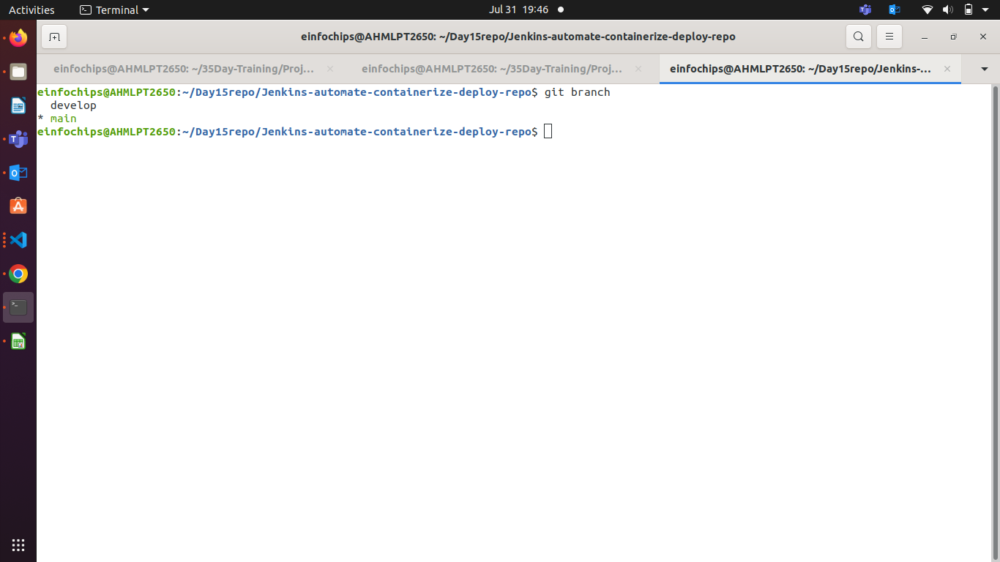

   * **Add Configuration Files**:  
     * Create a `.gitignore` file to exclude files like logs, temporary files, etc.  
     * Create a `README.md` file with a project description, setup instructions, and contribution guidelines.  
1. **Docker Configuration:**  
   * **Dockerfile**:  
     * Write a `Dockerfile` to define how to build the Docker image for the web application.  
     ```Dockerfile
        FROM nginx:alpine
        COPY index.html /usr/share/nginx/html/index.html
        EXPOSE 80
        CMD ["nginx", "-g", "daemon off"]
     ```
     * **Create Custom nginx page using index.html file**
     ```html
        <!DOCTYPE html>
        <html>
        <head>
            <title>My Static Website</title>
        </head>

        <body>
            <h1>Hello from Ansible and Jenkins!</h1>
            <p>This is a simple static front-end served by Nginx.</p>

        </body>
        </html>
     ```
   * **Docker Ignore File**:  
     * Create a `.dockerignore` file to exclude files and directories from the Docker build context.  
   * **Image Management**:  
     * Build a Docker image using the `Dockerfile`.  
        
            docker build -t 'image_name' .
    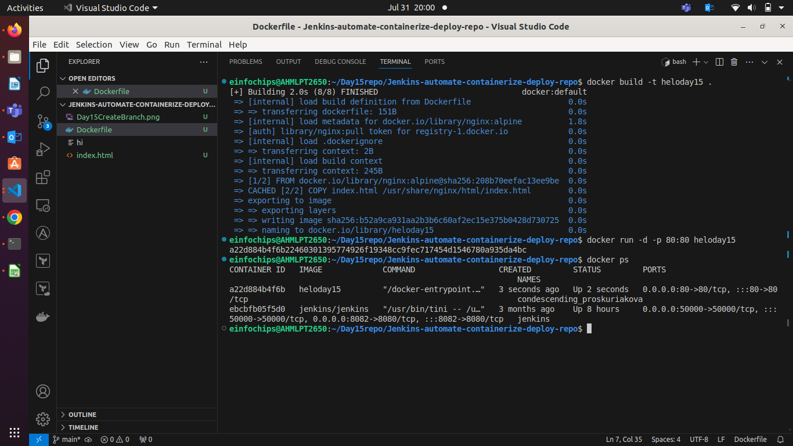
         
     * Push the built Docker image to a container registry (e.g., Docker Hub).  

   * **Varify Container is Running**
           
    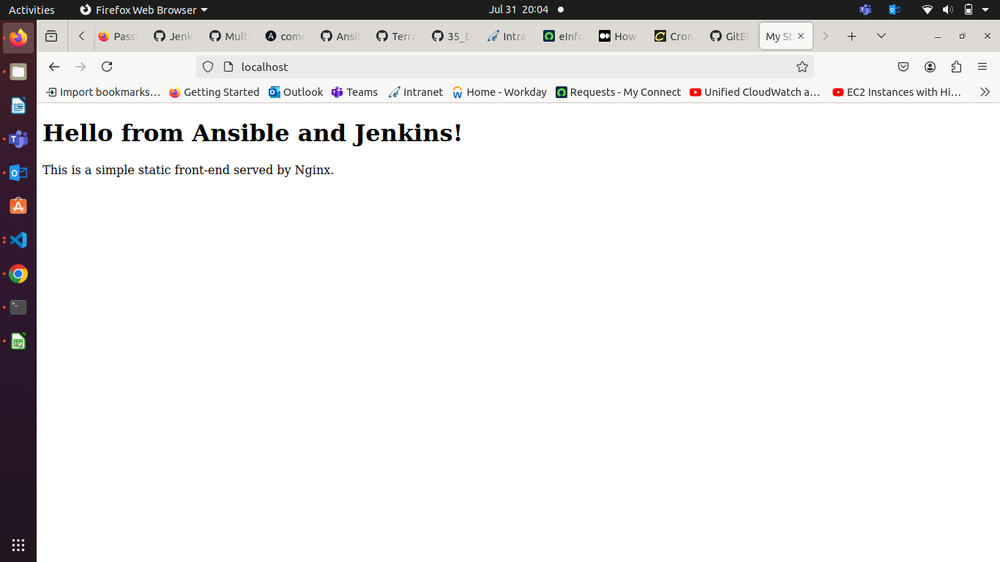
1. **Jenkins Configuration:**  
   * **Jenkins Job Setup**:  
     * Create a Jenkins job to pull code from the Git repository.  
      
      - Create Pipeline Job.

     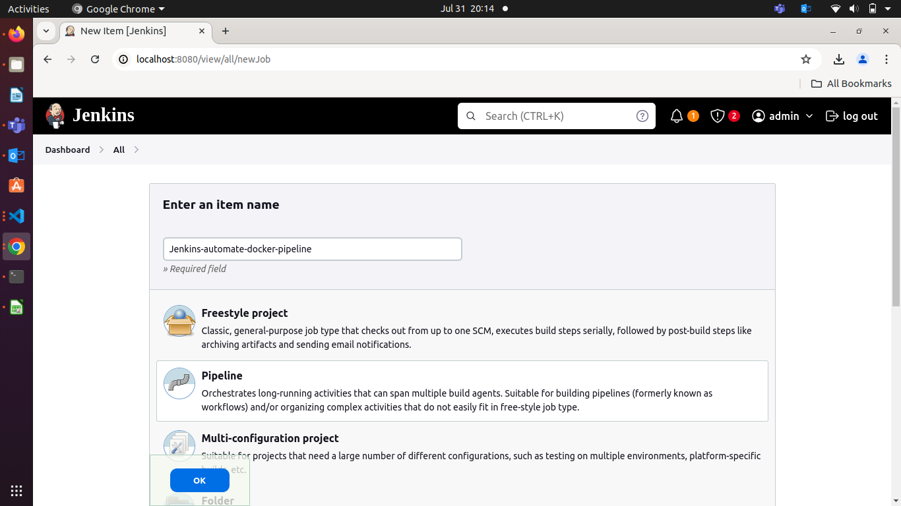

      - Add Your Git Repo
      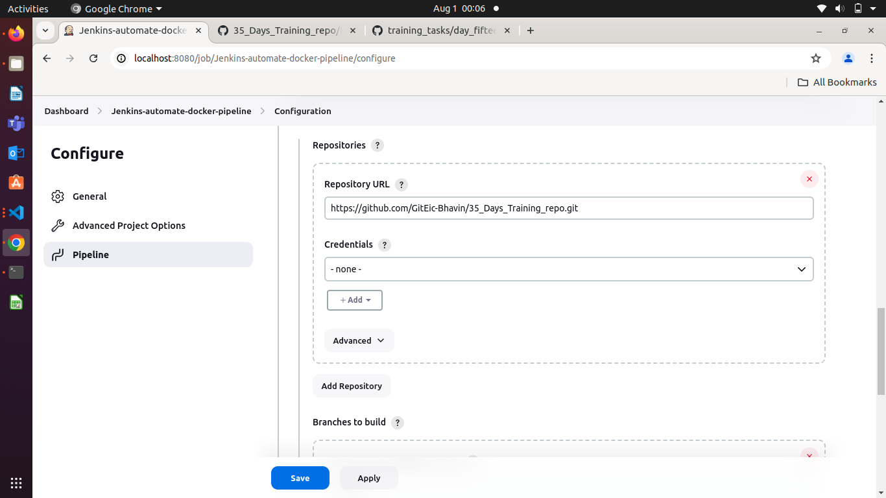

      - Add your git branch where jenkinsfile is.
      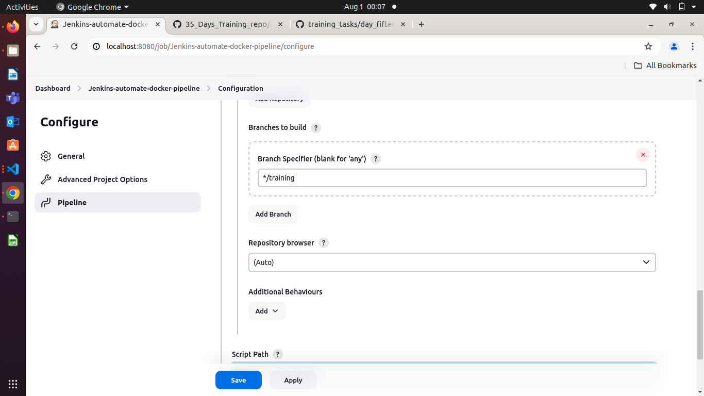

      - Add Jenkinsfile path
      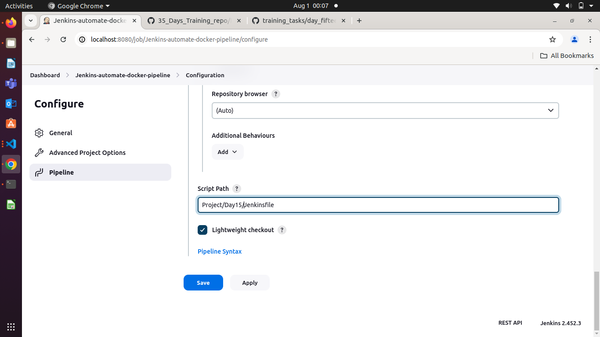
  *
            
   * Configure Jenkins to build the Docker image using the `Dockerfile`.  
     * Set up Jenkins to run tests on the Docker image.  
     * Configure Jenkins to push the Docker image to the container registry after a successful build. 

```groovy

    pipeline {
    agent any 
    //   tools {
    //     maven 'maven-3.9.0'
    //   }

    stages{
        stage('Checkout') {
            steps {
                git branch: 'training', url: 'https://github.com/GitEic-Bhavin/35_Days_Training_repo.git'
            }
        }
        stage('Build') {
            steps {
                script {

                    withDockerRegistry(credentialsId: 'docker-cred') {
                        sh "docker build -t bhavin1099/day15-${BUILD_NUMBER}:v1 -f Project/Day15/Dockerfile ."
                 }


                }
            } 
        }
        stage('Push') {
          steps {
              script {
                  withDockerRegistry(credentialsId: 'docker-cred') {
                    sh "docker push bhavin1099/day15-${BUILD_NUMBER}:v1"
                  }    
              }
            }
        }

        stage('Deploy Container'){
            steps{
                script{
                    withDockerRegistry(credentialsId: 'docker-cred') {
                        def runContainer = docker.image("bhavin1099/day15-${BUILD_NUMBER}:v1").run("--name myday15-${BUILD_NUMBER}-container -d -p 80:80")

                    }
                }
            }
        }
    }
}
```

   * **Jenkins Pipeline**:  
     * Create a `Jenkinsfile` to define the CI/CD pipeline stages, including build, test, and deploy.  
1. **Ansible Playbook:**  
   * **Basic Playbook Creation**:  
     * Develop an Ansible playbook to automate the deployment of the Docker container. 
          
          - **NOTE**:- If you are facing error like ModuleNotFound for **docker** during pulling image and Run Container, It means, module **docker_image** and module **docker_container** doesn't have module for docker to work on remote server.

          - You have to use community for docker.
          - This community will have all required module for docker like **push, pull, run, service**.
          - To Install docker community use below command
            
                
                ansible-galaxy collection install community.docker
  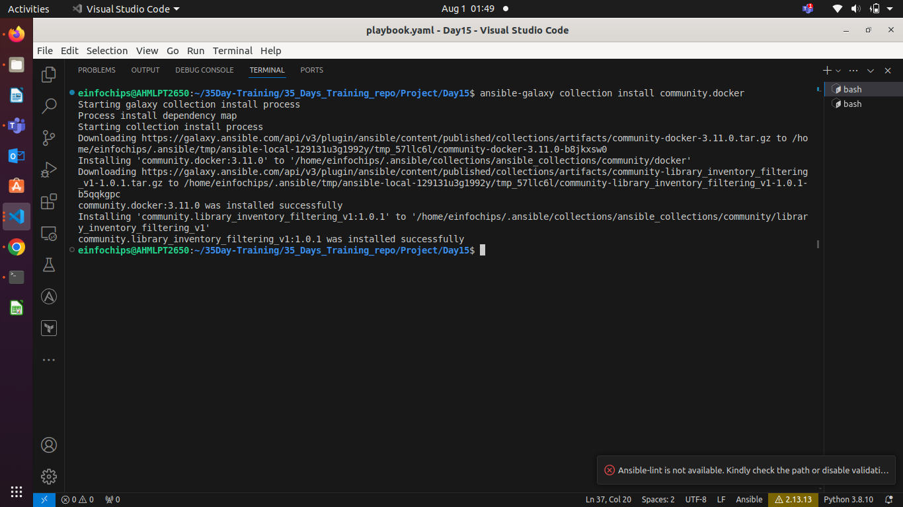

   * **Playbook Tasks**:  
     * Install Docker on the target server (if Docker is not already installed).  
     * Pull the Docker image from the container registry.  
     * Run the Docker container with the required configurations.  

```yaml

---
- name: Install Docker on target
  hosts: webserver
  become: true
  tasks: 
    - name: install dependencies for docker
      ansible.builtin.apt:
        name: "{{ item }}"
        update_cache: true
        state: present
      with_items:
          - python3-pip
          - python3
          - docker.io

    - name: Enable docker servcie
      ansible.builtin.service:
        name: docker
        state: started
        enabled: yes

    - name: Pulling docker image
      community.docker.docker_image:
        name: bhavin1099/day15-8
        tag: v1
        source: pull

        

    - name: Running docker container
      community.docker.docker_container:
        name: my-ansible-container
        image: bhavin1099/day15-8:v1
        state: started
        restart_policy: always
        ports:
          - "81:80"
```
- **OutPut**

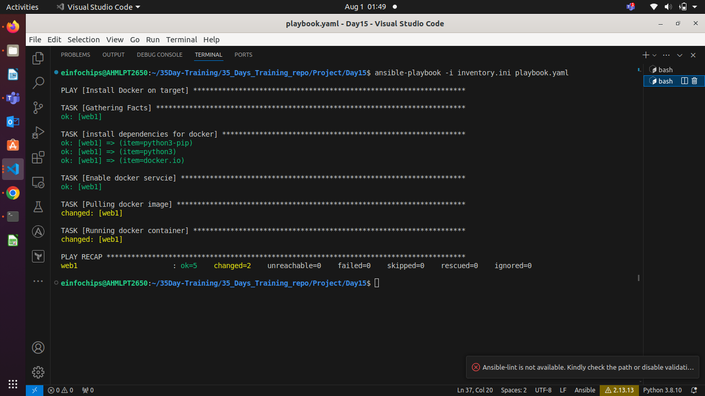

- **Varify on Browser**

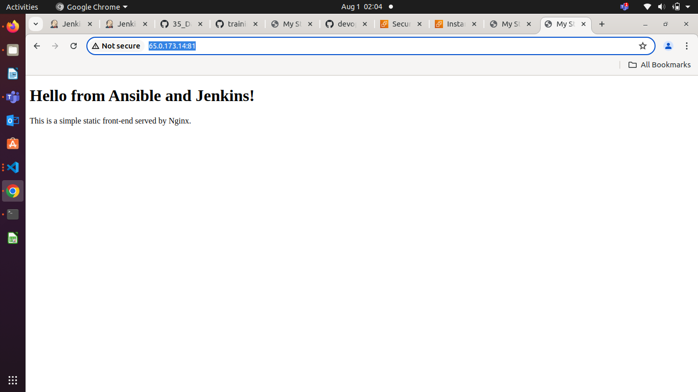

- **How to work on port 81 instead of 80 ?**
- **This is works on Ubuntu EC2 Instance**

  - To work on port 80, you have to modify SG of your server like below

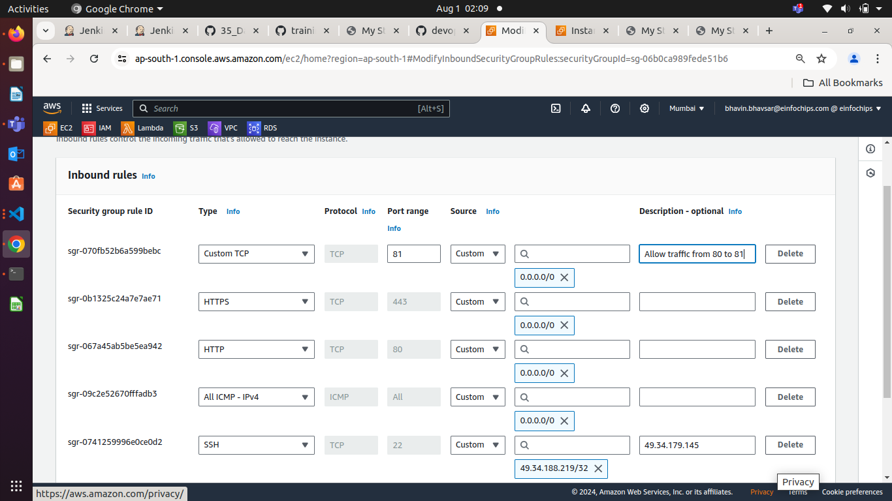

   * **Inventory File**:  
     * Create an `inventory` file specifying the target server(s) for deployment.

     **inventory.ini**
     [webserver]
```inventory.ini
web1 ansible_host=ip-of-server ansible_user=ubuntu ansible_private_key_file=/path/of/private-key-file
```
  **Ad-hoc Command to ping target**
  
     ansible webserver -i inventory.ini -m ping
