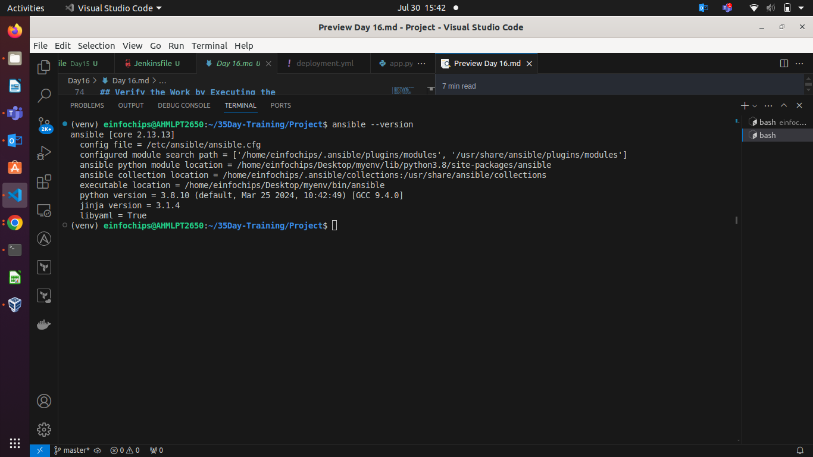
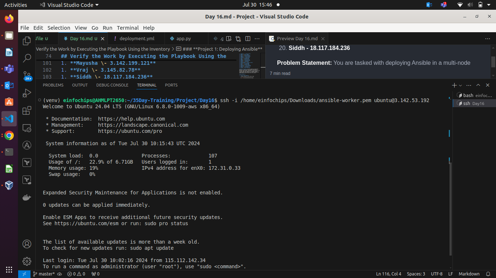
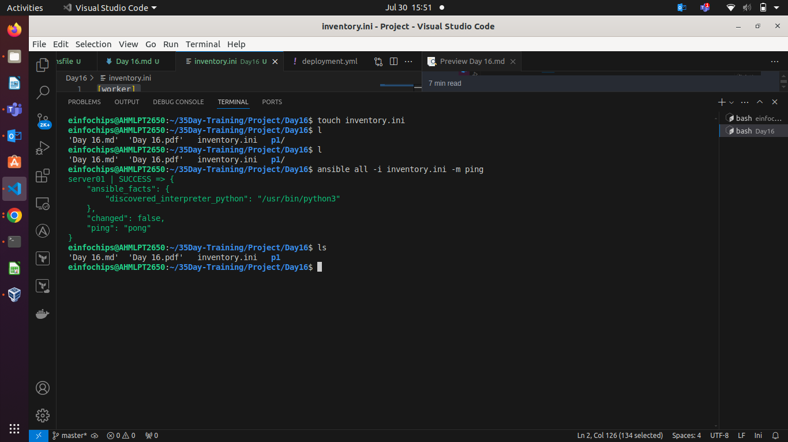
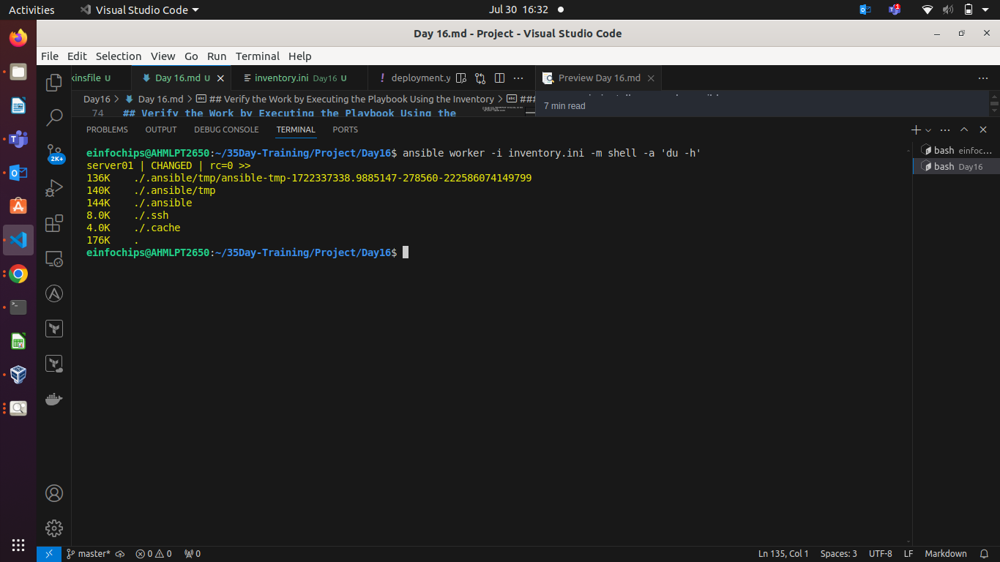
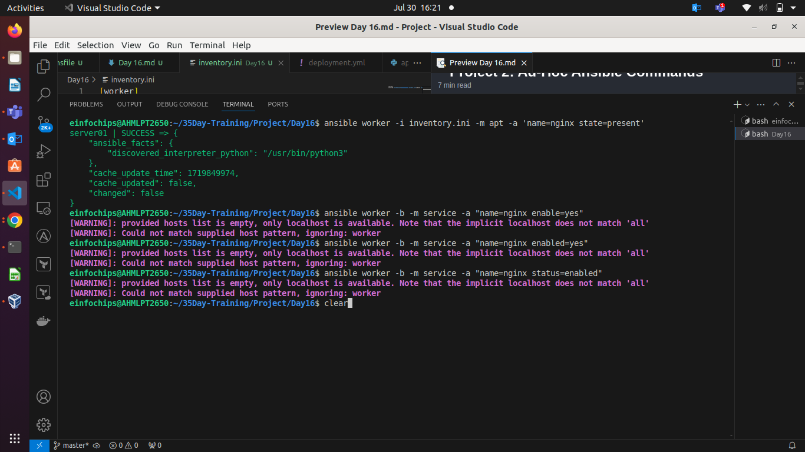
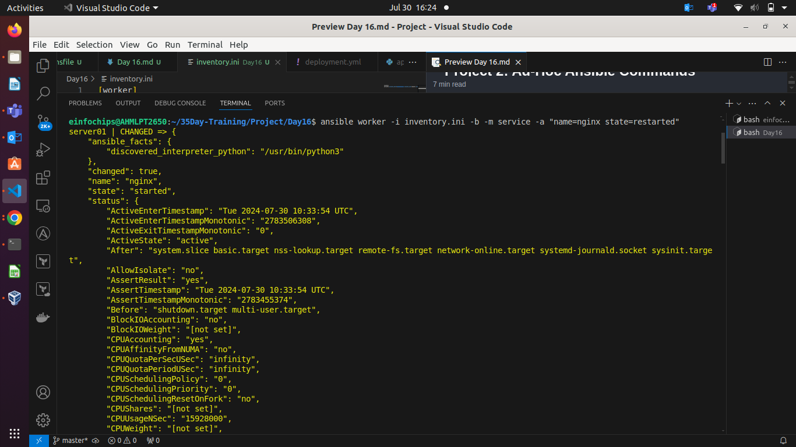
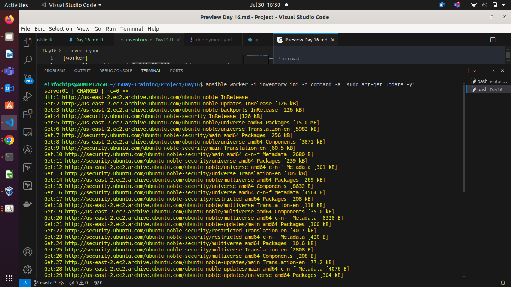
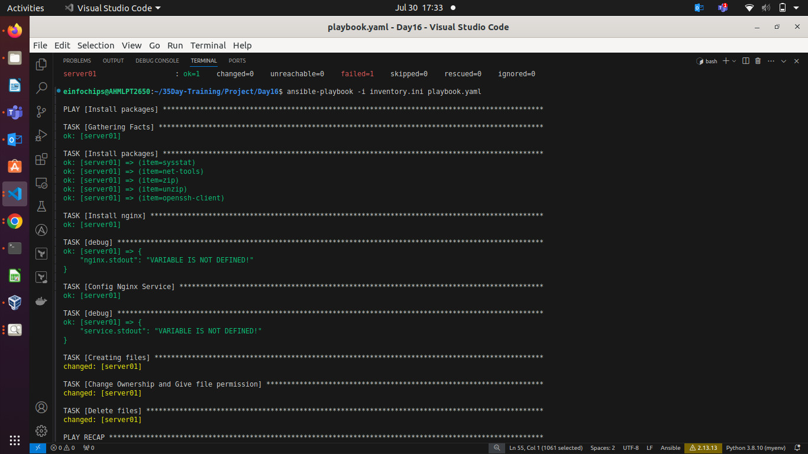

**Project is on last page**

**Use Case Scenario**

Some consultants will be performing audits on a number of systems in our company's environment. We've got to create the user accounts listed in */home/ansible/userlist.txt* and set up the provided public keys for their accounts. The security team has built a jump host for the consultants to access production systems and provided us with the full key-pair so we can set up and test the connection. All hosts in `dbsystems` will need that public key installed so the consultants may use key-pair authentication to access the systems. We must also ensure the `auditd` service is enabled and running on all systems.

#### **Get Logged In**

* Login credentials are all on the lab overview page. Once we're logged into the **control1** server, become the **ansible** user (**su \- ansible**) and we can get going.

#### **Create the User Accounts Noted in `/home/ansible/userlist.txt`**

* If we read the `userlist.txt` file in our home directory, we'll see `consultant` and `supervisor`. Those are the two new user accounts we have to create:

`ansible dbsystems -b -m user -a "name=consultant"`  
`ansible dbsystems -b -m user -a "name=supervisor"`

#### **Place Key Files in the Correct Location, */home/$USER/.ssh/authorized\_keys*, on Hosts in *dbsystems***

* Run the following commands:

`ansible dbsystems -b -m file -a "path=/home/consultant/.ssh state=directory owner=consultant group=consultant mode=0755"`

`ansible dbsystems -b -m copy -a "src=/home/ansible/keys/consultant/authorized_keys dest=/home/consultant/.ssh/authorized_keys mode=0600 owner=consultant group=consultant"`

`ansible dbsystems -b -m file -a "path=/home/supervisor/.ssh state=directory owner=supervisor group=supervisor mode=0755"`  
`ansible dbsystems -b -m copy -a "src=/home/ansible/keys/supervisor/authorized_keys dest=/home/supervisor/.ssh/authorized_keys mode=0600 owner=supervisor group=supervisor"`

#### **Ensure *auditd* Is Enabled and Running on All Hosts**

* Run the following command:

`ansible all -b -m service -a "name=auditd state=started enabled=yes"`

## **Playbook Scenario Scenario**

Our company has been increasing the deployment of small brochure-style websites for clients. The head of IT has decided that each client should have their own web server, for better client isolation, and has tasked us with creating concept automation to quickly deploy web-nodes with simple static website content.  
We have been provided an Ansible control node (control1) and 2 test lab servers (node1 and node2) that have been preconfigured with the ansible user and key.  
We must create an Ansible inventory in /home/ansible/inventory containing a host group named web. The web group should contain node1 and node2.  
Then we've got to design an Ansible playbook that will execute the following tasks on your configured inventory:

* Install httpd  
* Start and enable the httpd service  
* Install a simple website provided on a repository server.

## Create an inventory in /home/ansible/inventory That Contains a Host Group Named web. The web Group Should Contain node1 and node2

Use Vim to create the inventory file:  
\[ansible@control1\]$ echo "\[web\]" \>\> /home/ansible/inventory  
\[ansible@control1\]$ echo "node1" \>\> /home/ansible/inventory  
\[ansible@control1\]$ echo "node2" \>\> /home/ansible/inventory

It should contain this when we're done:  
\[web\]  
node1  
node2

## Create a Playbook in /home/ansible/web.yml

Using Vim, we'll create our web.yml file with these contents:  
\---  
\- hosts: web  
  become: yes  
  tasks:  
    \- name: install httpd  
      yum: name=httpd state=latest  
    \- name: start and enable httpd  
      service: name=httpd state=started enabled=yes  
    \- name: retrieve website from repo  
      get\_url: url=http://repo.example.com/website.tgz dest=/tmp/website.tgz  
    \- name: install website  
      unarchive: remote\_src=yes src=/tmp/website.tgz dest=/var/www/html/

## Verify the Work by Executing the Playbook Using the Inventory

ansible-playbook \-i /home/ansible/inventory /home/ansible/web.yml

### **Project 1: Deploying Ansible**

**Problem Statement:** You are tasked with deploying Ansible in a multi-node environment consisting of multiple Linux servers. The goal is to set up Ansible on a control node and configure it to manage several managed nodes. This setup will be used for automating system administration tasks across the network.

**Deliverables:**

1. **Control Node Setup:**  
   * Install Ansible on the control node.  

   

   * Configure SSH key-based authentication between the control node and managed nodes. 

    


1. **Managed Nodes Configuration:**  
   * Ensure all managed nodes are properly configured to be controlled by Ansible.  
   * Verify connectivity and proper setup between the control node and managed nodes. 

    

1. **Documentation:**  
   * Detailed installation and configuration steps.  
   * Troubleshooting guide for common issues encountered during deployment.

   If ping pong now work, varify
ICMP Protocol is enable for all in SG of worker node.
sudo apt-get update
if you get error "ModuleNotFound" during ping, you have to upgrade ansible by
  pip install --upgrade ansible


### **Project 2: Ad-Hoc Ansible Commands**

**Problem Statement:** Your organization needs to perform frequent, one-off administrative tasks across a fleet of servers. These tasks include checking disk usage, restarting services, and updating packages. You are required to use Ansible ad-hoc commands to accomplish these tasks efficiently.

**Deliverables:**

1. **Task Execution:**  
   * Execute commands to check disk usage across all managed nodes.  



   * Restart a specific service on all managed nodes.  





   * Update all packages on a subset of managed nodes.  



1. **Command Scripts:**  
   * Create a script or documentation for each task, detailing the ad-hoc command used and its output.  
1. **Documentation:**  
   * Provide a comprehensive guide on using Ansible ad-hoc commands.  
   * Include examples of common administrative tasks that can be performed with ad-hoc commands.

### **Project 3: Working with Ansible Inventories**

**Problem Statement:** You need to manage a dynamic and diverse set of servers, which requires an organized and flexible inventory system. The project involves creating static and dynamic inventories in Ansible to categorize servers based on different attributes such as environment (development, staging, production) and roles (web servers, database servers).

**Deliverables:**

1. **Static Inventory:**  
   * Create a static inventory file with different groups for various environments and roles.  
   * Verify that the inventory is correctly structured and accessible by Ansible.  

**inventory.ini**

      [worker]
      server01 ansible_host=public_ip-of-server ansible_user=ubuntu ansible_private_key_file=/path/to/private-key-file

1. **Dynamic Inventory:**  
   * Implement a dynamic inventory script or use a dynamic inventory plugin.  
   * Configure the dynamic inventory to categorize servers automatically based on predefined criteria.  
1. **Documentation:**  
   * Instructions for setting up and using static and dynamic inventories.  
   * Examples of playbooks utilizing both types of inventories.

### **Project 4: Ansible Playbooks: The Basics**

**Problem Statement:** Your team needs to automate repetitive tasks such as installing packages, configuring services, and managing files on multiple servers. The project involves writing basic Ansible playbooks to automate these tasks, ensuring consistency and efficiency in the operations.

**Deliverables:**

1. **Playbook Creation:**  
   * Write a playbook to install a specific package on all managed nodes. 

   * Create a playbook to configure a service with specific parameters.  

   * Develop a playbook to manage files, such as creating, deleting, and modifying files on managed nodes. 
   ```yml    
         ---
         - name: Install packages
         hosts: worker
         become: true
         tasks:

            - name: Install packages
               apt:
               name: "{{ item }}"
               state: present
               update_cache: true
               with_items:
               - sysstat
               - net-tools
               - zip
               - unzip
               - openssh-client

            - name: Install nginx
               apt: 
               name: nginx
               state: present
               update_cache: true
               register: nginx
            - debug:
               var: nginx.stdout

            - name: Config Nginx Service
               service:
               name: nginx
               state: started
               enabled: true
               register: service
            - debug:
               var: service.stdout

            - name: Creating files
               ansible.builtin.file:
               path: /home/ubuntu/Day16.txt
               state: touch 

            - name: Change Ownership and Give file permission
               ansible.builtin.file:
               path: /home/ubuntu/Day16.txt
               group: ubuntu
               owner: ubuntu
               mode: 400

            - name: Delete files
               ansible.builtin.file:
               path: /home/ubuntu/Day16.txt
               state: absent
   ```
  


1. **Testing and Verification:**  
   * Test the playbooks to ensure they run successfully and perform the intended tasks. 

   
    
   * Validate the changes made by the playbooks on the managed nodes.  
1. **Documentation:**  
   * Detailed explanation of each playbook, including the tasks and modules used.  
   * Guide on how to run the playbooks and interpret the results.

### **Project 5: Ansible Playbooks \- Error Handling**

**Problem Statement:** In a complex IT environment, tasks automated by Ansible playbooks may encounter errors due to various reasons such as incorrect configurations, unavailable resources, or network issues. The project focuses on implementing error handling in Ansible playbooks to ensure resilience and proper reporting of issues.

**Deliverables:**

1. **Playbook with Error Handling:**  
   * Write a playbook that includes tasks likely to fail, such as starting a non-existent service or accessing a non-existent file.  
   * Implement error handling strategies using modules like `block`, `rescue`, and `always`. 
   ```yaml
         ---
         - name: Trying to access unavailable service
         hosts: server01
         tasks:
            - name: Trying to access unavailable service
               block:
               - ansible.builtin.get_url:
                     url: http://be.jacpcldce.ac.in/govt/pdf/List%20of%20Institute%20with%20MQ_NRI%20and%20Entrance%20exam%20Bifurcation1.pdf
                     dest: /home/ubuntu
               - debug: 
                     msg: "Image is downloaded!"
               rescue:
               - debug: msg="Corrected Image is downloading!"
               - ansible.builtin.get_url:
                     url: http://be.jacpcldce.ac.in/govt/pdf/List%20of%20Institute%20with%20MQ_NRI%20and%20Entrance%20exam%20Bifurcation.pdf
                     dest: /home/ubuntu
   ```      
          

1. **Logging and Notifications:**  
   * Configure the playbook to log errors and notify administrators of any issues encountered during execution.  
   * Use Ansible modules to send notifications via email or other communication channels.  
1. **Documentation:**  
   * Comprehensive guide on error handling in Ansible playbooks, including examples of common scenarios and solutions.  
   * Detailed instructions on setting up logging and notifications for error handling.

