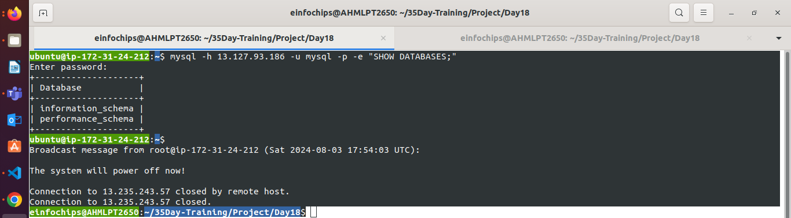

### **Ansible Variables**

### **Defining Variables**

#### **In Playbooks**

`- name: Example playbook`  
  `hosts: all`  
  `vars:`  
    `http_port: 80`  
    `max_clients: 200`  
  `tasks:`  
    `- name: Print the HTTP port`  
      `debug:`  
        `msg: "HTTP port is {{ http_port }}"`

#### **In Inventory Files**

`[webservers]`  
`web1 ansible_host=192.168.1.100 http_port=8080`  
`web2 ansible_host=192.168.1.101 http_port=9090`

#### **In Roles**

**defaults/main.yml**:

`http_port: 80`  
`max_clients: 200`

**vars/main.yml**:

`http_port: 8080`

### **Using Variables**

#### **In Tasks**

Variables are referenced using the Jinja2 templating syntax, typically `{{ variable_name }}`.

`- name: Start web server`  
  `service:`  
    `name: apache2`  
    `state: started`  
    `port: "{{ http_port }}"`

#### **In Templates**

`server {`  
    `listen {{ http_port }};`  
    `server_name {{ server_name }};`  
    `location / {`  
        `proxy_pass http://{{ proxy_host }};`  
    `}`  
`}`

#### **In Handlers**

`- name: Restart web server`  
  `service:`  
    `name: apache2`  
    `state: restarted`

**Reserved Keywords in Ansible**

Avoid using these reserved keywords as variable names in Ansible

[**Playbook Keywords — Ansible Community Documentation**](https://docs.ansible.com/ansible/latest/reference\_appendices/playbooks\_keywords.html)

### **Use Cases**

#### **Dynamic Configuration Management**

Variables allow for dynamic configurations, such as setting different ports for web servers based on the environment.

#### **Reusability and Modularity**

Using variables in roles enables you to create modular and reusable code. For example, a role for deploying a web server can be reused across different environments (dev, staging, production) by changing the variables.

#### **Conditional Execution**

Variables can be used for conditional execution of tasks.

`- name: Install Apache on CentOS`  
  `yum:`  
    `name: httpd`  
    `state: present`  
  `when: ansible_os_family == "RedHat"`

### **Example: Combining Variables**

   
`- name: Deploy web application`  
  `hosts: webservers`  
  `vars:`  
    `http_port: 8080`  
    `max_clients: 100`  
  `tasks:`  
    `- name: Install Nginx`  
      `apt:`  
        `name: nginx`  
        `state: present`  
      `when: ansible_os_family == "Ubuntu"`

    `- name: Start Nginx`  
      `service:`  
        `name: nginx`  
        `state: started`  
        `enabled: yes`

    `- name: Deploy configuration file`  
      `template:`  
        `src: nginx.conf.j2`  
        `dest: /etc/nginx/nginx.conf`  
      `notify:`  
        `- Restart Nginx`

  `handlers:`  
    `- name: Restart Nginx`  
      `service:`  
        `name: nginx`  
        `state: restarted`

### **Jinja2 Template**

### Jinja2 is a modern and designer-friendly templating engine for Python. In Ansible, Jinja2 templates are used to create dynamic content. They allow you to generate configuration files and scripts dynamically based on variables and conditions. Here's an overview of how to use Jinja2 templates in Ansible:

### **1\. Basic Structure**

### A Jinja2 template is essentially a text file with placeholders for variables and expressions. These placeholders are enclosed in double curly braces `{{ }}`. Control structures like loops and conditionals are enclosed in ``.

### **2\. Using Variables**

### You can use variables in your templates by enclosing them in double curly braces. For example, if you have a variable `hostname`, you can use it in your template as follows:

### `server {`

###     `listen 80;`

###     `server_name {{ hostname }};`

###     `...`

### `}`

### **Using the `template` Module in Ansible**

### The `template` module in Ansible is used to copy a Jinja2 template file from the control node to the managed nodes. This module processes the template file, rendering it with variables and logic defined within the template, and then places the rendered file on the managed nodes.

### **What Happens When We Use the `template` Module**

### When we use the `template` module, the following happens:

1. ### **Template Rendering**: The Jinja2 template file is rendered with the provided variables.

1. ### **File Transfer**: The rendered file is transferred to the specified destination on the managed nodes.

1. ### **Change Detection**: Ansible detects if the contents of the destination file have changed.

1. ### **Notification**: If a change is detected, handlers notified by this task are triggered.

#### **Example Using the `template` Module**

### **Jinja2 Template File (`nginx.conf.j2`)**

### `server {`

###     `listen 80;`

###     `server_name {{ hostname }};`

### 

###     `location / {`

###         `proxy_pass http://backend;`

###         ``

###         `add_header {{ header.name }} "{{ header.value }}";`

###         ``

###     `}`

### `}`

### 

### 

### 

### 

### **Playbook (`site.yml`)**

### `- name: Configure Nginx`

###   `hosts: webservers`

###   `vars:`

###     `hostname: "example.com"`

###     `headers:`

###       `- { name: "X-Frame-Options", value: "DENY" }`

###       `- { name: "X-Content-Type-Options", value: "nosniff" }`

###       `- { name: "X-XSS-Protection", value: "1; mode=block" }`

###   `tasks:`

###     `- name: Generate Nginx config file from template`

###       `template:`

###         `src: templates/nginx.conf.j2`

###         `dest: /etc/nginx/nginx.conf`

###       `notify:`

###         `- restart nginx`

### 

###   `handlers:`

###     `- name: restart nginx`

###       `service:`

###         `name: nginx`

###         `state: restarted`

### 

### **What Happens in This Example**

1. ### **Rendering**: The `nginx.conf.j2` template is rendered with the values of `hostname` and `headers`.

1. ### **File Transfer**: The rendered `nginx.conf` file is placed in `/etc/nginx/nginx.conf` on the managed nodes.

1. ### **Change Detection**: Ansible checks if the content of `/etc/nginx/nginx.conf` has changed.

1. ### **Handler Notification**: If the content has changed, the `restart nginx` handler is notified to restart the Nginx service.

### **What Happens When We Don't Use the `template` Module**

### If we don't use the `template` module and instead use another method like `copy` or manual file editing, we lose the advantages of dynamic content generation and change detection.

#### **Example Without the `template` Module**

### **Static Configuration File (`nginx.conf`)**

### `server {`

###     `listen 80;`

###     `server_name example.com;`

### 

###     `location / {`

###         `proxy_pass http://backend;`

###         `add_header X-Frame-Options "DENY";`

###         `add_header X-Content-Type-Options "nosniff";`

###         `add_header X-XSS-Protection "1; mode=block";`

###     `}`

### `}`

### 

### **Playbook (`site.yml`)**

### `- name: Configure Nginx`

###   `hosts: webservers`

###   `tasks:`

###     `- name: Copy Nginx config file`

###       `copy:`

###         `src: files/nginx.conf`

###         `dest: /etc/nginx/nginx.conf`

###       `notify:`

###         `- restart nginx`

### 

###   `handlers:`

###     `- name: restart nginx`

###       `service:`

###         `name: nginx`

###         `state: restarted`

### 

### **Differences and Impact**

1. ### **Static Content**: The configuration file is static and does not adapt to different variables or conditions.

1. ### **No Dynamic Rendering**: Variables like `hostname` and `headers` are hard-coded and cannot be dynamically adjusted based on different environments or hosts.

1. ### **Limited Flexibility**: If you need to change the `hostname` or add headers, you must manually edit the configuration file or create multiple static files for different environments.

1. ### **Change Detection and Efficiency**: The `copy` module will overwrite the file every time the playbook runs, leading to unnecessary service restarts if the file hasn't changed.

### 

### **3\. Conditionals**

### Jinja2 supports conditionals using the `` statement.

### ``

### `server {`

###     `listen 80;`

###     `server_name {{ hostname }};`

### `}`

### ``

### `server {`

###     `listen 8080;`

###     `server_name {{ hostname }};`

### `}`

### ``

### 

### **4\. Loops**

### You can iterate over lists or dictionaries using ``.

### `server {`

###     `listen 80;`

###     `server_name {{ hostname }};`

###     `location / {`

###         `proxy_pass http://backend;`

###         ``

###         `add_header {{ header.name }} "{{ header.value }}";`

###         ``

###     `}`

### `}`

### 

### **5\. Filters**

### Jinja2 provides various filters to transform the output. Filters are applied using the pipe `|` symbol.

### `{{ some_variable | upper }}`

### `{{ list_variable | join(", ") }}`

### 

### **6\. Template File**

### Save your Jinja2 template as a `.j2` file. For example, `nginx.conf.j2`.

### **7\. Using Templates in Ansible Playbook**

### Use the `template` module in your Ansible playbook to process the template and generate the file.

### `- name: Generate Nginx config file`

###   `hosts: webservers`

###   `vars:`

###     `hostname: "example.com"`

###     `environment: "production"`

###     `headers:`

###       `- { name: "X-Frame-Options", value: "DENY" }`

###       `- { name: "X-Content-Type-Options", value: "nosniff" }`

###   `tasks:`

###     `- name: Create Nginx config file from template`

###       `template:`

###         `src: templates/nginx.conf.j2`

###         `dest: /etc/nginx/nginx.conf`

###       `notify:`

###         `- restart nginx`

### 

### **8\. Handlers**

### Use handlers to perform actions like restarting a service when the template changes.

### 

### `handlers:`

###   `- name: restart nginx`

###     `service:`

###       `name: nginx`

###       `state: restarted`

### 

### **Example Jinja2 Template**

### Here’s a complete example of an Nginx configuration file template `nginx.conf.j2`:

### `server {`

###     `listen 80;`

###     `server_name {{ hostname }};`

### 

###     `location / {`

###         `proxy_pass http://backend;`

###         ``

###         `add_header {{ header.name }} "{{ header.value }}";`

###         ``

###     `}`

### 

###     ``

###     `error_log /var/log/nginx/error.log;`

###     `access_log /var/log/nginx/access.log;`

###     ``

###     `error_log /var/log/nginx/error_dev.log;`

###     `access_log /var/log/nginx/access_dev.log;`

###     ``

### `}`

### 

### **Handlers in Ansible**

Handlers in Ansible are special tasks that are triggered by other tasks using the `notify` directive. They are typically used for tasks that need to run when certain conditions are met, such as restarting a service after a configuration file has been changed. Handlers are only run once, at the end of a playbook, regardless of how many tasks notify them.

### **Purpose of Handlers**

1. **Efficiency**: Handlers prevent unnecessary actions by ensuring that the action (e.g., service restart) is only performed if there was a change.  
1. **Order and Dependency Management**: Handlers run in a specific order, after all tasks have been executed, ensuring that dependent services are restarted in the correct sequence.  
1. **Idempotence**: They help maintain idempotence (ensuring the same result is produced even if the playbook runs multiple times) by only triggering actions when needed.

### **What Happens If We Don't Use Handlers?**

If handlers are not used, tasks that need to be conditionally executed based on changes in other tasks will either:

* Not be executed when necessary, leading to outdated configurations or services not being properly restarted.  
* Be executed every time, leading to unnecessary actions and potentially longer playbook execution times.

### **Example Without Handlers**

Consider the scenario where an Nginx configuration file is updated, and the Nginx service needs to be restarted if the configuration file changes.

#### **Playbook Without Handlers**

`- name: Configure Nginx`  
  `hosts: webservers`  
  `tasks:`  
    `- name: Generate Nginx config file from template`  
      `template:`  
        `src: templates/nginx.conf.j2`  
        `dest: /etc/nginx/nginx.conf`  
      `# No notify directive here`

    `- name: Restart Nginx service`  
      `service:`  
        `name: nginx`  
        `state: restarted`

### **Issues Without Handlers**

1. **Inefficiency**: The Nginx service will be restarted every time the playbook runs, regardless of whether the configuration file was actually changed.  
1. **Unnecessary Downtime**: Restarting a service unnecessarily can lead to unwanted downtime and performance issues.

### **Example With Handlers**

#### **Template File (`nginx.conf.j2`)**

`server {`  
    `listen 80;`  
    `server_name {{ hostname }};`

    `location / {`  
        `proxy_pass http://backend;`  
        ``  
        `add_header {{ header.name }} "{{ header.value }}";`  
        ``  
    `}`  
`}`

#### **Playbook With Handlers**

`- name: Configure Nginx`  
  `hosts: webservers`  
  `vars:`  
    `hostname: "example.com"`  
    `headers:`  
      `- { name: "X-Frame-Options", value: "DENY" }`  
      `- { name: "X-Content-Type-Options", value: "nosniff" }`  
      `- { name: "X-XSS-Protection", value: "1; mode=block" }`  
  `tasks:`  
    `- name: Generate Nginx config file from template`  
      `template:`  
        `src: templates/nginx.conf.j2`  
        `dest: /etc/nginx/nginx.conf`  
      `notify:`  
        `- restart nginx`

  `handlers:`  
    `- name: restart nginx`  
      `service:`  
        `name: nginx`  
        `state: restarted`

### **Explanation**

1. **Tasks Section**:  
   * The `template` module generates the Nginx config file and places it at `/etc/nginx/nginx.conf`.  
   * The `notify` directive is used to notify the handler named `restart nginx` if the template task results in a change.  
1. **Handlers Section**:  
   * The handler `restart nginx` is defined to restart the Nginx service.  
   * This handler will only be triggered if the `template` task reports a change.

### **Benefits With Handlers**

* **Efficiency**: The Nginx service is only restarted if the configuration file changes.  
* **Reduced Downtime**: Avoid unnecessary service restarts, leading to fewer disruptions.  
* **Clarity and Maintainability**: The playbook is easier to read and maintain, with a clear separation of configuration changes and service management.

**Playbook Example for Jinja2 Template**

    \- name: Configure Nginx  
      hosts: web  
      become: true  
      vars:  
        hostname: "example.com"  
        header:  
          \- { name: "X-Frame-Options", value: "DENY" }  
          \- { name: "X-Content-Type-Options", value: "nosniff" }  
          \- { name: "X-XSS-Protection", value: "1; mode=block" }  
    tasks:  
      \- name: installing nginx  
        yum:   
          name: nginx  
          state: present  
          update\_cache: true

    \- name: Generate Nginx config file from template  
      template:  
        src: templates/nginx.conf.j2  
        dest: /etc/nginx/nginx.conf  
      notify:  
        \- restart nginx

    handlers:  
      \- name: restart nginx  
        ansible.builtin.service:  
          name: nginx.service  
          state: restarted

###  **Project 01**

### **Deploy a Database Server with Backup Automation**

**Objective**: Automate the deployment and configuration of a PostgreSQL database server on an Ubuntu instance hosted on AWS, and set up regular backups.

### **Problem Statement**

**Objective**: Automate the deployment, configuration, and backup of a PostgreSQL database server on an Ubuntu instance using Ansible.

**Requirements**:

1. **AWS Ubuntu Instance**: You have an Ubuntu server instance running on AWS.  
1. **Database Server Deployment**: Deploy and configure PostgreSQL on the Ubuntu instance.  
1. **Database Initialization**: Create a database and a user with specific permissions.  
1. **Backup Automation**: Set up a cron job for regular database backups and ensure that backups are stored in a specified directory.  
1. **Configuration Management**: Use Ansible to handle the deployment and configuration, including managing sensitive data like database passwords.

### **Deliverables**

1. **Ansible Inventory File**  
   * **Filename**: `inventory.ini`  
   * **Content**: Defines the AWS Ubuntu instance and connection details for Ansible.  
   
      - **inventory.ini**

            [dataserver]
            server02 ansible_host=Databaseserver_Ip ansible_user=ubuntu ansible_private_key_file=/Path/to.Private_key_file.pem

1. **Ansible Playbook**  
   * **Filename**: `deploy_database.yml`  
   * **Content**: Automates the installation of PostgreSQL, sets up the database, creates a user, and configures a cron job for backups. It also includes variables for database configuration and backup settings. 
   - I used **Roles** to manage Servers and **MySQL Database**.

- roles/mysql/tasks/main.yml
```yml
---
# tasks file for mysql
- name: Install Python 3
  become: true
  # hosts: dataserver
  package:
    name: "{{ item }}"
    state: present
    update_cache: true
  with_items:
    - mysql-client
    - python3-mysqldb
    - libmysqlclient-dev

- name: Install MySQL Database
  become: true
  apt: 
    name: "{{ item }}"
    update_cache: true
    state: present
  with_items: 
    - mysql-server
  notify: 
    - Enable mysql service
    - Start mysql service

- name: Set Root User & Root Password to Secure MySq
  mysql_user:
    name: root
    password: "{{ mysql_root_password }}"
    login_unix_socket: /var/run/mysqld/mysqld.sock
    login_user: root
    login_password: root

- name: Remove Anonymous Users
  mysql_user:
    name: test
    state: absent
    login_user: root
    login_password: "{{ mysql_root_password }}"

- name: Ensure no user named 'db_user'@'localhost' exists, also passing in the auth credentials.
  mysql_user:
    name: mysql
    state: absent
    login_user: root
    login_password: "{{ mysql_root_password }}"

- name: Create Database
  mysql_db:
    name: "{{ mysql_db_name }}"
    state: present
    login_host: webserver
    login_user: root
    login_password: "{{ mysql_root_password }}"
    login_unix_socket: /var/run/mysqld/mysqld.sock

- name: Create MySQL user with password with access from any host (0.0.0.0)
  mysql_user:
    name: "{{ mysql_user }}"
    password: "{{ mysql_user_password }}"
    state: present
    host: "%"
    login_user: root
    login_password: "{{ mysql_root_password }}"
    login_unix_socket: /var/run/mysqld/mysqld.sock

# If you want to give all priv to your database only. use priv: "{{ your_db_name }}.*:ALL,GRANT"
- name: Grant all privileges on all databases to a user from any host
  mysql_user:
    name: "{{ mysql_user }}"
    password: "{{ mysql_user_password }}"
    priv: '*.*:ALL,GRANT'
    state: present
    login_user: root
    login_password: "{{ mysql_root_password }}"
    login_unix_socket: /var/run/mysqld/mysqld.sock

# create user 'mysql'@'%' identified by 'xyz@123';
# grant all on *.* to 'mysql'@'%'' with grant option;

- name: Allow MySQL Server to listen on all IPV4 to access user your database.
  lineinfile:
    path: /etc/mysql/mysql.conf.d/mysqld.cnf
    regexp: '^bind-address\s+=\s+127.0.0.1$'
    line: "{{ item }}"
  with_items: 
    - 'bind-address            = 0.0.0.0'
  notify: 
    - Restart MySQL Service
```

1. **Jinja2 Template**  
   * **Filename**: `templates/pg_hba.conf.j2`  
   * **Content**: Defines the PostgreSQL configuration file (`pg_hba.conf`) using Jinja2 templates to manage access controls dynamically.  
1. **Backup Script**  
   * **Filename**: `scripts/backup.sh`  
   * **Content**: A script to perform the backup of the PostgreSQL database. This script should be referenced in the cron job defined in the playbook.

### **Project 02**

**Objective**: Automate the setup of a multi-tier web application stack with separate database and application servers using Ansible.

### **Problem Statement**

**Objective**: Automate the deployment and configuration of a multi-tier web application stack consisting of:

1. **Database Server**: Set up a PostgreSQL database server on one Ubuntu instance.  
**inventory.ini**

       [webserver]
       server01 ansible_host=Webserver_Ip ansible_user=ubuntu ansible_private_key_file=/Path/to.Private_key_file.pem

       [dataserver]
       server02 ansible_host=Databaseserver_Ip ansible_user=ubuntu ansible_private_key_file=/Path/to.Private_key_file.pem


1. **Application Server**: Set up a web server (e.g., Apache or Nginx) on another Ubuntu instance to host a web application.  

* roles/apache2/tasks/main.yml
```yml
---
# tasks file for apache2
- name: Install apache2
  become: true
  ansible.builtin.apt:
    name: apache2
    state: present
    update_cache: true
  notify: 
    - Enable apache2 service
    - Start apache2 service

- name: Allow HTTP & HTTPS connection
  become: true
  command: ufw allow 'Apache FUll'

- name: Create Website ROOT PATH
  ansible.builtin.file:
    path: /var/www/my-website/
    state: directory
    owner: root
    mode: '755' 
    
- name: Make Custom Apache2 Page 
  template:
    src: index.html.j2
    dest: "/var/www/my-website/index.html"

- name: Set up APache conf file for Root Path for find/serve your Website
  template:
    src: "files/apache.conf.j2"
    dest: "/etc/apache2/sites-available/my-website.conf"

- name: Enable new site
  command: /usr/sbin/a2ensite my-website.conf
  notify:
    - Reload Apache

- name: Disable default apache site
  command: /usr/sbin/a2dissite 000-default.conf
  notify:
    - Reload Apache
```
**files/apache.conf.j2**
```html
<VirtualHost *:80>
   ServerAdmin webmaster@localhost
   ServerName my-website
   ServerAlias www.my-website
   DocumentRoot /var/www/my-website
   ErrorLog ${APACHE_LOG_DIR}/error.log
   CustomLog ${APACHE_LOG_DIR}/access.log combined
</VirtualHost>
```
**index.html.j2**
```html
<html>
<h1>
Hello world from Webserver Apache2!
</h1>
</html>
```

1. **Application Deployment**: Ensure the web application is deployed on the application server and is configured to connect to the PostgreSQL database on the database server. 
**To setup apache2, you have to install below dependencies**

##### roles/packages/tasks/main.yml
```yml
---
# tasks file for dependencies
- name: Insatlling PHP Packages 
  become: true
  apt:
    name: "{{ item }}"
    state: latest
    update_cache: true
  with_items: 
    - php 
    - libapache2-mod-php 
    - php-dev 
    - php-bcmath 
    - php-intl 
    - php-soap 
    - php-zip 
    - php-curl 
    - php-mbstring 
    - php-mysql 
    - php-gd
    - php-xml
    - mysql-client

- name: Show version of PHP
  become: true
  command: php -v
  register: php

- debug:
    var: php.stdout
```

- **Configured database server to receive traffic from webserver is done in mysql/main.yml**
- **Check Your webserver is able to connect dataserver by ad-hoc command**
- Allow Traffic from webserver SG to dataserver SG in MySQL Protocol.
      mysql -h dataserver_ip -u mysql -p -e "SHOW DATABASES;"
  **OutPut**


1. **Configuration Management**: Use Ansible to automate the configuration of both servers, including the initialization of the database and the deployment of the web application.
**Use Roles Stucture and write main.yml like below**
```yml
---
- name: install apache2
  hosts: webserver
  become: true
  roles:
    - apache2
    - packages
  
- name: Set up mysql for durpal
  hosts: dataserver
  become: true
  roles:
    - mysql
```
### **Deliverables**

1. **Ansible Inventory File**  
   * **Filename**: `inventory.ini`  
   * **Content**: Defines the database server and application server instances, including their IP addresses and connection details.  
1. **Ansible Playbook**  
   * **Filename**: `deploy_multitier_stack.yml`  
   * **Content**: Automates:  
     * The deployment and configuration of the PostgreSQL database server.  
     * The setup and configuration of the web server.  
     * The deployment of the web application and its configuration to connect to the database.  
1. **Jinja2 Template**  
   * **Filename**: `templates/app_config.php.j2`  
   * **Content**: Defines a configuration file for the web application that includes placeholders for dynamic values such as database connection details.  
1. **Application Files**  
   * **Filename**: `files/index.html` (or equivalent application files)  
   * **Content**: Static or basic dynamic content served by the web application.

