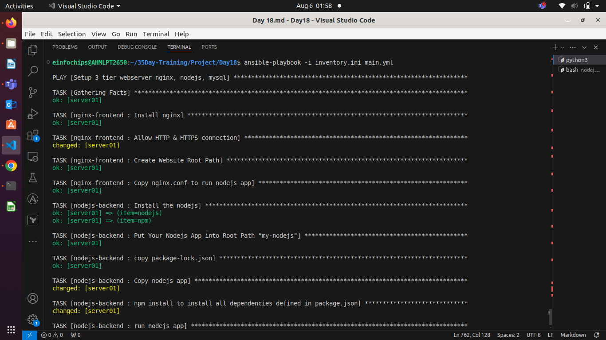
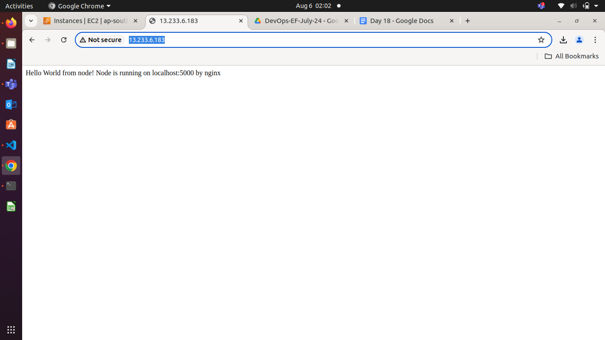

**Ansible Roles**

Ansible roles are a way to organize playbooks and automate tasks in a reusable, modular manner. Roles  help to keep playbooks simple and maintainable by grouping related tasks, variables, files, templates, and handlers together. Here’s an explanation of Ansible roles along with some example use cases:

### **Structure of Ansible Roles**

An Ansible role has a specific directory structure, typically organized as follows:

`roles/`  
`└── example_role/`  
    `├── tasks/`  
    `│   └── main.yml`  
    `├── handlers/`  
    `│   └── main.yml`  
    `├── templates/`  
		`NGINX.CONF.J1`  
		`DB2.CONF.J2`  
    `├── files/`  
		`FILE1.TXT`  
		`DBBACKUP.PARQUET`  
    `├── vars/`  
    `│   └── main.yml`  
    `├── defaults/ (Variables)`  
    `│   └── main.yml`  
    `├── meta/`  
    `│   └── main.yml`  
    `└── README.md`

### **Components of a Role**

* **tasks/**: Contains the main list of tasks to be executed by the role.  
* **handlers/**: Contains handlers which can be used to restart services, etc.  
* **templates/**: Contains Jinja2 templates that can be used to dynamically generate configuration files.  
* **files/**: Contains static files that can be deployed by the role.  
* **vars/**: Contains variables specific to the role.  
* **defaults/**: Contains default variables for the role. The variables defined here can be easily replaced, ie. they have lower precedence over the vars folder.   
* **meta/**: Defines meta information about the role, including dependencies on other roles.

### **Example Use Cases**

1. **Web Server Deployment**  
   * **Role Name**: webserver  
   * **Description**: Automates the installation and configuration of a web server (e.g., Apache or Nginx).

**Directory Structure**:  
`roles/`  
`└── database/`  
    `├── tasks/`  
    `│   └── main.yml`  
    `├── handlers/`  
    `│   └── main.yml`  
    `├── templates/`  
    `│   └── httpd.conf.j2`  
    `├── files/`  
    `│   └── index.html`  
    `├── vars/`  
    `│   └── main.yml`  
    `├── defaults/`  
    `│   └── main.yml`  
    `└── meta/`  
        `└── main.yml`

**tasks/main.yml**:

`---`  
`- name: Install web server`  
  `apt:`  
    `name: apache2`  
    `state: present`  
  `become: true`

`- name: Deploy configuration file`  
  `template:`  
    `src: httpd.conf.j2`  
    `dest: /etc/apache2/sites-available/000-default.conf`  
  `notify:`  
    `- Restart Apache`

`- name: Deploy website content`  
  `copy:`  
    `src: index.html`  
    `dest: /var/www/html/index.html`

**handlers/main.yml**:

`---`  
`- name: Restart Apache`  
  `service:`  
    `name: apache2`

*     `state: restarted`

Using Ansible roles offers several advantages over not using them. Here are some key benefits:

### **1\. Organization and Modularity**

* **Roles**: Roles allow you to structure your playbooks into reusable, modular components. Each role can encapsulate specific functionality or tasks, making your playbooks more organized and easier to maintain.  
* **Without Roles**: Without roles, playbooks can become monolithic and hard to manage as they grow in complexity. All tasks are typically included in a single file, which can quickly become unwieldy.

### **2\. Reusability**

* **Roles**: Roles enable you to reuse code across multiple playbooks and projects. Once a role is defined, it can be applied to various hosts and groups, reducing duplication of effort.  
* **Without Roles**: Without roles, you would need to duplicate tasks across different playbooks, leading to code repetition and increased chances of errors.

### **3\. Separation of Concerns**

* **Roles**: By using roles, you can separate different concerns and responsibilities. For example, you can have separate roles for installing packages, configuring services, managing users, etc.  
* **Without Roles**: Without roles, separating these concerns can be challenging, as all tasks are lumped together, making it harder to isolate and manage different aspects of the configuration.

### **4\. Simplified Playbooks**

* **Roles**: Playbooks that use roles are typically simpler and more concise. The high-level structure of the playbook can focus on which roles to apply, rather than detailing every individual task.  
* **Without Roles**: Playbooks without roles tend to be more verbose and complex, as they need to specify every task directly within the playbook.

### **5\. Scalability**

* **Roles**: Roles make it easier to scale your automation efforts. As your infrastructure grows, you can develop new roles and combine them as needed without overcomplicating your playbooks.  
* **Without Roles**: Scaling without roles can be more difficult because the lack of modularity makes it harder to manage and extend your automation scripts.

### **6\. Consistency**

* **Roles**: Roles help ensure consistency across your infrastructure by encapsulating best practices and standard configurations within reusable roles.  
* **Without Roles**: Achieving consistency without roles is more challenging, as there is a higher risk of discrepancies and inconsistencies creeping into your playbooks.

### **7\. Community and Sharing**

* **Roles**: The Ansible Galaxy platform allows you to download and share roles created by the community. This can save time and effort by leveraging existing roles for common tasks.  
* **Without Roles**: Without using roles, you miss out on the ability to easily share and reuse community-contributed roles, potentially duplicating work that others have already done.

### **8\. Testing and Validation**

* **Roles**: Roles can be individually tested and validated, making it easier to ensure that each component works correctly before integrating it into your playbooks.  
* **Without Roles**: Without roles, testing individual components is more complex, as tasks are not as easily isolated.

### **Roles Example**

**Create the main project directory**:

`mkdir -p project-directory/playbooks project-directory/roles`  
`cd project-directory`

### **Step 2: Create Playbook Files**

**Create the `webserver.yml` playbook**:

`mkdir -p playbooks`  
`cat <<EOF > playbooks/webserver.yml`  
`---`  
`- hosts: webservers`  
  `roles:`  
    `- apache`  
    `- website`  
    `- firewall`  
`EOF`

**Create the `dbserver.yml` playbook**:

`cat <<EOF > playbooks/dbserver.yml`  
`---`  
`- hosts: dbservers`  
  `roles:`  
    `- postgresql_install`  
		  
    `- postgresql_config`  
    `- postgresql_user`  
`EOF`

**Create the `appserver.yml` playbook**:

`cat <<EOF > playbooks/appserver.yml`  
`---`  
`- hosts: appservers`  
  `roles:`  
    `- app_deploy`  
    `- monitoring_install`  
    `- monitoring_config`  
`EOF`

### **Step 3: Create Roles**

#### **Create roles using `ansible-galaxy init`**

**Navigate to your project directory**:

`cd project-directory`  
**Create roles using `ansible-galaxy init`**:

`ansible-galaxy init roles/apache`  
`ansible-galaxy init roles/website`  
`ansible-galaxy init roles/firewall`  
`ansible-galaxy init roles/postgresql_install`  
`ansible-galaxy init roles/postgresql_config`  
`ansible-galaxy init roles/postgresql_user`  
`ansible-galaxy init roles/app_deploy`  
`ansible-galaxy init roles/monitoring_install`  
`ansible-galaxy init roles/monitoring_config`

### **Customize Role Files**

#### **roles/apache/tasks/main.yml**

`cat <<EOF > roles/apache/tasks/main.yml`  
`---`  
`- name: Install Apache`  
  `yum:`  
    `name: httpd`  
    `state: present`

`- name: Start and enable Apache`  
  `systemd:`  
    `name: httpd`  
    `state: started`  
    `enabled: yes`

`- name: Copy configuration file`  
  `template:`  
    `src: templates/httpd.conf.j2`  
    `dest: /etc/httpd/conf/httpd.conf`  
    `mode: '0644'`  
`EOF`  
`#End Of File`

#### **roles/website/tasks/main.yml**

`cat <<EOF > roles/website/tasks/main.yml`  
`---`  
`- name: Deploy website`  
  `copy:`  
    `src: /path/to/website/`  
    `dest: /var/www/html/`  
`EOF`

#### **roles/firewall/tasks/main.yml**

`cat <<EOF > roles/firewall/tasks/main.yml`  
`---`  
`- name: Ensure firewalld is running`  
  `systemd:`  
    `name: firewalld`  
    `state: started`  
    `enabled: yes`

`- name: Open firewall for HTTP`  
  `firewalld:`  
    `port: 80/tcp`  
    `permanent: yes`  
    `state: enabled`

`- name: Reload firewalld`  
  `command: firewall-cmd --reload`  
`EOF`

#### **roles/postgresql\_install/tasks/main.yml**

`cat <<EOF > roles/postgresql_install/tasks/main.yml`  
`---`  
`- name: Install PostgreSQL`  
  `yum:`  
    `name: postgresql-server`  
    `state: present`

`- name: Initialize PostgreSQL database`  
  `command: postgresql-setup initdb`

`- name: Start and enable PostgreSQL`  
  `systemd:`  
    `name: postgresql`  
    `state: started`  
    `enabled: yes`  
`EOF`

#### **roles/postgresql\_config/tasks/main.yml**

`cat <<EOF > roles/postgresql_config/tasks/main.yml`  
`---`  
`- name: Configure PostgreSQL`  
  `template:`  
    `src: templates/postgresql.conf.j2`  
    `dest: /var/lib/pgsql/data/postgresql.conf`  
    `mode: '0644'`

`- name: Restart PostgreSQL`  
  `systemd:`  
    `name: postgresql`  
    `state: restarted`  
`EOF`

#### **roles/postgresql\_config/templates/postgresql.conf.j2**

`cat <<EOF > roles/postgresql_config/templates/postgresql.conf.j2`  
`# PostgreSQL configuration file`  
`# Adjust these settings as needed`

`# Connection Settings`  
`listen_addresses = '*'`  
`port = 5432`

`# Memory Settings`  
`shared_buffers = 128MB`  
`work_mem = 4MB`  
`maintenance_work_mem = 64MB`

`# Logging`  
`log_destination = 'stderr'`  
`logging_collector = on`  
`log_directory = 'pg_log'`  
`log_filename = 'postgresql-%Y-%m-%d_%H%M%S.log'`  
`log_truncate_on_rotation = on`  
`log_rotation_age = 1d`  
`log_rotation_size = 0`

`EOF`

#### **roles/postgresql\_user/tasks/main.yml**

`cat <<EOF > roles/postgresql_user/tasks/main.yml`  
`---`  
`- name: Create database user`  
  `become_user: postgres`  
  `postgresql_user:`  
    `name: myuser`  
    `password: mypassword`  
    `state: present`

`- name: Create database`  
  `become_user: postgres`  
  `postgresql_db:`  
    `name: mydb`  
    `owner: myuser`  
    `state: present`  
`EOF`

#### **roles/app\_deploy/tasks/main.yml**

`cat <<EOF > roles/app_deploy/tasks/main.yml`  
`---`  
`- name: Deploy application`  
  `copy:`  
    `src: /path/to/app/`  
    `dest: /var/www/app/`  
`EOF`

#### **roles/monitoring\_install/tasks/main.yml**

`cat <<EOF > roles/monitoring_install/tasks/main.yml`  
`---`  
`- name: Install Prometheus Node Exporter`  
  `yum:`  
    `name: prometheus-node-exporter`  
    `state: present`

`- name: Start and enable Node Exporter`  
  `systemd:`  
    `name: node_exporter`  
    `state: started`  
    `enabled: yes`  
`EOF`

#### **roles/monitoring\_config/tasks/main.yml**

`cat <<EOF > roles/monitoring_config/tasks/main.yml`  
`---`  
`- name: Configure Prometheus alerts`  
  `template:`  
    `src: templates/alerts.yml.j2`  
    `dest: /etc/prometheus/alerts.yml`  
    `mode: '0644'`  
`EOF`

#### **roles/monitoring\_config/templates/alerts.yml.j2**

`cat <<EOF > roles/monitoring_config/templates/alerts.yml.j2`  
`groups:`  
  `- name: example`  
    `rules:`  
      `- alert: HighCPUUsage`  
        `expr: avg(rate(node_cpu_seconds_total{mode="idle"}[5m])) by (instance) < 0.2`  
        `for: 5m`  
        `labels:`  
          `severity: critical`  
        `annotations:`  
          `summary: "High CPU usage on instance {{ $labels.instance }}"`  
          `description: "Instance {{ $labels.instance }} has high CPU usage ({{ $value }})."`

      `- alert: DiskSpaceLow`  
        `expr: (node_filesystem_avail_bytes{fstype!~"tmpfs|devtmpfs"} / node_filesystem_size_bytes{fstype!~"tmpfs|devtmpfs"}) < 0.1`  
        `for: 5m`  
        `labels:`  
          `severity: critical`  
        `annotations:`  
          `summary: "Disk space is running low on instance {{ $labels.instance }}"`  
          `description: "Instance {{ $labels.instance }} has low disk space ({{ $value }})."`

`EOF`

#### **roles/apache/templates/httpd.conf.j2**

`cat <<EOF > roles/apache/templates/httpd.conf.j2`  
`# Load the modules`  
`LoadModule dir_module modules/mod_dir.so`  
`LoadModule mime_module modules/mod_mime.so`

`# Server configuration`  
`ServerAdmin webmaster@localhost`  
`ServerName localhost`

`# Document root`  
`DocumentRoot "/var/www/html"`

`<Directory "/var/www/html">`  
    `Options Indexes FollowSymLinks`  
    `AllowOverride None`  
    `Require all granted`  
`</Directory>`

`# Logging`  
`ErrorLog "logs/error_log"`  
`CustomLog "logs/access_log" common`

`# DirectoryIndex`  
`DirectoryIndex index.html`

`EOF`

### **Running the Playbooks**

**Run the web server playbook**:

`ansible-playbook playbooks/webserver.yml`

**Run the database server playbook**:  
`ansible-playbook playbooks/dbserver.yml`

**Run the application server playbook**:  
`ansible-playbook playbooks/appserver.yml`

**Ansible Roles Dependency**

### **Create Roles Using `ansible-galaxy`**

**Initialize the `database` Role**:

`ansible-galaxy init roles/database`

**Initialize the `webserver` Role**:

`ansible-galaxy init roles/webserver`

### **Step 4: Define the `database` Role**

**Edit `roles/database/tasks/main.yml`**:

`---`  
`# tasks file for database`  
`- name: Install MySQL`  
  `apt:`  
    `name: mysql-server`  
    `state: present`  
  `become: yes`

`- name: Start MySQL service`  
  `service:`  
    `name: mysql`  
    `state: started`  
    `enabled: true`  
  `become: yes`

`- name: Set up MySQL root user password`  
  `mysql_user:`  
    `name: root`  
    `password: "securepassword"`  
    `host_all: true`  
    `state: present`  
  `become: yes`

**Edit `roles/database/meta/main.yml`**:  
`---`  
`dependencies: []`

### **Step 5: Define the `webserver` Role**

**Edit `roles/webserver/tasks/main.yml`**:

`---`  
`# tasks file for webserver`  
`- name: Install Apache`  
  `apt:`  
    `name: apache2`  
    `state: present`  
  `become: yes`

`- name: Start Apache service`  
  `service:`  
    `name: apache2`  
    `state: started`  
    `enabled: true`  
  `become: yes`

`- name: Deploy web application`  
  `copy:`  
    `src: /path/to/your/web/app`  
    `dest: /var/www/html/`  
    `owner: www-data`  
    `group: www-data`  
    `mode: '0755'`  
  `become: yes`

**Edit `roles/webserver/meta/main.yml`**:

`---`  
`dependencies:`  
  `- role: database`

1. 

### **Step 6: Create the Playbook**

**Create the `site.yml` playbook file**:

`touch site.yml`

**Edit `site.yml`**:

`---`  
`- hosts: webservers`  
  `become: yes`  
  `roles:`  
    `- webserver`

### **Step 7: Create a Simple Web Application**

Create a simple HTML file to deploy as your web application. For example:

**Create the web application directory**:

`mkdir -p /path/to/your/web`

**Create an `index.html` file**:

`echo "<html><body><h1>Hello, World!</h1></body></html>" > /path/to/your/web/app/index.html`

### **Step 8: Run the Playbook**

Execute the playbook to set up the web server with the database:

`ansible-playbook -i hosts site.yml`

#### **Project 01**

#### **Problem Statement**

You are tasked with deploying a three-tier web application (frontend, backend, and database) using Ansible roles. The frontend is an Nginx web server, the backend is a Node.js application, and the database is a MySQL server. Your solution should use Ansible Galaxy roles where applicable and define appropriate role dependencies. The deployment should be automated to ensure that all components are configured correctly and can communicate with each other.

#### **Steps and Deliverables**

1. **Define Project Structure**  
   * Create a new Ansible project with a suitable directory structure to organize roles, playbooks, and inventory files. 

   **See Roles Struecture**
```html   
   .
├── Day 18.md
├── Day 18.pdf
├── inventory.ini
├── main.yml
├── package-lock.json
├── README.md
└── roles
    ├── mysql-database
    │   ├── defaults
    │   │   └── main.yml
    │   ├── files
    │   ├── handlers
    │   │   └── main.yml
    │   ├── meta
    │   │   └── main.yml
    │   ├── README.md
    │   ├── tasks
    │   │   └── main.yml
    │   ├── templates
    │   ├── tests
    │   │   ├── inventory
    │   │   └── test.yml
    │   └── vars
    │       └── main.yml
    ├── nginx-frontend
    │   ├── defaults
    │   │   └── main.yml
    │   ├── files
    │   ├── handlers
    │   │   └── main.yml
    │   ├── meta
    │   │   └── main.yml
    │   ├── README.md
    │   ├── tasks
    │   │   └── main.yml
    │   ├── templates
    │   │   └── nginx.conf.j2
    │   ├── tests
    │   │   ├── inventory
    │   │   └── test.yml
    │   └── vars
    │       └── main.yml
    └── nodejs-backend
        ├── defaults
        │   └── main.yml
        ├── files
        │   ├── index.js
        │   ├── package.json
        │   └── package-lock.json
        ├── handlers
        │   └── main.yml
        ├── meta
        │   └── main.yml
        ├── README.md
        ├── tasks
        │   └── main.yml
        ├── templates
        ├── tests
        │   ├── inventory
        │   └── test.yml
        └── vars
            └── main.yml 
```
2. **Role Selection and Creation**  
   * Select appropriate roles from Ansible Galaxy for each tier of the application:  
     * Nginx for the frontend.  

      ```
      ansible-galaxy init nginx-frontend
      ```
     * Node.js for the backend.  

      ```
      ansible-galaxy init nodejs-backend
      ```
     * MySQL for the database.  

      ```
      ansible-galaxy init mysql-database
      ```

   * Create any custom roles needed for specific configurations that are not covered by the Galaxy roles.  
3. **Dependencies Management**  
   * Define dependencies for each role in the `meta/main.yml` file.  
   **for nginx-frontend is depends on nodejs-backedn. go to nodejs-backend**
```
dependencies:
  # List your role dependencies here, one per line. Be sure to remove the '[]' above,
  # if you add dependencies to this list.
  - role: nginx-frontend
```
   **for mysql-database is depends on nodejs-backend got to mysql-database**

```
dependencies:
  # List your role dependencies here, one per line. Be sure to remove the '[]' above,
  # if you add dependencies to this list.
  - role: nodejs-backend
```

   * Ensure that the roles have appropriate dependencies, such as ensuring the database is set up before deploying the backend.  
4. **Inventory Configuration**  
   * Create an inventory file that defines the groups of hosts for each tier (frontend, backend, database).  
   **inventory.init**
```ini
[webserver]
server01 ansible_host=public_ip  ansible_user=ubuntu ansible_connection=ssh ansible_private_key_file=/Path/to/private-key-file.pem

[backend]
server01 ansible_host=public_ip  ansible_user=ubuntu ansible_connection=ssh ansible_private_key_file=/Path/to/private-key-file.pem

[database]
server01 ansible_host=public_ip  ansible_user=ubuntu ansible_connection=ssh ansible_private_key_file=/Path/to/private-key-file.pem
```
   * Ensure proper group definitions and host variables as needed.  
5. **Playbook Creation**  
   * Create a playbook (`deploy.yml`) that includes and orchestrates the roles for deploying the application.  
```yml
---
- name: Setup 3 tier webserver nginx, nodejs, mysql
  hosts: webserver
  become: true
  roles:
    - nginx-frontend
    - nodejs-backend
    - mysql-database
```
   * Ensure the playbook handles the deployment order and variable passing between roles. 
   **nginx-frontend/tasks/main/yml**
```yml
---
# tasks file for nginx-frontend
- name: Install nginx
  apt: name=nginx state=present update_cache=true
  notify:
    - Start Nginx
    - Enable Nginx

- name: Allow HTTP & HTTPS connection
  command: ufw allow 'Nginx Full'

- name: Create Website Root Path
  ansible.builtin.file:
    path: /var/www/my-nodejs/
    state: directory
    owner: root
    mode: '0755'

- name: Copy nginx.conf to run nodejs app
  template:
    src: nginx.conf.j2
    dest: /etc/nginx/nginx.conf
  notify: 
    - restart nginx
```
  **nginx-frontend/handlers/main.yml**
```yml
---
# handlers file for nginx-frontend
- name: Start Nginx
  ansible.builtin.service:
    name: nginx
    state: started

- name: Enable Nginx
  ansible.builtin.service:
    name: nginx
    enabled: true

- name: restart nginx
  ansible.builtin.service:
    name: nginx
    state: restart
```

  **nginx-frontend/templates/nginx.conf.j2**
```yml
# nginx.conf
events {}
# Specify where Nginx should look for files
http {
    server {
        listen 80;

        # Define the location to your Node.js application
        location / {
            proxy_pass http://localhost:5000;  # Assuming your Node.js app runs on port 5000
            proxy_http_version 1.1;
            proxy_set_header Upgrade $http_upgrade;
            proxy_set_header Connection 'upgrade';
            proxy_set_header Host $host;
            proxy_cache_bypass $http_upgrade;
        }
    }
}
```

  **nodejs-backend/tasks/main.yml**
```yml
---
# if you want to use node and npm you can also do it by install node and npm repo into your ubuntu repo by following procedures

# tasks file for nodejs-backend
# - name: Install the gpg key for nodejs LTS
#   ansible.builtin.apt_key:
#     url: "http://deb.nodesource.com/gpgkey/nodesource.gpg.key"
#     state: present
#     # update_cache: true This module does not support in apt_key module

# - name: Install the nodejs LTS repos
#   ansible.builtin.apt_repository:
#     repo: "deb https://deb.nodesource.com/node_8.x {{ ansible_distribution_release }} main"
#     state: present
#     # update_cache: yes

- name: Install the nodejs
  apt:
    name: "{{ item }}"
    state: present
    update_cache: true
  with_items: 
    - nodejs
    - npm 

- name: Put Your Nodejs App into Root Path "my-nodejs"
  ansible.builtin.copy: 
    src: files/package.json 
    dest: /var/www/my-nodejs
    # state: present

- name: copy package-lock.json 
  ansible.builtin.copy:
    src: files/package-lock.json
    dest: /var/www/my-nodejs
    force: true
    # state: present


- name: Copy nodejs app 
  ansible.builtin.copy: 
    src: files/index.js
    dest: /var/www/my-nodejs

- name: npm install to install all dependencies defined in package.json
  shell: cd /var/www/my-nodejs/ && npm install
  args:
    chdir: /var/www/my-nodejs/
  notify: 
    - restart nginx

- name: run nodejs app
  command: node /var/www/my-nodejs/index.js
  register: node
- debug:
    vars: node.stdout
  notify: 
    - reload nginx
```
  **nodejs-backend/handlers/main.yml**
```yml
---
# handlers file for nodejs-backend
- name: restart nginx
  ansible.builtin.service:
    name: nginx
    state: restarted

- name: reload nginx
  ansible.builtin.service:
    name: nginx
    state: reload
```

  **nodejs-backend/meta/main.yml**
```yml
dependencies:
  # List your role dependencies here, one per line. Be sure to remove the '[]' above,
  # if you add dependencies to this list.
  - role: nginx-frontend
  - role: mysql-database
```
  **nodejs-backend/files**

```
files/
├── index.js
├── package.json
└── package-lock.json
```

  **index.js**
```js
const express = require('express');
const app = express();
app.get('/', (req, res) => {
  res.send('Hello World from node! Node is running on localhost:5000 by nginx')
});
app.listen(5000, () => console.log('Server is up and running on 5000'));
```
  **package.json**
    - How to create package.json?
    
    npm init -y

- Edit package.json to execute index.js app
```package.json
{
  "name": "nodejs-nginx-docker", # This will be your project directory name where package.json will work or created
  "version": "1.0.0",
  "description": "Node.js app served by Nginx in Docker",
  "main": "/var/www/my-nodejs/index.js", 
  "scripts": {
    "start": "node /var/www/my-nodejs/index.js"
    # This is Script to run command build app
    # start is a script command where this command will run while you run "npm start"
    node /var/www/my-nodejs/index.js

  },
  "dependencies": {
    "express": "^4.17.2"
  },
  "devDependencies": {
    "@types/express": "^4.17.13"
  }
}
```
  **To install all dependencies which defined in package.json run below command**
```
npm install 
```
  - This will create package-lock.json and node_modules/ directory

  **mysql-database/tasks/main.yml**
```yml
---
# tasks file for mysql-database
- name: Install MySQL
  apt:
    name: mysql-server
    state: present
  become: true

- name: Start MySQL service
  service:
    name: mysql
    state: started
    enabled: true
  become: true

- name: Set up MySQL root user password
  mysql_user:
    name: root
    password: "root"
    hosts: webserver
    state: present
  become: true
```

  **Varify Ansible playbook is working on remote server to run node js app index.js and serve by nginx**


  **Check on browser by searching public ip of ubuntu ec2 instance**


6. **Role Customization and Variable Definition**  
   * Customize the roles by defining the necessary variables in `group_vars` or `host_vars` as needed for the environment.  
   * Ensure sensitive data like database credentials are managed securely.  
7. **Testing and Validation**  
   * Create a separate playbook for testing the deployment (`test.yml`) that verifies each tier is functioning correctly and can communicate with the other tiers.  
   * Use Ansible modules and tasks to check the status of services and applications.  
8. **Documentation**  
   * Document the setup process, including any prerequisites, role dependencies, and how to run the playbooks.  
   * Include a README.md file that provides an overview of the project and instructions for use.

#### **Deliverables**

1. **Ansible Project Directory Structure**  
   * Organized directory structure with roles, playbooks, inventory, and configuration files.  
2. **Role Definitions and Dependencies**  
   * `meta/main.yml` files for each role defining dependencies.  
   * Customized roles with necessary configurations.  
3. **Inventory File**  
   * Inventory file defining groups and hosts for frontend, backend, and database tiers.  
4. **Playbook for Deployment (`deploy.yml`)**  
   * Playbook that orchestrates the deployment of the three-tier application.  
5. **Playbook for Testing (`test.yml`)**  
   * Playbook that verifies the deployment and functionality of each tier.

