**35 Days Training – Day 2 – Project Ans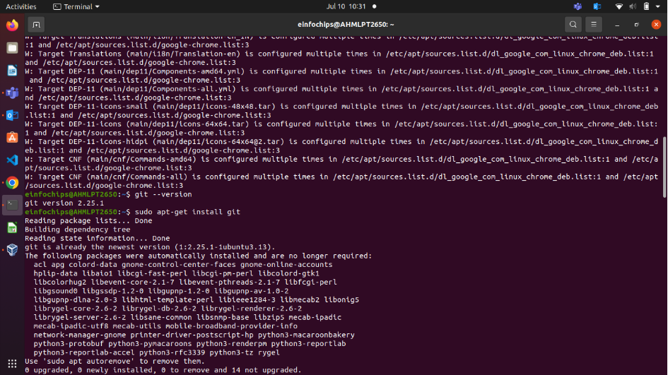**

1. Install Git: Ensure Git is installed on your system. Verify with git –version.\

Set Up Git: Configure your Git username and email:

git config --global user.name "Your Name"

git config --global user.email "your.email@example.com"

2. Create a GitHub Repository: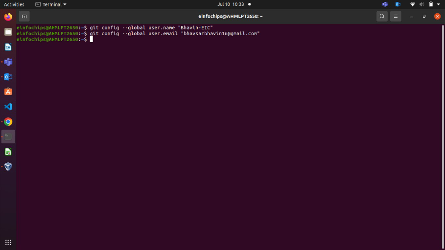

○ Go to GitHub and create a new repository named website-project.

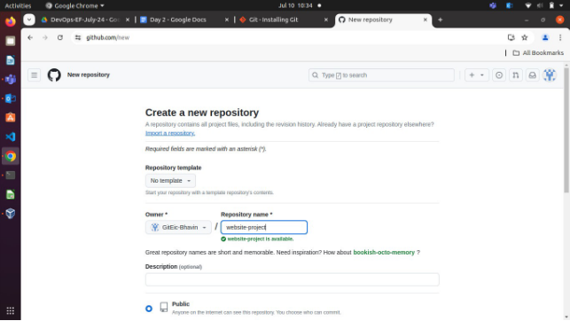

Clone the repository to your local machine:

git clone https://github.com/GitEic-Bhavin/website-project.git

3. Initialize the Project: Navigate to the project directory: cd website-project

   Create initial project structure:

   mkdir src

   touch src/index.html

   echo "<!DOCTYPE html><html><head><title>My Website</title></head><body><h1>Welcome to my website!</h1></body></html>" > src/index.html

   Commit and push the initial project structure: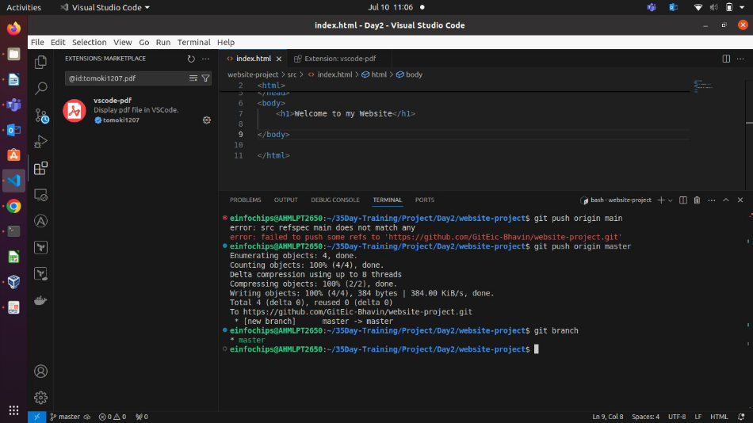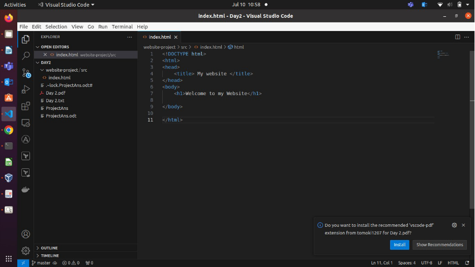

   git add .

   git commit -m "Initial commit: Added project structure and index.html"

   git push origin main

   **Exercise 1: Branching and Basic Operations (10 minutes)**

   **Create a New Branch**:

   git checkout -b feature/add-about-page

1. **Add a New Page**:

Create about.html :

touch src/about.html

echo "<!DOCTYPE html><html><head><title>About Us</title></head><body><h1>About Us</h1></body></html>" > src/about.html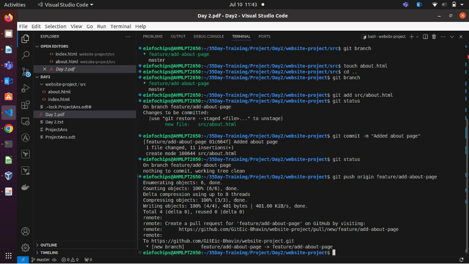

**Exercise 2: Merging and Handling Merge Conflicts (15 minutes) Create Another Branch:**

git checkout main

git checkout -b feature/update-homepage

**1.Update the Homepage**:

Modify index.html :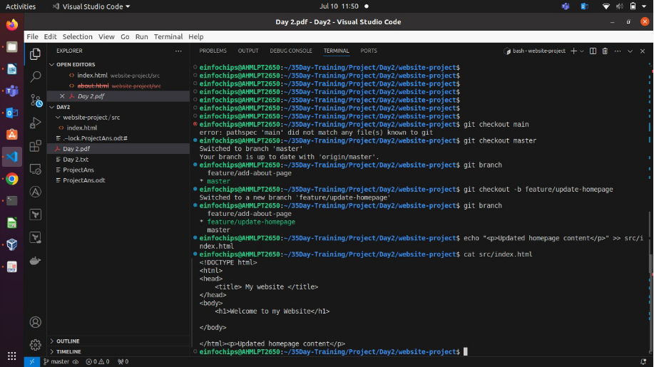

echo "
Updated homepage content
" >> src/index.html

Commit and push changes:

git add src/index.html

git commit -m "Updated homepage content"

git push origin feature/update-homepage

Commit and push changes: git add src/index.html

git commit -m "Updated homepage content" git push origin feature/update-homepage

2. **Create a Merge Conflict**:

Modify index.html on the feature/add-about-page branch:

git checkout feature/add-about-page

echo "
Conflict content
" >> src/index.html git add src/index.html

git commit -m "Added conflicting content to homepage" git push origin feature/add-about-page

3. **Merge and Resolve Conflict**: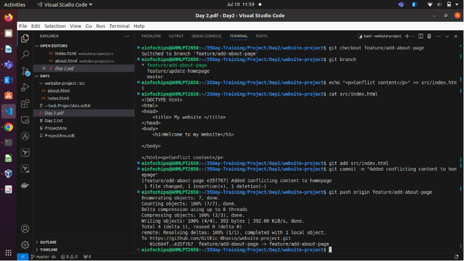

Attempt to merge feature/add-about-page into main :

git checkout main

git merge feature/add-about-page

Resolve the conflict in src/index.html , then:

git add src/index.html

git commit -m "Resolved merge conflict in homepage" git push origin main

**This above pic is stating is only merge from feature/add-about-page branch to master branch 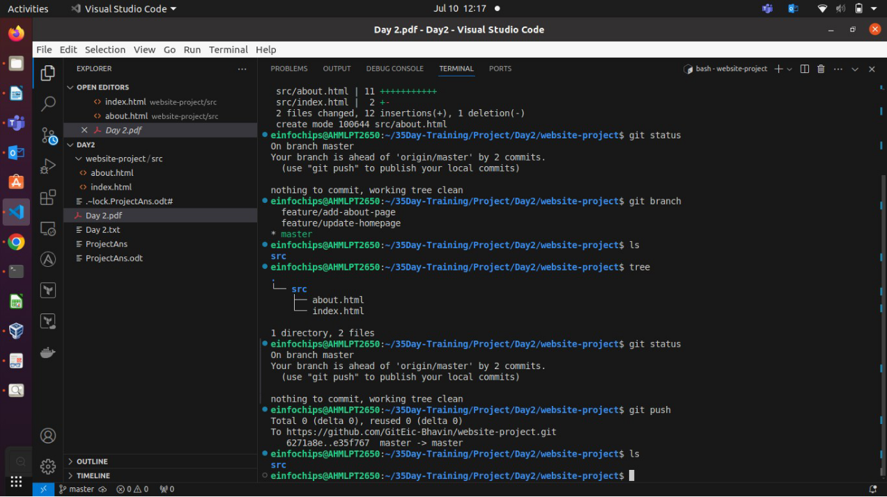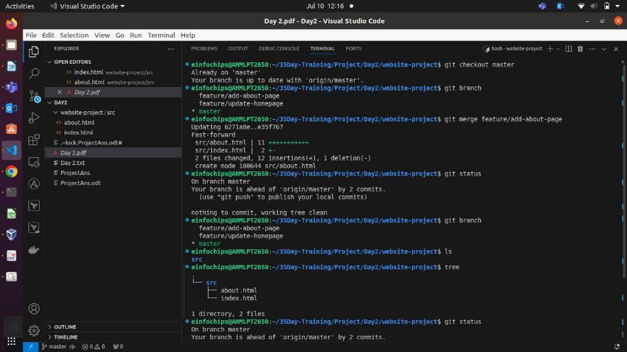locally & not bring chagnes in remote repo.**

**To Bring chages in reomte repo , do this git push 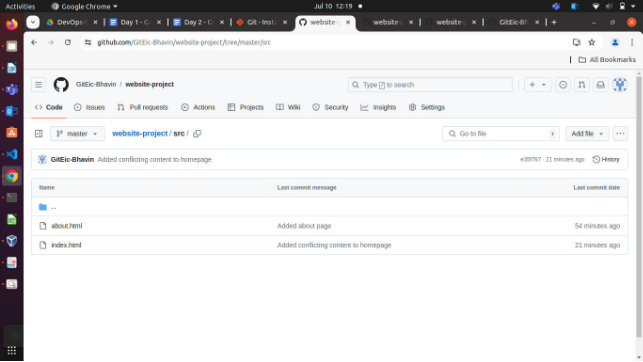**

**Exercise 3: Rebasing (10 minutes)**

1. **Rebase a Branch**:

Rebase feature/update-homepage onto main :

git checkout feature/update-homepage git rebase main

Resolve any conflicts that arise during rebase.

**Any conflict you see , add its manually. ex. if should any new line delete/add do it & git push to bring reflect this at your remote repo.**

**Push the Rebased Branch**:

git push -f origin feature/update-homepage

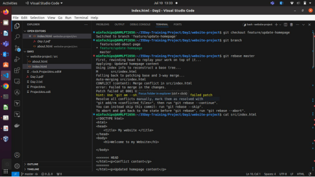

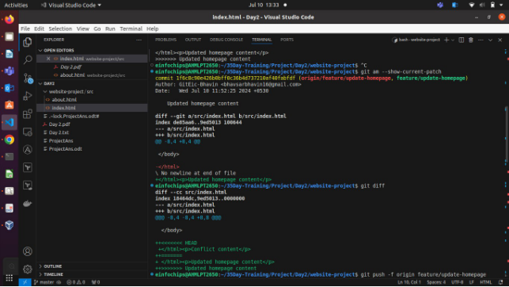

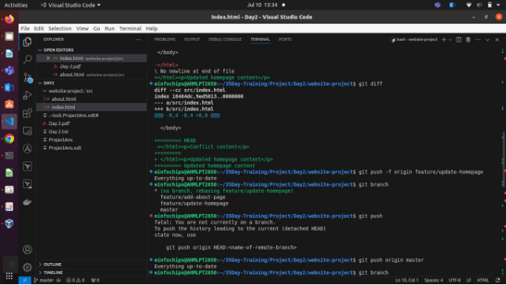

**Exercise 4: Pulling and Collaboration (10 minutes) 1.Pull Changes from Remote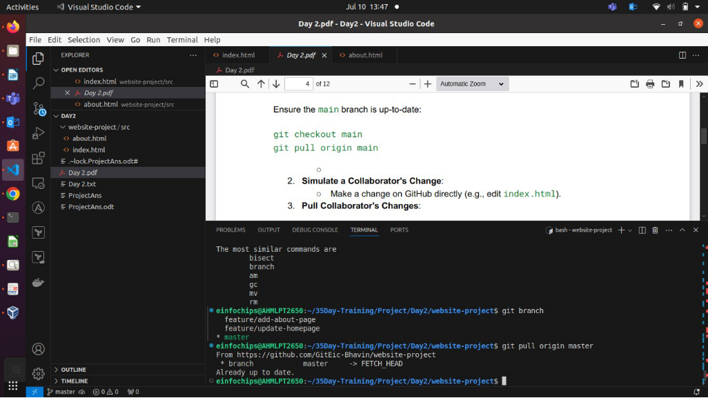**:

Ensure the main** branch is up-to-date: git checkout main

git pull origin main

2. **Simulate a Collaborator's Change**:

Make a change on GitHub directly (e.g., edit index.html ).

3. **Pull Collaborator's Changes**:

Pull the changes made by the collaborator:

git pull origin main

**After git pull origin master.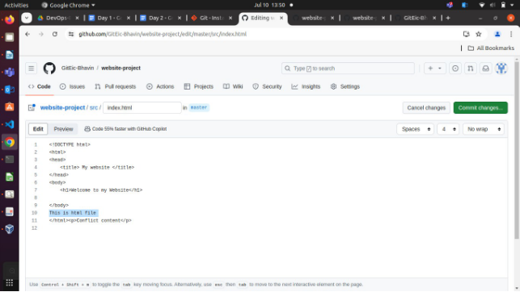**

**Exercise 5: Versioning and Rollback (15 minutes)**

1. **Tagging a Version**:

Tag the current commit as v1.0:

git tag -a v1.0 -m "Version 1.0: Initial release" git push origin v1.0

2. **Make a Change that Needs Reversion**: Modify index.html :

   echo "
Incorrect update
" >> src/index.html git add src/index.html

   git commit -m "Incorrect update"

   git push origin main

3. **Revert to a Previous Version**: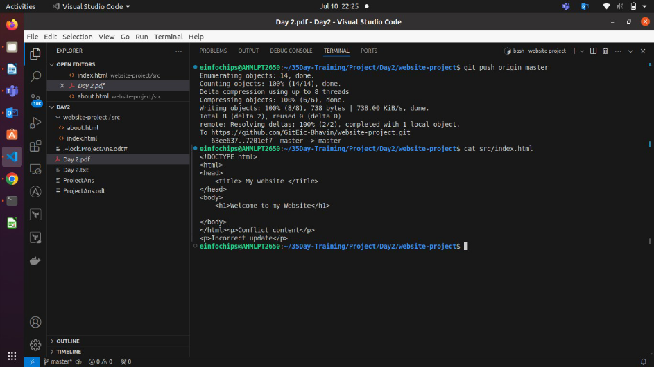

Use git revert to undo the last commit:

git revert HEAD git push origin main

When you do git revert HEAD , it ask you to why you want to revert & write commit for it. Here, wirte a commit like, “revert for last commit in master branch”, Save & Exit.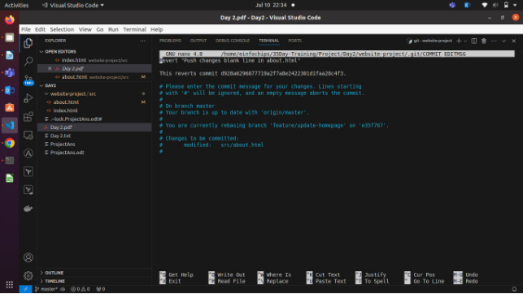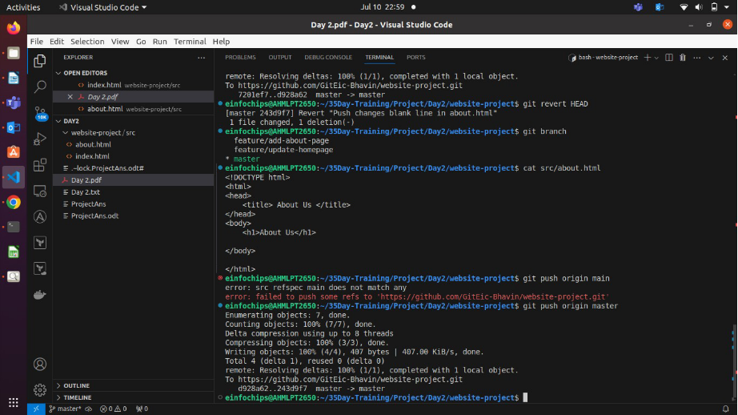

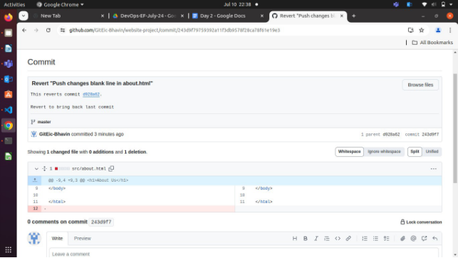

**Extra Activities (10 minutes) 1. Stashing Changes**:

Make some local changes without committing:

echo "
Uncommitted changes
" >> src/index.html

Stash the changes: git stash

1\. **Viewing Commit History**: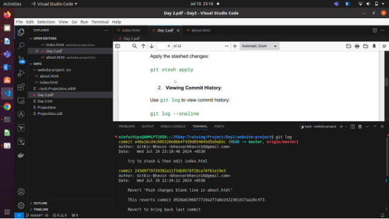

Use git log to view commit history: git log –oneline

Output of git log

Output of git log --online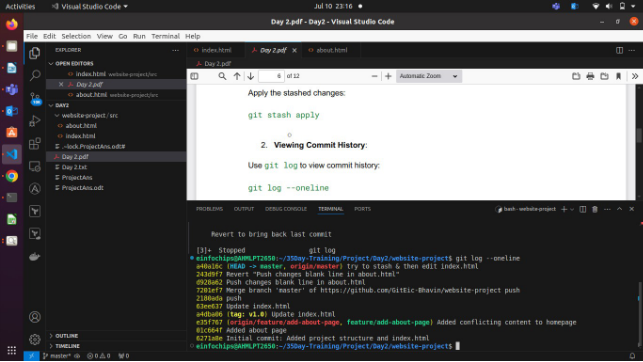

3. **Cherry-Picking Commits**:

Create a new branch and cherry-pick a commit from another branch:

git checkout -b feature/cherry-pick

git cherry-pick <commit-hash> means , do git log –online & Look for 7 digit called commit id , which commit you want to use to bring it in your custom / dest branch.

git push origin feature/cherry-pick

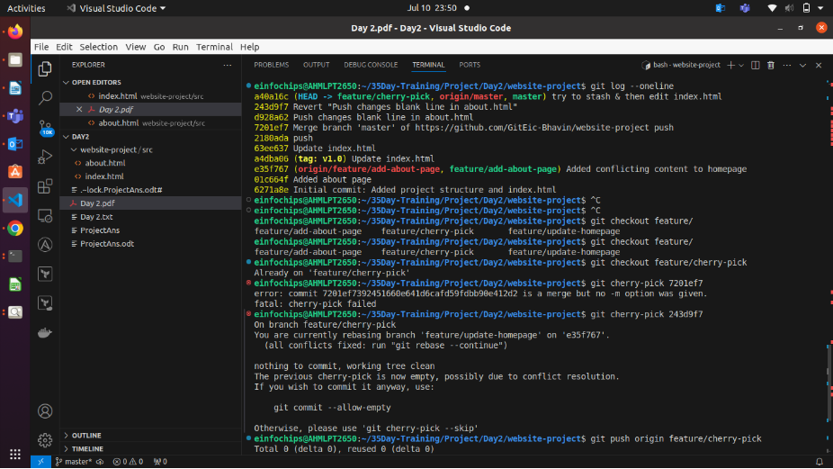

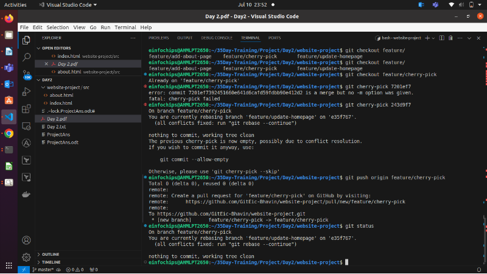

**See Actual reflection in git remote repo, using git cherry-pick.**

**This is use to bring changes of specific commit of any branch into your custom/dest branch.**

4. **Interactive Rebase**: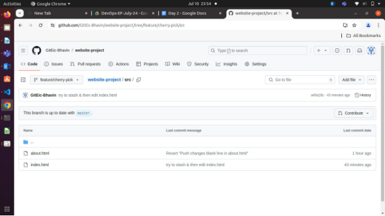

Use interactive rebase to squash commits:

git checkout main

git rebase -i HEAD~3
