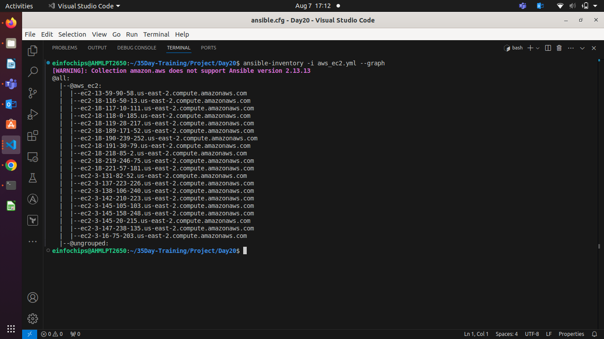
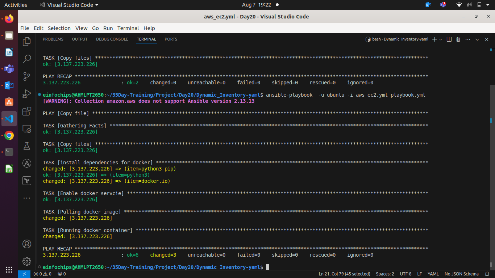
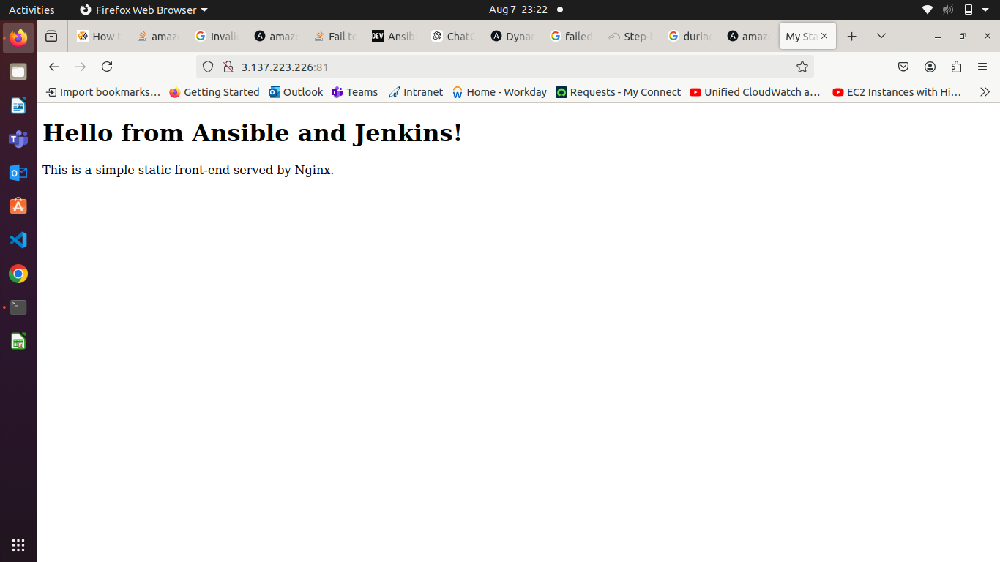

#### **Project 01**

1. **Inventory Plugins**  
   * **Activity**: Configure a dynamic inventory plugin to manage a growing number of web servers dynamically. Integrate the plugin with Ansible to automatically detect and configure servers in various environments.  
   ##### There are 2 method to use dynamic inventory.
   ###### 1. Using Script
      - Using Fileter, filter the tag like Name:xyz, Value:role.
      - You can list out every instance which has assingned this tags.
      - You can also list out all instance by using Boto3 Clinet('ec2').
      - You can make csv file , print json output by import csv and json

  ###### 2. Use Ansible Plugin which is Alt Options.
  - **plugin name**:- aws_ec2 or amazon.aws.aws_ec2
  - **Bydefault this plugin is installed during installaion of ansibel**
  - **If not installed then follow below command**

        ansible-galaxy collection install amazon.aws
  - ###### Normally we defined hosts in inventory.ini, but in dynamic inventory, as plugin , we are using **YAML** file.

  - This file should always end with **aws_ec2.yaml**
  - Because, in yaml file we are normally defined tasks, roles etc. 
  - #####  so, how ansilbe can decide is this yaml file will use for deploy the tasks or for defined the hosts ?
  - Thatsfor while we use ansible plugin **aws_ec2** the inventory will defined in this yaml file.

  - After Install the plugin **aws_ec2** we have to **enable** it.
  - To enable plugin, follow below steps

  1. Go to default ansible.cfg file
  
    default path is /etc/ansbile/
                            ├── ansible.cfg
                            └── hosts

  2. Go to [inventory] , here we will enable ansible plugin to use it.
  

    [inventory]
    enable_plugins = amazon.aws.aws_ec2, auto, yaml,ini
    inventory= /path/to/aws_ec2.yml

    # Give private key file path to avoid error 'No Host Matching Found' during execute playbook.
    [defaults]
    private_key_file = /path/to/private_key_file.pem

  - If you are modifying this on default ansible.cfg this will not be good practice.
  - Create ansible.cfg where your aws_ec2.yaml is available.

  - Provide your Cloud Provider Credential like secret key and access key to use it by ansible.
- **For Aws**

      aws configure --profile 'your-profile-name' 
    - Your-profile-name like dynamic_inventory, your-custome-name etc.
  - Use this Profile in **aws_ec2.yaml**

```yml
plugin: amazon.aws.aws_ec2
profile: dynamic-inventory
regions:
  - us-east-2
filters:
  instance-state-name:
    - running
  tag:Name:
    - Bhavin
hostnames:
  -  ip-address
compose:
# This compose will be created inventory.ini where all Running state instace will available with fileted of tag "Name: Bhavin"
# ansible formate will be like this
# [all]
# ansible_host='public_ip' ansible_user='ubuntu' ansible_ssh_private_key_file='/Path/to/pvt_key_file.pem'
  ansible_host: public_ip_address
  ansilbe_user: 'ubuntu'
  ansilbe_ssh_private_key_file: '/Path/to/pvt-key-file.pem'
```

  **Now Varify you are able to list out all instance**

    ansible-inventory -i aws_ec2.yaml --list 
    ansilbe-inventory -i aws_ec2.yaml --graph

   * **Deliverable**: Dynamic inventory configuration file or script, demonstrating the ability to automatically update the inventory based on real-time server data.  


2. **Performance Tuning**  
   * **Activity**: Tune Ansible performance by adjusting settings such as parallel execution (forks), optimizing playbook tasks, and reducing playbook run time.  
   * **Deliverable**: Optimized `ansible.cfg` configuration file, performance benchmarks, and documentation detailing changes made for performance improvement.  

    [defaults]
    private_key_file = /path/to/private_key_file.pem

3. **Debugging and Troubleshooting Playbooks**  
   * **Activity**: Implement debugging strategies to identify and resolve issues in playbooks, including setting up verbose output and advanced error handling.  

  #####  Use -v to -vvvv to describe all tasks with detailed execution including internal msg, error, success etc.

    ansible-inventory -i aws_ec2.yaml --list -vv

  It will helps you to solve error.
   * **Deliverable**: Debugged playbooks with enhanced error handling and logging, including a troubleshooting guide with common issues and solutions.  
4. **Exploring Advanced Modules**  
   * **Activity**: Use advanced Ansible modules such as `docker_container` to manage containerized applications and `aws_ec2` for AWS infrastructure management, demonstrating their integration and usage.  

  ##### playbook.yaml
```yaml
---
- name: Copy file
  hosts: all
  become: true
  tasks:
    - name: Copy files
      ansible.builtin.copy:
        src: test.txt
        dest: /home/ubuntu

# Deploy Manage Docker Container using docker modules
    - name: install dependencies for docker
      ansible.builtin.apt:
        name: "{{ item }}"
        update_cache: true
        state: present
      with_items:
          - python3-pip
          - python3
          - docker.io

    - name: Enable docker servcie
      ansible.builtin.service:
        name: docker
        state: started
        enabled: yes

    - name: Pulling docker image
      community.docker.docker_image:
        name: bhavin1099/day15-8
        tag: v1
        source: pull

    - name: Running docker container
      community.docker.docker_container:
        name: my-ansible-container
        image: bhavin1099/day15-8:v1
        state: started
        restart_policy: always
        ports:
          - "81:80"
  ```
   * **Deliverable**: Playbooks showcasing the deployment and management of Docker containers and AWS EC2 instances, along with documentation on the benefits and configurations of these advanced modules.


##### OutPut in browser
##### Docker container is running on port 81.



