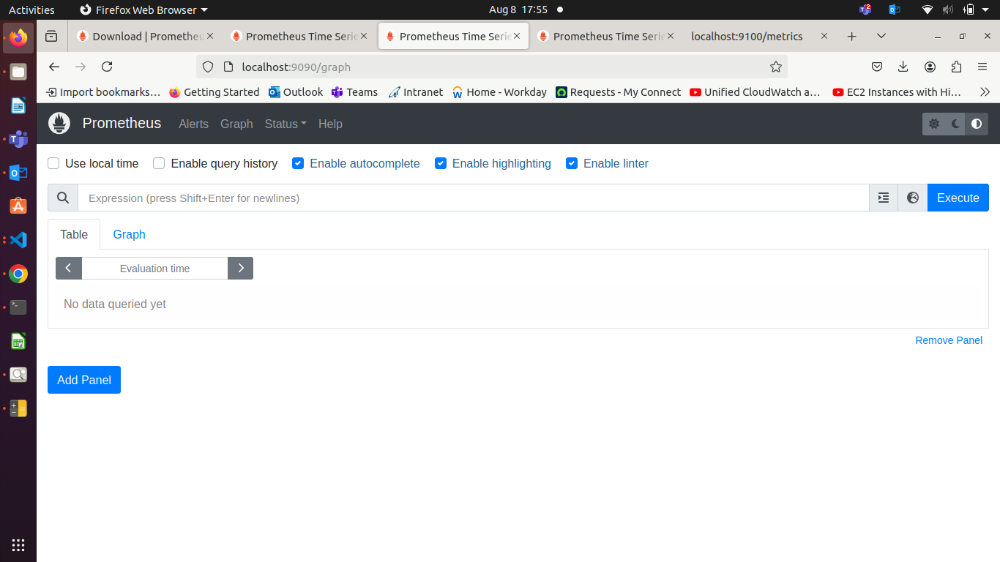
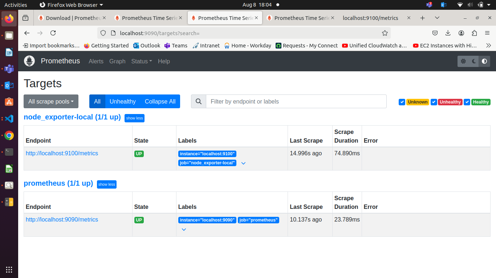
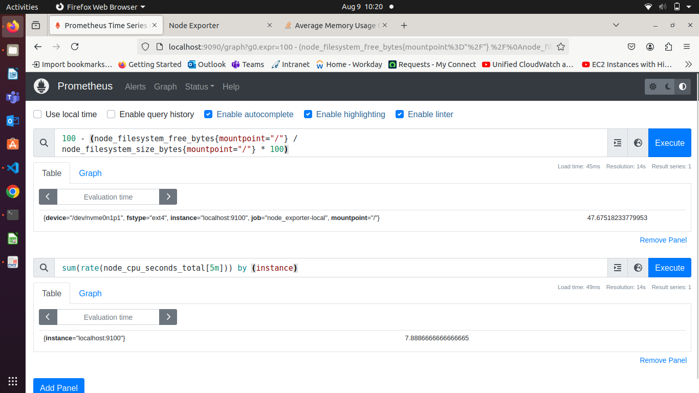
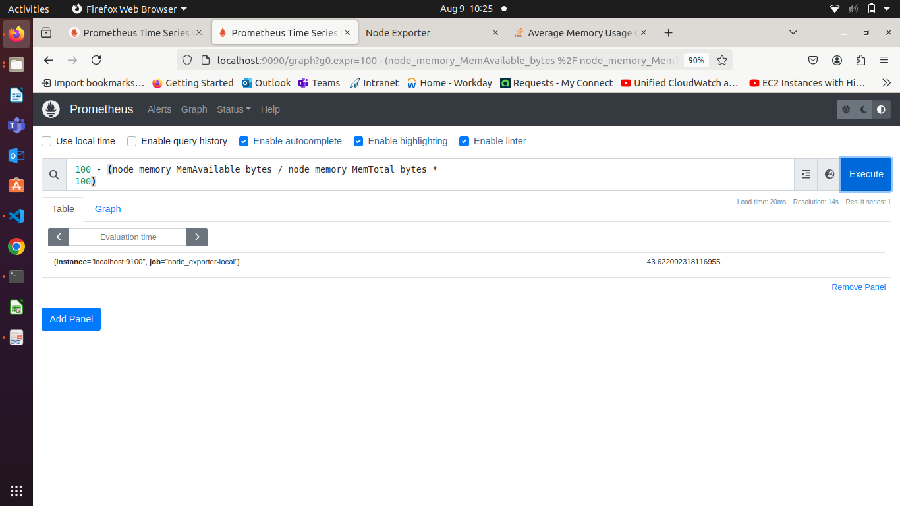
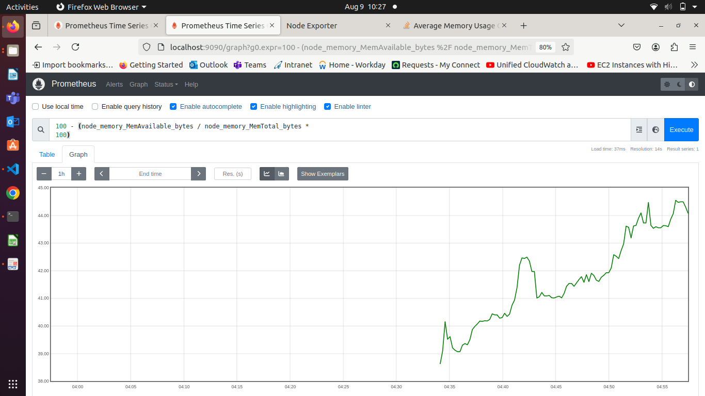

### **Loops, conditions, functions, and error handling in Bash**

Here's a script that combines loops, conditions, functions, and error handling:

`#!/bin/bash`

`# Function to calculate the average of numbers in a file`  
`calculate_average() {`  
    `local file=$1`  
    `local total=0`  
    `local count=0`

    `while read -r line`  
    `do`  
        `if [[ $line =~ ^[0-9]+$ ]]; then`  
            `total=$((total + line))`  
            `count=$((count + 1))`  
        `else`  
            `echo "Warning: Non-numeric value '$line' ignored."`  
        `fi`  
    `done < "$file"`

    `if [ $count -eq 0 ]; then`  
        `echo "Error: No valid numbers in the file."`  
        `exit 1`  
    `fi`

    `echo "Average: $((total / count))"`  
`}`

`# Main script`  
`read -p "Enter the file name: " filename`

`# Error handling for file existence`  
`if [ ! -f $filename ]; then`  
    `echo "Error: File '$filename' not found!"`  
    `exit 1`  
`fi`

`# Call the function to calculate average`  
`calculate_average $filename`

### **Use Case: Log Management and Rotation on Ubuntu**

#### **Scenario**

You have an Ubuntu server running a web application, and you want to manage the logs generated by the application to prevent disk space from being filled up. Additionally, you need to troubleshoot issues using system and application logs.

### **1\. Log Rotation Using `logrotate`**

Log rotation is the process of periodically rotating and archiving log files. This helps in managing disk space and keeps logs organized.

**Example Configuration:**

Let's assume your web application writes logs to `/var/log/myapp/myapp.log`.

#### **Configuration File for `logrotate`**

1. Create a configuration file for your application logs in `/etc/logrotate.d/`:

`sudo nano /etc/logrotate.d/myapp`

2. Add the following configuration:

`/var/log/myapp/myapp.log {`  
    `daily`  
    `rotate 7`  
    `compress`  
    `missingok`  
    `notifempty`  
    `create 0640 www-data www-data`  
    `postrotate`  
        `systemctl reload myapp.service`  
    `endscript`  
`}`

* **daily**: Rotate the log files daily.  
* **rotate 7**: Keep 7 days' worth of log files.  
* **compress**: Compress the rotated log files to save space.  
* **missingok**: Ignore errors if the log file is missing.  
* **notifempty**: Do not rotate the log if it is empty.  
* **create 0640 www-data www-data**: Create new log files with specific permissions and ownership.  
* **postrotate**: Command to run after rotation (e.g., reload the application service).

### **2\. Steps to Troubleshoot Using Logs**

#### **System Logs**

System logs contain information about the system's operation. They can be found in the `/var/log` directory.

**Example Logs:**

* `/var/log/syslog`: General system log.  
* `/var/log/auth.log`: Authentication log.  
* `/var/log/dmesg`: Kernel ring buffer log.

#### **Application Logs**

Application logs contain information specific to your application. They help in diagnosing issues related to the application's performance and behavior.

**Example Log:**

* `/var/log/myapp/myapp.log`: Custom application log.

#### **Troubleshooting Steps**

1. **Check System Logs for Errors:**

`sudo tail -n 100 /var/log/syslog`  
`sudo tail -n 100 /var/log/auth.log`

* Use `tail -n 100` to display the last 100 lines of the log file.  
2. **Check Application Logs:**

bash  
Copy code  
`sudo tail -n 100 /var/log/myapp/myapp.log`

3. **Search for Specific Errors or Patterns:**

Use `grep` to search for specific errors or patterns in the logs.

`sudo grep "ERROR" /var/log/myapp/myapp.log`  
`sudo grep "authentication failure" /var/log/auth.log`

4. **Monitor Logs in Real-Time:**

Use `tail -f` to monitor logs in real-time.

`sudo tail -f /var/log/myapp/myapp.log`

5. **Review Logrotate Status:**

Check the status and configuration of `logrotate` to ensure logs are being rotated correctly.

`sudo logrotate -d /etc/logrotate.conf`  
`sudo logrotate -f /etc/logrotate.conf`

### **Example Script for Troubleshooting**

Below is a Bash script that automates the process of checking logs and providing a summary.

`#!/bin/bash`

`LOG_FILE="/var/log/myapp/myapp.log"`  
`SYSLOG_FILE="/var/log/syslog"`  
`AUTH_LOG_FILE="/var/log/auth.log"`

`check_logs() {`  
    `local file=$1`  
    `local keyword=$2`  
    `echo "Checking $file for '$keyword'..."`  
    `grep "$keyword" "$file" | tail -n 10`  
`}`

`echo "Starting log check..."`

`echo "=== Application Log Errors ==="`  
`check_logs $LOG_FILE "ERROR"`

`echo "=== System Log Errors ==="`  
`check_logs $SYSLOG_FILE "error"`

`echo "=== Authentication Failures ==="`  
`check_logs $AUTH_LOG_FILE "authentication failure"`

`echo "Log check completed."`

### **Explanation**

1. **Logrotate Configuration:**  
* The configuration ensures logs are rotated daily, old logs are compressed, and only the last 7 logs are kept. This prevents the log directory from filling up with old logs and saves disk space.  
2. **Troubleshooting Script:**  
* The script `check_logs` takes a log file and a keyword as arguments, searches for the keyword in the log file, and displays the last 10 occurrences.  
* The main part of the script calls `check_logs` for application errors, system errors, and authentication failures, providing a quick summary of recent issues.

### **OSI Layers**

The OSI (Open Systems Interconnection) model has seven layers that describe the functions of a networking system.

1. **Physical Layer**: Deals with the hardware connection and physical transmission of data.  
2. **Data Link Layer**: Manages data frames between physical links.  
3. **Network Layer**: Handles logical addressing and routing (e.g., IP addresses).  
4. **Transport Layer**: Provides reliable data transfer (e.g., TCP, UDP).  
5. **Session Layer**: Manages sessions and controls dialogues between computers.  
6. **Presentation Layer**: Translates data formats and handles encryption/decryption.  
7. **Application Layer**: Interfaces with the application software (e.g., HTTP, FTP).

![][image1]

### **IP Addressing and Subnet Masking**

**IP Address**: A unique identifier for a device on a network (e.g., `192.168.1.10`).

**Subnet Mask**: Divides the IP address into network and host portions (e.g., `255.255.255.0`).

**Use Case**: Assign IP addresses to devices in the office network.

### **Assigning IP Addresses with Best Practices**

1. **Static IP Addresses**: For critical devices like servers and printers.  
2. **Dynamic IP Addresses (DHCP)**: For client devices like laptops and smartphones.  
3. **Avoid Conflicts**: Ensure no two devices have the same IP address.

### **Gateway and NAT (Network Address Translation)**

**Gateway**: A device that routes traffic from a local network to external networks (e.g., the internet).

**NAT**: Translates private IP addresses to a public IP address for internet access.

**SNAT (Source NAT)**: Translates the source address of outgoing packets.

**Broadcast Address**: An IP address that allows information to be sent to all devices in a network (e.g., `192.168.1.255`).

### **Example Configuration**

#### **1\. Static IP Address Assignment**

Assume you are configuring a Linux server with a static IP address.

`sudo nano /etc/network/interfaces`

Add the following configuration:

`auto eth0`  
`iface eth0 inet static`  
    `address 192.168.1.10`  
    `netmask 255.255.255.0`  
    `gateway 192.168.1.1`  
    `dns-nameservers 8.8.8.8 8.8.4.4`

* **address**: Static IP address (`192.168.1.10`).  
* **netmask**: Subnet mask (`255.255.255.0`).  
* **gateway**: Default gateway (`192.168.1.1`).  
* **dns-nameservers**: DNS servers (`8.8.8.8` and `8.8.4.4`).

Save and restart the network service:

`sudo systemctl restart networking`

#### **2\. Dynamic IP Address Assignment with DHCP**

For client devices, configure DHCP on the router.

Access the router's web interface and configure the DHCP server to assign IP addresses in the range `192.168.1.100` to `192.168.1.200`.

#### **3\. NAT Configuration**

Configure NAT on a Linux router.

`sudo nano /etc/rc.local`

Add the following lines to enable NAT:

`iptables -t nat -A POSTROUTING -o eth0 -j MASQUERADE`

Enable IP forwarding:

`sudo sysctl -w net.ipv4.ip_forward=1`

Persist the setting:

`sudo nano /etc/sysctl.conf`

Uncomment or add the following line:

`net.ipv4.ip_forward=1`

### **Troubleshooting Commands**

**Check IP Address**:

`ip addr show`

**Check Routing Table**:  
`ip route show`

**Check NAT Rules**:

`sudo iptables -t nat -L`

**Ping Gateway**:

`ping 192.168.1.1`

### **Explanation of Commands and Scripts**

#### **Static IP Configuration**

* **`/etc/network/interfaces`**: Configuration file for network interfaces.  
* **`auto eth0`**: Automatically brings up the `eth0` interface at boot.  
* **`iface eth0 inet static`**: Defines the `eth0` interface with a static IP.  
* **`address`**: IP address assigned to the interface.  
* **`netmask`**: Subnet mask.  
* **`gateway`**: Default gateway.  
* **`dns-nameservers`**: DNS servers.  
* **`sudo systemctl restart networking`**: Restarts the networking service to apply changes.

#### **DHCP Configuration**

* **Router Configuration**: Configure DHCP server to assign IP addresses dynamically.

#### **NAT Configuration**

* **`iptables -t nat -A POSTROUTING -o eth0 -j MASQUERADE`**: Adds a rule to the NAT table to masquerade (SNAT) outgoing packets on the `eth0` interface.  
* **`sysctl -w net.ipv4.ip_forward=1`**: Temporarily enables IP forwarding.  
* **`/etc/sysctl.conf`**: Configuration file to persistently enable IP forwarding.

### 

### 

### 

### 

### **Archiving and Transferring Files**

**Scenario**: You are a system administrator responsible for maintaining backups of critical files on a web server. To efficiently manage storage and simplify the process of transferring backups to a remote server, you need to archive and compress these files. Additionally, you want to ensure the backups can be easily extracted when needed.

### **Tools and Commands**

1. **ZIP and UNZIP**: Used for compressing and extracting `.zip` files.  
2. **tar**: Used for archiving files into a single file (tarball).  
3. **gzip and gunzip**: Used for compressing and decompressing files, often used with tarballs.

### **Compression in Linux**

#### **1\. Archiving and Compressing Files Using tar and gzip**

**Objective**: Archive and compress the `/var/www/html` directory, which contains your website files, into a single compressed file for storage and transfer.

**Example**

**Create a tarball of the `/var/www/html` directory**:

`tar -cvf website_backup.tar /var/www/html`

* **`tar`**: The archiving utility.  
  * **`-c`**: Create a new archive.  
  * **`-v`**: Verbose mode, showing progress in the terminal.  
  * **`-f`**: Specifies the filename of the archive (`website_backup.tar`).  
  * **`/var/www/html`**: The directory to be archived.

**Compress the tarball using gzip**:

`gzip website_backup.tar`

* **`gzip`**: The compression utility.  
  * **`website_backup.tar`**: The file to be compressed. This will create `website_backup.tar.gz`.

**Verify the compressed file**:

`ls -lh website_backup.tar.gz`

2.   
   * **`ls -lh`**: Lists the file with human-readable file sizes to verify the size and presence of `website_backup.tar.gz`.

#### **2\. Extracting Files from a tar.gz Archive**

**Objective**: Extract the archived files to restore the website on a new server.

**Step-by-Step Guide**:

**Copy the compressed file to the new server** (using `scp` for secure transfer):

`scp website_backup.tar.gz user@newserver:/path/to/destination`

1.   
   * **`scp`**: Secure copy command for transferring files over SSH.  
   * **`website_backup.tar.gz`**: The file to transfer.  
   * **`user@newserver`**: The username and server address.  
   * **`/path/to/destination`**: The destination directory on the new server.

**Log in to the new server**:

`ssh user@newserver`

* **`ssh`**: Secure Shell command for logging into the remote server.  
  * **`user@newserver`**: The username and server address.

**Navigate to the destination directory**:

`cd /path/to/destination`

**Decompress the file using gunzip**:

`gunzip website_backup.tar.gz`

* **`gunzip`**: The decompression utility.  
  * **`website_backup.tar.gz`**: The compressed file to decompress. This will produce `website_backup.tar`.

**Extract the tarball**:

`tar -xvf website_backup.tar`

* **`tar`**: The archiving utility.  
  * **`-x`**: Extract the archive.  
  * **`-v`**: Verbose mode.  
  * **`-f`**: Specifies the filename of the archive (`website_backup.tar`).

#### **3\. Using ZIP and UNZIP**

**Objective**: Archive and compress multiple log files from `/var/log` into a `.zip` file for easy transfer.

**Step-by-Step Guide**:

**Navigate to the `/var/log` directory**:

`cd /var/log`

**Create a ZIP archive of the log files**:

`zip logs_backup.zip *.log`

* **`zip`**: The archiving and compression utility.  
  * **`logs_backup.zip`**: The name of the output ZIP file.  
  * **`*.log`**: Wildcard to include all `.log` files in the current directory.

**Verify the ZIP file**:

`ls -lh logs_backup.zip`

**Transfer the ZIP file to a remote server**:

`scp logs_backup.zip user@newserver:/path/to/destination`

**Log in to the remote server** and navigate to the destination directory:

`ssh user@newserver`  
`cd /path/to/destination`

**Extract the ZIP file**:  
`unzip logs_backup.zip`

**Virtual Private Cloud**

**IP**

* **IPv4:** default, 32 bit, CIDR \- /16 to /28, 0.0.0.0 \- 255.255.255.255  
* **IPv6:** 128 bit, CIDR \- /56, example: 2001:0000:130F:0000:0000:09C0:876A:130B.

**CIDR, Classless Inter Domain Routing**

* 

**Subnet**  
**0**  
**Security Group/Firewall**  
**Network ACL**

195.78.3.21  
175.25.3.9

10.0.1.5 \- 10.0.1.195

**10.0.0.0/16**  
32 \- 16 \= 16 → 2 ^ 16 \= 65,536

**10.0.1.0/24**  
32 \- 24 \= 8 → 2 ^ 8 \= 256 \- 5 \= 251

10.0.1.0   
10.0.1.1  
10.0.1.2  
10.0.1.3  
10.0.1.255

**Prometheus**

![][image2]

**Installation of Prometheus**

[Download | Prometheus](https://prometheus.io/download/)

Prometheus is an open-source monitoring and alerting toolkit designed for reliability and scalability. It is particularly well-suited for monitoring dynamic cloud environments and microservices. Prometheus is based on a pull model, where it scrapes metrics from configured endpoints at regular intervals.

### **Prometheus Architecture Overview**

Prometheus consists of several components, each playing a vital role in its monitoring and alerting functions:

1. **Prometheus Server**: The core component responsible for scraping and storing metrics, querying data, and triggering alerts.  
2. **Client Libraries**: Libraries used to instrument applications to expose metrics in a format that Prometheus can scrape.  
3. **Pushgateway**: A component used to push metrics from short-lived jobs.  
4. **Alertmanager**: Handles alerts generated by the Prometheus server, including routing, silencing, and notifications.  
5. **Exporters**: Components that expose metrics from third-party systems as Prometheus-compatible metrics.  
6. **Service Discovery**: Mechanisms for dynamically discovering targets to scrape metrics from.  
7. **PromQL**: The query language used to retrieve and analyze metrics data stored in Prometheus.

### **Detailed Explanation of Components**

#### **1\. Prometheus Server**

* **Scrape**: Prometheus server pulls metrics data (scraping) from targets at regular intervals, which are defined in the configuration file. It uses HTTP-based pulls to retrieve metrics.  
* **Time Series Database (TSDB)**: The scraped metrics are stored as time series data in a highly efficient, custom database. Each metric is identified by its name and key-value pairs called labels.  
* **PromQL (Prometheus Query Language)**: This is the query language used to retrieve and manipulate time series data stored in Prometheus. PromQL enables users to aggregate, filter, and process metrics, making it a powerful tool for building dashboards and generating alerts.

#### **2\. Client Libraries**

Prometheus client libraries are available in multiple programming languages (e.g., Go, Java, Python, Ruby). They allow developers to instrument their applications by exposing internal metrics such as memory usage, request durations, and more.

* **Instrumentation**: Applications are instrumented using these libraries to expose metrics at an endpoint (usually `/metrics`), where Prometheus can scrape them.

#### **3\. Pushgateway**

The Pushgateway is designed for short-lived jobs that do not have a persistent runtime, making it difficult for Prometheus to scrape them directly. Instead, these jobs push their metrics to the Pushgateway, which then holds the metrics for Prometheus to scrape.

* **Use Case**: Ideal for batch jobs, CI/CD pipelines, and other ephemeral processes that need to report metrics.

#### **4\. Alertmanager**

The Alertmanager handles alerts sent by Prometheus. It manages alert notifications, deduplication, grouping, routing, and silencing.

* **Alert Routing**: Alerts can be sent to different receivers based on predefined rules (e.g., email, Slack, PagerDuty).  
* **Grouping**: Alerts can be grouped by common labels to avoid flooding receivers with multiple alerts.  
* **Silencing**: Alerts can be temporarily silenced based on specific conditions, such as during maintenance windows.

#### **5\. Exporters**

Exporters are components that allow Prometheus to collect metrics from third-party systems that don’t natively expose Prometheus metrics. Common exporters include:

* **Node Exporter**: Exposes hardware and OS metrics from \*nix systems.  
* **MySQL Exporter**: Exposes MySQL server metrics.  
* **Blackbox Exporter**: Allows probing of endpoints for availability and response times.

Exporters translate the native metrics of these systems into Prometheus-compatible metrics that can be scraped.

#### **6\. Service Discovery**

Prometheus uses service discovery to automatically find targets to scrape, especially in dynamic environments like cloud platforms or Kubernetes.

* **Static Configuration**: Targets can be statically configured in the `prometheus.yml` file.  
* **Dynamic Discovery**: Prometheus can integrate with service discovery mechanisms like Kubernetes, Consul, or EC2, allowing it to automatically adapt to changes in the environment (e.g., scaling up/down of instances).

#### **7\. PromQL**

PromQL is the powerful query language used by Prometheus to retrieve, aggregate, and process time series data. It is designed for working with time series and offers a variety of functions for calculating rates, averages, sums, and more.

* **Examples**:  
  * `up`: Simple query to check if targets are up.  
  * `rate(http_requests_total[5m])`: Calculates the rate of HTTP requests over the last 5 minutes.

### **Prometheus Data Flow**

1. **Scraping**: Prometheus server scrapes metrics from targets (applications, services, exporters) at defined intervals.  
2. **Storage**: The scraped metrics are stored as time series data in Prometheus' TSDB.  
3. **Querying**: Users can query this data using PromQL to generate dashboards, reports, or to perform ad-hoc analysis.  
4. **Alerting**: Prometheus evaluates alerting rules, and if conditions are met, it sends alerts to the Alertmanager.  
5. **Alert Handling**: The Alertmanager processes and routes the alerts to various notification channels.

**PromQL (Prometheus Query Language)** is a powerful language used to query and analyze the time series data collected by Prometheus. It allows users to select and aggregate data in various ways, making it an essential tool for creating dashboards, generating reports, and setting up alerts.

### **PromQL Overview**

PromQL operates on time series data, which is identified by a metric name and a set of key-value pairs (labels). The queries can filter, aggregate, and transform this data to provide insights.

#### **Basic Concepts**

1. **Metric Name**: The name of the metric being queried, e.g., `http_requests_total`.  
2. **Labels**: Key-value pairs associated with metrics, e.g., `{method="GET", status="200"}`.  
3. **Time Series**: A stream of timestamped values for a particular set of labels and metric name.  
4. **Range Vector**: A sequence of time series over a specified time range.  
5. **Instant Vector**: A set of time series containing a single sample point per time series.

### **PromQL Query Types**

1. **Instant Queries**: Return the current value of a time series.  
2. **Range Queries**: Return values over a specified time range.

### **Basic PromQL Examples**

Let's explore some basic PromQL queries using the data exposed by the Node Exporter on your Ubuntu EC2 instance. Node Exporter exposes various metrics about the system's hardware and OS, such as CPU usage, memory, disk I/O, etc.

#### **1\. Querying Current CPU Usage**

`rate(node_cpu_seconds_total[5m])`

* **Explanation**:  
  * `node_cpu_seconds_total`: The total number of seconds the CPU has spent in various modes (user, system, idle, etc.).  
  * `rate(node_cpu_seconds_total[5m])`: Calculates the per-second average rate of CPU time spent over the last 5 minutes.  
* **Use Case**: Monitoring CPU usage trends to detect abnormal spikes or sustained high usage, which could indicate performance issues.

#### **2\. Filtering by Labels**

`node_cpu_seconds_total{mode="idle"}`

* **Explanation**:  
  * `mode="idle"`: Filters the `node_cpu_seconds_total` metric to show only the idle CPU time.  
  * This query will return the total idle CPU time.  
* **Use Case**: Understanding how much time the CPU spends idle, which can help in capacity planning.

#### **3\. Querying Free Memory**

`node_memory_MemFree_bytes`

* **Explanation**:  
  * `node_memory_MemFree_bytes`: Shows the current amount of free memory in bytes.  
* **Use Case**: Ensuring that the system has enough free memory to handle current and future workloads.

#### **4\. Calculating Memory Usage Percentage**

`100 - (node_memory_MemAvailable_bytes / node_memory_MemTotal_bytes * 100)`

* **Explanation**:  
  * `node_memory_MemAvailable_bytes`: The amount of memory available for new processes.  
  * `node_memory_MemTotal_bytes`: The total memory available in the system.  
  * This query calculates the percentage of memory in use by subtracting the available memory percentage from 100%.  
* **Use Case**: Monitoring memory utilization to detect when the system is running low on memory.

### **Advanced PromQL Queries**

#### **1\. Aggregating CPU Usage Across All Cores**

`sum(rate(node_cpu_seconds_total[5m])) by (instance)`

* **Explanation**:  
  * `sum(rate(node_cpu_seconds_total[5m]))`: Sums up the CPU usage across all cores.  
  * `by (instance)`: Groups the result by instance, so you can see the aggregated CPU usage per server.  
* **Use Case**: Useful for understanding the overall CPU usage on multi-core systems.

#### **2\. Monitoring Disk Space Usage**

`100 - (node_filesystem_free_bytes{mountpoint="/"} / node_filesystem_size_bytes{mountpoint="/"} * 100)`

* **Explanation**:  
  * `node_filesystem_free_bytes{mountpoint="/"}`: The free disk space in bytes for the root filesystem.  
  * `node_filesystem_size_bytes{mountpoint="/"}`: The total size of the root filesystem in bytes.  
  * This query calculates the percentage of disk space used on the root filesystem.  
* **Use Case**: Essential for monitoring disk space to prevent the system from running out of storage.

#### **3\. Alerting on High CPU Usage**

You can set up an alert for high CPU usage using a PromQL expression:

`groups:`  
`- name: CPUAlerts`  
  `rules:`  
  `- alert: HighCPUUsage`  
    `expr: sum(rate(node_cpu_seconds_total{mode!="idle"}[5m])) by (instance) > 0.9`  
    `for: 5m`  
    `labels:`  
      `severity: critical`  
    `annotations:`  
      `summary: "High CPU usage on {{ $labels.instance }}"`  
      `description: "CPU usage is above 90% for more than 5 minutes."`

* **Explanation**:  
  * `expr`: The PromQL expression that triggers the alert. In this case, it checks if the CPU usage is greater than 90% for more than 5 minutes.  
  * `for`: The duration the condition must hold true before the alert is fired.  
  * `labels` and `annotations`: Additional information attached to the alert for routing and documentation.  
* **Use Case**: Automatically notify when a system is under high CPU load, potentially preventing system outages.

### **Setting Up Prometheus to Scrape Node Exporter**

Since you have Node Exporter and Prometheus installed on your Ubuntu EC2 instance, let's ensure that Prometheus is scraping metrics from the Node Exporter.

**Prometheus Configuration File (`prometheus.yml`)**  
Ensure that your Prometheus configuration file includes a job for scraping Node Exporter:

`scrape_configs:`  
`- job_name: 'node_exporter'`  
  `static_configs:`  
    `- targets: ['localhost:9100']`

* **Explanation**:  
  * `job_name`: A label that will appear in your queries to identify this job.  
    * `targets`: The endpoint where Node Exporter is running. By default, Node Exporter runs on port `9100`.

**Reload Prometheus Configuration**  
After updating the configuration, reload Prometheus to apply the changes:

`kill -HUP $(pgrep prometheus)`

* **Explanation**: This command sends a SIGHUP signal to the Prometheus process, causing it to reload its configuration without restarting.  
2. **Verify Metrics in Prometheus**  
   Navigate to Prometheus’ web UI (typically at `http://<your-ec2-instance-ip>:9090`) and use the "Graph" or "Explore" tab to execute the PromQL queries mentioned above.

### **Project 01:** 

#### **Project Overview:**

The goal of this capstone project is to combine shell scripting with system monitoring and log management practices. You will create a set of automated tools using shell scripts to manage logs, monitor system performance using Prometheus and Node Exporter, and generate insights using PromQL queries. The project will require a systematic approach, covering scripting fundamentals, log management, and monitoring setup.

### **Project Deliverables:**

1. **Shell Scripts for Basic Operations:**  
   * **Task:** Write shell scripts to perform basic system operations, such as checking disk usage, memory usage, and CPU load.  
   * **Deliverable:**  
     * A collection of scripts that output system performance metrics.  
     * Scripts should include error handling and logging.  
```
memory_usage() {
    echo "See mamory usage"
    free -h
}
memory_usage

disk_usage() {
    echo
    echo "disk usage in GB Out of 338GB is" `du -sh /home/einfochips` | awk '{print $1}'
}
disk_usage

cpu_load() {
    echo
    echo "Cpu Load is "
    top -bn1 | grep -i "Cpu(s)"
}

cpu_load
```
OutPut:-
```
See mamory usage
              total        used        free      shared  buff/cache   available
Mem:           15Gi       8.2Gi       254Mi       775Mi       6.9Gi       6.0Gi
Swap:          31Gi        12Mi        31Gi

disk

Cpu Load is 
%Cpu(s): 15.6 us,  3.7 sy,  0.0 ni, 80.7 id,  0.0 wa,  0.0 hi,  0.0 si,  0.0 st
```
2. **Log Management Script:**  
   * **Task:** Develop a script to automate log management tasks such as log rotation and archiving. This script should include the ability to compress old logs and delete logs older than a specified number of days.  
```
log_mangagement() {
    echo 
    echo "Watch logs for deleted"
    cat /var/log/syslog | grep -i deleted | tail -n 6
}

log_mangagement
```
OutPut
```
Watch logs for deleted
Jul 26 10:30:51 AHMLPT2650 /usr/lib/gdm3/gdm-x-session[5692]: #011Entry deleted from font path.
Jul 27 12:51:53 AHMLPT2650 /usr/lib/gdm3/gdm-x-session[3797]: #011Entry deleted from font path.
Jul 27 12:51:53 AHMLPT2650 /usr/lib/gdm3/gdm-x-session[3797]: #011Entry deleted from font path.
Jul 27 12:51:53 AHMLPT2650 /usr/lib/gdm3/gdm-x-session[3797]: #011Entry deleted from font path.
Jul 27 12:51:53 AHMLPT2650 /usr/lib/gdm3/gdm-x-session[3797]: #011Entry deleted from font path.
Jul 27 12:51:53 AHMLPT2650 /usr/lib/gdm3/gdm-x-session[3797]: #011Entry deleted from font path.
```
   * **Deliverable:**  
     * A shell script that performs log rotation based on predefined conditions (e.g., log size, log age).  
     * A report generated by the script detailing which logs were rotated, compressed, or deleted.  
3. **Advanced Shell Scripting \- Loops, Conditions, Functions, and Error Handling:**  
   * **Task:** Refactor the previous scripts to include loops, conditionals, and functions for modularity. Implement error handling to manage potential issues during script execution.  
   * **Deliverable:**  
     * Modular shell scripts that use functions for repeatable tasks.  
     * Error-handling mechanisms in place for scenarios like missing files, insufficient permissions, etc.  
     * Logs that track script execution and any errors encountered.  
4. **Log Checking and Troubleshooting:**  
   * **Task:** Write a script that reads through system and application logs, identifies common issues (e.g., out of memory, failed service starts), and provides troubleshooting steps based on log analysis.  
   * **Deliverable:**  
     * A script that parses logs for errors or warnings and outputs possible root causes.  
     * Documentation on the types of logs checked and the issues identified.  
     * A troubleshooting guide based on common errors found in the logs.  
5. **Installation and Setup of Prometheus and Node Exporter:**  
   * **Task:** Install and configure Prometheus and Node Exporter on the system. Ensure that Node Exporter is properly configured to collect system metrics.  
   - **Install Prometheus**

          wget https://github.com/prometheus/prometheus/releases/download/v2.54.0-rc.1/prometheus-2.54.0-rc.1.linux-amd64.tar.gz

   - **Untar prometheus.tar.gz**

          tar -xvf prometheus-2.54.0-rc.1.linux-amd64.tar.gz

   - **Run Prometheus**

          cd prometheus/prometheus-2.54.0-rc.1.linux-amd64

          ./prometheus 
    - **Bydefalut Prometheus is working on port **9090****

          localhost:9090
    - **If you installed prometheus on ec2 instance**

          ec2_public_ip:9090


    - **Installed Node Exporter**

    wget https://github.com/prometheus/node_exporter/releases/download/v1.8.2/node_exporter-1.8.2.linux-amd64.tar.gz

    tar -xvf node_exporter-1.8.2.linux-amd64.tar.gz
    
- **Run Node Exporter**

      cd node_exporter-1.8.2.linux-amd64/

      ./node_exporter

- **Bydefault Node Exporter is working on port 9100**

      localhost:9100

- But Before procced further for use Node Exporter as collector for data from your currnet node.
- Your Prometheus does not know that this **Node Exporter** is installed where ? In your **localhost where prometheus** or installed **on another node, vm**

- You have to tell that your **Node Exporter is installed on localhost**

- **How to do that ?**

  - Edit prometheus.yml file
  - You can add multiple node for get collected date by where Node Exporter is install.
  - Just create **job_name: "node1"
```yml
# Add Node Exporter and tell prometheus that Node Exported is installed and working on port 9100
# Define Job_name for Node Exporter first.
  - job_name: "node_exporter-local"
    
    # Metrics_path defaultes to '/metrics'
    # scheme defaults to 'http'.
    static_configs:
      - targets: ["localhost:9100"]
```
**See Node Exporter is getting collection from localhost**


* **Deliverable:**  
     * A documented installation and configuration process for Prometheus and Node Exporter.  
     * A running instance of Prometheus scraping metrics from Node Exporter.  
6. **Prometheus Query Language (PromQL) Basic Queries:**  
   * **Task:** Create a series of PromQL queries to monitor system performance, such as CPU usage, memory usage, and disk I/O. 

**Disk Usage & CPU Usage**

 

**Memory Usage**



**Memory Usage Graph**



   * **Deliverable:**  
     * A set of PromQL queries that can be used to monitor key system metrics.  
     * A dashboard setup guide or configuration that visualizes these metrics in Prometheus or Grafana.  
7. **Final Report and Presentation:**  
   * **Task:** Prepare a final report documenting all scripts, the installation and configuration of monitoring tools, and the output of your PromQL queries.  
   * **Deliverable:**  
     * A comprehensive project report covering all steps, scripts, and results.

[image1]: <data:image/png;base64,iVBORw0KGgoAAAANSUhEUgAAAawAAAFrCAIAAAACRyr3AABVJklEQVR4Xu2dB3gVVfr/AyzWtev+LLu6xdXd1V111bXsuuvfXbevBXZVEENHiihIVewVBaRX6b3XhDSSEJJQElIIJCEhhZCQ3nN7/X9nzr0nk3NDCeRkMvJ+n++T5533nCn3zc0n58zMvRPkJZFIpEtYQWKCRCKRLiURBEkk0iUtgiCJRLqkRRAkkUiXtAiCJBLpkhZB8Lsgq8NlsrWw3ekWO523HE43Nihm21UWu8vp9ohZ+TLbXFa73JdGMpwIgt8F/fnTpKCXwwRv2F/q9lwIaCauzXlgfIKYbVfdMGDPyn2nxax8oSz3jt4nZkmXtgiC3wUxCGozpbU2ZJ77+rA2eZ4iCJIuKREEvwsKhCB0bb8oJDEv3nKobEHUqdJaK35ODy10uHwz5fwK87fRSiYuq4ZlnC43FrG124fGIID51hotzh3J5cis319a0+TgeabF0cVoCk2tNFlbTDZtDndURhWalsUWO13Nw1ItBHGEu9Mq0WdrUnmDxcn7CErOr2eHFJ9dy5PbksrnRRYhCEtXtrArpcLpf3VcezNrWJOXIEhqTQTB74JaheD1/RUIAkN3DI3t+krYra9Hf741b9GeUw4nZsmeq16LQOtLM9LeWZdz44A9IKbFrpxJRIe/f5n8w2ExCGC2qT99dBCdfzshEZk/f6Lsa0lMMWv6YGMu2w6afvV2POI/fHCQNfWamY7FO4fHounFqamIx67KZk1aCCJ/39h49PnDhwcQg1ksr9V/v0n9Xq/wfvMycLS3DI5mcEf+R8Niu/UKu+31mAELMrCF7wdHogkjWbYW+gSpZwYW7jnVd+4RFhMESYIIgt8FBUKwqtGOzB8/OgjeAYKI68zNw7fiaisykUeq2aLV4cLif77yzZ2F6TDGVmh9dVY6G0Jig+9vyAU3gVer3XX5qwpMWU9A5/99cogtohsCbMfivxABeAFkZpuyyCE4K+wk8qwDhGHd5B35fJHrslfDT1ZaWFxSY+3eO/zQiTqvCkHs5a+fJ7GmOpPjij4RMFv8emcBWtGfLaYUNBAESYEiCH4XxCD4qzHxzPeMirvytQi4rM6GVgZBbX9gTmDB9/tGAky8VQvB46dNWD2rpIlnqlXCRmVUb9hfhmDy9mZsZZ82jV6R5XZ7MPlF054MH2ehTQeVzpiSezUQnB1+8saBvv2eRcIE/Jdv71uToKzOIJhZ3HxsA+Yf5S8WY9I3l2XxJi9Nh0mtyQAQ/HDTCfznF7MkjQJHgloFQhDjtT99fEibuXnQnu/5iyxAMDGnNnDjyHy9o+CLbXkITpSZhVavfyoqJJH591cp3pbT4Wc+PcSmsTBmte7Wbp3BwLaL2uG6/lE3DVQOVQtBbc9pIcroj8XX94/akaycCuQiCJICZQAI4o378MREMUvSqK0Q/POnh5760HfmjgkQvNw/i2wVgtrLGm51qjs34uSX2/MRHMpTZqaCGAS1tyti+ozMa3OPeFu7Onyq2vKnjw5h2tt37hFPyzt79mbWdH0lbNDCozxz76gWI8Hmri0hCFxu2F+qbSUIkgJ1URAMCrg3jbnO5Ju87E6r7DNbOTsO//PLwxlFjXxddqZJ679/kbwqXrxtgv29bU8uR/zyjLQg//t7SUyxsPoLU1LWt3zHMzWYnWjdmqRsQdDvJu1HU3WTXWw4l6bsLHji/QNiNkC/GZewcl+JmJWgtkJw0vqcu9+K02auDo7EIIu33jcmnjex6fARze+uokGZDoekVLAZ7gcbc3lTcn59r1npICabDrNrskwr4kqQmbarwNsaBJnWJ5aij0k9b8j1xHvKBRO+aLI6z3Mk+PTHhwbMz9C2BnVKCIakVoLXOLYfv7H30y155fXKSQwujIJ7TlMuK8GobfTR5jMMj7yT2OrvPa1QOfvZ6m3hyD95Hm9dQfi3dOOAPXcMixEbWsrR2vC/8+uiIMjFLkQKycELlbMzU3YVoIJNVue25HIs/mh4LGtlI4UvNaeTNh1Q/qL+8pnvJDcT/sAem7Sfxf/5OoXvZeou5b2+2H+NstbkWL5X+RsDKFmGq1L9i4WzTzefOfL676SDK+rbDMGxq7O1mDiT8M6eE6HcwCFbbYUgG5SB0ftz6oqrrR9tOoFF/MdirXsyqrG45VAZ739lH+UM47K9CtBDUiqv6RuJ/1is6YFxCei8P0e5bWVeRBGGk+Apa7qmX1T33uHsjGFcljKa4799DsGXpqehP/vvlZRX/9CERKylHXVCgxYob6SII1WI1yacvmGA8mY7Hwjiny7i3rPT8Q5MLWzAMQd1MgjiCK/oo1xZ2p+rFBC/AlQAi/nlvjMM767LweL8yKKaJvupKsu0XYVYfHV2Omv9jVp8vjWuKPU3eM+oFv/noLXq/5gH234TqMut/EvDdEFsaKlWz4F0fsmCIHv/bT3UYvw1fEkmkqCStzUIepVfXlWXV8KqG5up9P2+kXz8eBYIMq2OP42/tHrNZVCvBoLPfa2cjeLCGIHlL0EIQuPXHGcvn/mrltdkMS1l+TCVjJiQMvQw4++20X9DX73Z+fh7yoCaGYOF1IIG1pRTagL1eBPGnuxX7205ErxSpQA31mJ5LofLd9GZedzq4796O/58IAj9VmUK821DY4I6GQQfVwe5kRkK35lsDhcK9Vv1/I/Zply11149h/DPCW/yWvVK0dkhCG8+2PyfDP/5rnpNOfdKEBQkC4Kvf3sssByo0Yilmew8eqsQLKtTRmf8blh07qLZyDkhmFnchCT+52uTDIIT1ip/8xiQsuRydWr21IfK7W8MgupbpMVfY0VD86ykzxzfXWYwRi5//vQQhyD+abOXz4y/NHYXiLcDIUgyqILUKbCQ3K7OmfBehRF8r9cZrwqeHYL/+eowcMmTeMeyd7gWgtdp3rpB/gGpV703nv3PYL53VFyQBoKfbDmBLfNWDOdZniDY4sW/MLUZWK0qEIKYs6yJP40JFBtlsNMQ2n+DZ4cg+s8ILbzs1QjhjBKD4OH8eswOpuxU5uZedaSDQQobQAGCSPafn3FN36jskib808MB/Hpswp0jYlnn0NTKIPW8JEDpdnveW6/cHswhiPcoXv6pauUuNqzYTV1kTQRB0tmFN9K/JosfbWSzKHZf55vLshDf81ZcbplJuF7kPRcEs0qUMQE/C4R44AJl9sMhOCvsJN69B3Lr8Mdosjpfm3MEaGP/wnvPUk7lv7M2B38OeNvfPCg6yA9BHAaGJo9N2g9Go5XtBZvyEgSFF//8lPOCICZlBRVm5mGLlcly33m+M9nsPDryfJVACE7ens/WzSs3s88n8M8kcDEIphTUx2XVBKnXK2tNjiD1FBiHIOCFYOOB5rkDu24Tq3564S8Bk81fjdnHIRjU8vTZW8uVdy27KkoQJJ1dQco9QyIEK+qV+VCt/+oi3up82DVhzfHiaivveXYIIhiwIOOvnycBW8hc+Zpy9T9IA8EfDI7+ZHOedsUg/42cQeopY56vV68uMggeOlEX1PLe+7vfVO5LxfiAIHghEPzF6H34T8j8ysx07V2v1/aL+n+ftLiXLRCC+D3x1QcuOHqiTDyd5NVA0Ktu87bXYzAkHLks0+s/lQYInq6xBh4tMqwb+xCutumjTSe0EAz0giiFfQRB0tkV1BoEj55qHglqNS+y6P6xygcTMVFlN2CcE4JedRcfbMwFpIrVT84EaSDIsKhVkPohHxYMX6K8+ZnY538YBD/YoMyEAl1UZSEItnjxr6kn0bQZptTChkb1xFzgdFgrNhDT3lLjbQ2CwjnBVqWFILuvLUj9RK1XA8HiM0CQvQ8CIfjJlhYQHPrtMcH7spUhJEGQdHbhzfPou+I9sJh/II/Bl5Bn2nm4Aq2fb1VGcOcDwQcnKH1gNpsO0kCQf76QK8h/noe/+ZkCIRj4nq9pshMEW7x4dnKXX+lnYjf3neXCCBdqipGdkLx4CHrV7zvBRJvFHIJ8gszXYre5sbv82PUT3gQ9PDFRC0H+RQOCDAHBw/n1z36u1AHGMJndB9O+wv8YTOiEWwVI0P8NUc61VfkvmjNhWnN5nwiMA0JSFN69vTJb2+pWL9SOXKoQ6nwgaLG75kYU8fd/kAaCeH/ODlfO5XGhdYx6QgkBu0LNxM4XMQjuVRmtvYWDiyDY4sU7XO57Ru27+624Bs0/NHZHKPumz7NAsN7swED9mGZqzNQuENRKe2HkkXf23/1mHLvzABq08Og1/SLZ9zLNCT+JbpiksKZV+04HaS6MIMbLL1c/pQvdOHBPF/8luc4PQfwWuvVS7obZsL8UxtQsKOBeootXVaMdewlNbfEJNpLXfxsg3ng8gzc23j/s+8HYzRIYrzk0H7yZrb4bw9OVf9jnA0FBQRoI9p2b8f3gSP4FE9+EFKK1SqUbuw17lf82JvY1QgyCTpXCj03az4aW+JPBfzjM070EwcAXf6rawn6FD01I/PXY+BtVAm7yX3w4CwQXRZ8K8rNSK3kQ9PrfcN/vG3n/mHgMiIKUL1nx3b2F/73s3fbzt+JYAAJyCK5JUJiIl/nbCYnsH/vSGN9gqvNDcPIO5fxAheYjCn/6WBz2kuTJ5fawfzx3DIvB++eWQcrfSJDmQ4oMZ9f0jfzF6H3owN6Zk9bnsNaLhCC7+6977/B7R+374TBly1P9t0/kV5jZkfx6XDyGMuy+UX6LDPvDwbsdf9f4k7m2XxQ7HX9JQxAvnp1lCxR+nWiC+Xd5MqHWSLoCPi1frsJosOaDolzYAt8Lu3Lf6oftBbEdBSLVq37KB038zgMELGNzttKf7Z31d6kXwniTsqLaale/qo/nsRj4AjuVes9Kv3NErLaMbrVc/FVkFDXij4T9PXTr1fy1VNuSlNMdPaaldlEvXGIUiWEF/2wP06wwZczC5tdXBUfy71n4NvrU99ThJ9smH2JDTVYnb/pe73A23mF6+J1EdpEUe/zxG7GdvLBtFXtr4Q3T6lta+0ekfWee6e+OvefFrCq2F76Ink7/Gztw16yJvavxU7uiW82wQ+LJs+y3M6t9INiOOnKy8bcTE4+fbuU6L6ndxab2fWanB/4BeP2nwzFIwWA5rbDhGfVjG+w2TAZB7TcUHCtWrmkWVPi+9c+rgo/fMnnVaz4IshuAbx0SXdVgT86vBzcBNXYjVKPFiTHFwxMTQV50u129WZfBrtbk6PJy2NDFxxB/vi3v6uDIL7e1MocgkS5AnQ6CpA7WHeo8CIh5/dujMceaP5wPZZU0YbLDvxUVwljslRnKB1cZBLWDODa3Grf6OFtkAP2f/7MEHIJrE04DYewOAaYg/wfG31iq3CjKh3g1TXbsPUT9CoZpuwr59zt41QMTDpVEumARBEmKlu0tZie/4V++7ft0LYZ+t70e89nWPG7wi30/AoNgi034T5+z+9HARwzreBOH4O8m7cckmue1uvV15Yyqdne/GZfw32+Uzuy7r389Lj4qoyrwCSck0sWIIEhqFqa6T76vfKSfXUfCzJRhUeuzQHB7snJLxzchhYh/OzHx+SnNV5k5BH8zLr7PbOUrBQOl/Qg2N9/I+v2lz3zq+xqF+8bG829wIJEuUgTBS1f1ZucfPjyYnC9eN8cIjt2iMWZVtvbuDa1ahSD0R3UwyL7JQpvnEHxpeprwQaDV8aej1K9R+a3KXG1Tq7I73V9sUy5qn+XRdCTS+YsgeOnK4/H835Bo4ZJuhvqZLfbNnUVVlq6vhCXnNVPypyP3so95nQmCLP+HDw7ymyWZOARDUyu/1zucf+2uVz0n+I8vlW8nHLsqO0j5pISvqcHs/MXofewW6xenpmpvZY/MqAo6w/26JFJbRRC8pBWfrXx1PkiXdrLhdK31vQ05XdTvbmK3yOAnuyslMad2e3L5ncOVR3fmlSsX7s8EQazCrrTcOSJWm+cQtDncXdTbXNILG7YcKrthQBT/dkKse/vQGOxibUJpTqkJfbr4h3uL9iifNfrX5MM4SOV2YuWLVfZp70YikS5YBEGSMrD6y2dJ8H+/SQ38itmkvHrWqr01PaOoUfgOcK60wgY0mVt+t/vLM9K0A7co/x6X7RVvd99xuPyvnytNwvVfq8P19c4C5PvMTk883vz8dRLpIkUQJJFIl7QIgiQS6ZIWQZBEIl3SIgiSSKRLWgRBEol0SYsgSCKRLmkRBEkk0iUtgiCJRLqkRRAkkUiXtAiChlFOcU1dk++LnWPTiyIOF7A4+1R1WHLzN4wm5zQ/BHnmtmSbw/fJjeWRGVlFvs9g8CSUlle+IS6bLx4t1HxEN6WQx9/uTi+v9X3Tbb2p+ev4dyflb03wfdv7yfJ67IU3xR9t/jTIsojm/OroTBwzX+QqqzGhiS9qV9FualtiLnbEYuw6v7SON/EDw6HigHl++lbls8lM2heIF46Xz+LaRmtBWfOmSJeOzgHBxQdMM+KayJK8/FAbvkC735SQRaG+7ygdMiNswLTdLH53adzwWb5nJ4ICo+b7HgQRfrgg+OuQ+SG+VRBHpRayGMldB0+weMzCGDSx+HR104TFsSyG+C5ACvT5cv0BtvjNlqSY9JMs/nRNIl/941UJiHNLlM+0udzuYf6jggZ9s5sTCn1wzCxevzcLZnHIwTy+KXTGKiyGsClskMVDZ4ZjRyxG/7k7fN+1hUPCgbEYh4omDri+U3ybhfAC8TJZjD54+SyevP4Af73nozWHzYG/UHI7Wqy4NJ0DggPX1/ZYWk2W5OGb2vAZWAwDrXbfl0c5XW72JDyv+pXOPFYXm2O7w8W/ZcDudPEvbdZ+9QD6O5zNA0Pt6trNYnX+dAvt6kjzZ6G5lUevNG9KWJ3HDs2RaOVWnvHS3O1Mm3JoHsShjb2aA1OfgKHZlGbkq32B6pH4FrELPtA+H729vS7wF0puR4sVlyaCoJ5uEwRJnUoEQdkWKy5NBEE9TRA0rgiCsi1WXJoIgnqaIGhcEQRlW6y4NBEE9TRB0LgiCMq2WHFpIgjqaYKgcUUQlG2x4tJEENTTBEHjiiAo22LFpYkgqKcJgsYVQVC2xYpLE0FQTxMEjSuCoGyLFZcmgqCeJggaVwRB2RYrLk0EQT1NEDSuCIKyLVZcmgiCepogaFwRBGVbrLg0EQT1NEHQuCIIyrZYcWkiCOppgqBxRRCUbbHi0kQQ1NMEQeOKICjbYsWliSCopwmCxhVBULbFiksTQVBPEwSNK4KgbIsVlyaCoJ4mCBpXUiE4N6Ep8rg1MH8+Dsm09FqpBFHHrb1X1gR2OJNXJJleWu6Lse74nRJf4PlYrLg0EQT1NEHQuJIKwVqz8n3XgfnzscXu6bdGYR+2MHBdG/5+cyqdvVf5Yqw7K64xsE9HWih4W/W/YfP+1mca95QFYWIPvwiCepogaFxJhaDH4xm6oXZPTvNgMK/KOXJzXWWTq6LJ1WuFL1lY4xy4rqbKpCQ/i2hgSQ7B0/UulkH/5FN2rPtNbDPXwrOtWHHOvia2iNjh8lSb3OjGFsftrGdNU2MasYgt8P0eK3Owg0krcfBku1useBtltTkamizMXe4asHqb7wk5gSII6mmCoHElD4JTYhpnxzf1XFpdb3XzJOImm3thYtOqZJPV4emzSsEcMjgSJNemmIGwV9VZsHYkiJ9DNtQ63Z74Atu3+00Wh+e9UAVt61LNB07asSK2cKLKicyc+KbyRtfSg6b5CQoWse7H4QpVDxfbsRZ6YoLMNshaG6zKwWRXOHAw/CDb1y3KfRFyOJzf++kgs8UuNvhFENTTBEHjShIEFfZZ3D3VuM7i3pZhYXlA8H/+E3ZHSx1R6iARCPtERRU8cVf9rmNKZwGC6SV2PqJ8ZUX1BP/4Dh68oRakszt9FBOmwwyCCPqv9Z1Y3JhmZgxF8n/LfD2rTb7xZru7Zb0vXEMmrtgW7nskYasiCOppgqBxJQmCk/c0KhvfVgevSjZXqZPTHi1HhQn5tvh8Ww8VgngLseRbW+sYGQUIZpY5ME4U9jJ6Wx3GdwXVzqQi+zkhyJPzEpom7/El+aaKapWBpAy3KPeFqqbO1P1ng7VPMQwUQVBPEwSNK0kQTC0WZ20f7FYGX4Dgf/2Dr7QSe3SubyT4zi7fyG7cjrrQrFYgeOS0Pcp/ofml5dVvbK7tvbLabHez8d3ILbXnhGA//0hwXYr5wzCDQXDphvhrfzVczLYUQVBPEwSNKxkQBGK8muknvPSgqaROGQwCgieqnF/taZwe2whsDVrXfE4Qg8cZexsRD1BXFCCI43S5PZuPWL6ObixrcH0S0fDycgWCWAUrOlweDsHYE7YVSSYk2boMgph6Yy0k1x42sw3yLTN3ZghW1jQG3Tlg7faDYkNLEQT1NEHQuJIBwbAsK0aC2syg9co7pIcKQVDM7fHAo7b6dg3wjd9Z71WeKO8Bv1jSZHf3VSHI6YZDPaVcHfFsSvPNi4dsqAX+sOIodV7Mkr1WVludHqiHCqBJ6uk/EHNDqoI/bAGDTdbT6t8yzK6ryHCLcl+Qvp4fdtsjo11u5V/FWUQQ1NMEQeNKBgTPYu05QW7tOcHvnsWKt11X/HzIZ7N2idkAEQT1NEHQuOpoCFpagWCjzT2MIHjRIgjqaYKgcdXBELwELVZcmgiCepogaFwRBGVbrLg0EQT1NEHQuCIIyrZYcWkiCOppgqBxRRCUbbHi0kQQ1NMEQeOKICjbYsWliSCopwmCxhVBULbFiksTQVBPEwSNK4KgbIsVlyaCoJ4mCBpXBEHZFisuTQRBPU0QNK4IgrItVlyaCIJ6miBoXBEEZVusuDQRBPU0QdC4IgjKtlhxaSII6mmCoHFFEJRtseLSRBDU0wRB44ogKNtixaWJIKinCYLGFUFQtsWKSxNBUE8TBI0rgqBsixWXJoKgniYIGlcjV2S+MiuFLM9ixaWJIKinCYLG1XvL9gV/HUKWZ7Hi0kQQ1NMEQeOKICjbYsWliSCopwmCxhVBULbFiksTQVBPEwSNK4KgbIsVlyaCoJ4mCBpXBEHZFisuTQRBPU0QNK4IgrItVlyaCIJ6miBoXBEEZVusuDQRBPU0QdC4IgjKtlhxaSII6mmCoHFFEJRtseLSRBDU0+0LwW7dumkXg4KCcnNz3W73fFVYnD59OoL6+nq73c6SN99884wZMxBYLBbk0Yflodtuu+3GG2/UbhBat27d1VdfzRcrKiqwyunTp7dv345Vhg4dikW+wYKCArYpJN99910Ex44d86oHxvfyy1/+ctKkSUgmJCTcdNNNLHndddc9+uijfC9aYd1Ro0bx1ZGprq5m8TXXXDN79mwEa9asKSwsRM+xY8fypocffljc1sWJICjbYsWliSCopzsAgtpFYE7TruhnP/tZY2MjixkEeZPJZOratStfZDoTBNnijh07sMg3yIVkenq6dlHT6L3hhhvw88UXXzx+/DjLgNFdunTR9uHCunv37hWzqm699VabzcZiBsH9+/ezxaKiIrwWbLa590WLICjbYsWliSCopzszBLOzswNJ1O4QBLYwGkWAUeoDDzwQExPDm1rVhUEwNja2e/fuvLVdRBCUbbHi0kQQ1NPtC8GgAF0ABN9RNXLkyKuuuurZZ59t2V2BoLiPC4Ig2wt05513Ll68mOWxOzQ99thjkydP5p0FoQNY+bRf2qZACAYHB7O9gOYDBw7Udr54EQRlW6y4NBEE9XT7QhAjwaMaBV0QBF9StXLlSgy43G53y+4KBK+88kq+i3379l0YBNleFi1atGXLFk1Hb3Fx8fjx4zFqu/7667V5riD19OJKv7RNgRB85plnsJfZs2cfOnRI27NdRBCUbbHi0kQQ1NPtDkHt4oVBsGW7qHafDjMBXg899BBfBHwD+zAFXdB0WIYIgrItVlyaWn+rcREEpbrzQ/Cmm24KCWl+O0qCoMfjue+++5YvX+5UlZWVxfrEx8djSqvteTEQ7NmzZztikSAo22LFpUl8OwoiCEp1+0Lwd7/7nXbx4YcfLikp4YtPPPFE4OXRl19+2eFwsNhsNgv3kWBE9qMf/UibSUhIeOqpp/iixWLBKtXVvi8BBmKefPJJvkEu9CkqKuKLjz/+uKaxWbt27cLG0XnJkiUsM2bMGHZXDRdahQzXv/71L5fLxeLKykr0zMjI4K1NTU2B8L0YEQRlW6y4NJ3jbSEVgh+FNXwW2RCYPx9/GeVbcfKehp7LxNazGCv2XlnD1+29UuzQkW5fCLa7wJQVK1aI2Q7UF198IaYuVHV1df379xezF6F2hOCUTYdmbE1mfndpXGCHdvfrM8PfXhAdmOd+Z8neD1fGs3jU/D0dc1SCxYpLk54QZLsIzJ+P+YoIXl1VE9jhTHa5PRN21vN139qq55MiOjkESWdRO0KwwWzLLalhtjmcB7NPB/ZpX3+6JnFtTGZgnjsqtTDlRDmLF+1Ojz9aHNhHtsWKX5BsdsespXvEbEvpBkEMwfKrnasPmzEcYxkM6HZnWUZvq4vItoZmWv/rH9+FZlpeWVGNZEimZbD/eLx+CG7PsLAgeHXN1iPmXccsb2xuPuaVySasOG6Hj3SI3R7PwZO2jWlmttjHD9CvoxuxODe+ie0XBzMnvokdzLwEX7LdTRA0rtoXgjzuNyXUZLXj5+gF0e8t37cuNis67SRrCkvOR/z5uv2888o9x5D5bG0izwyfFYHMntSTb86NYpmdB06MmB0Zeihv18G8gdN2I7MsIiMlt+xESS3fMjojhvtPDcXi1E2Hiqsaq+rNyLw1b8/IuVGfrPbtYszC6NCkvJCDecNmRbDMhr3ZQ2eGb4nPQefXZ4TzI7l4ixVvu8wW2w8fGzN4wnKxoaV0g+DCRNPH4Q1DN9Ymn7KzzP+WVXs8nhqzOzrXerTUkVXu6Knmga2KJheSmWUOjONY0qsZCeInjtPp9qSVOBLylVPjACKSuzItR047sCIyABkye3IUCCYV2QFHtu6QDcoLPFbmMNmV/ZY1uEobXOxgmmxudjBowsFoD769TBA0riRBELbanf2mhk5ef6DRbD+QdTomvQjJw7llGCHuO3oKux7/bSwyheX1pyobkMFfzY79uchg0mq2OZCJP1bsdLnZ1hBYbA5kKupM2CAyc3empOWV55XWoScWsTW7w4X4QFZJea2p79ch76/YV1LVWN1gQRJc+2hlwhp12Dhg2m5sLTmnLOVEmcvlHqceBnCJ4084VozODqdvp+1iseJt14tD5tzzp3fsdqfY0FK6QRAwYgH28k6IMj8Fd7ya2XGdxf1phDJIRHKUf9K6LtU8KVTpzHuywGx3LzmocA3GDJf159Pkhfub6i1uFgvTYQZB8I5l4OxyR7+1NTiY0/UKDWFg1+b0HW37miBoXLUvBDHsgsEdh9OVmqfMQwFBPmMFgzBNZnHfKSEVdeZglREYKmq3g9UXhKSxeNKyuNXRyuroxkdt9U1WFminwwOmhQ78RhkhBqvEZJ2102EOQaD2q40HWXLWtsOAdbAKQYwWWbKoogFsZfHFW6x4G1Vd2xR05wDmHz0+tqHRIvbwSx8ILj5gArYwI4YTCmwHTyqDQQGCp+qcCxKV4Zs2iUnrzLhGbZIFFoeHkVTrvmtqgDyM47CvBuvZIIgRH18LB4MkDgazdZ6s96/eviYIGlftC8GVUUdhAK6vPwkILtqdzmIgyaORxabQZ3HYEZPV4XZ7NsZlM4pp+0Ax6mwXh8p3lFdaywItBDEF3paYA8hiFIm1zgJBzLLHLophyVHz99idrmAVgnz7GCRiLMkXL9JixduoG3498nheGSvF3X+c+PRLX4k9/NIHgoCOsCM2+PJqeIeB2Jx4HwRfXu5LTt/bOC22dQhO36t0htEZfmVFNSbIvVYomcUHms4OQS3jUovtA9cpB0MQJJ1F7QvBwKQWgjsPnDhd3RTYh7mkWpm6Bqvz6CkbDwmt3nNBEFs+kl/B4rOPBCNTCj9elcCS7y/fZ3N0agh2/XHzByV3RKZhPKhpbCEdIDgvoQlbZqf2mI+VOuLybAyCSw+ZRm+rezekHjNQdtUCybIGF5KYCJts7l7qTS3elhBcnWy2OjzvhtaP3VFXUqd0BsjAOwRvb6/DpjgEgct9eTZ2UdjrhyBwGZKpXJNZetDENkgQJJ1dHQnBwdPDMOj7aFXCu8vitsQfT84pDVYZodxSsywu5FAe28K62CwMEpHBXLi20frO0r2sG98mhyBIh6kruvWbEooB4N4jRVhrafgRPhL8dnc6toDpNnbNIfj2wujS6qYPV8YDhRa7M/JwQXAnhuBlPxvM409n7rzyntc1jS2kAwQBl5hcmzbzeVQD9sUgGK9e2QCVJu5qHq99Fa18CAHJ0EzftWB+ShHsY8HWIxaLw+1weWJzrSyzcL9CW0yHlyeZas2+E3zjdtRVm1zgI9vyIPUFvrG59niFcotvUa3zC/XWRRwMMmyVHuoJSh63ozsPBIM0+s9//mO1KleTXC7XD3/4Q6Ebuxe6sbGRfXsgxG+fXrt2rXY7EyZM0K7LlJmZyTtcdtll/N69O+6448SJEyzGn+Lll1/O4oyMjOeee66bqhdffJElO4PaEYL43x6YxGCNQxB+b1kcpp/Yb+bJKnYNd+7OVBAHGYzjPljhu6dv0z7l68jw18Gv/PIrJHD2qWoeA4JelY8TFscWlisfJUo6XgogDp2pQHDI9LDsIuUPZNrmJLzS5ZFH2VrYLCbOGHKGqwSET5bX823uzyrRMvEira32Bejl4fMHT1gen5QLX3Xv0MXr94k9/NIBgmeyMB3mbjX53XDngWDXrl3T/erduzdjEyB4++23a7uBXOxjJw8++OD999/P+i9atOiee+5BcuXKlUHqJ+SYrrjiitdfF//9Hjt27F//+hfrkJycjO3X1NQgf8sttzzyyCOsDyAY5P90x9VXX42NpKWlpaam9uzZc8SIEXxT+qodIUhu1WLF2yi8i/7ZbwZmwd/7yaANu5LEZo0Ignq680Aw8HPHp0+fPhMEkb/yyiudzuY7D5Bfs2YNgyBPzps376677uKLTIBgnz59+GJCQgL7ZmlA8OGHH2af/OMQBCV79OjBO0NJSWd7N3ekCIKyLVZcmjoRBGE2OT2f5HfDnRmCmJwyCLo1YhA0m8233nqrtj+TFoLKJbm7737sscdadmkBQfT529/+xr5IFRAsKSlhX33KIRgbGzty5EjWmR8DWv0b01MEQdkWKy5NnQuCl5o7MwRzc3MBweuuu26xRgyCjY2NZ4Hg/6m67777tm3bJvZQIYhpMjpgkIgJ9YwZM1geEMRPTI0x/8UuAiG4dOlSdgB5eXn+jekpgqBsixWXJoKgnu7MEDx16tSZpsMQYxZXaGgops/CdLhVCdNhLr5BBO+++y7bTnx8vHBWEfm6ujptRi8RBGVbrLg0neMtSxCU6s4MQQzKzgRBFmRnZ2vzCQkJ7QLBxMTErl27su1UVFTce++9/Lu5gL8777yTr6KvCIKyLVZcms7xliUISnXngSCg86Rfl1122b59yv0EZ4Hgjh07unfvzvpjertz505vy3OCTJi6CplzQtCrXg/ha2E6jPiJJ5547LHHsMfA74XVSwRB2RYrLk0EQT3deSC4RaOsrCyW9Hg8YWFhQje3/8EjGCqy/vxbTouLi7dv397cW53PCheIGxsbU1NTtRmm8PBwHmO/WzTPHiksLNy2bRu2jIEhT+ougqBsixWXJoKgnu48ECS1VQRB2RYrLk0EQT1NEDSuCIKyLVZcmgiCepogaFwRBGVbrLg0EQT1NEHQuCIIyrZYcWkiCOppgqBxRRCUbbHi0kQQ1NMEQeOKICjbYsWliSCopwmCxhVBULbFiksTQVBPEwSNK4KgbIsVlyaCoJ4mCBpXBEHZFisuTQRBPU0QNK7eXJ7xyqzDZHkWKy5NBEE9TRA0rt7e7nsMLFmSxYpLE0FQTxMEjSuCoGyLFZcmgqCeJggaVwRB2RYrLk0EQT1NEDSuCIKyLVZcmgiCepogaFwRBGVbrLg0EQT1NEHQuCIIyrZYcWkiCOppgqBxRRCUbbHi0kQQ1NMEQeOKICjbYsWliSCopwmCxhVBULbFiksTQVBPEwSNK4KgbIsVlyaCoJ4mCBpXBEHZFisuTQRBPU0QNK4IgrItVlyaCIJ6miBoXBEEZVusuDQRBPU0QdC4IgjKtlhxaSII6mmCoHFFEJRtseLSRBDU0wRB44ogKNtixaWJIKinCYLGFUFQtsWKSxNBUE8TBI0rvSDYc1n1/5ZV/3eZmG+rey5VthOY7zwWKy5NBEE9TRA0rnSBYFSO1eX2NNrcVofn2wOmwA7n729iG/EqAvOdx2LFpYkgqKcJgsZVx0NwyUGT2e7miw1W92cRDSx+c2vdF1ENo7Y1HxJGech8HO7rAI/YXIvMuB2+Pr1WKh1Y/PJyJYb52BBxn1U1Y7Yrmx2yQR8IiBVvo9btOPTjJ8f/8plJzAWnKsUefhEE9TRB0LjqeAjOjW9yuDzDNol/khtSzRgYHq9wmO2e3VnWHuqUucbsQiavyplQYOupdsMQEplqkyvllB2z6bE76rzqSPDVVTUna51ogovrXP9brnRGU3a5o6TOhS2wbh1voeBt1cczdlRUNYjZ1kQQ1NMEQeOq4yEIg1Zg2eZ082jNoM/p9gxXyYghGyiJYFJIPabMrHVVsqn3ymoc7cpkZfr82uoaZPCTQ3BDmrmswcU615jdWOyhAiipyM6SiQU27e46zGLF26gXBs8WU2cQQVBPEwSNK10gyDx+Z31MrnJy8P3dynwWQXGdk9nm9ASvqUESI7jCGmd8vu2VFb613B4PGIphY++VSgcOQYwZ16Uo4IPXp5oZRtHEp9ITdtYvPXhR5x8vzGLF26ibHnjz+vtHBI9e/M9+M+58fOzpcuX1tiqCoJ4mCBpXOkKQGbNXzFgR1FvdY7bXcfMLxyM21wJeJrubndR7ebnyfksrsVscnpFb6jgE6yzubRk+CG4+YvnOQPBIdrHdoczloZ/+YcLw91a1bG8WQVBPEwSNq46HYHi21enyvL6httcK5bKGxeFerF4gdrs98+KbkPwwrAGjQmRCs6zVJpfSbUW1x+N5N7R+Xar5q+hGLA5cV4sMYg7BqTGN2BTrjIHkgkRlm16DQ9Dlcn88Yydf7D9m6c//OFHT3kIEQT1NEDSuOh6CPVQO1pnd2DvGa1uPWFjy3ZB6jOaQbLC6l/hplVnuYMcZka1cKoGBRSwCc3F5Nizi+L3+Kx57cqys894TSlOPlhAct6POcBCEuv14EB8J/uT340d+sKZle7MIgnqaIGhc6QLBS8pixduo8V9svPHXI18b9e0/gqcDgjV1JrGHXwRBPU0QNK4IgrItVlyaCIJ6miBoXBEEZVusuDQRBPU0QdC4IgjKtlhxaSII6mmCoHFFEJRtseLSRBDU0wRB44ogKNtixaWJIKinCYLGFUFQtsWKSxNBUE8TBI0rgqBsixWXJoKgniYIGlcEQdkWKy5NBEE9TRA0rgiCsi1WXJoIgnqaIGhcEQRlW6y4NBEE9TRB0LgiCMq2WHFpIgjqaYKgcUUQlG2x4tJEENTTBEHjiiAo22LFpYkgqKcJgsYVQVC2xYpLE0FQTxMEjSuCoGyLFZcmgqCeJggaVwRB2RYrLk0EQT3dJgi+u3TvroMnWDxq/p435kSy+It1+99eEM3iJot90rI4FscfLe47JWRNTCZbHDBtd3TaSRYjGZPuiz9YET/omzAWV9SZPlmdwGKI7yKrqLr/1NA5O1PY4uKw9IPZp1n85foDg6f7Vp+2OQl7KSyvR+xyu8csjGF56PUZ4Tg2Fg/8ZjeOmcUhh/JgFkemFKKJxeiMVVgMYVPYIIvfnBeFHbEYu14afoTFOCQcGItxqDhgHDZb7Dc1lAUQXmCF//s18cLx8lm8IvLoO0v38m7nFEFQtsWKS9M5IPjD4bFdXwknS/LPR+0TK35mTV5/gFNsc/xxTreknNJVe46x2OPxRKUWshjUGLsoxmT1oQfcOZxbxmIkOVP2Hjk1a/thFmP1xMwSFkNrY7NY4HZ7PlqVwOjmVVhp5qtj1wtC0licebIKe3F7PF51Uzv257I89Pna/R41D03ddAjHzGKXyw2zGNtHE4vRGauwGMKm+OoLQ9OwIxZj1xkFvodq45BwYCzGpnDAOGy2+PZC3z8JCC+QbwovHC+fxRvjsj/T7PGcem/5vuCvQ8jyLFZcms4BwduHxgS9HEaW5J+96Ru1kQyn95YRBOVarLg0EQT1NEHQuCIIyrZYcWkiCOppgqBxRRCUbbHi0kQQ1NMEQeOKICjbYsWliSCopwmCxhVBULbFiksTQVBPEwSNK4KgbIsVlyaCoJ4mCBpXBEHZFisuTQRBPU0QNK4IgrItVlyaCIJ6miBoXBEEZVusuDQRBPU0QdC4IgjKtlhxaSII6mmCoHFFEJRtseLSRBDU0wRB44ogKNtixaWJIKinCYLGFUFQtsWKSxNBUE8TBI0rgqBsixWXJoKgniYIGlcEQdkWKy5NBEE9TRA0rgiCsi1WXJoIgnqaIGhcEQRlW6y4NOkPwYj0KsG/nZgY2K0jvSKu5MHxCYH5dncnhGBdXd2zAeKtzz33HBbfeOMNnnn++ed5t+jo5i9w1mrYsGHaxX/+8582m2358uV8xR49esTH+77mPiUlheehEydOaNftPOoACIq7VJ+LENitI510vDQ8uSAwL8Pii5cm/SF4VXDk9/sqtjvdLAjs08EuqrK8ODUlMN/u7oQQhEwmU2Nj48CBA7t3796oCsnx48cHBQU1NDRgsbq6ukuXLqGhyoM7rrjiivT0dNZt9OjRl112WVNTk7DBe++9V7uI7dTU1KAzArZifX39gAEDxowZg9bNmzd369aN5aF77rkHnNWu3knUARDk9qqPQ2FxX81PbUZwYLLvGZKBmbMkD+eWRaYUBnaQYbHiF6T8osruPx388YydYoNG+kOQGxBkwVc78jceKCuvs+EArnwt4jfjEjKLlb+rQQuPdusVjg5bD5X/cFjMnqPKgyb+/dXhLq8oa+Fn8FzlmTsHcuu691a6/W5SIlqXxigPzZi8I58l4TtHxLJX97B/yImYrRuWVnnwRB1rrWq0Bx5k+7pzQpBp6NChgCCLPR7PjTfeuGTJEt7617/+9emnn/aqEOSDtVOnToFrBw4c4N2YzgJBnrTb7Zdffjl2xCDI8zNnzkQ3jBx5ppNIFwjO3JZstjlgk9UerI7L7A6XyepAh+lbk5HZsDd7d1K+xeZE0uVyT1y8F8n+U0PrTTZkLDbHkvAjyExYHLs/q8RqV7ph3dV7jrEdNZrt6sYd6D94urLH3JLa48U1yBRXNkYcLnC63A6nsscRsyMDj7N9LRT8AoSjveuJsT/5/fiPpu8Q2zTqjBCcGXYSu+47N+MFdTiG/PjVx/vPz6g1ORAgE5VRXW92DFxw9NVZRxwu93NfK93eXpmNDsh8sS0flETmz58ecrk9k7fnY92qBvuulAokbx60x+3xoBtb9/cfHAhSIWi2uZC5+624hyYkAn/TQgr+8eXhwINsXxsFgmAWSJSYmNiyiyItBOPi4tDt6NGjLbucFwRZHpNxAYJDhgy5+uqrXS6XpmOnkF4QdLs9LDlpWVxlvfn1GeGIV0cfK6sxBasQLK819Z2idMg+VX2yvB7Bxrhsp9ONAPn0/IpgFYJe9WmCiOfsSAEsEIz7NqawrJ6N8nKKa44VVgarELTYnfxIkjESPGyY6fBns3bd86d3YvdnGxKCe45WC60PjE9Yua+krM4WpELwB0OiWf6zrXn4n4dg6q6C07XWO4Y1HzAg+P7GXBbfMCAKLwdB+snGyCNVLPnO2hy2Lpr6zcvgK17i02EmLQQLCgrOAsEgv+68887ISN9TOrU6fwiWlpYCgnyDEMabFRUV2m6dRHpBsLbRyvNvzo36dnd6ck7ZqYoGq4oqQPB9/2Pw2NNTEWDUhiHewezTC0PTWBMgGH+0WLt9/AxLykeeZbARJPtPCwUEI1KaqWcgCNbWm+9/9n0ERoUgpqU8H5JSgabw9KrEnFoOQd46Yc1xr0q37/UO/2TLCfQsqbGySyuAIIaTvCfrBsDNiyxiGYwQkcSK+NlrZjrvSRD0toRgVVVV0JkhuGHDBjRVV5/xQbGBEHQ4HK1CEBsBBLt27ZqoStva2aQ7BCevP2B3ukAuwG7yhgNngSDz2phMjA1zS2r6TQ0F7GLSi7Tbx8/IlEIBgpgRGxeCP//TO1U1yulsw0Ow57TU/3zlm5aChmeB4ItTU3kSmVsG7QEEtycr82L48feUE1VB6pXfrJImllyxtyStsIH1FyD46uzmRXk2CgShX//619qLvDfccEP//v29LafDZxLoVlhYyOLa2lrGRAGCxcXFP/nJT7z+CyM832mlOwSPFVYdOl4arJ7yO1V5tpFgXMapCD+5kPlgxT7AzuV2D5sVgcz0rcmIEUxcshfIY9PhI/kVeadrg9XpsBaCe48UHVEn1B1goeBt0qP/+TTozgG/+vN78F1PjrvlobcQiJ386uwQvK5fVF65OXhuxtLYYrPNdRYIJhyvPVllQc9J63OrG+3de4ezc4LTQgqRrGly7EhWzgneNFA5J4gM7HS5//jRwaAACGJT5fW2PrOP8IwkGwiCERERYNaCBQuWL1/+9ddfX3vttWVlyqPcAyEIPjaqF5S5nnjiiVtuuQUrfvvtt7fddtvGjRu9fgguV7Vw4cI77rhj2bJlXoJga/a2BsF3lu51ON21TdYGs23f0VNngeDIuVEWm7Om0VLXZE3JLeurToczCirNNgeS6IO12CpmqwMbRNJkdbw1b09wAAQ/WqVsEx1GL4jmSUluWe+2KTuvNPlIIfOC1bFDJq5AIHbyqxNB8HStlQWfb8vbdVgBFvOssJPg45hV2UMWHc0+bUJmw/5S3jpiSWatyYGg6ythA+ZnoGdOqenK1yKC1OnwoIVH50eeQvLjzSe+p15Zhu8YGoMM/JtxvpsBEb88I41v87JXw0Fhi105XSjVnRmCEyZMALC0GQzirr/+epDx0UcftViUPx6viryCggLep7S0VJjkQpj8AnBY8aqrrpo9ezZLfvDBB939wmbnzJnD8pGRkVdeeWXzyp1VHQlBfikWg77hs5XhG/OAabvfmBOJSWu/KaGsz6BvdiNmrZj2jlAvfbAV0ZNvh02HB36jrD5khu/mG9YNfZBEwDJDZ0YMUS8Tc2MRHdi1F6kWK36hMtJ0uN0tnBPshO7MECSdXR0JwXa3cE6wc1qsuDR9lyGIqS5BkCRJhobg8NmRK6KOBuY7lcWKS9N3GYKd3wRB48rQEDSExYpLE0FQTxMEjSuCoGyLFZcmgqCeJggaVwRB2RYrLk0EQT1NEDSuCIKyLVZcmgiCepogaFwRBGVbrLg0EQT1NEHQuCIIyrZYcWkiCOppgqBxRRCUbbHi0kQQ1NMEQeOKICjbYsWliSCopwmCxhVBULbFiksTQVBPEwSNK4KgbIsVlyaCoJ4mCBpXBEHZFisuTQRBPU0QNK4IgrItVlyaCIJ6miBoXBEEZVusuDQRBPU0QdC4IgjKtlhxaSII6uk2QdDmcLpcbjFLaj+hwmLqzCIIyrZYcWk6BwSfejni/r/tJEvyP/pHixU/s4bNilgZ5Xua5aRlceypidCcHSlYZLHZ5pi83vfY37T8iv5TQ8OS89ni0Jnhe48UsRjJw7nKl+NDUzcdemOO7xFxtY3WGVuTWQxNWLyXBYVl9UNmhK2OzmSLm+OPHy2sZPGUTYfemhfF4sVhR7CX0hrlIdFut+ejlfEs71Wf7ohjY/Hw2RE4ZhYnHCuGWbwv4xSaWIzO/KggbAobZPH4b2OxIxZj1xv2ZrEYh4QDYzEOFQeMw2aLA6Ypz4lnwgvEy2QxdoGXz/N87+ej8dsqei8rJcuzWHFpOgcEX7591V+CFpIl+bWfrRMrfmZZbE6nfyTYYLLVmXx/ycjXNfliqMli53FZTZPb42NHZZ3Z4scQT0Imq6O6wfdd+V6VPjyuNzU/8ryizoSRKIv5YUB16iMpWIyRFPbCmxrMzatr81X1OJJWxlx2pwtNfPFMm8Lu+JANsdXevCl+YDhUHDDPMy4zaV8gXjh7+rhXXVe7qXPq7e11PZZWk+VZrLg0EQT1dJsgSOpUIgjKtlhxaSII6mmCoHFFEJRtseLSRBDU0wRB44ogKNtixaWJIKinCYLGFUFQtsWKSxNBUE8TBI0rgqBsixWXJoKgniYIGlcEQdkWKy5NBEE9TRA0rgiCsi1WXJoIgnqaIGhcEQRlW6y4NBEE9TRB0LgiCMq2WHFpIgjqaYKgcUUQlG2x4tJEENTTBEHjiiAo22LFpYkgqKcJgsYVQVC2xYpLE0FQTxMEjSuCoGyLFZcmgqCeJggaVwRB2RYrLk0EQT1NEDSuCIKyLVZcmgiCepogaFwRBGVbrLg0EQT1NEHQuOpgCE4Kre+7poYvjttRN2Bd86Lg4Ztq58Q3BeYvwIsPmF5ZISY7xmLFpanTQRA7DUxqfTShLDB5kX7u2qXn3K8M6wVBi8Xy05/+lMVBQUEvqnrhhRcQp6Wltezr0+jRo9GakuL7Wnxo3rx5jzzyCFv3vvvuu/7661n++9//Pks+//zzWGXgwIF8FaZt27Yhz+K5c+deffXVrP/ll1+ObSL58MMPX3HFFdpV/vSnP7311lsI+vfvf9NNN7H+0K233lpXV6ft2WHqYAhGHle+PPy/y3yL2zIsH4Y1BHZjBgFrzO7A/AUYO+2/9oy0lWqx4m3UdfeNCLpzAPeuPeliD78IgoovcQjyPBj3zDPP8EWtbr/9dhAKsOMZLK5cuZLFDofj7rvvrqio8KoQ5H3279+v3T4Th6DZbAb4sC7Lz5w5k+UBQQS1tbUsn5+f361bNw7Bp59+2rchr/eqq64KDg7mix2pjoegxeE5Uelki1oIjtpal1Jsh19brdAq9oTtZI3T7vIg8/7uevx8ebnSrdfK6gOFNrbKq6tqpu9tRNB7ZXVkjhV9Rm/zvZwRm2r35dm2H7UgOXKL8g+GQXBBYtPePN/qHWOx4m1UeVVD3slKeOmG+J89NaHJ/ziKQIlvUEE6QhBB2JLjVrPyiLWj8Qr41n/VPEgJvnsdMoN/s8luVZ4LUZxTx9Y6mVmbHnva4/G4XZ5nuyysLDalRJWgg83i3L04m/V58abl5gblQRzlhY3/u3Ul2xdTfnp14CHJc2eDILjzq1/9ii9yRUdHoxvGXPjJmaWFIDRkyJD4eOXJSloIVlZWngWCy5Yt07Y6nc7rrrvOq0LwnnvuwUCP5R9//PE+ffq0CsEnn3zyscce44sdqY6HIPbo9ni+jFLYp4Wgy+3ZecwCg5ID19UsOmBKLbZbHUoSWLQ63O+E1PdQh4c4bLbK4oMm8BGB0+05eNKOntjyov0mZD4Mq0cccdy69YgFE2GvCsHoHKvd6Rm7Q1mlwyxW/IJ0PK/sip+/XqV5yEygxDeoIH0hOPKJ7Sw+GFIE3rGYjwSRAexY/Pkre+orLQiKsutCFmaxJCDodLj/ddUStlha0PDv7y/BIl/rrSe3I37+umWX+EiwWFVWVhaSs2bNatlXEWad8+fPR/D73//+qaeeYklAEGM3tu6IESO6du3qUZ/fBAiy5JEjR3784x/fddddmi0p4hB8++23AxHpVSEI0t18882zZ88eP348NoKtcQg+8cQTbPuHDh3CThMTE8X1O0QdD8EhG2oxggOhemogmHTKjtEcM4ZvJ6qUoaJ2OrzliOVoqb2HyrtPIxreVYFYUq90+yyyYV6C79ThW1uVQV8PFYJNtuapNJI2p2darDJs7GCLFW+73p+6DRPhrWEpjZonkQWqlbegVvpC8L//pwzT4GXvJ43+404Wcwh+9nKUudG+Y+4xeOf8TIfN9RcVgosnHmIdAMGqEhPfcmZi+QvXL+tx03JMFdhasMvp7vXD1Zc4BO9UhQEXRnMtO/rUvXt3NjktLy/HBBZDNq8KwZtuuomte8011/DThYAg3yDgqN0OE4fguHHjzgLB0NDQH/zgB9g1tqyFIA6Abz8vL09cuaOkCwQRrE42r081cwiWNvgeAchUa3b1aAlBHCfyQCTGiX3X1MScsL2+QflVomn63iY2SISDV9ewJCDYaG0BQZbveGte1gXqlRELHn/+s4f/9TFQeCDljG+VVt6CWnVmCH74YkRtuVlY/ZwQfPHG5TazU1jrEodgy0ZRYWFhQS31wgsveFtOh6+++mrOO+10uFVxCK5bt067d5PJhO14/RBE8MYbb3z99dcItBDUTod1lF4QhIGzeoubQTA0yzJsky8/aH3twHVKDAjWai6M5Fc7Z8U1faOO5uwuT3iWNSZXObs3dnsd5rysD0aI3jNAENDEjPsDdfrckRYrfhEa+cGay+9u/R+814gQrKtQpr3wK3esRp+/X/Yt4hlD4+M25v/lPCCI/ljr3+oc+d1/7E6JKvnnlYsxR+b77Uh3QghardYPPvhAm3nyyScLCwv5Iqaf7EKwFoIhISH8em4gBLHB3NxcvsghaLPZrrrqKuyR5d99912W5xDkIghqIfhlVCMOgEEQE+SKJhcQBgOOyw8p5/WGrK91uDzIsFXWpChPcP6femU5p1I5pYuJMNsUprpf7mlET4wok4uUWXMgBPuvrVmeZMJsevKeM16PluGW9W6bKqsbb3rgTb7Yb8ySHz0+VtPeQsaDoNPhzkmuHPP0LsRz3kwoOVF/PKnS7fa89++wv5wHBBFM/HtobZlZWcvlWTTuIGuN25R/IrUq60A5798B7oQQTE9P12bKysqEDiAXy2ghiAnyAw88wEgXCEH0P3HiBF/U3iITFRWF6e0jqjAM3LVrl5cg2JpDMy2D/RCEDxTa2Nk9GKM5dkjzEpp6+jvE5Cr/WnYeUwZ6oBiGciw/M64R4Ht1la/b/MSmWovyxHrMrzFlRuadXSIE+6lXh+fGNwGsPN8B1hT7QnTLQ29NWRgWGpMBd//p4DXbD4g9/Op0ELykrBcEz6KlS5f269dPzF6chg8fLqaMrw6G4CVoseJtV97JioOp+clHCp0uBfRnEkFQT3dCCJLOUwRB2RYrLk0EQT1NEDSuCIKyLVZcmgiCepogaFwRBGVbrLg0EQT1NEHQuCIIyrZYcWkiCOppgqBxRRCUbbHi0kQQ1NMEQeOKICjbYsWliSCopwmCxhVBULbFiksTQVBPEwSNK4KgbIsVlyaCoJ4mCBpXBEHZFisuTQRBPU0QNK4IgrItVlyaCIJ6miBoXBEEZVusuDQRBPU0QdC4IgjKtlhxaSII6mmCoHFFEJRtseLSRBDU0wRB44ogKNtixaWJIKinCYLGFUFQtsWKSxNBUE8TBI0rgqBsixWXJoKgnm4TBJss9rN/NyTpYuRyu80239NEz0dj1he8NC+LLM9ixaXpHBC8/dG3tU9xJ7evf/bUBLHiZ9bIOVEroo6yuN+U0L5fh7B48PSwYH9cWW8eOG03ixftTkd+1Pw9bBFxdNpJFiM5a/thFg/8ZjdfPbekdtD0MBZDfBeRKYXoM2xWBFscMTtypf9IPl+7n6/++sxwxEk5pYjB6/5TQ1neq+4dx8bjwf69fLI6AWbxxrhs7QvhMYRN8X8AyGNHPP5i3X4W45BwYCzGoaIJh827sQDCC8TL5Hm8fBbP25U6ZEbzaz+n3lu2D6uT5VmsuDQRBPV0myCIcQqNBOUJI0GLTXmU6HmKICjbYsWliSCop9sEQVKnEkFQtsWKSxNBUE8TBI0rgqBsixWXJoKgniYIGlcEQdkWKy5NBEE9TRA0rgiCsi1WXJoIgnqaIGhcEQRlW6y4NBEE9TRB0LgiCMq2WHFpIgjqaYKgcUUQlG2x4tJEENTTBEHjiiAo22LFpYkgqKcJgsYVQVC2xYpLE0FQTxMEjSuCoGyLFZcmgqCeJggaVwRB2RYrLk0EQT1NEDSuCIKyLVZcmgiCepogaFwRBGVbrLg0EQT1NEHQuCIIyrZYcWkiCOppgqBxRRCUbbHi0kQQ1NMEQeOq4yE4ZmHM2EU+j5gdGdhB61Hz9wQmuftNCWVbwKaGql+F26oHTw8bpH7nri4WKy5NBEE9TRA0rjoegi6Xe87OlJnbD8OJmSX5pXVgWWA35uoGS2CSe8Li2Jj0IgQpJ8pmbE0O7MC8OOzI9C1JgfmOsVjxNsrj8Tw3cBb+yq791fCcgnKxWSOCoJ4mCBpXukBwwLTmcRmOYdKyOAR9pyjPGFgRdfTzdcqjDuDlkUdNVgcyMMu8szQO8dRNh9gihyCSby+IRjBvV+roBdHf7k5H5p2le1k3DsHhsyOQf33GGceMMixWvI16+9P1r765KGLfsQ27kq7+xbDq2iaxh18EQT1NEDSudIdgXZN11vbDCPJKaxEfKaiw2J1hSfnIpOaV250uZJKOlwarz1pxqIsNZtsnqxOCNRD0qg9XCVafAFNQVpdRUAljDMV2wSFoc7jijxVrD6YDLFa8jbrq3qE8vvzuIeF7fU/FCRRBUE8TBI0r3SFYVmtaG5MZrJwrVIZy8MfqI6tYrJ0OowObOI+YHZlbUht8BgiGHMpj/Scs3huXcSpYhWDqiXKny80eodXBFit+EcLf2sHUfDHrF0FQTxMEjavOA8E350YBbVX1ZrNVeWQoa9VCcNA3uw/nltU2WTESPHH6jBBcEJLG+mODKSfKg1UIosOGvcpTADveQsEvWEMmrnj6pa9cZ35IGUFQTxMEjSvdIYhJ6yerExEUltWzzLTNSd4ACC4JP2KxOfpPVUaCb83b01YIztiaXFzVOGubMu/uYIsVb7uO5ZR0uWvAn3tNERtaiiCopwmCxpUuEBy9IHrk3Cj4szWJVrtzyAzlkdP1JhtLnq5Wzv2zzkk5pR+vSkBy7s5UJMd/G/vmvKjMk1VthSA7Jwjgro4+FnhIUi0UvK3CMeNP7E8vfSU2BIggqKcJgsZVx0NQ+9RpDPTGfRvL8uCaV31u8qo9x7x+CA6fHcF6Io4/Wox1LTbn1sQcdk5w3KIYDsHZO1IQVNSZGA1hoDM5R7mismh3+rTNygXlT9SzjRhUao9HtvmLvTA9N2AW8HU8v4zZZLGJPfwiCOppgqBx1fEQvNQsVryNen/qtvenbuXesvuw2MMvgqCeJggaVwRB2RYrLk0EQT1NEDSuCIKyLVZcmgiCepogaFwRBGVbrLg0EQT1NEHQuCIIyrZYcWkiCOppgqBxRRCUbbHi0kQQ1NMEQeOKICjbYsWliSCopwmCxhVBULbFiksTQVBPEwSNK4KgbIsVlyaCoJ4mCBpXBEHZFisuTQRBPU0QNK4IgrItVlyaCIJ6miBoXBEEZVusuDQRBPU0QdC4IgjKtlhxaSII6mmCoHFFEJRtseLSZDwIzlq2p8tdA7WZIRNX/OixsYE9mUd9vC4w2UncYRA8depUUEux/C233MKCuLi4G2+8sXmF9lZ0dPS6devErKqqqiocz4kTJ4Q8kqGhoY8//vgTTzwhNEHBwcHal3Pvvfci2aVLl8jISLGrHBEEZVusuDQZD4I4qm4/bgHB3bEZf+j5ZWBP5rTMosBkJ3GHQbCwsPCPf/xjjl+5ubksf8MNN7AgKipKKgTDw8NXrFghZlXZ7XZQbPHixUIeyfLyctA5MTFRaIJ69eqFDvwV1dTUILl9+/a6ujqxqxwRBGVbrLg0fRcgOPKDNdfdNwLBqq0HbvzNyI0hyemZp+56Yhxr5RC8+YE3cwvKu9wlblBHdyQE//73v2szCQkJ2pEUIHj99df/+9//Rty9e/esrCzW7aOPPrr66quRvO2227ARZJ599tn777+/i6qvvvrqjjvuePDBB9HhsssuO336NFvr0UcfRWu3bt3+/Oc/YxFDOb6jiRMn+o5Ao379+j399NMIFixYgGNAYDKZ2ODuueeeQ6vQ3+uHoJC85pprKisrhaQkEQRlW6y4NIlvI0GGgODUheE3P/gmgsMZhSazbeLkzWu3H3S7PezgGQQxVHS53Tc9oHTrPO5ICD7zzDOVfmEG6vF4nE4nRoL46XK5AEEw5fPPP8ciBlagicPhcLvdIGBtbS2SY8aMQRKbAteQZGt9+eWXWGvHjh1YTEpKeuyxx9ABKAQWsTpA9qMf/eiNN97AdjCxXbp0KbqJR6Zq586d6Ing97//PTZotVpLS0v/8Y9/IPOf//wHM19xBT8EzX5hF94OhuCKxOCp4WR5FisuTd81CP7gobdYclNocnWtKUiFYGVNY+S+Y91+Mihwa/q6IyEIMK3xa8uWLSyvnQ7z2KtORYuKimw22y9+8YvBfmFk51Uh+NBDD7FuDILatfBz0KBBL730Elvln//850033eQ963QYKi4uxrrJyclXXHHFI488Mnv27ClTpoCMXg0E+VgSSklJYRB82i8Q1tuxEHx7e12PpdVkeRYrLk3fNQjy5LyVMTabI0iFIFb5W59pgZvS3R0JQWE6zHSmc4Icgvfcc08fjbznAUHMXp9//nm+yvDhw73ngiAGlSDsuHHjhgwZsnHjRkzMMYPGeNB7rpGgkCQIfpcsVlyaxLeRoO8GBMd/sQlr/bXzcbCTQxBT2gceeIBlEO/fv997HhCcN28evxBcXl6enZ3tVSG4aNEi3jNQzz777G233RYfH4/48ssv55slCF6yFisuTeLbSFDnhODzA2f9u/9MZkxyzwlB/Lzlwbfyiyr/O3Re4AZ1dEdC8Nprr31QI5b/8MMPf/7zn2OxVQgieOqpp5BHh65du06ePNl7HhCEsK/777//3nvvxZguNVV55CNrBVJfe+01IPK6667jazGtWrWKnVKEBg4cyKbeXoLgJWyx4tIkvo0EdU4IanXdfSM+mbnzxt+MRNO+Qzm8G8hYXduEYH9KHstc/Yth6N/9p4MDt6mXOwyCmNjGtRTLu91uttjY2MgGekzIYBWvOlHNzMzEYllZGWvCYnp6OotLSkoSEpSHMTKxcRxkNpsRHzhwoKlJeRIuE9sO1h09enQg1xoaGvLz81lssVj4ZrFW4C2EUG5u7sGDB4VkYmIiRqxCUpIIgrItVlyajAfB75I7DIKkdhdBULbFiksTQVBPEwSNK4KgbIsVlyaCoJ4mCBpXBEHZFisuTQRBPU0QNK4IgrItVlyaCIJ6miBoXBEEZVusuDQRBPU0QdC4IgjKtlhxaSII6mmCoHFFEJRtseLSRBDU0wRB44ogKNtixaWJIKinCYLGFUFQtsWKSxNBUE8TBI0rgqBsixWXJoKgniYIGlcEQdkWKy5NBEE9TRA0rgiCsi1WXJoIgnqaIGhcEQRlW6y4NBEE9TRB0LjqYAh+HNGQW+nclGaGo3Otbo+n18oa5G1OT2Dn87HD5fkwrCEw36r7rFKeYxWYl2qx4hckm935h55fHs/3fQdSqyII6mmCoHHV8RDclmHhiyuSTN/sbeyhQvB/y6tf31gLs6YB62r6rlH4yPz6hlp0QDBwXQ36vLLClx+8ofa/y3wx+qNJu9Zrq5UM3FNdNCgEjx4vwV9Zt58MSjl6UmzTiCCopwmCxpW+EJwZ17TkoKmHCkGX21PR6Koxu+PybGDWliMWp6t5eIgxI7A4cVd9vdWNbug/Vj3yJpt7+CaFmzuPWTAqRJPd6Rm5Rcn0WqGME5GpbHIdOGnvaUwImi22bj8eOOK9Vb3eWEAQ7LwmCBpXHQ/B9BL7gsQmOCTTigMIXi1OhxFP3qMMD81297RYJfgqunHRfoWVp+tdfNzHzCD4WURDvcXNkzkVDiBv0HrfoBK2uxQyGhGCHo+HBQTBTm2CoHHV8RDEuCyt2A6vOWweu8O3dy0EMXZbdkhB3roUMwaGCAqqna+prPwgrMHi8ETnWkdv863IILgmxXyq1hm4u/kJTXtyrBmlytd0v7W1zogQ5CIIdmoTBI2rjoegdjrM3SoEe6oEmRrTWNXk0nbGYDDiuLW0QUkyCC49aCpTF5kxcsTPRpv79Q2+wSDm2gRBgqBEEwSNq84MQXjJQRMwtzHNzBaLap3sEgdmxw1WZZDIIDhkQ63b45kUWo8MfpY3uhhA2Vr91irsIwgSBCWaIGhcdTQEw88NQSBsqR+CmAU73Z5XV/maPgyrR0+rQ7mKMnmPcmcMIDhMvTCyMtmEnmhyujz91ypz508iGuxqZ/wEMRkEPZ4LvBfngi1W/EJFEOzUJggaVx0Mwbb6yz2Ny/1ANKjFil+oPp6xM+9khZjViCCopwmCxlUnh6D1Qm+i7jwWKy5NBEE9TRA0rjozBHsurQ7NbGXubCyLFZcmgqCeJggaV50Zgt8NixWXJoKgniYIGlcEQdkWKy5NBEE9TRA0rgiCsi1WXJoIgnqaIGhcEQRlW6y4NBEE9TRB0LgiCMq2WHFpIgjqaYKgcUUQlG2x4tJEENTTBEHjiiAo22LFpYkgqKcJgsYVQVC2xYpLE0FQTxMEjSuCoGyLFZcmgqCeJggaVwRB2RYrLk0EQT1NEDSuCIKyLVZcmgiCepogaFwRBGVbrLg0EQT1NEHQuCIIyrZYcWkiCOppgqBxRRCUbbHi0kQQ1NNtguCnaxJDDuaxeNKyuPGLY1k8Z0cKFllstjm+XH+AxWl55f2nhu5OymeLQ2eGxx4pYjGSybm+x1FP2XTojTmRLK5ptE7fmsxiaIJ/FwVl9UOmh62OPsYWN8cfP1pYyWKs/ua8KBYvDjuCvZTWNCF2uz0froxneQi7wLGxePjsCBwzixOOFcMs3pdxCk0sRmd+VBA2hQ2yePy3sdgRi7Hr9XuzWIxDwoGxGIeKA8Zhs8UB00JZAOEF4mWyGLvA8bN4Y1y29oDPKYKgbIsVl6ZzQHBTaPKKzYlkSd4a7mPB+eh0dZPZ6uNIg9lWb7Kx2GJ31vljyGS187is1uT2P3iwst5ssTlZzJNepb+jusHCFzmqIL4LqKLO7HC6WOx0uXm+rsla62eKzeHEXnhTo7n5SLT5qgYLjpkvcmH7VZojOdOmsDvsiMdWzab4gWFTOGCeL6sx8Vj7AvHCTf6SIqjUrEK6dHQOCJJIJNJ3WwRBEol0SYsgSCKRLmkRBEkk0iUtgiCJRLqkRRAkkUiXtAiCJBLpktb/B5HrR/Qau9fyAAAAAElFTkSuQmCC>

[image2]: <data:image/png;base64,iVBORw0KGgoAAAANSUhEUgAAAloAAAFPCAIAAAAayvcIAAA4x0lEQVR4Xu2dPY/lyJWmWW5b6zQWmHXGWyfNbaP9+gUzGGCVgMqXmVMYQINumTIWQrUcVbu7wEJOQ4ZSVgtYYAT02I1KoMx26KRzW71OqWoxDveIb/Po5AkyLiNIBr/eB4FEMBgRZJJx47kR/LhVQwghhJyeyicQQggh54M6JIQQQqhDQgghhDokhBBCGuqQEEIIaahDQgghpKEOyd755MWrn/3ytwxDwR8vQsgA1CHZN9Lj12QYf7wIIQNQh2TfUIdx/PEihAxAHZJ9Qx3G8ceLEDIAdUj2DXUYxx8vQsgA1CHZN9RhHH+8CCEDUIdk31CHcfzxOijv3n/403d//Pn/ejEUznMoSDbUIdk31GEcf7wOR9yCLkhmX56QDuqQ7BvqMI4/XgcitN34QC+SEOqQ7BvqMI4/XkchNFxqWM6Il+3hd5H0QR2SfUMdxvHHa/+8e/8hdFte+NWb/+FrnwPvog3gd5H0QR2SfUMdxvHHa+dIzx5abWLw25iMd1E6P7z95sMXfy/h3b/8nfyVRZ8jEb+LpA/qkOwb6jCOP157RgZzocxmCX5L0/AuSgEWlPCX3//0z7/7AhFN9LlH43eR9EEdkn1DHcbxx2vPhBqbK8x7HdG7aDSqPRkOYlyIAaIOFrON6HeR9EEdkn1DHcbxx2u3LDc0RPDbm4B30Th0FCj+u7RqFAsi0doxz4h+F0kf1CHZN9RhHH+89smMt89Egt9qLt5F41DbwX92EbOmdq0vfA2/i6QP6pDsG+owjj9e+yRUlwhyYrgEd+XMNWXqXTQCO/iTIJXYS4ayaNdi+JiE30XSB3VI9k0BHT48vLm/v/epo5lSdjr+eO2Q3vfO+EzpvOsbcfpMWXgXjcDaDsKzOnSylCBn1lcRxe8i6YM6JPtmaR1WBr9uHFJwRSP647VDQmlZb4WrrgYU7NXhLANE76JruKlRhN5EDX/+3Re+lih+F0kf1CHZNwV0iEi20rILzoI/XnujV1pQmqyKZBgKqFZG/EMF7dbz8C66Rtx8vYE6XALqkOybAjp8/eVrm3Jzc4PB4u3trSzKX01BxGZDDUi5u7tDNqS4xYXwx2tvhLpSacFn8WxhKTkmEpHvKBvU4V9+/9O/3kT6/kN4K41LTL2bxu8i6YM6JPumgA6B6K3uHKarZJAhOqw6ZcoiErEW40LkxyoU1AyISDZn3Bnxx2tvhLpSaanP4jltkbp14c83psNLd+3QPVDhgqxqultsfPlr+F0kfVCHZN8srcO6tRcsCKVV7bgQFpReFRHNjLWIaEr91KM2p2JXzYg/Xnsj1JVKy/osnjnMsEEdiuf0lWyR6dO/jhR5Z+kyUIdk3xTQIRCfyRgOOrTpTodQpuTUS4ZYi7KaTdOXxh+vvRHqSqXlfCYHfCh/Y8aFmnlTOrw8vblU1fjh6V2mSPclR+B3kfRBHZJ9s6gOpdOE23RsZ22HFKfDuptftYsauW9BStVOwEqF1p2z44/X3gh1pdIKfdZbpAlc+PNN6tA9a6/+C1N8yRH4XSR9UIdk3yyqw7qzHRSIFPhMU0IduoGgxnWuFfKTRb0HRzPPjj9eeyPUlUor9Jn2+85t4ZOLG9ThxQwQ8Z5SuFAqnPiGtgt1OA7qkOybpXW4d/zx2huhrlRaoc8kEVOmFvl20gRG3KYOL3331OgrTLNdeKEOx0Edkn1DHcbxx2tvhLpSaVmfvWufQQyzIcCINsNmdajI0FCDX5eO38XtsdBPMSdBHZJ9Qx3G8cdrb4S6Ummpz9DdhzOiNsCIYkEsbl+H8+J3cXv8l//9n/GdxiGa/Mn/+SefugzUIdk31GEcf7z2RqgrlRZ8hr7+4eFNmMcFa0TqcCLStERUElA54rqoKXjpnRxqLEJ4kgeLTfslBnHRoSyq+VAVVkkiMuMvIrO8Ts9BHZJ9Qx3G8cdrb9TBTaEqLfisuTYudKWa1ojU4UTEXmIpCdAYvKVWk79qMjk7umjXyio5BRrXVahfUi6tDrEVaNKupQ4J8cyrQ9znqejT8Vh8mncf+OO1Q0JjWWmFq64GFOzV4SydrHfR5SID05ubm7u7u5sWv7qP2/blf0Danl/9FNyl7FMNfhcno8M4THJCdfCWbE69pVK07tS1crRtPXaVpod5sHaWM+WgDsm+WUKHiON5CbxHDU8HPsm6E/zx2iG9gz+fKZ1eHfpMWXgXXS54wx/i4jnblmw2pEhjQxG7CtgMrgYbsenA7+JkQo3JaZKN9uoQa3XilDokZBGW02FtniCUiI4U8aAhNKmL8sXfFkH3h7X6iL3LYxeRU0pJXPtKvBwO8Wz88donS3gr1OFcPaz1kCANwLoNbUkS5eRiVd2q66Z9JwMmcrF4eeo/fCdDHllEcYw467Z1XVrXogYUUfwuTuYn7fW8cHbULSKbLv6qvXyoVru04hwqiDxOh7p2rpNloQ7JvllUh0ipzbP2UN19+6rSujUZFvVv9fQtNkixVcGF1poQoS5qfvSPiGfjj9c+6R0gzh78VnOxHrr06RCtBVZDW7p0I8i6G9WhCL4eIY5smgf+E9BgsGg3ZPG7OBnVISrXm2XUUlaHF3NTDMpqPX/qbqVx9fyqu2sGGRDXtdQhIT2U12FlBna9mTV+b37R4qYFixK5bdHKkVMLYhDgKs/DH6/dIp1gKLAZg9/eBJyKLt3IT+NwIXSIwaLNXLVXCq3YrA5d4mUlHeoIr5c/tbfPIPh1E/hJe/Vx9moV6pDsm0V1iDFc/fRNbHZg54xlF6tOh5oTQz3YTrPVgQ6xLQwZTa5M/PHaM6HD5grzDjW8i7oBIiY2YTWM+XTx0poMX5JsBjRIlRzyODuiaSERchV07Aj8LpI+qEOyb5bTIbQHh90GLybFombQRFWd5n/ofhNR09VzWrnVIfK4mrPxx2vPLDdA9FuahvXQEK/b97b71MXwu0j6oA7JvllCh8rt09tnbAbMl2JKU1NgUJtBq9VFW6TqmyxFfqyajj9eOyc02fSAZ8NnxLuoD1wU9KmL4XdxM3z19bc+aT2oQ7Jv5tXhRqhmGhrWh9Nh03dHaHbQezTmxbtoA/hd3Aby4X323+6kqfsVK0Edkn1zPB2GE7NT8MfrKIRuSw3LHRzvoml8/Pxzn5SO38VtIC5E8CtWgjok++Z4OpwXf7wORGi48WHee2eWQ1y4HVvMyycvXlGHhMwJdRjHH6/DIWKT8XQovN6wFwuCr77+FrYQc/h1+0dduB0jUodk31CHcfzxOiLoT+OP6u/xUFhbvP3u0a/eM3ZoiLCFe2qoQ7JvqMM4/ngdDu1Yt9CfzghuM7HB59gt0izdv7aRf5A6JPuGOozjj9fh2FR/OiOhLQ7je1wQDYN8ln3WslCHZN9Qh3H88ToWbgh1GGF89ps/hLZ4dgjfh9Ok2zmD1CHZN9RhHH+8DsS79x/C/tRn2ifh/7UFW0zncrnIfyGjQ/wjUGPTnkpJ+ejTl+ueQeqQ7BvqMI4/Xgeid5wh4yqfb2/0/l8afO5dIf+afQeQ6lCp2x/rsCkloQ7JvqEO4/jjdRTefvcYquIAwtDxE6yg/xHGT88O4Xsl1OG6UIdk38gnSjqI8gFXrcL0rQV/vI5CaMFjGNF9g+n9dw7z0AV1SMgRQD91yOejtw+GUPKNxA2hxBPoYQ/zPaBXh4eBOiTkCBxgILJf3LeQ8ESsfsv+XIT/2pE4jg61O2DoDf54kQPxmbkP/jAzV/vlwJ+4A/9rzcF06K/ak47DzNWQkIeHN+6rz+w/mEeSOLAzDvyvNdThSaAOD4xz4TNeQVybAzvjwP9aQx2eBOrwqNhpUhs4Zboi+qXkeOHA/5qErf18FXW4CNThUQlFqMFnJaUIzwXDjoI/netBHS4CdXhI9AOML7YfffoSX3KRKCm+ACHT2Jowjg11uAjU4SER8+kbpNBPvfz1jz8n+/a7R7Hj37ISMgfUYUlm1qF+fWYIgz+CZFe4tyfjnKoOAa8gknlh11GSmXVIhuB48WD06pCQeaEOS0IdFoI6PBjop/LeflI9BSk3Nzc+X4Bku7+/17jjaV5yBKjDkuR/hKjDJKjDgzFdh3cdSEnVIcpKKa3qad5MpH6adTtQhyXJb/fUYRLU4cGYrkOfOgKrQyAWzKtqiNvb23krJFOgDkuS3+6pwySow4OBfirv2mGoQ02B3sR5qiVpPEjRVbag0+HrL18jj/yVeNONO+3fh4c38lfqR36kYBUK6lY0PzKT8iyhQzmhtfkZKVm8XC6uXY3kYK8npA4LQR0ejOk6BDpZWnU6lO5Js9lViMd1qGgpW0TiqFz+qvBsEVsQcTiVrEVEhzj1Vkhh81BEeDqd7k4xSlVdUxyDrWp8qe3T80EaSZIOcVIZeoM/smQP4NxN0WFvynQdYoCopapOgbrKFtGcNj8iTXcdsTI1kMJEugicRz1ZTV/zUHDqEbejQ3uuEbmKmFVLcXT4I89SdEiG4Khxp2xTh1V3S46Wqp7q0NaPtRrXFJdouz9SmDE61Juwqqd3WtlF5JRE6XPuWjSP/L1vp+JdWeRxi5hp10VpUVoKU+5aCqvwjaru7ItLAJudcshv5dThLFCHOwX91Fy30mjKXaBD+QKOteCqDqu2f9RLj5XRoY72QBNUrhUirunax5HCXNVhYyyICL6+1K2BoC6sQiSMa0QrQVlgv0shg21yKlGtE1uXUjZb1U7qSk7Uttkx5ZPPZBLU4SxQhztlig4zqE0PFScysandk4u7IrItfRednVgj5RmjQ3ynwd/77pYr5MEXoCZQoI1rRMWGFIu0gas61C9qVffkj61cGhKGj5sdGjbU4epQhzulsA5nAf0g+ikO+HbBGB023ZmtFtAhphluWibqsDHzE/p9a1NQhytDHe4U9FN51w5X5KG9pzQygiSbYqQOm05yOLlVd8fp9MlSzXDf0gzrEJcwMUgNJ0ttk9NtbQ3qcGWow52yUx2SfTFeh43RjDgJItSZybp9ehVaQkSLuLKIV53esBWJ4+KfzYC1mqi3NMPEoQ71QvU2XdhQh6tDHe4U6pAUIKJDMjvU4cpQhzuFOiQFoA5LsrIOcbIZhoI/6GQz4ARRh2RR2A+UZH0d+iTSwYHjlkE/ta87S8nuoA5LQh1uF+pwy1CHpADUYUmow+1CHW4Z6pAUgDosCXW4XajDLYN+itcOyaJQhyWhDrcLdXgVdBYMGvwBItcIjyHDUPDH7nBQh9uFOrwK24+FDSYDNqGRUIcxZmlGs1RyVNi7XYXtx8IGkwGb0EiowxizNKN4JZ+8ePWzX/6WoTf483FK4u3nbFCHGbAJjYQ6jDFLM4pXIp2+TyId/nycknj7ORvUYQZsQiOhDmPM0ozilVCHEfz5iII354LIT6sgg42Au7u729vbv+Vr0R+YTaKa9QfP4u3nbFCHGbAJjYQ6jDFLM4pXQh1G8OcjStW+k/7+/h5vnR/6fZ+IDqvuRfVAX06vKZb77lfWQirqcDGowwzYhEZCHcaYpRnFK6EOI/jzEaUyP/eqGtMU/SUzXeVU537MExlsCvynnkNxySD7KX9lPAoNoypsSxLxGzSwLBZ1l0YSbz9ngzrMgE1oJNRhjFmaUbwS6jCCPx9RICeN45fMrMyu6hA/kwbh6RATebAII2rNSBHJSQTTqsiMdESgRkzDYhEb0u1eJd5+zgZ1mAGb0EiowxjP//nfw+AP4TXibZE6jODPRxTYSMGArErUIYSHtffdj25j0Y4LXfGqc6Qu6rY0EYtJIgTx9nM2qMMM2IRGQh3GCF1IHZbEn48ocJJqTxMRGalDpOscqdWhxRWvzMAUi1alio4g7RXKq8Tbz9mgDjNgExoJdRgjdCF1WBJ/Pjq++vpbnxQ4SRMR0et5qjGNaAYdumm61aGO/7BjtnjVp0NEkGLvdMXVRF28Srz9nA3qMAM2oZFQhzFCF1KHJfHno73bc6jJOidpIsDAUVNsBPRe0lMd6l2mWgojSEH2sxrWIZCtoyotopmvEm8/Z4M6zIBNaCRDfcuRoA73ijsdcqzkYPYODSOEksvG7ZIsRh5wBJLH7kDGzsTbz9mgDjNgExoJdRgjdCF1WBI9ERgUIpjzcwri7edsUIcZsAmN5AzdC3W4V+QUSPenIqQOCXU4xNvvHode88smNJIzdC8z63Ao+EPbEW+L1GEEJ0LqkFCHET558ar3A8ImNJLeo3cwqMP9gcuEveHj55+fJ6CD80fnxFCHES6XCz4j7ijN1YRef/n6/v7epx4I6jBG6LxI8Ie2I94WqcNeHh7ehCI8bfBHpzg/vP3mz7/7QsL3v7iVv7IowWcqAnUYxzYbvW8rrwnhTUy4ERrc3t5KoskyyF378sLd8Yw6jBA6LxL8oe2It0XqMIL0fR99+tK5QRIXDS9//ccyGxoTvvr623j7WQIR3uM/3KQGX8syyDF5+90jw1DAdIL7vOQ1oap9E1OeDm2pHUEdxgidFwn+0HbE2yJ1GAFnAUrQ8PQUzY/0KdhQ0rtjliPefuZFBn+h55KCqNRXOivo3BmGwsfPPw8Tn7UjRX8oo6gIq/bNgki0OtSHaJFSdW/0tasws6qLNzc3+mIm1KmrqrYgarApAl5bUbWvBXabRh77RC+qlZxaFYqM5Nny3cvqUId7xZ4LHSbaxCU4oQ5/ePtNKLYpYbmpVOowHsLZFA3+UEapWnvVraIQqY0OVTxOgS5Rq9IIqqo6t1m51k8LVp1oXR71tBU28sC1GpGdSf0S8Gz57mV18nUYNikJoQipw4Xw56MdKcoH3qfOyql0OF6EMnCUnQnT48FvbzKiQ5wX+csQBp3q15B3NxaMBdRzVocWpOhdNhEd2uK1uTyJRadDKFM2rQNEu6rqfi5Ga9A8GB0icxLPqMNUQhHGQ7wtZutw5CR+L9pupBL96pfBxOJX8Ye+RXSV+mKaJM6jw9BekYCdCdOvBr/VaXzGW2miuGuH0pib9CaE6Uf5dCNUnZmsDl2RKkuHlZk1dQWxUd0TV4+1nVaiUIcRDqhDvDATbTQD2xy1kY3EtsWM4kn4Q1+Ek+gw9FYkyCASOxOuGhNmnDulDuOoCMWL2oBTm5B8x7XftjEUQwTp0v/gNbx2xtIpyvYSGgl1WBsLhjrU+uFFXQVw/yriUlYWVdvU4RAH1GHVzsJr+0gFDahuG1nqKBMtD/GM4kn4Q1+EM+gwNFY86M6Eq0aG73+R+dXNQR1G0KaLQaGS2oRcx6JDNNVhbe5wQW9gu4W6M6iuQiIqQQSJiKDmuk+HdbchVfLrdkbqvkUzYy0MjUXqcIij6RBDw7ptMfp8DxoHGi5aBtLR2sLJd61BE9GkIin4pmZTNOLWIsXtUsZY1h/6Ihxbh3kPUdj9CdeOvwDp9yYd6jACmopPnbsJrYtOjNmuZi6ow2RC4cVDvC1m6FDbgW0QcA8W0WLsFzH9MqV3diGnRhCHXPULIFbBZ7ftPD6c97p7OYUWR/pDeyuXJtpdQvN1U/xX8Ye+CMfWYaioMcHuj1uFZ/PDIkPB71Ai1OEQbkRombcJrQ46orzxXxzqMJlQePEQb4upOrTXliEhNAu4R5uIeqgKntfpjaAqZAvRbJGtaHGd5Q8zq2hH4g99EQ6sw1BOvSHUm92fcFVYQyRMnDWlDjOYsQkdG+owmVB48RBvi6k61Jl0oB4K3YN0ZA4TXaRXhzrU02yRrSCi6b2ZqcMM4u1nPKGZhoL8425O1e6PXSXxJlGHKOV3bjTUYQZzNaHDQx3ORijCJXRYmeuFtdFY6B5YUCOIO3tpxN64BeBaxDVbuBVXj+bpzUwdZhBvPyMJnRQJuI/UjhHdLrn0jOuRfv9GM6MO0WgVv7oPfEx8aoc0mLCqSH7L5XKRz7VPnYlZmtAZoA5nIxThQjoMU+RTCvdUrXIQ0bVVa1AMK+0FRRtBHDdY48YtXICUiB2D6nVEVw+2/rp7SskmUocTibefMYSTn/Gg/zgW8QC+RSvEouQPK7ka/F6OY14dIgKNPV3ZT1yH+MigzWtiJL8FHxyfOhPTm9BJoA5nIxThmJCkQ1jNJd60bwJU9+ADqTetVK29rAuRWAU61LK6CS2lA766GzXaJ36QrjOr7mZX6nAi0/uyUEXxoJvGoj50qMhQpjdnUsibMl1Ch4jjBg0dot21bzxpOlEhXSdR0LC1OEALx6fGJiIiBw0XOLCIj5VWpZ8d5HSVTGR6EzoJ1OFshKobE5J0GMG5R6mynnDYCP4QF+FgOhz/FIQG3bRbtDw+HTVmzJc+Zg0Ql9Nh0w3vNOW+fV1n1ZrS6hCTKEjXGrSSuv3QuUQxXNU9YGe3BVSHUGzVvX7M1Z/NxCZ0HqjD2QhVNybMpUP55Ny2z0K4dJ3Y3CP+EBfhYDoMJRQPdiz42DdTCh67+2hsSkbwu3uNeXVohdT06RAp+ELZPJ0shbS6yhpk1lXiP43jL/KjQvhVq9IMNh6OPrOZ2ITOA3U4G6HqxoS5dHhI/CEuwpF0mHrV8DF4pkK7dcdjMIkaVjUm+D2+xrw6dCmhDptWgTp1GdEhHKZIEU3HX00BER023Qyt/NWUKUxpQqeCOpyNUHVjAnUYwR/iIhxJh6F+rga76aGhYdO3Ku+GmsdEIy6qQ0xaIl49HZ9BZkM6DG/Gsdmap3fK1G3DjutQE11KHlOa0KmgDhcnVCB1OBJ/KItwGB1mXDV8HLhSGOJmSkFY25jg9zvKojpEoqKX9EAzrMPwzhcUR0RTFGlaTodYrMxLDav2nh3NMIXsJnQ2qMPFCRVIHY7EH8oiHEaHoXiuhqGp0ZBeHTZZRvT7HWVGHZ6H7CZ0NqjDxQkVSB2OxB/KIhxDh4sODZv2Vkmf1BLWeTUkPXFBHWaQ14ROCHW4OKECGUYGfyiLcAwdZjz5EF4OzCDj5p3HlAEidZhBXhM6IdTh4oS9PMPI4A9lEY6hw1A5V0P4uH0GeaNSv/fDUIcZSBOS48ZwNVCHixP28gwjgz+URTitDmf5f/WFNUlBJOr/gQE+ow4JmcDxdfjV199KJy7hH//13563FtH0MPPVIPVo/OWv/4hFm1gs+ENZhNPq0G84izwdjr98SB0SMoWD61A6IGhPXCg9+HOjQ5FZmD8MTnV2n6VOVE4drkUxHc7y/+bpcPyPIFKHhExhZR2ibx0KoQOSgvTd4RCweapDaFL6KS3ytv3hbBhO9zMsjhp0dCgbsqXwF0NS9KRaXFKwSvfN1jk+6L6V5LQ6XPHa4ePoy4fUISFTWFmHcUIHJAWpIRwCarVYpYuI6CKGkiq8sLhdq3nUiyj+3EzJqilVvahKh62pQY9SSU6rw6FHCZPIu7P0kTokpAin1qEE6dZ1RGjXwl6pOkRKuOeS7up/3hpXXIgRpMs/JvztMBXktDp8nOPyYVjnyOD/gQGoQ0KmcGQdysgsHHhptaIo2Kh37Vw6lB3AABGJdpWbR00N5jiV48w6HHq4fiR5Fw4R/D8wAHVIyBSOrMPnnRGlE5e/UKNWi4GjdFJvuxlOuxaGw3U+ewGyaZWAYHXYWwnikq13lW4lL/x4jMpyEh3+8Pab3olNv/kUwtpkE7KhMe8E8P/AANQhIVM4uA43HqjDiSykQ7sJq8bs/1prEPm5UWa49TD4f2AA6pCQKVCHa4Yp/6M/WEU4iQ6HbpzJvr906HCNmUHlgxaElIE63GvwB6sIJ9Hh47R50fGE2w0DH8MnpAyb1iF6Xobe4A9WEc6jw8fljdh7eTIMfu+HoQ4JmcKmdUi2xql0OMuvWEQIt9gb/N4PQx0SMgXqkCRwDB2OuZkTIfti4VXG74Pf+2GoQ0KmQB2SBI6hw6SXpflNzsH4HRh/4bCmDgmZBnVIEjiGDuvR86WrB7/fUahDQqZAHZIEDqPD8eOzdYPf7yjUISFToA5JAofRYT16gPj9L25nD+FWhoLf6SjUISFToA5JAkfS4cgBot/kHIRb6Q1+j69BHRIyBeqQJHAkHdbjBoh+k3MQbiUM349+GY1CHRIyBeqQJHAwHY4ZIPpNzkG4lTD4fR0BdUjIFKhDksDBdFiPGCD6Tc5BuBUXkp6vUKhDQqZAHZIEjqfD+poRwxthpodwKzbkubCmDgmZBnVIEjikDse/IKZM8Ps3GuqQkClQhySBQ+qwvjZALBmyh4Y1dUjINKhDksBRdVinGNHvxAjCSnrD9+l3k1qoQ0KmQB2SBA6sw3q0Ef1OXGPkZOwPb7/xO5QIdUjIFKhDksCxdViPM+L3iT/8FNYQBr8fWVCHhEyBOiQJHF6H9Tgjjv/3xwwNJ86RKtQhIVOgDkkCZ9BhPc6Iflf6GPOY/5R7ZxzUISFToA5JAifRIQjVFZrM71CHHJ8wvwvTLxY6qENCpkAdkgROpcN63COJkkfEhv25XC5jijwu4MKaOiRkGtQhSeBsOqzHvdc0KSwhQkAdEjIF6pAkcEIdAnHY1ZerXQ1z3TIzBHVIyBSoQ5LAaXVoSVIjplJ9FcuwXx0+PLy5XC4+lZCyUIckAeowRIQnAe/mRryY/xxL6/D+/r4y+NVZ2Aq1TrGjxOXv07yELMs8bZqcBOpwyxTQ4d3dHeK3LU/XJ/P6y9eiPW1LakTqkKwCdUgSoA63TEkdwlgSkZTL5XJzcyNrm/YJE0mXRUx+yl5JBsksKVoKOZvWf7YhSRGspQ7JKlCHJAHqcMsU06F6qzFDuqYb7SFux3nSWmT3bBFJV6FaUBt1SFbBN0dCIlCHW6aADqGrqh3/IVHiOmTEKsQlg3OejagXkaKgZuqQrIJvjoREoA63TAEdqvmUiTrkZCnZDtQhSYA63DKr6xAakz3BOFJTNKdG7OVDXHeUSiT++svXWur29vauRSpEZkIWhTokCVCHqUj/LsGnLsOQDmXU9cmLVz41nas6bDqT6djuqg41P6hb87lEDhNJGahDksAxdOi6Wr96DmRko5Gq7eUL0KtDEeF2zlccGSZWT6dPCSkJdUgSOIwOEcGdkE9XzoDOGdar6lAGhR8//1wOkfy16VumdwBKSBmoQ5LAwXSocZEWhiZY1LjmrNpLWUiBRBGpO/kBievaqqtZF5Fi68cgUv7qhCry2DqRPgbV4c9++VucJgS+/4yQMVCHJIGD6RAWRKTqHoazGcRSMFbV3vGBCNbqsK/qvKgF7YhQ4zpkxD0jml/SQx1WnSmT5nKhQ8yO2uCPGiGkD+qQJHAYHSpIsQLDXZE2M/6qF5GiE61YBZDSq0NblRap2ptKbgMdYhW2OJ5QhAgfP//82OGrr7/1LYOQdKhDksBhdOhSrLQydKiZwVUdYqCphDqs293AnOrf8kURJYQiPEn46NOXG2mQZNdQhySBM+iwbjOInx7aN22KlpAS0WHVDvIwztNVMFyoQ8yaylr1rkY0s0R0uyg7hs9+8wd31RBB0o8a9P/dSIMku4Y6JAmcRIfwU2WGcdWwDuuueGUe29BsoQ5rU78dFFatU5FHM2RcO8RhseHAt9JsrUGSXUMdkgS21vvk6fCoqA4FO3d64EtrW2uQZNdQhySBrfU+1KHF6hBgLvGjT1+69MOwtQZJdg11SBLYWu9DHVpCHQJcY/Oph6B8g/zkxSs5mAcIz/gETgB1SBIo3/vEoQ4tQzps2jfU+KRDUL5Bikj8cd8n1GEIdUgSKN/7xKEOLREdHpXyDZI6PDDUIUmgfO8TZ2kd6hvX8NjDxqEOC1BMh3/+3Rc+aVaowxDqkCRQvveJs6gOIcK6fVJQn4jYMtRhAQro8Ie33/zf//5fEZaTInUYQh2SBMr3PnGW1qF7fUzdvXEUv0lbt48V1u0rufXtppoNEYwvXf7b7l2p80IdFqCADtWFCGJHn2MOqMMQ6pAkUL73ibOoDvEEvXjLPlyP99ToA/IYQVbtA/UuZ21eT6NmRUQX54U6LMDSOnQuRPCZ5oA6DKEOSQLle584i+oQ6OXDuns3jYIUmxmLNy1YlAgyaw3LXYakDguwqA7//LsvQhcODRAlsTd9JNRhCHVIEijf+8QpoMPa/DaTk1+Yotl07OguOlKH81K+QS6nwyEX2oBLiTbn979I+9kThToMoQ5JAuV7nziL6lCtpr9QqCk2j1vUgSAWdVJUBUkdzkj5BrmEDseIMBJ8deOgDkOoQ5JA+d4nzqI6xEU+YH+eAvT+4oS7cQbDSgX5qcMZKd8gs3UYOk8GdtJCQr2lBr+lcVCHIdQhSaB87xNnUR3uDuqwAHk6DB02Y/AbGwd1GEIdkgTK9z5xqEMLdViAMjqUgaOMJu3M/A9vvwnHlwhmOwlQhyHUIUmgfO8Thzq0UIcFWFqHY24WDb3oc4yAOgyhDkkC5XufONShhToswHI6TL1H1JYdI1EHdRhCHZIEyvc+cahDC3VYgDwdiupC/9ngC4wm24jUYQh1SBIo3/vEoQ4t1GEB8nRYRweIPmsiefVQhyHUIUmgfO8Thzq0UIcFmF2HPl8WqCrpfd/UYQh1SBIo3/vEoQ4t1GEBsnWI36l49y9/pyJE3OfrA+9jc6+AsOhkrF8xDHUYUkiHaLKHDP5fPTTle584z6hDA3VYgGwdCuI/DbBX5IKfvdzoSvXedIMMkQodZ+u7xlBIh/5UHIWzNanyvU8c6tBCHRZgLh3Gh4YiPJdZi+hfX6at/y+//6lPHeBsfdcYqMNJnK1Jle994mBnGDT4A3R0yjfIbB3KuM25behS35ALw+DGgihoUyKcsLVchTqcxNmaVPneZ7PwUGyB8mchW4civ7jMerPpu2nwVpqrRtysDu3Le19/+dqv3gbU4SQKN6nVKd/7bBYeii1Q/ixk6zA0mc/xdATp13WEo0xrxEhBR+G+CyJEHD+gPXTK8B58n1qEQlv1p+IoFG5Sq1O+99ksPBRboPxZyNNhOLD78MXf+0x1LYmRtUpoRJ9jBIX7LqvDpjOijeuQETnv7n7cPfy8mgyRsbgo1OEkCjep1Snf+2wWHootUP4sZOgQenMC673nZbzenF/96hEU7rucDpHSdGNBa0TklBTEb25u8ENpl8vFFl8C6nAShZvU6pTvfTYLD8UWKH8WUnUoItQwRoeSrXdViK2t9zJknMJ915AOgf4yKNJdzrr7oVCbuATU4SQKN6nVKd/7bBYeii2gZ+Hj55+XCUk6tC60E6EIPnc3WTp0x6nD1jzSoJbCfZeTnE6WIoIZ0VCH+MFt/BD3eXWII6L41ZuhcJNaHTpA4aHYAnoWioXxOpQRm9OhDb0znElucxX61dd4VrbvQk+OuL2VpjLzoshgc9rIqXUo3whuO/zqXDBP7VMnULhJrQ4doPBQbAQZsamrPvr0pUYQ1xQXbM6hteEqSRmvw1CBVwUmIhxaFXK1tjjPyvZdkJyid8pgEb191crPjRR11al16Cwoi/rKPqxCyk2LroLw5IBqQUnBxLROT2tVyKwbksW6rVYq1OJxCjep1aEDFB6KczJShzI0/H//82OxFP66gMTeUeB4vbma/eprnK3vGsOmdXjfghRMH9etrpAIt2HcjVXIA8khRbNhEREIUuejpUIrwqr9PoKyVzlbk6IDFB6KczJSh7UxorWghojDsOrqFURbj0RS76Y5W981hu3q0GpME+1sZ9UN7OzgD8M+G3c12OI6pkSienE8zwpew99C0OkjkYE/xycjokPM7ciXqnDVLOg8R9VNdfgcZDHG67B+OkbsDb0DxLpTHTJI6M2pOtTMLkMc6jBkuzp0k6V1N7epQzebp+qGiZoZKYjYRF38sTvpqM24czzoEE8Yvvr6W3+OT8aQDtGc9H45TbR5JgIdSnPVqyzyofCZOubdNEnSYd0ZMRJ8gQ4pqCIMR34ydgyritQW8ow6DCj0UfGn4hr4tNsUtR3+2jw6ZKza4aNNsfkRt+k6FsQwMU+Hn/3mD6cK0h3QhU1Uh+6av72erYsqMEmUVUhECgaXWgla/mvzmked/NAUNGyJyM5gzh97pVaGmPUaAQeU2aTq0AK9hcHnu0ZEsaE4h6AOQ7arQwtSYC/5hGOAaDOgr9GrhpqCbFotOpqq7Q5sZmg1T4f+XyXnIKJDoCloadK0LpeLXrHGwK55OvMpi5JB8qsCEUGb1wpDHaJhN+3WpRS20nQ6vG/BWolY9ZJUpuiwHjbZeI0N1ZBaT2rfhe9SNkUbElqdXTUStOSmu5vUrx5BXqkh5qwrgj8Vc1B1t9u49DDFIidALxnWbWa7mEpqkyKHYUiHTddNaB+hn/mm/fTW7RgRcSlr1yIRETUZsmmGpk+HYW9it2jTI4lkDBN1WLfX/P7j6/8Ee0lEQ3h1MERsp2XD4HNHyei7XFOsukkObeqp5Omw9/MyC3PWFcGfijmoggnV8mQ0KXIMIjoEOkRzOtQMUJpda0eKANmqp1cHQx1qZhmA6hSIrtJskKtdS1KZrkPBKs0aMT68c+NCLRUpEiGj76raLhfxupt4e5olDfddcCQZRUayVL0OfyqOQkaTIsdgSIfqLdVh3XYcSKzMRUEkDo0Om/ZCoE3XglaHkgcbkghsp/ldZCiRJDGLDuvWiNaC+jcSNJvN6esdTUbf5RqYNnVtnGiWMtTDX5u5d7o+HB3K97m/zux3kyKyiCJVS9M3/6+b0IsLmqJlce38KoU+Ff5UHIWMJkWOQa8OJY4PIdBVWKy7O8JAOJXaPB3A3bboouYJB5FQI/qOcHSoi9XTl0OSDJbQYXbwlaaQ13ehCSFSm2l/yMnOYfTqUMGqUIcgvLztPKfpiN+3F+ORImXxyaq6z4V+Mb3KqEzT8afiKOQ1KXIAenUIcEXQpkhTsT9PI2sjv1YTFneLccLMmiIbDdeSJGbRIS4BTgy+0kTy+i5Vi3OSjtWAtOFeHdpve82ADut2NkU/IK4IakNE41JcdYuBKVahtY+/MDkq03T8qTgKeU2KHICIDsmB2YgOfY3p5PVdmP/QERiong7+oC47wtMMVec5rOrVoa0N6ZhBtRkQ0fh9OwGLlHB0SB0WIq9JkQNAHZ6Tk+uw6Zt7hMDsHH7dzqPqYmV0aKfrQx3qXdmVeRxO1uqjRFqtDgFtItCUjeowfJr7GCG7SZG9Qx2ek1l0WPddO8QNongZTbjWhjGPZFxlib4rnI13i2GGq4RFwqsJoG6fo/OpKRTSYQHYPZGSsL2dkyV0GH9SItShz5HFEjrcO9QhITmwvZ2TuXSYhB0v+nW5UIch1CEhY/nkxSttXb3tDX2lLpLjsYoOAX7dwqfmQh2GUIeEjOVyuTxrf9Lrq6+/te1NgqR89OnLz37zB1+GHIsVdTgv1GEIdUhIAjJARDPrDT43ORxTdPjw8OY++kblkIwiI2FzDaEOCUlDRoehCCVIR+mzksORp0M8J3DX/pIXHlTwOfqolnwtM3UYQh0SkgamTMPg85EjkqFDPEL+uvt11fFU7eN6PnUm2GJDqENCkgmnTPmTyCchQ4dDw0H7+rH66c+12kfa3SK0et/9ZCao22lVlycOdRhCHRKSA4eG5yRDh2osB3SI97nUrc+QXrU/FoGIjg5hOCgQZZEH2XrzxGGjDaEOCcnBDhD9OnJcMnRoR4f64rG602GYU/XpdGhXSbpeVtRKXJ44bLch1CEhOegVRE6TnooMHUJ7MmjTFFWa9VbVTXKqz6pOhxjwOZU6HYZ54lCHIdQhIZlIz8g+5Wxk6LAeuLM01GFtLgEiBTrUIras02GYJw6bbsiOdSjtxn4xD3Uop5z3vpMZkTb22W/+8I//+m/P//nfRwbJLEVqvqrmKOTpsA5++VlTNANGdSI5TVcdqiMRQVmnwzBPHOowZMc6FESHUOAnL15JM/3o05cfP/9cL+pI3BcgJIXL5ZIkvzHh5a//KFr1WyI7IVuHW4M6DNm3DpvgBj8bOGtKspFvWqHJnnejPVkb+Tl7ID2OZIuMJinFPUIdHpjd65CvCCHzIj1FqK7pE56iz17FPkz7hTZSGOrwwOxeh3xFCJkRN5J7+es/+hyTkRYr1dqtyEZ9JrJVqMMDs3sdNu09Nc6FnCYlqbz97lH9VOaHKaSVWvvygY1d8MmLV9I8DhCow5Aj6LAJpkz9akKiWBcW1tKKmyaEWA6iQztl+lmRr/bkSKiQ1ppX0B2op12hJIRkcxAdNt1DFx99+nKtHo3sFFWRX1GWjewGIadlqg7dRTsGF/zxIhtD5ypXn1R4eHhDHRKyIjPo0N+xtB4yQPRJq7J6D0uuojd5bmFSgTokZEUOpcOtQR1uH9WhX7EG29kTQk4Idbgg1OH2UR2uflenDE+pQ0JWhDpcEOpw+9gn4v26sugziH4FIaQI1OGCUIfbx+rw6mtIl0OaykasTMhpoQ4XhDrcPu59aau8VlunSalDQlZkKR2Gjxww2OCPI1kJ1aEdnxW7y9S+1JuTpYSsy4I69EmkgzrcDvbOUjtEEzktPXdqN4d3hVOHhKwIdbgC1OF2cA9a2DEiQj33W9PCn3nS382gDglZEepwBajD7dD73KHT1fN2sDjxSQwpHv4OsPtpp3BPCCHFoA5XgDrcDr06BO/efwgHi6HPpAYXQu25IHl6Z2Kx1qcSQopAHa4AdbgdIjpU3n736G5AzQtXr0cim08lhBSBOlwB6nA7jNGhRdQoQ8aRdhT/SeaHhze+lgGS9oQQMi/U4QpQh9shVYeLsp09IeSEUIcrQB1uB9Xh6u9M4A88EbIuK+jwWfBMOoMN/hCTJbHTnn5dWTayG4SclhV0+LNf/tYnkQ7qsDBWhysOEHUfqENC1oI63BbUYWHCm2ImPl+YytvvHt0O+ByEkCJQh9uCOiyM6lAOvgqpzDDx3fsP9glFfVuNz0cIKQJ1uC2ow8LYO0vd69Nk1XLv8nYP+ON5ROqQkBWhDrcFdVgY96CFG7FJkOY6468+hS8sfW5ei0odErIi1OG2oA4LM/TcYa+3EKSIrL06cJQBn2STUeDQO9tCyyLdJRJCykAdbgvqsDBDOgThYHF6kC3WA7+SgQw+lRBShG3p8FnwEB6DDf7ok8nEdajIUO/q67wjAW9rC4eDDmT2qYSQImxOhz6JdJS53fFsjNShQ8T21dffvmx/vAJBtYeACdWr/nNk7AkhZC6ow91AHS6B6jD+WxNloA4JWRHqcDdQh0ugOnS/xFsenYz1KwghRaAOdwN1uAT2rTR+XUFkbLqF3SDkzFCHu4E6XAL3kja/uhRb2AdCTg51uBuowyVwOnxefNY03AGfgxBSBOpwN1CHS2DvLLVOSr0pNAP35EbDW2kIWRXqcDdQh0tgdfju/Qfrp+eL/bpF+MobpFOHhKwIdbgbqMMlCJ87DF0leR4e3phCmciIM3zHjT2t1CEhK0Id7gbqcAlCHSqR19DgLTMiTtGknJpLh8TFeZKoD+mHZRFkrd8edUjIqlCHu4E6XIKIDoGILWK11CCbi1yVRB6fSggpAnW4G6jDJbiqQ+Xd+w95apQiUnDMW2+Q36cSQopAHe4G6nAJ9EphZNA2hBgOLy+14eHhjSSOkV8IdUjIilCHu4E6XAgdxvkVZdnIbhByWk6hw/v7e58U8PrL1xJ86pagDhdCB4grHmF1Ye8tNoSQAhxfh1XHzc2NX2dAHl0UNWpBmx7n9vbWJ83Hip314dErgqvYyD7a4dcRQkpxcB1ak8WtFupQ3SaDy3hZMDJbNtThorz97lGdVOxQ2xtzFnrknxAykoPrUFFXieRkmKjyk0XENQX06tBm1nQk2tFk3cpVB6NY+2O9EyjWR58W96DhogfcPeyfcSMPIWReTqFDWApPTKu9ZFGCpqvJgOoQeeAzvQaJFNUhElGzFkd8xiHjor0zAe/ef3CPUsSfFEyl91GNGesnhGRzCh0Kd3d30JKVlibWfTpEShVcdIThVIeabmuuO2WGxbOhDovR+z4aPD4ovvS5RyAVhhZ8zglSQrbEwXVoVQRXjddheF+MZJAiiFzVoQpVUyZCHZZHDnuvxqYEaf8cDhKyQY6vQ7GUeAvXC+un0sJEqBguVNeQDqXI0OgQlWDqVfNDn7NAHa4Ijn/otvFBitOChGyZg+uw7oZ9OkzsHcPJXztSRHqoQ73uKJFQh3UwxJxrmhRQhxvh3fsPeBkNXtLdG6SR4w01eZOrhJDyHF+HK+JkORHqkBBCloM6XAoZO9qJ0+lQh4QQshwz6FC66TBExHYSHc4OdUgIIcsxVYdDRMRGHeZBHRJCyHJQh7uBOiSEkOU4pg7xBEXGnSy4cRQRfQdNHNmW3oOat9GRUIeEELIcx9QhnohQt41Hi4x0Yf30Wf7Zb5+xUIeEELIcx9QhrKaP3gM8j189fcso/trhHXRoHzqE8NSscC2er9fn98OqsEofw5d0MaV7ujEJ6pAQQpbjsDqsuylTm3jbPj5fdU/lw2QuRSdLUQpORZ66VaO+xaY2OtRSSLelkKLZtGwq1GEGcqh9UiI4cTZFT6s0MJtOCNk1UzuLIYYewJCwtA5ft6+YQRx9lsY1A+JVd4HQplgdOqEq9n006Blt3L2tRlPsGFTXjoc6zKCaW4e6+O79B2kqErlcLtO3QghZnRU+xkvrEB2WYn93EJHxOgxfw4acmC9FCrZi49ThdqgCUeEMwmQAZ0faCRb1TbZYxDnVzDYnwEwA5gyatjhSNIO+9l3EiUVbv2gVc+wP7S+ONWZ/kJ8QUgbfWRRgUR2G4zld1IheU6w6HdoUq0ObglFmWFvV4uJayoqWOixP9VSHONHwDVapHXEbFIZ6emcyarCVQGZV5zZbp2Br01LIj8Wq9RzqRw1Vq0ZUC6GiNlT141YJIcuzwudtUR2iu+lNQaR6qiUd7dkURLoKfpQlvuNrfni07gSsm9CCGEHasSl1WJ7KGAVnyq5CipxKTQR1d6KRzZbSDJoOkyHd1lZ1Q8De4lAm1uL8am3SZiBINwwlhCyK/6AWYFEdRtB+x6ao1bYPdZiBVdEYHb57/6Fqv8TgOxCyhT5rzCXDJB3qlyQBOXUkKqe4aWsL9UwIKUDP53xpqMM8qMMMnMlUVzqZCTnZDEi3GWwlVTfJqcNHp0OtrepuPXXFEblvQYr1n1SuNfDHoQgpyYl0uHeowwwgM9B0kgO4UIdBnqboZDiGcVqDVohRI3DDO/EiBpfAelGLIx31o7itUBKRR9GChJClWeHzRh3mQR0eDx2DNq0X7TiVEFIY6nA3UIeHREeHuNBICFmLFXT4yYtX4bP5CNRhBOqQEEKWYwUdRqAOI1CHhBCyHNThbqAOCSFkOajD3UAdEkLIclCHu4E6JISQ5aAOdwN1SAghy0Ed7gbqkBBCloM63A3UISGELMfmdBg+jMiA8MmLV/54EUIImYlt6ZAQQghZBeqQEEIIoQ4JIYQQ6pAQQghpqENCCCGkoQ4JIYSQhjokhBBCGuqQEEIIaahDQgghpKEOCSGEkIY6JIQQQhrqkBBCCBH+P8BD+/X0MNO+AAAAAElFTkSuQmCC>