**Prometheus Exporter** 

**WMI Exporter**

[**prometheus-community/windows\_exporter: Prometheus exporter for Windows machines (github.com)**](https://github.com/prometheus-community/windows\_exporter)

**Server Response** 

[HTTP response status codes \- HTTP | MDN (mozilla.org)](https://developer.mozilla.org/en-US/docs/Web/HTTP/Status)

**Request Type**

[HTTP request methods \- HTTP | MDN (mozilla.org)](https://developer.mozilla.org/en-US/docs/Web/HTTP/Methods)

**PromQL (Prometheus Query Language)** is a powerful language used to query and analyze the time series data collected by Prometheus. It allows users to select and aggregate data in various ways, making it an essential tool for creating dashboards, generating reports, and setting up alerts.

### **PromQL Overview**

PromQL operates on time series data, which is identified by a metric name and a set of key-value pairs (labels). The queries can filter, aggregate, and transform this data to provide insights.

#### **Basic Concepts**

1. **Metric Name**: The name of the metric being queried, e.g., `http_requests_total`.  
2. **Labels**: Key-value pairs associated with metrics, e.g., `{method="GET", status="200"}`.  
3. **Time Series**: A stream of timestamped values for a particular set of labels and metric name.  
4. **Range Vector**: A sequence of time series over a specified time range.  
5. **Instant Vector**: A set of time series containing a single sample point per time series.

### **PromQL Query Types**

1. **Instant Queries**: Return the current value of a time series.  
2. **Range Queries**: Return values over a specified time range.

### **Basic PromQL Examples**

Let's explore some basic PromQL queries using the data exposed by the Node Exporter on your Ubuntu EC2 instance. Node Exporter exposes various metrics about the system's hardware and OS, such as CPU usage, memory, disk I/O, etc.

#### **1\. Querying Current CPU Usage**

`rate(node_cpu_seconds_total[5m])`

* **Explanation**:  
  * `node_cpu_seconds_total`: The total number of seconds the CPU has spent in various modes (user, system, idle, etc.).  
  * `rate(node_cpu_seconds_total[5m])`: Calculates the per-second average rate of CPU time spent over the last 5 minutes.  
* **Use Case**: Monitoring CPU usage trends to detect abnormal spikes or sustained high usage, which could indicate performance issues.

#### **2\. Filtering by Labels**

`node_cpu_seconds_total{mode="idle"}`

* **Explanation**:  
  * `mode="idle"`: Filters the `node_cpu_seconds_total` metric to show only the idle CPU time.  
  * This query will return the total idle CPU time.  
* **Use Case**: Understanding how much time the CPU spends idle, which can help in capacity planning.

#### **3\. Querying Free Memory**

`node_memory_MemFree_bytes`

* **Explanation**:  
  * `node_memory_MemFree_bytes`: Shows the current amount of free memory in bytes.  
* **Use Case**: Ensuring that the system has enough free memory to handle current and future workloads.

#### **4\. Calculating Memory Usage Percentage**

`100 - (node_memory_MemAvailable_bytes / node_memory_MemTotal_bytes * 100)`

* **Explanation**:  
  * `node_memory_MemAvailable_bytes`: The amount of memory available for new processes.  
  * `node_memory_MemTotal_bytes`: The total memory available in the system.  
  * This query calculates the percentage of memory in use by subtracting the available memory percentage from 100%.  
* **Use Case**: Monitoring memory utilization to detect when the system is running low on memory.

### **Advanced PromQL Queries**

#### **1\. Aggregating CPU Usage Across All Cores**

`sum(rate(node_cpu_seconds_total[5m])) by (instance)`

* **Explanation**:  
  * `sum(rate(node_cpu_seconds_total[5m]))`: Sums up the CPU usage across all cores.  
  * `by (instance)`: Groups the result by instance, so you can see the aggregated CPU usage per server.  
* **Use Case**: Useful for understanding the overall CPU usage on multi-core systems.

#### **2\. Monitoring Disk Space Usage**

`100 - (node_filesystem_free_bytes{mountpoint="/"} / node_filesystem_size_bytes{mountpoint="/"} * 100)`

* **Explanation**:  
  * `node_filesystem_free_bytes{mountpoint="/"}`: The free disk space in bytes for the root filesystem.  
  * `node_filesystem_size_bytes{mountpoint="/"}`: The total size of the root filesystem in bytes.  
  * This query calculates the percentage of disk space used on the root filesystem.  
* **Use Case**: Essential for monitoring disk space to prevent the system from running out of storage.

#### **3\. Alerting on High CPU Usage**

You can set up an alert for high CPU usage using a PromQL expression:

`groups:`  
`- name: CPUAlerts`  
  `rules:`  
  `- alert: HighCPUUsage`  
    `expr: sum(rate(node_cpu_seconds_total{mode!="idle"}[5m])) by (instance) > 0.9`  
    `for: 5m`  
    `labels:`  
      `severity: critical`  
    `annotations:`  
      `summary: "High CPU usage on {{ $labels.instance }}"`  
      `description: "CPU usage is above 90% for more than 5 minutes."`

* **Explanation**:  
  * `expr`: The PromQL expression that triggers the alert. In this case, it checks if the CPU usage is greater than 90% for more than 5 minutes.  
  * `for`: The duration the condition must hold true before the alert is fired.  
  * `labels` and `annotations`: Additional information attached to the alert for routing and documentation.  
* **Use Case**: Automatically notify when a system is under high CPU load, potentially preventing system outages.

### **Setting Up Prometheus to Scrape Node Exporter**

Since you have Node Exporter and Prometheus installed on your Ubuntu EC2 instance, let's ensure that Prometheus is scraping metrics from the Node Exporter.

**Prometheus Configuration File (`prometheus.yml`)**  
Ensure that your Prometheus configuration file includes a job for scraping Node Exporter:

`scrape_configs:`  
`- job_name: 'node_exporter'`  
  `static_configs:`  
    `- targets: ['localhost:9100']`

* **Explanation**:  
  * `job_name`: A label that will appear in your queries to identify this job.  
    * `targets`: The endpoint where Node Exporter is running. By default, Node Exporter runs on port `9100`.

**Reload Prometheus Configuration**  
After updating the configuration, reload Prometheus to apply the changes:

`kill -HUP $(pgrep prometheus)`

* **Explanation**: This command sends a SIGHUP signal to the Prometheus process, causing it to reload its configuration without restarting.  
2. **Verify Metrics in Prometheus**  
   Navigate to Prometheus’ web UI (typically at `http://<your-ec2-instance-ip>:9090`) and use the "Graph" or "Explore" tab to execute the PromQL queries mentioned above.

groups:  
  \- name: my-rules  
    rules:  
    \- record: job:node\_cpu\_seconds:avg\_idle  
      expr: avg without(cpu)(rate(node\_cpu\_seconds\_total{mode="idle"}\[5m\]))

    \- alert: NodeExporterDown  
      expr: up{job="node\_exporter"} \== 0  
      

### **How It Works:**

* When an alert is triggered in Prometheus that needs to be sent out, Alertmanager checks the `route` section to determine which `receiver` should handle the alert.  
* The `receiver` named `admin` is configured to send an email to `example@gmail.com` using the specified SMTP settings.

### **Example of How Alerts are Routed:**

`route:`  
  `receiver: admin`  
  `group_by: ['alertname']`  
  `group_wait: 30s`  
  `group_interval: 5m`  
  `repeat_interval: 3h`

`receivers:`  
`- name: admin`  
  `email_configs:`  
  `- to: 'example@gmail.com'`  
    `from: 'example@gmail.com'`  
    `smarthost: smtp.gmail.com:587`  
    `auth_username: 'testlabuserdemo@gmail.com'`  
    `auth_identity: 'testlabuserdemo@gmail.com'`  
    `auth_password: 'Password_1234'`

In this example:

* Any alerts matching the routing criteria (such as grouping by `alertname`, waiting 30 seconds before sending the first notification, and so on) will be sent to the `admin` receiver.  
* The `admin` receiver sends the alert as an email to the specified address.

**Alertmanager.yml**

route:  
  receiver: admin

receivers:  
\- name: admin  
  email\_configs:  
  \- to: 'testlabuserdemo@gmail.com'  
    from: 'testlabuserdemo@gmail.com'  
    smarthost: smtp.gmail.com:587  
    auth\_username: 'testlabuserdemo@gmail.com'  
    auth\_identity: 'testlabuserdemo@gmail.com'  
    auth\_password: 'Password\_1234'

To collect and expose application-specific metrics in Prometheus using Python, you can use the `prometheus_client` library. This library allows you to instrument your Python application to collect metrics, such as the number of HTTP requests, request durations, or custom business metrics.

### 

### **Exposing Application Metrics with Python**

#### **1\. Install the Prometheus Client Library**

First, you'll need to install the `prometheus_client` library:

`pip install prometheus_client`

#### **2\. Create a Simple Python Application**

For this example, let’s create a simple Flask web application that exposes some metrics.

`from flask import Flask, request`  
`from prometheus_client import Counter, Summary, start_http_server, generate_latest`  
`from prometheus_client.core import CollectorRegistry`

`# Create a Flask app`  
`app = Flask(__name__)`

`# Create a Prometheus registry`  
`registry = CollectorRegistry()`

`# Create metrics to track`  
`REQUEST_COUNT = Counter('http_requests_total', 'Total HTTP Requests', ['method', 'endpoint'], registry=registry)`  
`REQUEST_LATENCY = Summary('http_request_latency_seconds', 'Latency of HTTP requests in seconds', registry=registry)`

`@app.route('/')`  
`def index():`  
    `REQUEST_COUNT.labels(method=request.method, endpoint='/').inc()  # Increment the counter for this endpoint`  
    `with REQUEST_LATENCY.time():  # Measure the latency for this request`  
        `return "Hello, World!"`

`@app.route('/metrics')`  
`def metrics():`  
    `# Return the metrics as a Prometheus-compatible text response`  
    `return generate_latest(registry)`

`if __name__ == '__main__':`  
    `# Start the Prometheus metrics server on port 8000`  
    `start_http_server(8000, registry=registry)`  
    `app.run(port=5000)`

### **Explanation:**

* **`REQUEST_COUNT`**: A `Counter` that tracks the total number of HTTP requests, labeled by HTTP method and endpoint.  
* **`REQUEST_LATENCY`**: A `Summary` that tracks the latency of HTTP requests.  
* **`/metrics` endpoint**: This endpoint is where Prometheus will scrape the metrics. When you navigate to `http://localhost:8000/metrics`, it will return the metrics in a format that Prometheus can understand.

### **3\. Run the Application**

Save the code to a file, say `app.py`, and run it:

`python app.py`

This will start the Flask application on port 5000, and the Prometheus metrics server on port 8000\.

### **4\. Scrape the Metrics with Prometheus**

In your Prometheus configuration (`prometheus.yml`), add a job to scrape the metrics exposed by your Python application:

`scrape_configs:`  
  `- job_name: 'my_flask_app'`  
    `scrape_interval: 5s`  
    `static_configs:`  
      `- targets: ['localhost:8000']`

### **5\. View the Metrics in Prometheus**

Once the application is running and Prometheus is scraping the metrics, you can query the metrics in Prometheus.

**`http_requests_total`**: To see the total number of HTTP requests, you can query:

`http_requests_total`

* 

**`http_request_latency_seconds`**: To see the request latency summary, you can query:

`http_request_latency_seconds_sum`

* 

### **6\. Visualize Metrics in Grafana (Optional)**

If you use Grafana, you can create dashboards to visualize the metrics collected by Prometheus.

### **Example Metrics Output:**

When you access `http://localhost:8000/metrics`, you might see output like:

`# HELP http_requests_total Total HTTP Requests`  
`# TYPE http_requests_total counter`  
`http_requests_total{method="GET", endpoint="/"} 42`

`# HELP http_request_latency_seconds Latency of HTTP requests in seconds`  
`# TYPE http_request_latency_seconds summary`  
`http_request_latency_seconds_sum 1.234`  
`http_request_latency_seconds_count 42`

### 

**Project 01**

### **Project Breakdown**

#### **1\. Configuring Jobs and Targets**

* **Task:** Set up a Prometheus server to monitor multiple services running on different nodes.  
* **Deliverables:**  
  * Configure Prometheus with jobs for monitoring different services like web servers, databases, and system metrics. 
**Install Node Exporter from where you want to collect data**
  
```
wget https://github.com/prometheus/node_exporter/releases/download/v1.8.2/node_exporter-1.8.2.linux-amd64.tar.gz

tar -xvf node_exporter-1.8.2.linux-amd64.tar.gz
```
* **ByDefault Node Exporter port is 9100**

*  **Config Node Exporter in Prometheus to know where is your node exporter is working**

* **Go to Prometheus directory and edit prometheus.yml**
```yml
  - job_name: "node_exporter-ec2"

    static_configs:
      - targets: ["Ip_of_server:9100"]
```
 
  * Define static and dynamic targets using file-based and service discovery methods (e.g., Consul or Kubernetes).

#### **2\. Using Exporters (Node Exporter)**

* **Task:** Use Node Exporter to monitor system-level metrics like CPU, memory, disk usage, and network statistics.  
* **Deliverables:**  
  * Install and configure Node Exporter on all nodes. 

```yml
- job_name: "node_exporter2"

    static_configs:
      - targets: ["Ip_of_server:9100"]

- job_name: "node_exporter3"

    static_configs:
      - targets: ["Ip_of_server:9100"]
``` 
  * Ensure Node Exporter metrics are being correctly scraped by Prometheus.


#### **3\. Hands-on Exercise: Setting Up Exporters**

* **Task:** Configure at least two different types of exporters (e.g., Node Exporter and MySQL Exporter) and integrate them with Prometheus.  

* **Installed Node Exporter and Mysql Exporter in ec2 & Prometheus on local**

**For Install Mysql Exporter**
```
https://github.com/prometheus/mysqld_exporter/releases/download/v0.15.1/mysqld_exporter-0.15.1.linux-amd64.tar.gz

tar -xvf mysqld_exporter-0.15.1.linux-amd64.tar.gz
```
If you try to run this mysql exporter by ./mysqld_exporter, It will not work.

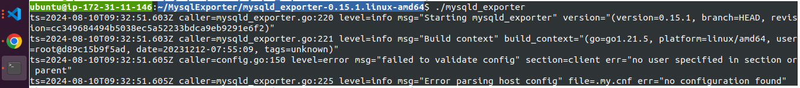

Bcz, Mysql exporter does not know what is your database credentials to connect with your database and fetch info.

Mysql Exporter will need your database credentials.

You have to create a file named **.my.cnf**
```
[client]
user="db_user"
password="db_user_password"
```

Mysql Exporter is listioning on port **9104**

**Conf Mysql Exporter with Prometheus**

```yml
  - job_name: "Mysql_exporter-ec2"

    static_configs:
      - targets: ["Ip_of_server:9104"]
```

* **Deliverables:**  
  * Demonstrate successful data collection from both exporters.  
  * Create a basic Prometheus dashboard to visualize key metrics from these exporters.

#### **4\. Introduction to PromQL**

* **Task:** Learn and implement basic PromQL queries to extract meaningful data from the metrics collected.  
* **Deliverables:**  
  * Write basic queries to retrieve metrics like average CPU usage, memory consumption, and disk I/O over time.

#### **5\. Basic Queries (Selectors, Functions, Operators)**

* **Task:** Create PromQL queries using selectors, functions, and operators to filter and manipulate time-series data.  
* **Deliverables:**  
  * Write PromQL queries to calculate the 95th percentile of CPU usage.  
  * Use functions like `rate()`, `increase()`, and `histogram_quantile()` to perform more complex analysis.

#### **6\. Advanced Queries and Aggregations**

* **Task:** Perform advanced data aggregation using PromQL.  
* **Deliverables:**  
  * Write queries to calculate the total memory usage across all nodes.  

```
sum(node_memory_MemTotal_bytes - node_memory_MemFree_bytes) / sum(node_memory_MemTotal_bytes) * 100
```

##### OutPut
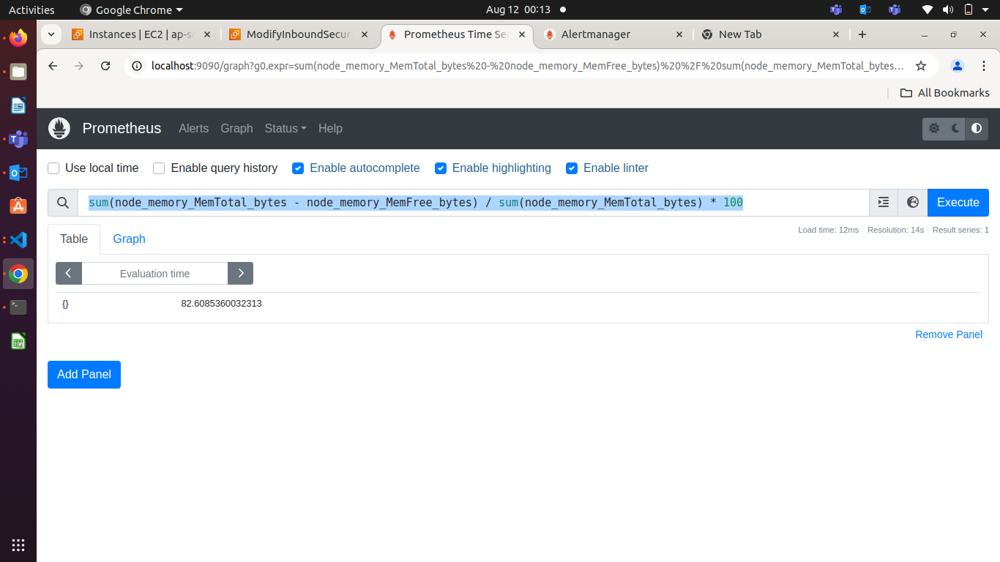
##### Graph

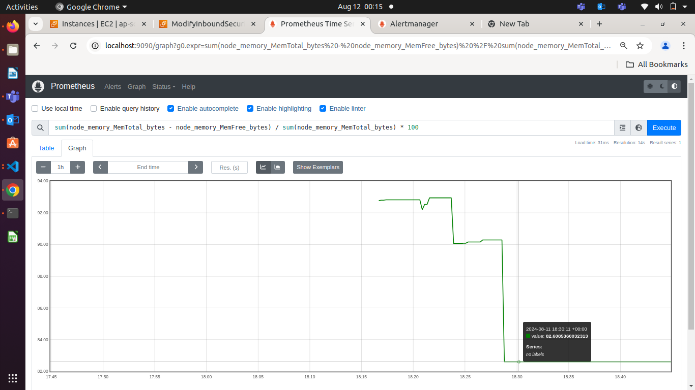

  * Aggregate data to find the maximum disk space usage among all nodes.

#### **7\. Configuring Alertmanager**

* **Task:** Set up Alertmanager to handle alerts generated by Prometheus.  
  
  - Install AlertManager

```
wget https://github.com/prometheus/alertmanager/releases/download/v0.27.0/alertmanager-0.27.0.linux-amd64.tar.gz

tar -xvf alertmanager-0.27.0.linux-amd64.tar.gz
```
NOTE: AlertManager will Receives Data from Prometheus and look for whatever your set the metric condition and its ThreshHold.

While This ThreshHold will triggered AlertManager will Handle This Alert by whatever you defined Rules.

You have to create Rules to handel Alert

Create first_rule.yml on prometheus directory

**Rules/first_rule.yml**
```yml
groups:
  - name: my-rules
    rules:
    - alert: NodeExporterDown
      expr: up{job="node_exporter-ec2"} == 0
      annotations:
        summary: "Node Exporter is down"
        description: "Node Exporter is down for more than 5 minutes."
```

**How Prometheus will know the AlertManager ?**

**Edit prometheus.yml**
```yml
# Alertmanager configuration
alerting:
  alertmanagers:
    - static_configs:
        - targets:
          # - alertmanager:9093
          - localhost:9093
          # Ip_of_server:9093
```
You created Rules to handle Alert
But, While Trigger this Alert , How this Alert will be handeled by **AlertManger** ?

**Is AlertManager will Send You Email Alert, Slack Alert What ?**

For This you have to Edit alertmanager.yml file

**alertmanager.yml**
```yml
route:
  receiver: admin

receivers:
- name: admin
  email_configs:
  - to: "alert@gmail.com"
    from: "alert@gmail.com"
    smarthost: smtp.gmail.com:587
    auth_username: "alert@gmail.com"
    auth_identity: "alert@gmail.com"
    auth_password: "Password@1234"
    send_resolved: true

  slack_configs:
  - channel: "#working-on-alertmanager-to-trigger-alert-and-send-email-to-this-group"
    api_url: "https://hooks.slack.com/api_of_your_webhook_chennal"
```


* **Deliverables:**  
  * Configure Alertmanager with Prometheus.  
  * Create routing rules to manage alert notifications based on severity and service type.

#### **8\. Writing Alerting Rules**

* **Task:** Write custom alerting rules in Prometheus to trigger alerts based on specific conditions.  
* **Deliverables:**  
  * Create alerting rules for high CPU usage, memory leaks, and disk space running low.  

**Write second_rule.yml in prometheus RULE/second_rule.yml**
```yml
groups:
  - name: CPUAlerts
    rules:
    - alert: HighCPUUsage
      expr: sum(rate(node_cpu_seconds_total{mode!="idle"}[5m])) by (instance) > 0.00001
      for: 5m
      labels:
        severity: critical
      annotations:
        summary: "High CPU usage on {{ $labels.instance }}"
        description: "CPU usage is above 90% for more than 5 minutes."

 # Alert for memory leaks (high memory usage)
    - alert: HighMemoryUsage
      expr: (node_memory_MemAvailable_bytes / node_memory_MemTotal_bytes) < 0.2
      for: 5m
      labels:
        severity: critical
      annotations:
        summary: "High memory usage detected on {{ $labels.instance }}"
        description: "Available memory is below 20% of the total memory for the last 5 minutes."

  # Alert for low disk space
    - alert: LowDiskSpace
      expr: (node_filesystem_avail_bytes / node_filesystem_size_bytes) < 0.0000015
      for: 5m
      labels:
        severity: critical
      annotations:
        summary: "Low disk space on {{ $labels.instance }} ({{ $labels.mountpoint }})"
        description: "Available disk space is below 15% for the last 5 minutes."
```

  * Ensure alerts are correctly generated and sent to Alertmanager.

**Firing State**
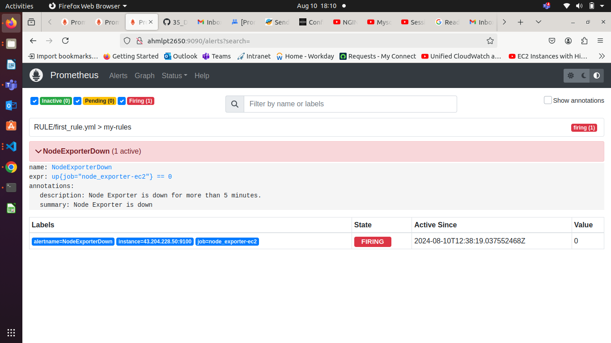

**AlertManager Receives Alert**
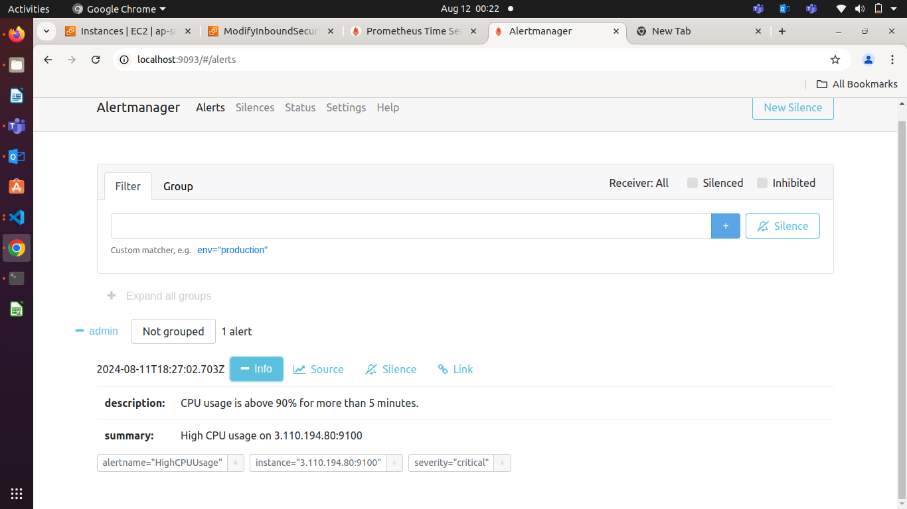

**AlertManage send Alert to slack**
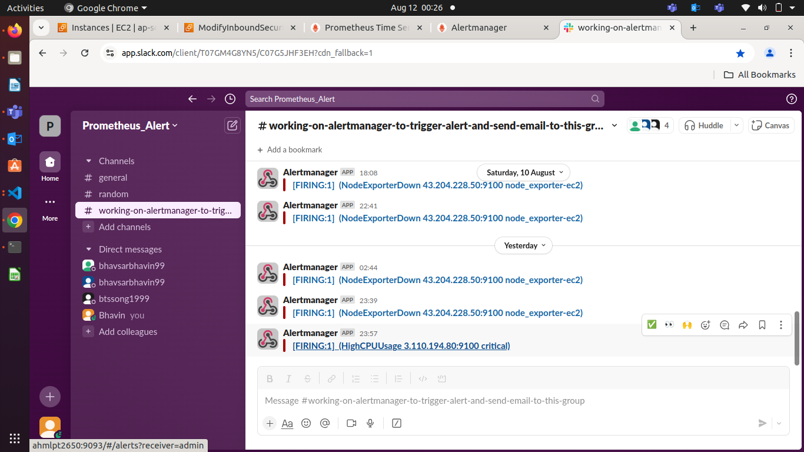

#### **9\. Setting Up Notification Channels (Email, Slack, etc.)**

* **Task:** Integrate Alertmanager with multiple notification channels like Email and Slack.  
* **Deliverables:**  
  * Set up Email notifications for critical alerts. 

**Run Prometheus**

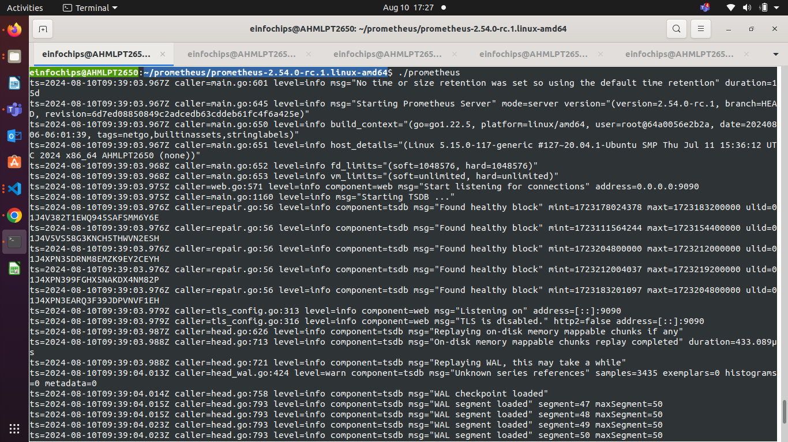

**Run NodeExporter**

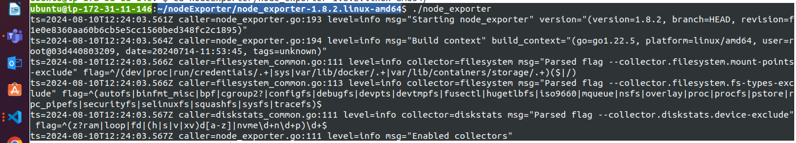

**Run AlertManager**

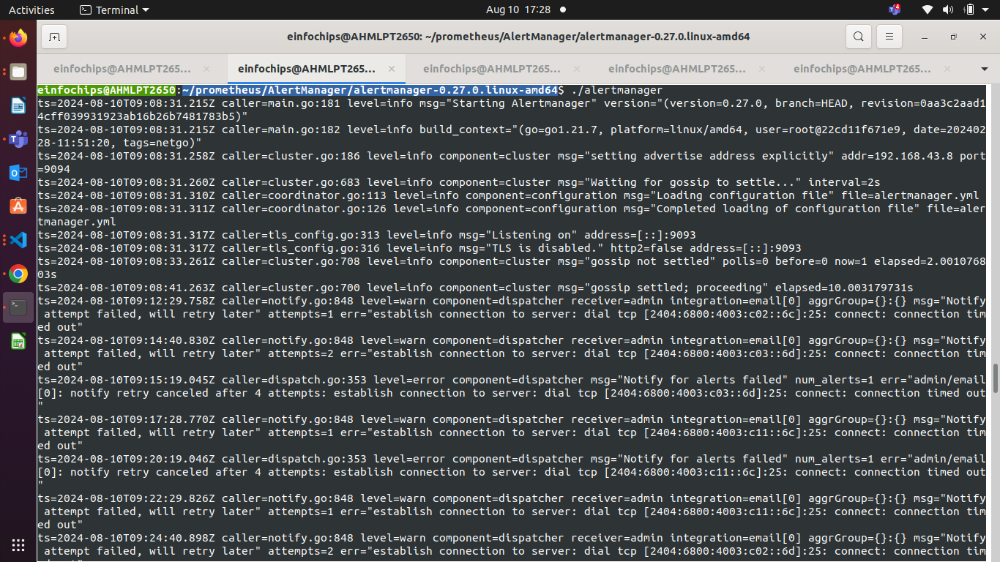

**Ensure all Targets are Running**

localhost:9090

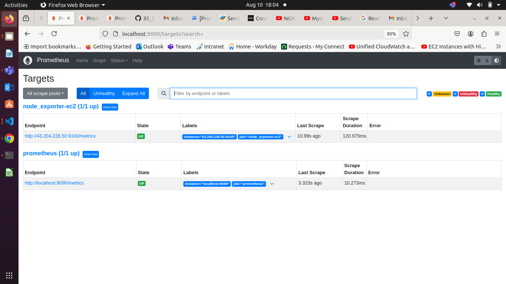

**Now, disable NodeExporter & Check result on prometheus**

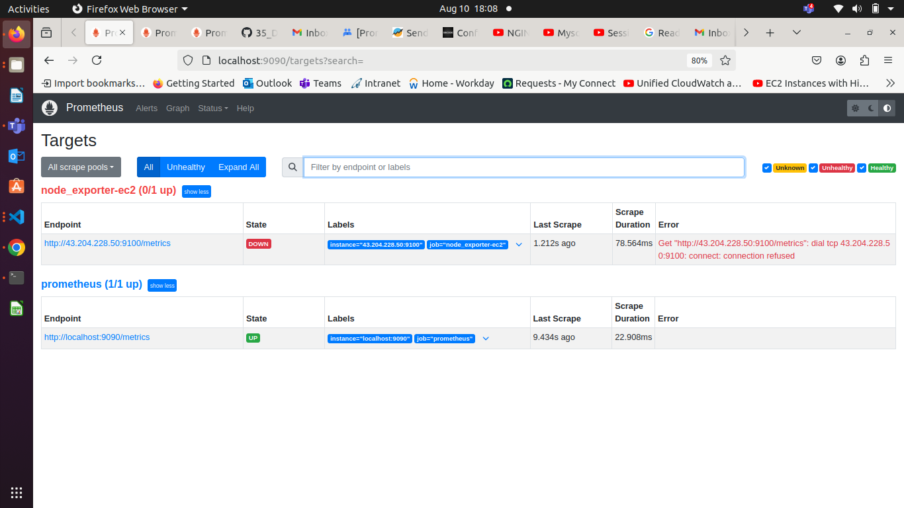

**Ensure Firing State for Node Exporter**


  * Integrate Slack for real-time alerts and notifications.

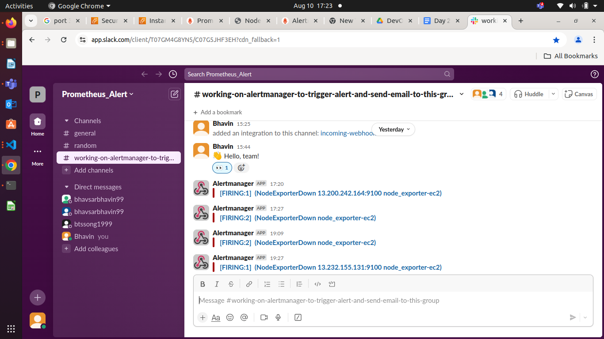 

#### **10\. Hands-on Exercise: Creating Alerts**

* **Task:** Test the entire alerting pipeline by creating and triggering custom alerts.  
* **Deliverables:**  
  * Simulate a scenario where a node exceeds 90% CPU usage and ensure alerts are triggered and sent to both Email and Slack.  
  * Validate the alerts in both notification channels.