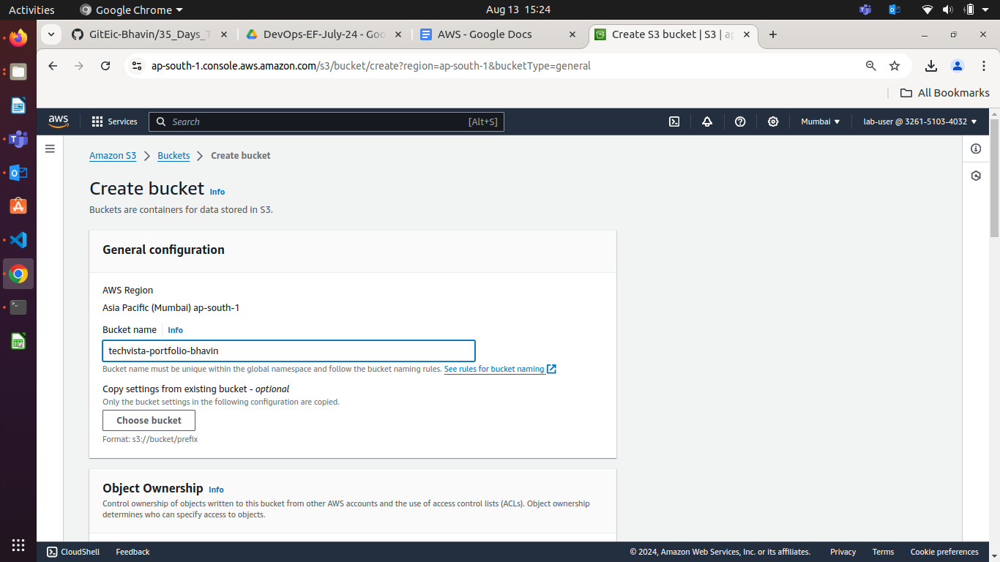

**Day 24**

**Topics for today**

**Object Storage \- S3 (BLOB)**  
**Block Storage \- EBS**  
**File Storage \- EFS, FSx**

* **S3**  
  * **Buckets**  
  * **Objects**  
  * **Create bucket, upload objects and give public access**  
  * **Storage Class**  
  * **Pricing**  
  * **Lifecycle Management**  
  * Host a static website on S3  
* Overview of CloudFront  
* EC2  
  * AMI  
  * Instance Type  
  * Key pair  
  * Pricing  
  * Security Group  
  * User Data  
  * Launch Instance and connect using SSH  
* EBS  
  * Volume Types  
  * Mount Volumes to Instances  
  * Snapshot

**S3 (Simple Storage Service)**

* **Buckets :** Unlimited in size, unlimited no. of objects in them   
* **Objects:** Single Object \< 5 TB, Single Time Upload \< 160 GB

**File : 1 TB**  
**Multi Part Upload Tool (Offered within AWS)**

Part 1 \<= 160 GB  
Part n \<= 160 GB  
Part \< 1GB

**S3 Pricing**

* **Volume**  
  * Pay Per GB  
* **Requests**  
  * Pay per 1000 Read & Put (Upload) Request  
* **Storage Class**  
  * **Standard:** Frequently accessed objects  
  * **Standard Infrequent Access, IA:** Infrequently accessed objects  
  * **One Zone IA**  
  * **Glacier:** Backups/Archives  
  * **Glacier Deep Archive**  
  * **Intelligent Tiering**  
* **Bandwidth**  
* **Time** 

Availability of S3 Objects \= **99.999999999%**

**AWS S3** 

**Bucket Policy for Public Access**

{  
	"Version": "2012-10-17",  
	"Statement": \[  
		{  
			"Sid": "Statement1",  
			"Principal": "\*",  
			"Effect": "Allow",  
			"Action": "s3:GetObject",  
			"Resource" : "arn:aws:s3:::augustdemobucket24/\*"  
		}  
	\]  
}

**Endpoint For Testing:** [https://d1hn87tb2hwa9e.cloudfront.net](https://d1hn87tb2hwa9e.cloudfront.net)

**Project** 

### **Comprehensive AWS S3 Management and Static Website Hosting**

#### **Objective:**

To test your knowledge and skills in managing AWS S3 storage classes, lifecycle management, bucket policies, access control lists (ACLs), and hosting a static website on S3. You will apply their understanding in a practical scenario, ensuring you have mastered the critical aspects of AWS S3.

#### **Project Scenario:**

You are tasked with creating and managing an S3 bucket for a fictional company, "TechVista Inc.," that hosts a static website for displaying their product portfolio. The website will have different types of content, including high-resolution images, which require careful storage management to optimize costs. Additionally, the company has strict security requirements for accessing the content.

#### **Project Steps and Deliverables:**

1. **Create and Configure an S3 Bucket:**  
   * Create an S3 bucket named `techvista-portfolio-[your-initials]`.  

**To create S3 Bucket follow below steps**

   * Go to S3 Service and click on create bucket
   * Give Bucket Name



   * If you want to Publish your static host website by S3 Service. Whatever your webpage data will serve that obejct should publically accessible.

   * For that you have to ACL Enabled, by this option still your Bucket is Private but you are now able to make your objects as Public.


   * Allow Public Access by uncheck


   * Enable versioning on the bucket.  
   * - Enable Bucket Versioning


   * Click on Create Bucket


   **Set up the bucket for static website hosting.**

   * Upload the provided static website files (HTML, CSS, images).  

**Upload your objects**
**Click on Upload**


**Add files**


#### Enable Static host website

   * Go to Properties


   * Edit Static host
   


   * Enable Static Host website option
   * Bydefault this option is **disabled**


   * Add your object / frontpage of website which will serve by S3 Bucket's URL


   * Ensure the website is accessible via the S3 website URL.  

   * Try to Access your website by index.html S3 Url

   * Click on index.html object and go to Properties and look for Object URL


   * Click on Object URL and see result


   * Still You are not able to see your static website, even we enabled public access during cration of bucket. Why ?

   **By that option you will be able to make object public, still your bucket and objects are private**

- You have 2 ways to make all objects public

   1. Manually choose object and make public by choosing **Make Public using ACL**

   * Click on **Object Options** and click on **Make Public using ACL**


   * Click on Make Public


   * Now Your Static Web should be able to Publically accessible


2. **Implement S3 Storage Classes:**  
   * Classify the uploaded content into different S3 storage classes (e.g., Standard, Intelligent-Tiering, Glacier).  
   * Justify your choice of storage class for each type of content (e.g., HTML/CSS files vs. images).  
3. **Lifecycle Management:**  
   * Create a lifecycle policy that transitions older versions of objects to a more cost-effective storage class (e.g., Standard to Glacier).

   **Go To Management**


 
   **Click on Create lifecycle rule**


   - Select the Lifecycle Action and For Current Version Choose S3 Class as per cost effective.

   \

   - Plan for NonCurrent Versions


   - Plan for when your current version should be expired


   - Click on Create Rule


   * Set up a policy to delete non-current versions of objects after 90 days.  
   * Verify that the lifecycle rules are correctly applied.  
4. **Configure Bucket Policies and ACLs:**  
   * Create and attach a bucket policy that allows read access to everyone for the static website content.  

**Go to Permission**


**Look for Bucket Policy and Edit it**


**Click on Add New Statement**


**Edit Policy**
```yml
{
	"Version": "2012-10-17",
	"Statement": [
		{
			"Sid": "Statement1",
			"Principal": "*", # This will allow all user will be accessible to your bucket with defined path for objects.
			"Effect": "Allow",
			"Action": "s3:GetObject",
			"Resource": ["arn:aws:s3:::techvista-portfolio-your-name/path-of-index.html-file",
			             "arn:aws:s3:::techvista-portfolio-your-name/path-of-jpg-file"]
		}
	]
}
```
   * Ensure your web is still responding after update bucket poliy


**By ACLs Restriction for everyone can only Read**

   - Go to Permission and look for ACL and click on Edit


   - Look for Everyone(public access)
   - Check the **Read** Permission


   - Ensure Still your web is accessible after update **ACL** Rule


   * Restrict access to the S3 management console for specific IAM users using the bucket policy.  
   * Set up an ACL to allow a specific external user access to only a particular folder within the bucket.  
5. **Test and Validate the Configuration:**  
   * Test the static website URL to ensure it is accessible.  
   * Validate the storage class transitions based on the lifecycle policy.  
   * Check the effectiveness of the bucket policy and ACLs by simulating different access scenarios (e.g., accessing the content with an external user, denying access from unauthorized users).  
6. **Documentation and Report:**  
   * Document each step you performed, including the reasoning behind your choices for storage classes, lifecycle policies, bucket policies, and ACLs.  
   * Provide screenshots of key configurations and test results.  
   * Summarize the project in a brief report, highlighting any challenges faced and how they were resolved.

#### **Time Allocation:**

* **Bucket Creation and Configuration:** 20 minutes  
* **Implementing Storage Classes:** 20 minutes  
* **Lifecycle Management:** 20 minutes  
* **Bucket Policies and ACLs:** 30 minutes  
* **Testing and Validation:** 20 minutes  
* 

