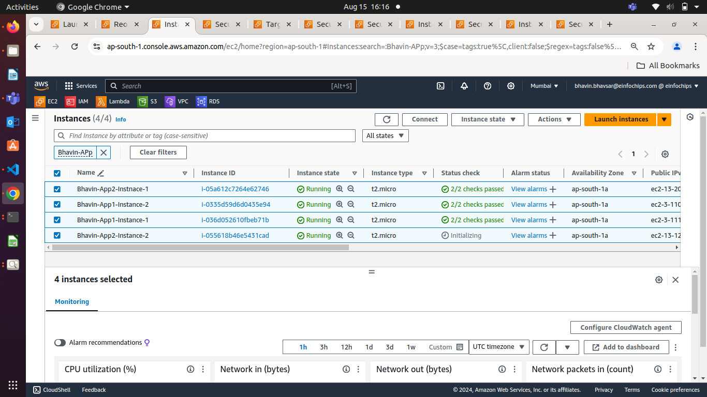
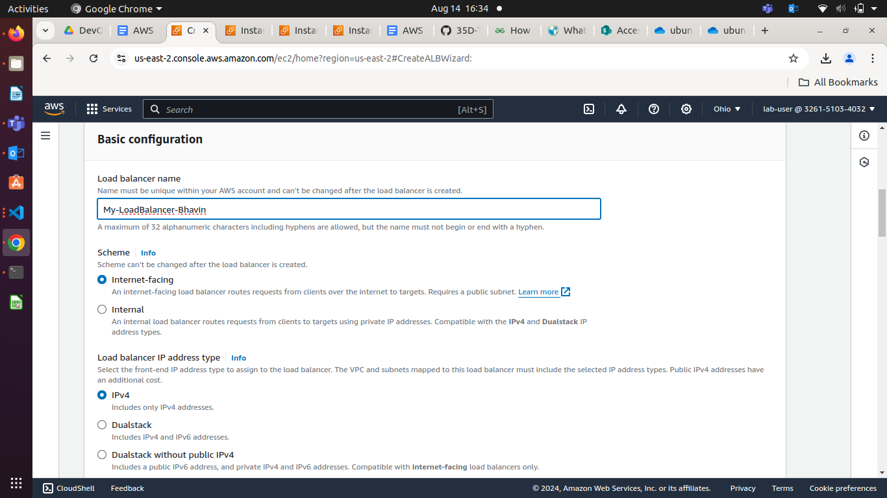

# Day 25

**EC2 Instance Type**

[Compute – Amazon EC2 Instance Types – AWS](https://aws.amazon.com/ec2/instance-types/)

**EBS ( Elastic Block Storage )**

* **Solid State Disk, SSD**  
  * **General Purpose SSD:** Preferred for root, upto 16k IOPS  
  * **Provisioned IOPS:** Preferred for Dbs, upto 256k IOPS  
* **Hard Disk Storage, HDD**  
  * **Throughput Optimized:** 500 mb/s  
  * **Cold HDD:** 250 mb/s

**Capacity:** 1 GB to 16 TB

**IOPS** (Input Output Per Second \[Read & Write Ops / Second\])   
**Throughput:** Amount of data flowing in & out / second

**Default EC2 Username (Based on the AMI)**

[Manage system users on your Amazon EC2 Linux instance \- Amazon Elastic Compute Cloud](https://docs.aws.amazon.com/AWSEC2/latest/UserGuide/managing-users.html)

**EC2 Pricing**

* **On Demand:** default, Pay as you Go  
* **Reserved:**   
* **Spot:** Bid Amount : $0.035

Instance : $1/Hour

[Amazon EC2 Spot Instances \- Product Details](https://aws.amazon.com/ec2/spot/pricing/)

**Sample Site Reference, deployed on EC2:**  
[Web App](http://18.208.160.127/)   
**Steps for setting up the site**

   **13  sudo apt-get update**  
   **14  clear**  
   **15  cd**  
   **16  clear**  
   **17  sudo apt-get install apache2 \-y**   
   **18  clear**  
   **19  ls**  
   **20  sudo mkdir \-p /var/www/html/web**  
   **21  sudo nano /var/www/html/web/index.html**  
   **22  cd /etc/apache2**  
   **23  cd sites-available**  
   **24  ls**  
   **25  sudo cp 000-default.conf web.conf**  
   **26  ls**  
   **27  sudo cp 000-default.conf web.conf**  
   **28  ls**  
   **29  sudo nano web.conf**  
   **30  sudo a2dissite 000-default.con**  
   **31  sudo a2dissite 000-default.conf**  
   **32  sudo a2ensite web.conf**  
   **33  sudo service apache2 restart**  
   **34  history**

**EBS Pricing**  
[High-Performance Block Storage– Amazon EBS Pricing – Amazon Web Services](https://aws.amazon.com/ebs/pricing/)

**AMI Pricing**  
[AMI product pricing \- AWS Marketplace (amazon.com)](https://docs.aws.amazon.com/marketplace/latest/userguide/pricing-ami-products.html)

**Health Check**  
[Health checks for your target groups \- Elastic Load Balancing (amazon.com)](https://docs.aws.amazon.com/elasticloadbalancing/latest/network/target-group-health-checks.html)

**Project \- 14th August**

### **Deploying a Path-Based Routing Web Application on AWS**

#### **Objective**

To evaluate your skills in deploying a web application on AWS using EC2 instances, configuring security groups, and setting up an Application Load Balancer (ALB) with path-based routing. You will deploy two simple web applications, configure the ALB to route traffic based on the URL path, and terminate all resources once the project is complete.

#### **Project Scenario:**

A small company needs to deploy two lightweight web applications, "App1" and "App2," on AWS. The traffic to these applications should be routed through a single Application Load Balancer (ALB) based on the URL path. The company has opted for t2.micro instances for cost efficiency.

#### **Project Steps and Deliverables:**

1. **EC2 Instance Setup (30 minutes):**  
   * **Launch EC2 Instances:**  
     * Launch four EC2 t2.micro instances using the Amazon Linux 2 AMI.  
     * SSH into each instance and deploy a simple web application:  
       * Deploy "App1" on two instances.  
       * Deploy "App2" on the other two instances.  



     * Assign tags to the instances for identification (e.g., "App1-Instance1," "App1-Instance2," "App2-Instance1," "App2-Instance2").  
    

2. **Security Group Configuration (20 minutes):**  
   * **Create Security Groups:**  
     * Create a security group for the EC2 instances that allows inbound HTTP (port 80\) and SSH (port 22\) traffic from your IP address.  


  * Create a security group for the ALB that allows inbound traffic on port 80\.  


  * Attach the appropriate security groups to the EC2 instances and ALB.  


3. **Application Load Balancer Setup with Path-Based Routing (40 minutes):**  
   * **Create an Application Load Balancer (ALB):**  
     * Set up an ALB in the same VPC and subnets as your EC2 instances.  

**Set up Load Balancer**

  * Go To Load Balancer


  * Click on Create Load Balancer and Choose **Application Load Balancer**


  * Give Load Balancer Name and Other configurations



  * Select Atleast 2 AZ 


  * Click on Create Security Group for ALB


  * Give SG Name and Descriptions


  * Create InBound Rule for ALB


  * Create OutBound Rule for ALB


  * Tag to ALB SG


  * Assign ALB SG to ALB


#### Create Target Groups for App1 and App2

  * Configure the ALB with two target groups:  
        * **Target Group 1:** For "App1" instances.  

  * Click on create Target Group


  * Choose Target Group Type 
  * I will prefer Instace


  * Give Target Group Name and Select Port for ALB


  * Tag to Target Group 1 and clic on NEXT


  * Now, Add All Instance for App1 which has tag **App1-Instance-1** and **App2-Instance-2**


  * Click on **Include as pending below** to register this all instances as targets for Target Group 1


  * Click on Create Target Group


  * 
       * **Target Group 2:** For "App2" instances.  

  * Do same for App2.
     * Register the appropriate EC2 instances with each target group.

#### Now, We have to Add TargetGroups to Load Balancer 

  * Go to Add Listioners and click on it


  * Add All TargetGroups into this listioners bcz, our Application is to maintain App1 and App2 by load balancer with port 80


   * **Configure Path-Based Routing:**  
     * Set up path-based routing rules on the ALB:  
       * Route traffic to "App1" instances when the URL path is `/app1`.  

  * Load Balancer is creted, Go to your Load Balancer

  * Go to Listioner


  * Select Prototcol **HTTP:80** and Go to Manage RUle and Click on **Edit Rule**


  * click on Add Rule and Give name of your rule


  * Click on Add Condition


  * Selct Condition type is **Path**


  * Add Path as **/app1** 


  * Click on Next
  * Now, Select those Target Group which will accepts the traffic while the path **/app1 will match


  * I will prefer /app1 > TargetGroup 1


  * Route traffic to "App2" instances when the URL path is `/app2`.  

Do Same for path **/app2**

     * Set up health checks for each target group to ensure that the instances are healthy and available.  

#### Still you will not able to perform path based routing , bcz, Load Balancer will search for path /app1 and /app2 into your web application default path for nginx /var/www/html and search for index.html file

* If you did not made any custom web app , it will show home page of nginx.

* This is not our Application Right!

* Follow procedure for make custom web app using **Defult-nginx.conf**

    - If you want to make own web app without making new nginx.conf file for your own web app.

    - You have to use nginx.conf file default.

    - Best Practice is:-
    **DO NOT ADD, MODIFY Default Nginx.conf** under /etc/nginx/nginx.conf
    **Create your custom nginx.conf file**

  - Go to /var/www/html/"your-web-name"
  - In my case /var/www/html/app1/

  - Create index.html under /var/www/html/index.html

  - Edit index.html

```html
Welcome to My App2 Instance 2 from ip-172-31-16-15
```

  - To load new web conf , restart nginx
```
sudo systemctl restart nginx
```

Check on Browser by typing ip/app1


  **Do same for other all instances for App1 and App2**


4. **Testing and Validation (20 minutes):**  
   * **Test Path-Based Routing:**  
     * Access the ALB's DNS name and validate that requests to `/app1` are correctly routed to the "App1" instances and that `/app2` requests are routed to the "App2" instances.

**Check for App1 Instance 1 using Load Balancer URL**

  

**For App1 Instance 2**


**For App2 Instnace 1**


**For App2 Instance 2**


   * **Security Validation:**  
     * Attempt to access the EC2 instances directly via their public IPs to ensure that only your IP address can SSH into the instances.  
5. **Resource Termination (10 minutes):**  
   * **Terminate EC2 Instances:**  
     * Stop and terminate all EC2 instances.  
   * **Delete Load Balancer and Target Groups:**  
     * Delete the ALB and the associated target groups.  
   * **Cleanup Security Groups:**  
     * Delete the security groups created for the project.  
6. **Documentation and Reporting (10 minutes):**  
   * **Brief Documentation:**  
     * Document the steps taken during the project, including the setup of EC2 instances, security groups, and ALB configuration.  
   * **Final Report:**  
     * Summarize the project, highlighting any challenges faced and how they were resolved.

#### **Time Allocation Summary:**

* **EC2 Instance Setup:** 30 minutes  
* **Security Group Configuration:** 20 minutes  
* **Application Load Balancer Setup with Path-Based Routing:** 40 minutes  
* **Testing and Validation:** 20 minutes  
* **Resource Termination:** 10 minutes  
* **Documentation and Reporting:** 10 minutes

