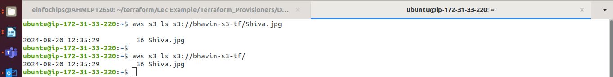
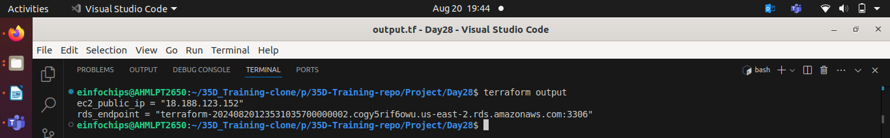
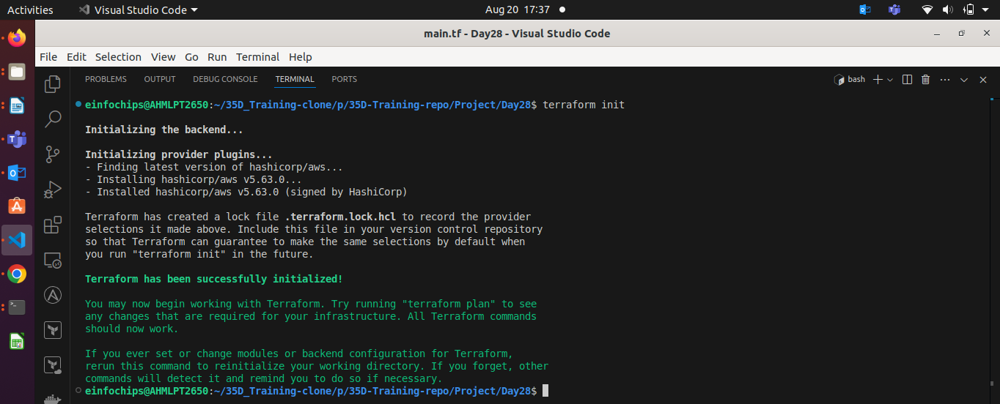
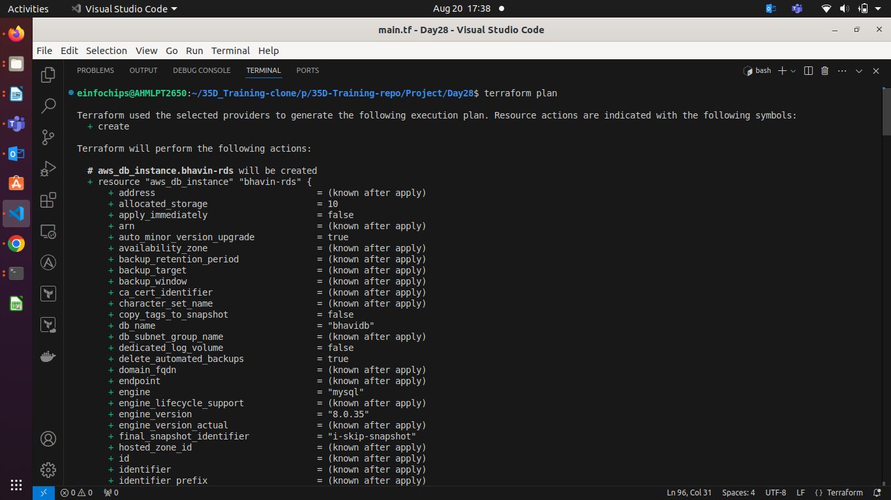
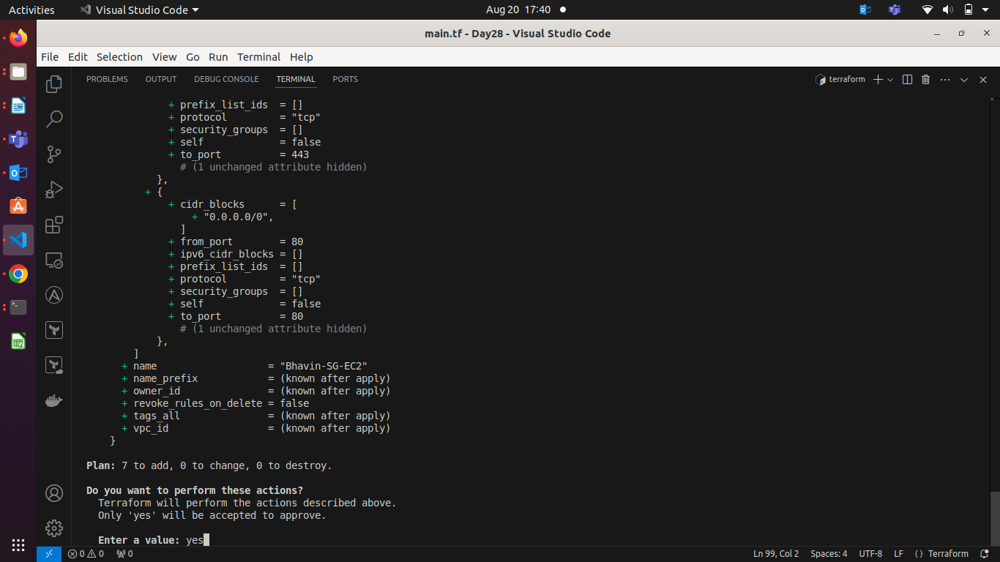
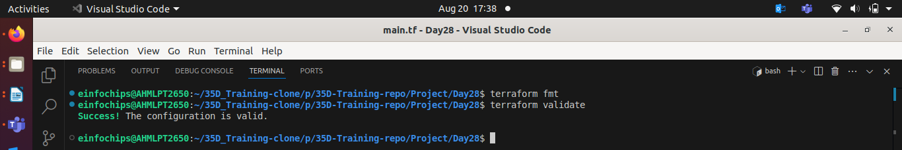
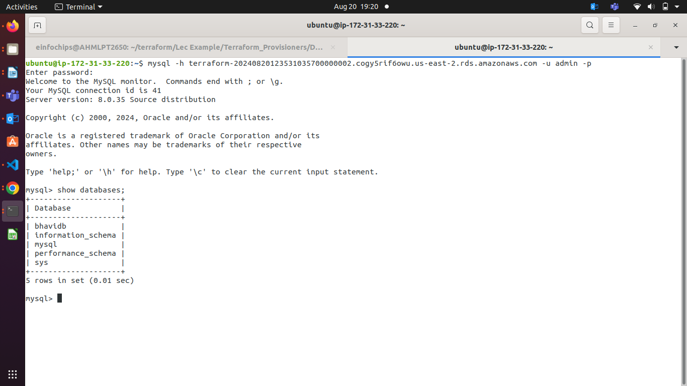
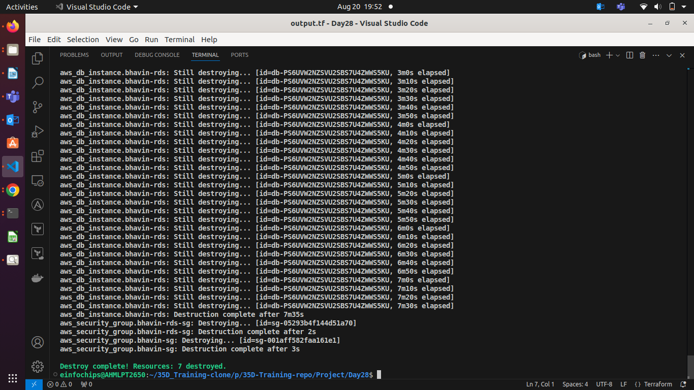

**Day 28**

### **Terraform Overview**

**Terraform** is an open-source infrastructure as code (IaC) tool created by HashiCorp. It allows users to define and provision infrastructure using a high-level configuration language known as HashiCorp Configuration Language (HCL) or JSON. Terraform enables you to automate the creation, modification, and destruction of infrastructure resources across various cloud providers and on-premises environments, ensuring that infrastructure is managed consistently.

### **Architecture of Terraform**

Terraform's architecture can be broken down into several key components:

1. **Configuration Files**:  
   * **Terraform Configuration**: Users write Terraform configuration files in HCL or JSON to describe the desired state of the infrastructure. These files define resources like servers, databases, networks, and load balancers.  
   * **Modules**: A module is a container for multiple resources that are used together. Modules allow you to create reusable infrastructure components.  
2. **Terraform Core**:  
   * **Terraform Core** is the heart of Terraform. It reads the configuration files, builds a dependency graph of resources, and communicates with the plugins to provision the infrastructure. Terraform Core has two primary functions:  
     * **Resource Graph Construction**: It builds a graph of all resources defined in the configuration, allowing it to figure out the correct order to create, update, or delete resources.  
     * **Execution Plan**: It generates an execution plan that details the steps Terraform will take to achieve the desired state.  
3. **Providers**:  
   * **Providers** are the plugins that interface with the APIs of various cloud platforms (e.g., AWS, Azure, GCP), services, and other systems (e.g., GitHub, Datadog). Each provider offers a set of resources and data sources specific to a particular service or platform.  
   * Terraform supports a wide variety of providers, and each provider has its own configuration options and set of available resources.  
4. **State**:  
   * **Terraform State** is a file that Terraform uses to keep track of the infrastructure it manages. The state file records the mappings between the Terraform resources in your configuration files and the actual resources in your infrastructure.  
   * The state file allows Terraform to detect changes in infrastructure and to create, modify, or delete resources accordingly. State files can be stored locally or remotely in a shared storage backend (e.g., AWS S3, HashiCorp Consul, Terraform Cloud).  
5. **CLI Commands**:  
   * Terraform provides a set of command-line interface (CLI) commands to interact with its functionality:  
     * **terraform init**: Initializes a Terraform working directory, downloading necessary plugins.  
     * **terraform plan**: Creates an execution plan by comparing the current state with the desired state defined in the configuration files.  
     * **terraform apply**: Applies the changes required to reach the desired state.  
     * **terraform destroy**: Destroys the infrastructure managed by Terraform.

### **Terraform Workflow**

1. **Write Configuration**: Write infrastructure as code in configuration files.  
2. **Initialize**: Run `terraform init` to initialize the working directory and download the necessary providers.  
3. **Format (not mandatory):** Formats the script properly  
4. **Validate (not mandatory):** Check for syntax error, if any.  
5. **Plan**: Run `terraform plan` to generate an execution plan that shows what Terraform will do.  
6. **Apply**: Run `terraform apply` to apply the changes and provision the infrastructure.  
7. **Manage**: Use `terraform apply` and `terraform destroy` to manage changes to your infrastructure over time.

### **Use Cases for Terraform**

Terraform is widely used in various scenarios, including:

1. **Multi-Cloud Deployments**:  
   * Terraform supports multiple cloud providers (e.g., AWS, Azure, Google Cloud), allowing users to define infrastructure that spans multiple clouds. This is particularly useful for organizations adopting a multi-cloud strategy.  
2. **Infrastructure as Code (IaC)**:  
   * Terraform allows infrastructure to be defined in code, versioned, and managed just like software. This enables teams to collaborate on infrastructure changes, track modifications, and automate deployments.  
3. **Provisioning and Scaling**:  
   * Terraform automates the provisioning and scaling of infrastructure resources. For example, you can use Terraform to create and manage EC2 instances, load balancers, and VPCs in AWS.  
4. **Self-Service Infrastructure**:  
   * Terraform can be integrated with CI/CD pipelines and other automation tools to provide self-service infrastructure to developers. Developers can use pre-defined Terraform modules to deploy their environments without needing to interact with cloud consoles.  
5. **Disaster Recovery**:  
   * Terraform can be used to define disaster recovery environments. In the event of a failure, Terraform can quickly recreate the infrastructure in a different region or cloud provider.  
6. **Immutable Infrastructure**:  
   * Terraform promotes the concept of immutable infrastructure, where servers and resources are replaced rather than modified. This approach reduces the risk of configuration drift and ensures consistency across environments.  
7. **Compliance and Governance**:  
   * Terraform allows organizations to enforce compliance and governance policies by defining infrastructure in code. Infrastructure changes can be reviewed, approved, and audited before being applied.

### **Benefits of Terraform**

* **Consistency**: Terraform ensures that infrastructure is consistently deployed and managed across different environments.  
* **Scalability**: Terraform can manage large-scale infrastructure, making it suitable for both small teams and enterprise organizations.  
* **Reusability**: Modules and configurations can be reused across different projects, reducing duplication and errors.  
* **Declarative**: Terraform's declarative language allows users to define the desired state of infrastructure without worrying about the steps to achieve it.

**Terraform Installation**

[**Install | Terraform | HashiCorp Developer**](https://developer.hashicorp.com/terraform/install)

[**Install | Terraform | HashiCorp Developer**](https://developer.hashicorp.com/terraform/install\#linux) **(Linux)**

**History of Terraform Lifecycle Deployment (Including the setup)**

    *1  clear*  
    *2  sudo apt-get update*  
    *3  wget \-O- https://apt.releases.hashicorp.com/gpg | sudo gpg \--dearmor \-o /usr/share/keyrings/hashicorp-archive-keyring.gpg*  
    *4  echo "deb \[signed-by=/usr/share/keyrings/hashicorp-archive-keyring.gpg\] https://apt.releases.hashicorp.com $(lsb\_release \-cs) main" | sudo tee /etc/apt/sources.list.d/hashicorp.list*  
    *5  sudo apt update && sudo apt install terraform*  
    *6  clear*  
    *7  mkdir .aws*  
    *8  nano .aws/config*  
    *9  nano .aws/credentials*  
   *10  export AWS\_ACCESS\_KEY\_ID=Enter access key value*  
   *11  export AWS\_SECRET\_ACCESS\_KEY=Enter secret key value*  
   *12  terraform*  
   *13  clear*  
   *14  terraform \--version*  
   *15  mkdir terraform-demo*  
   *16  cd terraform-demo*  
   *17  ls*  
   *18  nano main.tf*  
   *19  terraform init*  
   *20  terraform fmt*  
   *21  terraform validate*  
   *22  clear*  
   *23  terraform plan*  
   *24  terraform apply*  
   *25  history*

**State Management in Terraform** 

* A file named as **terraform.tfstate** gets automatically created upon execution of terraform apply command.  
* This file stores the details of the resources deployed using main.tf file

### **Project: Deploying a Multi-Tier Architecture Application on AWS using Terraform**

**Lab Access**

**Allowed Region (Choose Any One) :** us-east-1, us-east-2, us-west-1, us-west-2

#### **Project Objective:**

This project will assess your ability to deploy a multi-tier architecture application on AWS using Terraform. The deployment will involve using Terraform variables, outputs, and change sets. The multi-tier architecture will include an EC2 instance, an RDS MySQL DB instance, and an S3 bucket.

#### **Project Overview:**

You are required to write Terraform configuration files to automate the deployment of a multi-tier application on AWS. The architecture should consist of:

1. **EC2 Instance**: A `t2.micro` instance serving as the application server.  
2. **RDS MySQL DB Instance**: A `t3.micro` instance for the database backend.  
3. **S3 Bucket**: For storing static assets or configuration files.

#### **Specifications:**

* **EC2 Instance**: Use the `t2.micro` instance type with a public IP, allowing HTTP and SSH access.  
* **RDS MySQL DB Instance**: Use the `t3.micro` instance type with a publicly accessible endpoint.  
* **S3 Bucket**: Use for storing static assets, configuration files, or backups.  
* **Terraform Configuration**:  
  * Utilize Terraform variables to parameterize the deployment (e.g., instance type, database name).  
  * Use Terraform outputs to display important information (e.g., EC2 public IP, RDS endpoint).  
  * Implement change sets to demonstrate how Terraform manages infrastructure changes.  
* **No Terraform Modules**: Focus solely on the core Terraform configurations without custom or external modules.

#### **Key Tasks:**

1. **Setup Terraform Configuration:**  
   * **Provider Configuration**:  
     * Configure the AWS provider to specify the region for deployment.  
     * Ensure the region is parameterized using a Terraform variable.  

**provider.tf**
```
provider "aws" {
  region  = "us-east-2"
  profile = "training-tf"
}
```

   * **VPC and Security Groups**:  
     * Create a VPC with a public subnet for the EC2 instance.  
     * Define security groups allowing HTTP and SSH access to the EC2 instance, and MySQL access to the RDS instance.  
   * **EC2 Instance**:  
     * Define the EC2 instance using a `t2.micro` instance type.  
     * Configure the instance to allow SSH and HTTP access.  
     * Use Terraform variables to define instance parameters like AMI ID and instance type. 

```hcl
resource "aws_instance" "app_server" {
  instance_type = var.instance_type
  ami           = var.instance_ami
  iam_instance_profile = "EC2-S3-Role"
  vpc_security_group_ids = [aws_security_group.bhavin-sg.id]

  tags = {
    Name = var.instance_tag
  }

  depends_on = [aws_security_group.bhavin-sg]

  key_name = "ansible-worker"
}

resource "aws_security_group" "bhavin-sg" {
  name = var.aws_sg_name
  ingress {
    from_port   = 22
    to_port     = 22
    protocol    = "tcp"
    cidr_blocks = ["0.0.0.0/0"]
  }
  ingress {
    from_port   = 80
    to_port     = 80
    protocol    = "tcp"
    cidr_blocks = ["0.0.0.0/0"]
  }
  ingress {
    from_port   = 443
    to_port     = 443
    protocol    = "tcp"
    cidr_blocks = ["0.0.0.0/0"]
  }
  ingress {
    from_port   = -1
    to_port     = -1
    protocol    = "icmp"
    cidr_blocks = ["0.0.0.0/0"]
  }
  ingress {
    from_port   = 3306
    to_port     = 3306
    protocol    = "tcp"
    cidr_blocks = ["0.0.0.0/0"]
  }
  egress {
    from_port   = 0
    to_port     = 0
    protocol    = "-1"
    cidr_blocks = ["0.0.0.0/0"]
       }
}
``` 
   * **RDS MySQL DB Instance**:  
     * Create a `t3.micro` MySQL DB instance within the same VPC.  
     * Use Terraform variables to define DB parameters like DB name, username, and password.  
     * Ensure the DB instance is publicly accessible, and configure security groups to allow access from the EC2 instance.  
   
```hcl
resource "aws_db_instance" "bhavin-rds" {
  allocated_storage         = var.allocate_storage
  db_name                   = var.db_name
  engine                    = var.engine
  engine_version            = var.engine_version
  instance_class            = var.instance_class
  username                  = var.username
  password                  = var.password
  parameter_group_name      = var.parameter_group_name
  skip_final_snapshot       = var.skip_final_snapshot
  final_snapshot_identifier = var.final_snapshot_identifie
  vpc_security_group_ids = [aws_security_group.bhavin-rds-sg.id]
  
  tags = {
    Name = "Bhavin-rds"
  }
  publicly_accessible = true
  # To make RDS as public while you launch it from terraform.

  depends_on = [aws_security_group.bhavin-rds-sg]

}
resource "aws_security_group" "bhavin-rds-sg" {
  name = var.aws_rds_sg_name

  ingress {
    from_port   = 3306
    to_port     = 3306
    protocol    = "tcp"
    # Allow EC2 Instance Web Server SG into RDS DB SG
    security_groups = [ aws_security_group.bhavin-sg.id ]
  }
  egress {
    from_port   = 0
    to_port     = 0
    protocol    = "-1"
    cidr_blocks = ["0.0.0.0/0"]
    }
}
```
   * **S3 Bucket**:  
     * Create an S3 bucket for storing static files or configurations.  

```hcl
# Create S3 Bucket and upload image as object

resource "aws_s3_bucket" "bhavin-s3" {
  bucket = "bhavin-s3-tf"
  tags = {
    Name = "bhavin-s3-bucket"
  }

}

resource "aws_s3_bucket_public_access_block" "make_public" {
  bucket = aws_s3_bucket.bhavin-s3.id

  block_public_acls   = false
  block_public_policy = false
}

# Upload Image, objects in S3 Bucket.
resource "aws_s3_object" "shiva_jpg" {
  content = var.s3_object_upload # has path of jpg locally.
  key     = var.s3_object_name # object name
  bucket  = aws_s3_bucket.bhavin-s3.id # Ref of S3 Bucket.

}
```
   * Allow the EC2 instance to access the S3 bucket by assigning the appropriate IAM role and policy. 

For that we have to create Role which has policy of **S3 Full Access**
Role name is **EC2 S3 Role**

We can attach this Role in EC2 Instance Resource Block by using this key-word.
```hcl
iam_instance_profile = "EC2-S3-Role"
```
**Check EC2 is able to access S3 ?**



   * **Outputs**:  
     * Define Terraform outputs to display the EC2 instance’s public IP address, the RDS instance’s endpoint, and the S3 bucket name.  
**Write OutPut Block to print information about resources**

**output.tf**
```hcl
output "ec2_public_ip" {
    value = aws_instance.app_server.public_ip
}
output "rds_endpoint" {
    value = aws_db_instance.bhavin-rds.endpoint
}
```



2. **Apply and Manage Infrastructure:**  
   * **Initial Deployment**:  
     * Run `terraform init` to initialize the configuration.  

```hcl
terraform init
```


   * Use `terraform plan` to review the infrastructure changes before applying.  

```hcl
terraform plan
```



   * Deploy the infrastructure using `terraform apply`, and ensure that the application server, database, and S3 bucket are set up correctly.  

```hcl
terraform apply
```



   * **Change Sets**:  
     * Make a minor change in the Terraform configuration, such as modifying an EC2 instance tag or changing an S3 bucket policy.  
     * Use `terraform plan` to generate a change set, showing what will be modified.  
     * Apply the change set using `terraform apply` and observe how Terraform updates the infrastructure without disrupting existing resources.  
3. **Testing and Validation:**  
   * Validate the setup by:  

```hcl
terraform vslidate
```




   * Accessing the EC2 instance via SSH and HTTP.  

**Install awscli on ec2**
```
curl "https://awscli.amazonaws.com/awscli-exe-linux-x86_64.zip" -o "awscliv2.zip"
unzip awscliv2.zip/
sudo ./aws/install
```

**configure aws cli to use it in aws all services**
```
aws configure
aws access_key='Enter access key'
aws secret_key='Enter secret key'
aws default region='Enter region'
aws output='json'
```

   * Connecting to the MySQL DB instance from the EC2 instance.  



   * Verifying that the EC2 instance can read and write to the S3 bucket.  
   * Check the Terraform outputs to ensure they correctly display the relevant information.  
4. **Resource Termination:**  
   * Once the deployment is complete and validated, run `terraform destroy` to tear down all the resources created by Terraform.  
   * Confirm that all AWS resources (EC2 instance, RDS DB, S3 bucket, VPC) are properly deleted. 

```hcl
terraform destroy
```



5. **Documentation:**  
   * Document the entire process, including Terraform configurations, the purpose of each Terraform file, variables used, and outputs.  
   * Include screenshots or logs demonstrating the deployment, testing, and destruction of the resources.

#### **Deliverables:**

* **Terraform Configuration Files**: All `.tf` files used in the deployment.  
* **Deployment Documentation**: Detailed documentation covering the setup, deployment, change management, and teardown processes.  
* **Test Results**: Evidence of successful deployment and testing, including screenshots or command outputs.  
* **Cleanup Confirmation**: Confirmation that all resources have been terminated using `terraform destroy`.

#### **Estimated Time:**

This project is designed to be completed in **2 hours**.

