**Git Cherry Pick**

**Scenario:**

- You have two branches: branch-A and branch-B .
- You made a bug fix commit on branch-A that you now want to apply to branch-B without merging all changes from branch-A into branch-B .

**Steps:**

**Identify the Commit**:

First, find the commit hash of the bug fix commit on branch-A : git log --oneline branch-A

1\. Suppose the commit hash is abcdef1234567890 .

**Switch to branch-B** :

Ensure you are on branch-B where you want to apply the bug fix:

git checkout branch-B

2\.

**Cherry-pick the Commit**:

Apply the bug fix commit from branch-A to branch-B :

git cherry-pick abcdef1234567890

3\. This command applies the changes introduced by the commit abcdef1234567890 onto branch-B .

**Resolve Conflicts (if any)**: git cherry-pick --continue

4\.

**Commit the Cherry-picked Changes**:

After resolving conflicts (if any), commit the cherry-picked changes on branch-B :

git commit

5. This creates a new commit on branch-B that includes the changes from branch-A 's selected commit.

**Git Stash**

**Step 1: Initialize a Git Repository**

First, create a new directory for your project and initialize a Git repository:

mkdir git-stash-example cd git-stash-example

git init

**Step 2: Add and Commit Files**

Create some files and add content to them:

echo "This is file1.txt" > file1.txt echo "This is file2.txt" > file2.txt

Add these files to the staging area and commit them:

git add file1.txt file2.txt

git commit -m "Initial commit - Added file1.txt and file2.txt"

**Step 3: Modify Files**

Make some changes to file1.txt :

echo "Updated content in file1.txt" >> file1.txt

**Step 4: Use git stash**

Now, let's use git stash to temporarily store the changes in file1.txt without committing them:

git stash save "WIP: Work in progress changes"

This command saves your changes (in this case, the update to file1.txt ) to a stash with a message "WIP: Work in progress changes".

**Step 5: Verify Stash**

You can verify the stash list using:

git stash list

It should show something like:

stash@{0}: On master: WIP: Work in progress changes

**Step 6: Check Working Directory Status** Check the status of your working directory: git status

It should indicate that your working directory is clean (no changes). **Step 7: Apply Stashed Changes**

Let's apply the stashed changes back into your working directory: git stash pop

**Step 8: Verify Changes** Check the changes in file1.txt :

cat file1.txt

**Step 9: Commit Stashed Changes**

If you are satisfied with the changes, commit them:

git add file1.txt

git commit -m "Updated file1.txt with stashed changes"

**Docker Project 01**

**Project Overview**

In this project, you'll go through all three lifecycles of Docker: pulling an image and creating a container, modifying the container and creating a new image, and finally, creating a Dockerfile to build and deploy a web application.

**Part 1: Creating a Container from a Pulled Image**

**Objective:** Pull the official Nginx image from Docker Hub and run it as a container. **Steps:**

**Pull the Nginx Image:**

docker pull nginx

1\.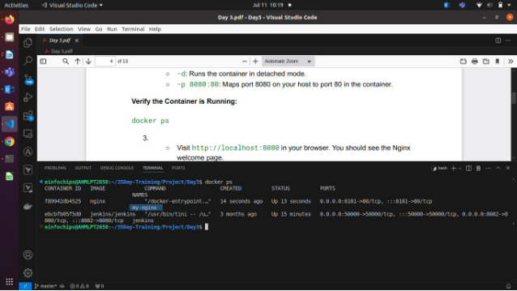

**Run the Nginx Container:**

docker run --name my-nginx -d -p 8080:80 nginx

2\.

- --name my-nginx : Assigns a name to the container.
- -d: Runs the container in detached mode.
- -p 8080:80 : Maps port 8080 on your host to port 80 in the container.

**Verify the Container is Running:** docker ps

3\.

- Visit http://localhost:8080 in your browser. You should see the Nginx welcome page.

**Part 2: Modifying the Container and Creating a New Image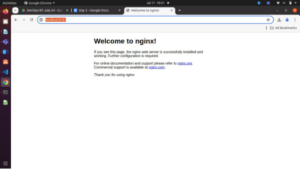**

**Objective:** Modify the running Nginx container to serve a custom HTML page and create a new image from this modified container.

**Steps:**

**Access the Running Container:**

docker exec -it my-nginx /bin/bash

1\.

**Create a Custom HTML Page:**

echo "<html><body><h1>Hello from Docker!</h1></body></html>" > /usr/share/nginx/html/index.html

2\.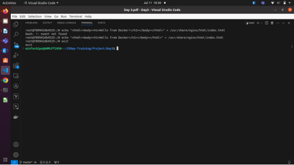

**Exit the Container:**

exit

3\.

**Commit the Changes to Create a New Image:**

docker commit my-nginx custom-nginx

I assgin host port for user is 8182 for just craeted custom image of existing container.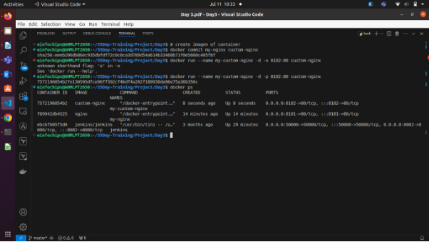

4\.

**Run a Container from the New Image:**

docker run --name my-custom-nginx -d -p 8081:80 custom-nginx

5\.

6. **Verify the New Container:**
- Visit http://localhost:8081 in your browser. You should see your custom HTML page.

**Pa rt 3: **

**Creating a Dockerfile to Build and Deploy a Web Application**

**Objective:** Write a Dockerfile to create an image for a simple web application and run it as a container.

**Steps:**

**Create a Project Directory:**

mkdir my-webapp cd my-webapp

1\.

2. **Create a Simple Web Application:**

Create an index.html file:

<!DOCTYPE html>

<html>

<body>

`    `<h1>Hello from My Web App!</h1> </body>

</html>

- Save this file in the my-webapp directory.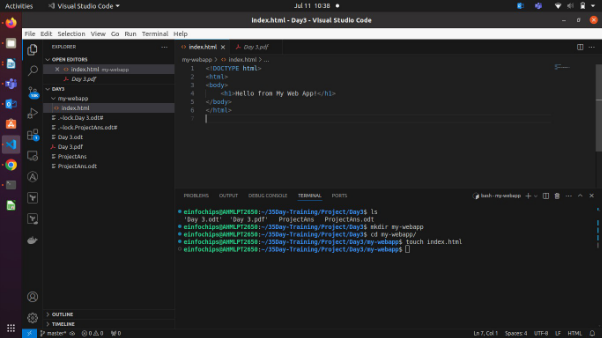
3. **Write the Dockerfile:**

Create a Dockerfile in the my-webapp directory with the following content:

- Use the official Nginx base image FROM nginx:latest
- Copy the custom HTML file to the appropriate location COPY index.html /usr/share/nginx/html/
- Expose port 80 EXPOSE 80

○

**Build the Docker Image:** docker build -t my-webapp-image .

4\.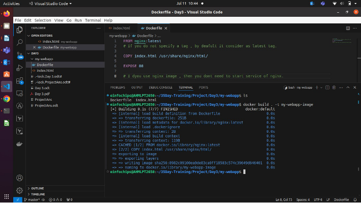

**Run a Container from the Built Image:**

docker run --name my-webapp-container -d -p 8082:80 my-webapp-image

5\.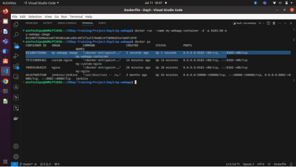

**6. Verify the Web Application:**

- Visit http://localhost:8082 in your browser. You should see your custom web

  application.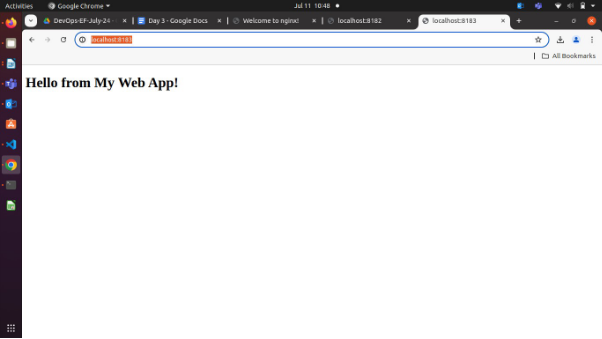

**Part 4: Cleaning Up**

**Objective:** Remove all created containers and images to clean up your environment. **Steps:**

**Stop and Remove the Containers:**

docker stop my-nginx my-custom-nginx my-webapp-container docker rm my-nginx my-custom-nginx my-webapp-container

1. **Remove the Images:**

   docker rmi nginx custom-nginx my-webapp-image

**Docker Project 02**

**Project Overview**

In this advanced project, you'll build a full-stack application using Docker. The application will consist of a front-end web server (Nginx), a back-end application server (Node.js with Express), and a PostgreSQL database. You will also set up a persistent volume for the database and handle inter-container communication. This project will take more time and involve more detailed steps to ensure thorough understanding.

**Part 1: Setting Up the Project Structure**

**Objective:** Create a structured project directory with necessary configuration files. **Steps:**

**Create the Project Directory:**

mkdir fullstack-docker-app cd fullstack-docker-app

1\.

**Create Subdirectories for Each Service:**

mkdir frontend backend database

2. **Create Shared Network and Volume: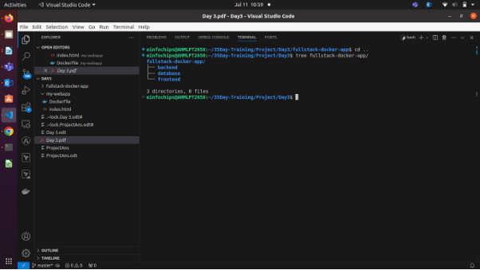**
- Docker allows communication between containers through a shared network.

docker network create fullstack-network

3\.

- Create a volume for the PostgreSQL database.

docker volume create pgdata

**Part 2: Setting Up the Database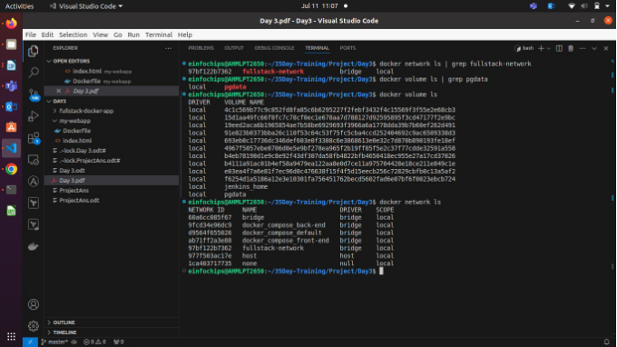**

**Objective:** Set up a PostgreSQL database with Docker.

**Steps:**

**1. Create a Dockerfile for PostgreSQL:**

In the database directory, create a file named Dockerfile with the following content:

FROM postgres:latest

ENV POSTGRES\_USER=user

ENV POSTGRES\_PASSWORD=password ENV POSTGRES\_DB=mydatabase

○

**Build the PostgreSQL Image:**

cd database

docker build -t my-postgres-db . cd ..

2\.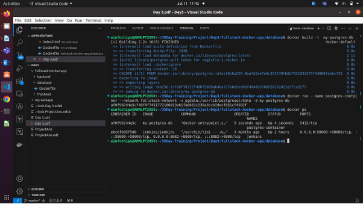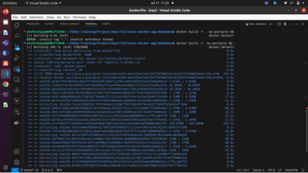

**Run the PostgreSQL Container:**

docker run --name postgres-container --network fullstack-network -v pgdata:/var/lib/postgresql/data -d my-postgres-db

**Part 3: Setting Up the Backend (Node.js with Express)**

**Objective:** Create a Node.js application with Express and set it up with Docker. **Steps:**

**Initialize the Node.js Application:**

cd backend npm init -y

1\.

**Install Express and pg (PostgreSQL client for Node.js):**

npm install express pg

2\.

3. **Create the Application Code:**

In the backend directory, create a file named index.js with the following content:

const express = require('express'); const { Pool } = require('pg'); const app = express();

const port = 3000;

const pool = new Pool({

`    `user: 'user',

`    `host: 'postgres-container',     database: 'mydatabase',

`    `password: 'password',

`    `port: 5432,

});

app.get('/', (req, res) => {

`    `res.send('Hello from Node.js and Docker!'); });

app.get('/data', async (req, res) => {

`    `const client = await pool.connect();

`    `const result = await client.query('SELECT NOW()');     client.release();

`    `res.send(result.rows);

});

app.listen(port, () => {

`    `console.log(`App running on http://localhost:${port}`); });

○

4. **Create a Dockerfile for the Backend:**

In the backend directory, create a file named Dockerfile with the following content: FROM node:latest WORKDIR /usr/src/app 

COPY package\*.json ./ RUN npm install 

COPY . . 

EXPOSE 3000 

CMD ["node", "index.js"] 

○ 

**Build the Backend Image: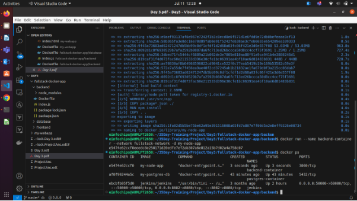**

docker build -t my-node-app . cd ..

5\.

**Run the Backend Container:**

docker run --name backend-container --network fullstack-network -d my-node-app

**Part 4: Setting Up the Frontend (Nginx)**

**Objective:** Create a simple static front-end and set it up with Docker.

**Steps:**

1. **Create a Simple HTML Page:**

In the frontend directory, create a file named index.html with the following content:

<!DOCTYPE html>

<html>

<body>

`    `<h1>Hello from Nginx and Docker!</h1>

`    `
This is a simple static front-end served by Nginx.
 </body>

</html>

○

2. **Create a Dockerfile for the Frontend:**

In the frontend directory, create a file named Dockerfile with the following content:

FROM nginx:latest

COPY index.html /usr/share/nginx/html/index.html

○

**Build the Frontend Image:**

cd frontend

docker build -t my-nginx-app . cd ..

3\.

**Run the Frontend Container:**

docker run --name frontend-container --network fullstack-network -p 8080:80 -d my- nginx-app

In my case port is 8184

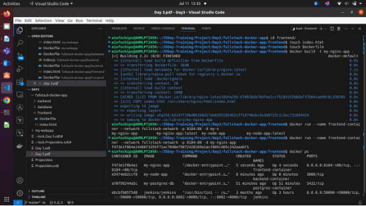

**Part 5: Connecting the Backend and Database**

**Objective:** Ensure the backend can communicate with the database and handle data requests.

**Steps:**

1. **Update Backend Code to Fetch Data from PostgreSQL:**
- Ensure that the index.js code in the backend handles /data endpoint correctly as written above.
2. **Verify Backend Communication:**

Access the backend container:

docker exec -it backend-container /bin/bash

Test the connection to the database using psql :

apt-get update && apt-get install -y postgresql-client psql -h postgres-container -U user -d mydatabase -c "SELECT NOW();"

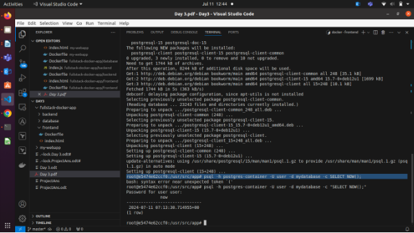

Exit the container: exit

3. **Test the Backend API:**
- Visit http://localhost:3000 to see the basic message.
- Visit http://localhost:3000/data to see the current date and time fetched from PostgreSQL.

**Part 6: Final Integration and Testing**

**Objective:** Ensure all components are working together and verify the full-stack application. **Steps:**

1. **Access the Frontend:**
- Visit http://localhost:8080 in your browser. You should see the Nginx welcome page with the custom HTML.
2. **Verify Full Integration:**

Update the index.html to include a link to the backend:

<!DOCTYPE html>

<html>

<body>

`    `<h1>Hello from Nginx and Docker!</h1>

`    `
This is a simple static front-end served by Nginx.
     <a href="http://localhost:3000/data">Fetch Data from Backend</a> </body>

</html>

○

**Rebuild and Run the Updated Frontend Container:**

cd frontend

docker build -t my-nginx-app .

docker stop frontend-container

docker rm frontend-container

docker run --name frontend-container --network fullstack-network -p 8080:80 -d my- nginx-app

cd ..

3. **Final Verification:**
- Visit http://localhost:8080 and click the link to fetch data from the backend.

**Part 7: Cleaning Up**

**Objective:** Remove all created containers, images, networks, and volumes to clean up your environment.

**Steps:**

**Stop and Remove the Containers:**

docker stop frontend-container backend-container postgres-container docker rm frontend-container backend-container postgres-container

1\.

**Remove the Images:**

docker rmi my-nginx-app my-node-app my-postgres-db

2\.

**Remove the Network and Volume:**

docker network rm fullstack-network docker volume rm pgdata

3\.
