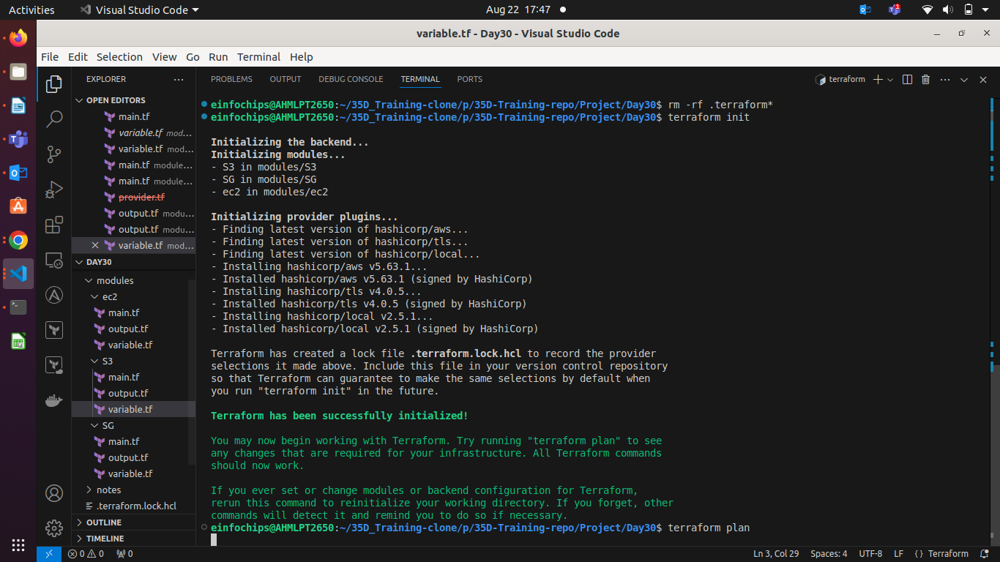
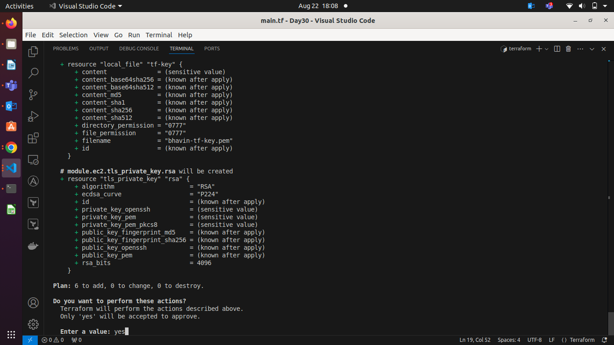
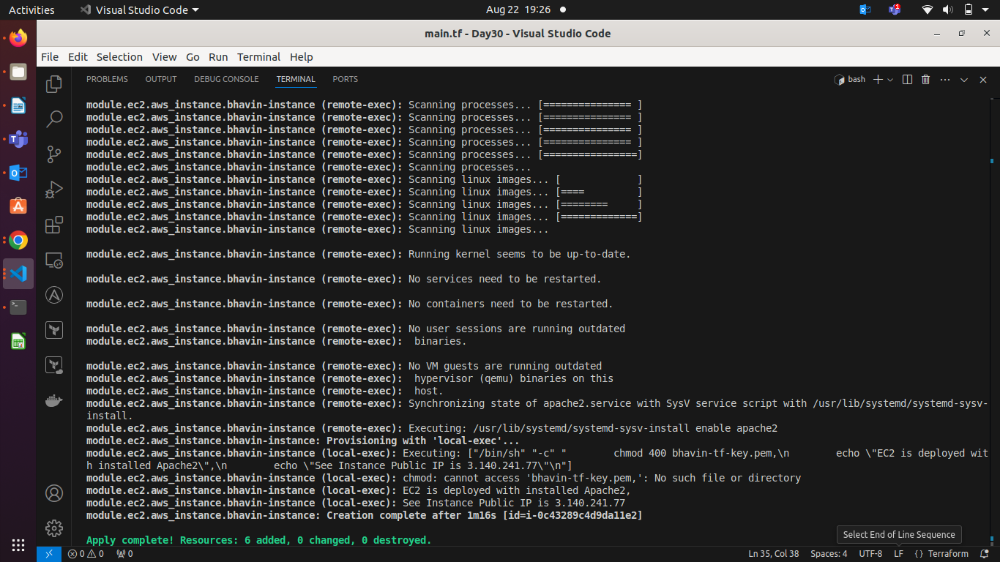
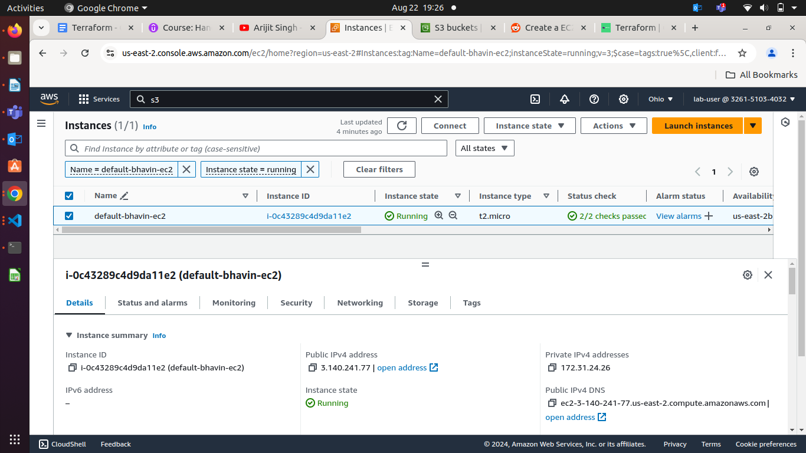
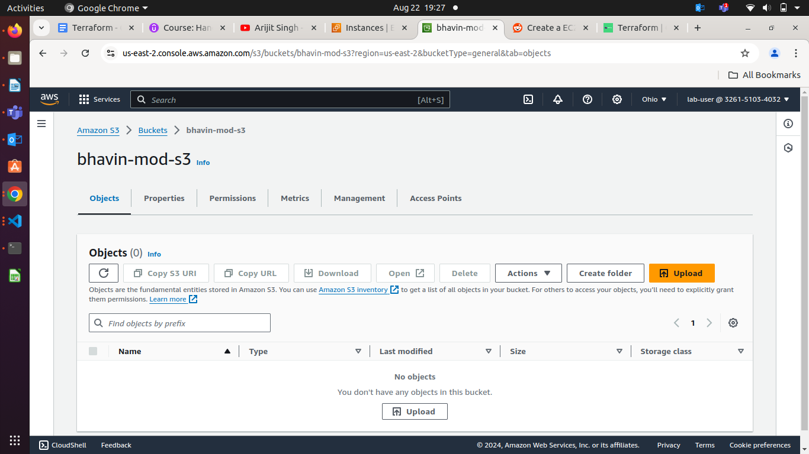
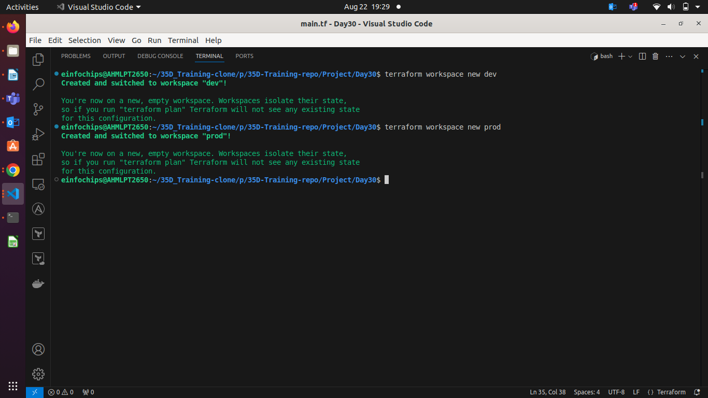
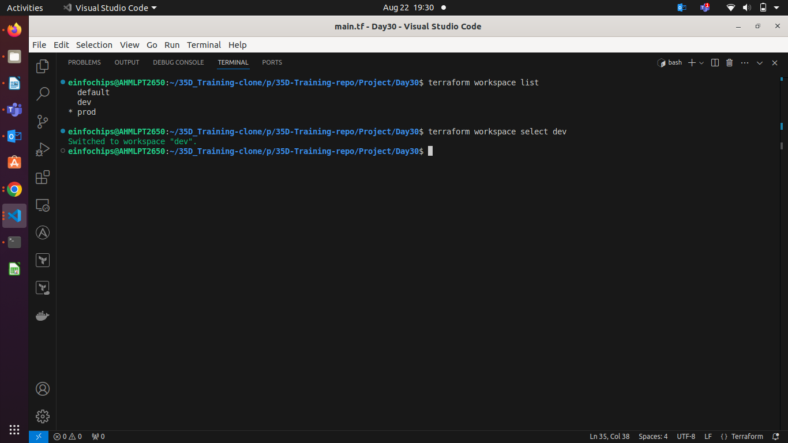
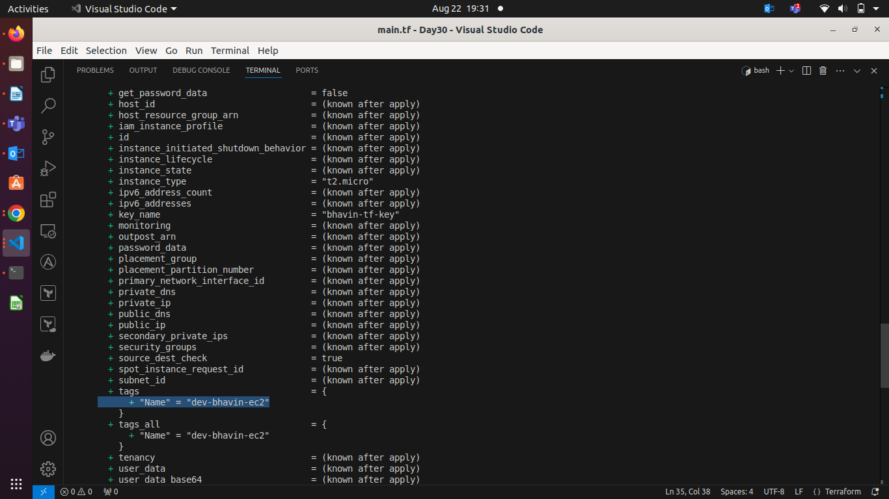

**Day 30**

### **Terraform Workspace**

### **Credentials**

**AWS\_ACCESS\_KEY\_ID \=** "Enter Value"  
**AWS\_SECRET\_KEY\_ACCESS \=** "Enter Value"

**Staging Profile**   
AWS_ACCESS_KEY_ID="Enter Value"  
AWS_SECRET_KEY_ACCESS="Enter Value"

**Production Profile**   
AWS_ACCESS_KEY_ID="Enter Value"  
AWS_SECRET_KEY_ACCESS="Enter Value"

### **Project: Advanced Terraform with Provisioners, Modules, and Workspaces**

#### **Project Objective:**

This project is designed to evaluate participants' understanding of Terraform provisioners, modules, and workspaces. The project involves deploying a basic infrastructure on AWS using Terraform modules, executing remote commands on the provisioned resources using provisioners, and managing multiple environments using Terraform workspaces. All resources should be within the AWS Free Tier limits.

#### **Project Overview:**

Participants will create a Terraform configuration that deploys an EC2 instance and an S3 bucket using a custom Terraform module. The project will also require the use of Terraform provisioners to execute scripts on the EC2 instance. Finally, participants will manage separate environments (e.g., dev and prod) using Terraform workspaces.

#### **Specifications:**

1. **Terraform Modules**:  
   * Create a reusable module to deploy an EC2 instance and an S3 bucket.  
   * The EC2 instance should be of type `t2.micro`, and the S3 bucket should be configured for standard storage.  
   * The module should accept input variables for the instance type, AMI ID, key pair name, and bucket name.  
   * Outputs should include the EC2 instance’s public IP and S3 bucket’s ARN.  
2. **Terraform Provisioners**:  
   * Use `remote-exec` and `local-exec` provisioners to perform post-deployment actions on the EC2 instance.  
   * The `remote-exec` provisioner should be used to connect to the EC2 instance via SSH and run a script that installs Apache HTTP Server.  
   * The `local-exec` provisioner should be used to output a message on the local machine indicating the deployment status, such as "EC2 instance successfully provisioned with Apache."  
3. **Terraform Workspaces**:  
   * Implement Terraform workspaces to manage separate environments (e.g., `dev` and `prod`).  
   * Each workspace should deploy the same infrastructure (EC2 and S3) but with different configurations (e.g., different tags or bucket names).  
   * Ensure that the state for each workspace is managed separately to prevent conflicts between environments.

#### **Key Tasks:**

1. **Module Development**:  
   * **Module Setup**: Create a directory for the module (e.g., `modules/aws_infrastructure`).  

```
modules
├── ec2
│   ├── main.tf
│   ├── output.tf
│   └── variable.tf
├── S3
│   ├── main.tf
│   ├── output.tf
│   └── variable.tf
└── SG
    ├── main.tf
    ├── output.tf
    └── variable.tf

```

   * **Resource Definitions**: Define the resources for an EC2 instance and an S3 bucket within the module.  
**Modules/ec2/main.tf**
```hcl
provider "aws" {
    region = "ap-south-1"
    profile = var.aws_profile
  
}

resource "aws_instance" "bhavin-instance" {
    ami = var.ami
    instance_type = var.instance_type
    vpc_security_group_ids = var.vpc_security_group_ids

    key_name = "bhavin-tf-key-${terraform.workspace}"

    tags = {
        Name = "${terraform.workspace}-bhavin-ec2"
    }


# Install apache2 after instance launched succesfully.
    provisioner "remote-exec" {
        inline = [ 
            "sudo apt-get update -y",
            "sudo apt-get install -y apache2",
            "sudo systemctl start apache2",
            "sudo systemctl enable apache2"
        ]
    # Connect to ec2 via ssh by connection block by terraform
    connection {
      type = "ssh"
      user = "ubuntu"
    #   private_key = file("bhavin-tf-key.pem")
      host = self.public_ip
    #   private_key = tls_private_key.rsa.private_key_pem
      private_key = file(local_file.tf-key.filename)
        }
    }
    depends_on = [ aws_key_pair.tf-key-pair ]

    provisioner "local-exec" {
        command = <<EOT
        chmod 400 'bhavin-tf-key.pem',
        echo "EC2 is deployed with installed Apache2",
        echo "See Instance Public IP is ${self.public_ip}"
        EOT
      
    }
}

# Create SSH private key file and use it for ssh by terraform

resource "aws_key_pair" "tf-key-pair" {
    key_name = "bhavin-tf-key-${terraform.workspace}"
    public_key = tls_private_key.rsa.public_key_openssh
}
resource "tls_private_key" "rsa" {
    algorithm = "RSA"
    rsa_bits = 4096
}
resource "local_file" "tf-key" {
    content = tls_private_key.rsa.private_key_pem
    filename = "bhavin-tf-key-${terraform.workspace}.pem"
}

```
**Modules/ec2/variable.tf**
```hcl
variable "ami" {
   type = string
   description = "This value will be given by user"
#    default = "ami-12456"
}

variable "instance_type" {
    type = string
    description = "This type will also given by user"
}

# variable "instance_tag" {
#     default = "Bhavin-ec2-tf"
# }

variable "vpc_security_group_ids" {

}
variable "aws_profile" {
  type = string
  description = "User will give input of aws profile"
  # default = "default"
}
```

**modules/SG/main.tf**
```hcl
resource "aws_security_group" "sg" {
    name = var.ec2_sg_name

    ingress {
        from_port = var.ingress_ssh.from_port
        to_port = var.ingress_ssh.to_port
        protocol = "tcp"
        cidr_blocks = var.cidr_blocks
    }
    ingress {
        from_port = var.ingress_http.from_port
        to_port = var.ingress_http.to_port
        protocol = "tcp"
        cidr_blocks = var.cidr_blocks
    }
    ingress {
        from_port = var.ingress_https.from_port
        to_port = var.ingress_https.to_port
        protocol = "tcp"
        cidr_blocks = var.cidr_blocks
    }
    ingress {
        from_port = var.ingress_icmp.from_port
        to_port = var.ingress_icmp.to_port
        protocol = "icmp"
        cidr_blocks = var.cidr_blocks
    }
    egress {
        from_port = 0
        to_port = 0
        protocol = -1
        cidr_blocks = ["0.0.0.0/0"]
    }
}

```

**modules/S3/main.tf**
```hcl
resource "aws_s3_bucket" "bhavin-s3" {
    bucket = var.s3_bucket_name
    
    tags = {
        Name = var.s3_tag_name
    }
}
```

   * **Variable Inputs**: Define input variables for instance type, AMI ID, key pair name, and S3 bucket name.  
   * **Outputs**: Define outputs for the EC2 instance's public IP and the S3 bucket's ARN.  

**modules/ec2/output.tf**

```hcl
output "Public_ip" {
    value = aws_instance.bhavin-instance.public_ip
}
```

2. **Main Terraform Configuration**:  
   * **Main Config Setup**: In the root directory, create a Terraform configuration that calls the custom module.  

**main.tf**
```hcl
provider "aws" {
  region = "us-east-2"
}

module "ec2" {
    source = "./modules/ec2"
    vpc_security_group_ids = [module.SG.sg_id]
    ami = "ami-085f9c64a9b75eed5"
    instance_type = var.instance_type
    aws_profile = "default"

}

variable "instance_type" {
  
}

module "SG" {
    source = "./modules/SG"
    ec2_sg_name = "bhavin-${terraform.workspace}"
}
module "S3" {
    source = "./modules/S3"
    s3_bucket_name = "bhavin-s3-${terraform.workspace}"
}
```

   * **Backend Configuration**: Configure Terraform to use local state storage for simplicity (optional for Free Tier compliance).  

**terraform plan OutPut**



**terraform apply**




**terraform apply OutPut**



**EC2 Created with default workspace**



**S3 Bucket Created**



**workspace created dev and prod**

```hcl
terraform workspace create dev
```

**Swich to other workspace**
```hcl
terraform  workspace select dev
```



**See Current WorkSpace is dev**

```hcl
terraform workspace list
```



**Workspace OutPut**



3. **Provisioner Implementation**:  
   * **Remote Execution**: Use the `remote-exec` provisioner to SSH into the EC2 instance and execute a script that installs Apache.  
   * **Local Execution**: Use the `local-exec` provisioner to print a confirmation message on the local machine after successful deployment.  
4. **Workspace Management**:  
   * **Workspace Creation**: Create Terraform workspaces for `dev` and `prod`.  
   * **Environment-Specific Configurations**: Customize the EC2 instance tags and S3 bucket names for each workspace to differentiate between environments.  
   * **Workspace Deployment**: Deploy the infrastructure separately in the `dev` and `prod` workspaces.  
5. **Validation and Testing**:  
   * **Apache Installation Verification**: After the deployment, verify that Apache is installed and running on the EC2 instance by accessing the public IP address in a web browser.  
   * **Workspace Separation**: Confirm that each workspace has its own isolated infrastructure and state files.  
   * **Provisioner Logs**: Review the output from the `local-exec` provisioner to ensure it indicates successful deployment.  
6. **Resource Cleanup**:  
   * **Destroy Resources**: Use `terraform destroy` to remove the resources in both workspaces.  
   * **Workspace Management**: Confirm that the resources are destroyed separately in each workspace and that the state files are updated accordingly.  
7. **Documentation**:  
   * **Module Documentation**: Provide detailed documentation of the Terraform module, including variable definitions, provisioners, and outputs.  
   * **Workspace Documentation**: Document the process for creating and managing Terraform workspaces.  
   * **Provisioner Documentation**: Include descriptions of the provisioners used and their purpose.

#### **Deliverables:**

* **Terraform Module**: The reusable module files in the `modules/aws_infrastructure` directory.  
* **Main Terraform Configuration**: The root Terraform configuration files.  
* **Provisioner Scripts**: Any scripts used by the `remote-exec` provisioner for post-deployment configuration.  
* **Workspace Documentation**: Documentation explaining the use of Terraform workspaces.  
* **Validation Screenshots/Logs**: Screenshots or logs showing the successful execution of provisioners and Apache running on the EC2 instance.  
* **Cleanup Confirmation**: Evidence that resources have been successfully destroyed in all workspaces.

#### **Estimated Time:**

This project is designed to be completed in **2 hours**.