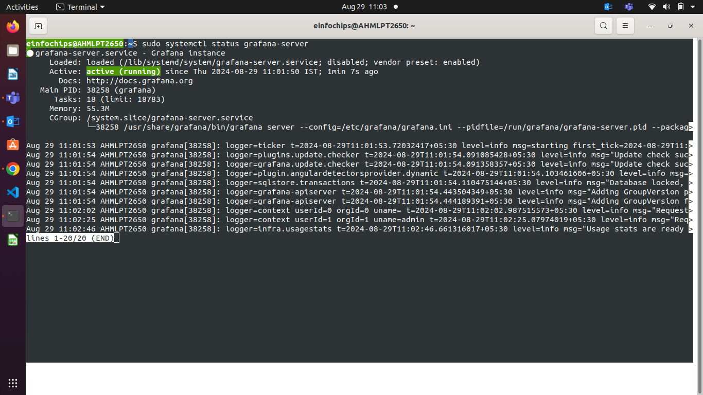
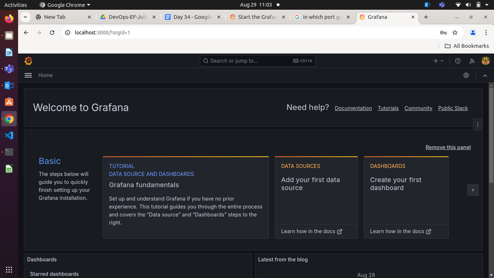

## Grafana Overview

##### Grafana is a visualization tool for your application metrics, logs.

##### Prometheus will collect data from you defined jobs like node exporter, mysql exporter and all this metrics will be send to the Grafana.
##### Grafana will receive metrics, logs from prometheus and show to you into visualize formate like dashboard.

- You can customize your dashboard in grafana.
- You can make queries for fileter the metrics and show it into graph.

##### Grafana is running on default port is 3000

#### Lets Get started with Grafana

**Add Repositroy**
```
sudo apt-get install -y apt-transport-https software-properties-common wget
```

**Import GPG Key**
```
sudo mkdir -p /etc/apt/keyrings/
wget -q -O - https://apt.grafana.com/gpg.key | gpg --dearmor | sudo tee /etc/apt/keyrings/grafana.gpg > /dev/null
```

**To add a repository for stable releases, run the following command**
```
echo "deb [signed-by=/etc/apt/keyrings/grafana.gpg] https://apt.grafana.com stable main" | sudo tee -a /etc/apt/sources.list.d/grafana.list
```

**To add a repository for beta releases, run the following command**
```
echo "deb [signed-by=/etc/apt/keyrings/grafana.gpg] https://apt.grafana.com beta main" | sudo tee -a /etc/apt/sources.list.d/grafana.list
```

**Now you need to update packages**

    sudo apt-get update

**Instll Grafana**

    sudo apt-get install grafana

**You use Grafana you have to start the service of Grafana**
```
sudo systemctl daemon-reload
sudo systemctl start grafana-server
```
**Ensure Grafana is Running State**
```
sudo systemctl status grafana-server
```


Grafana is running on default port **3000**
```
localhost:3000
```




