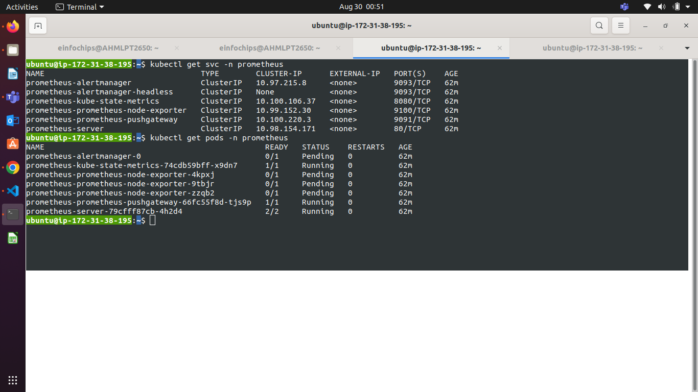
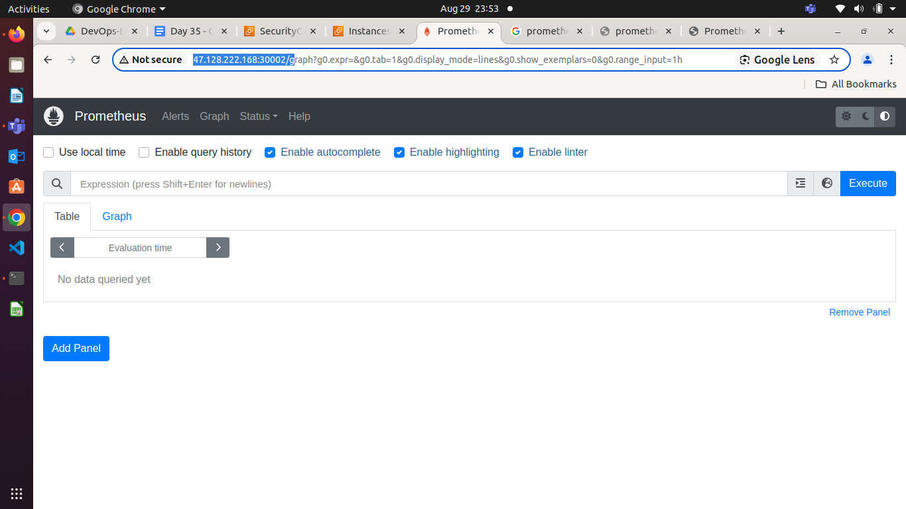
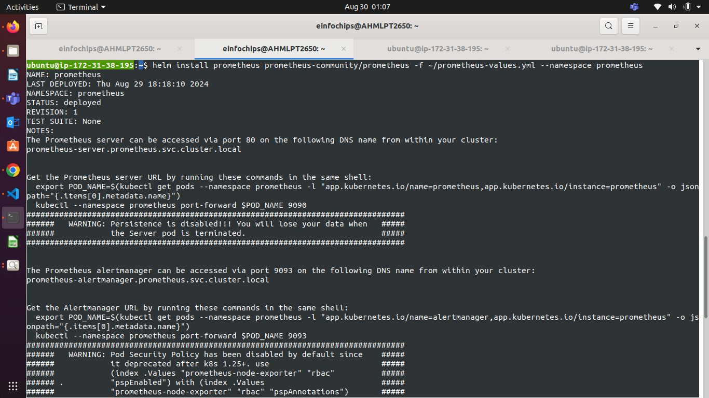
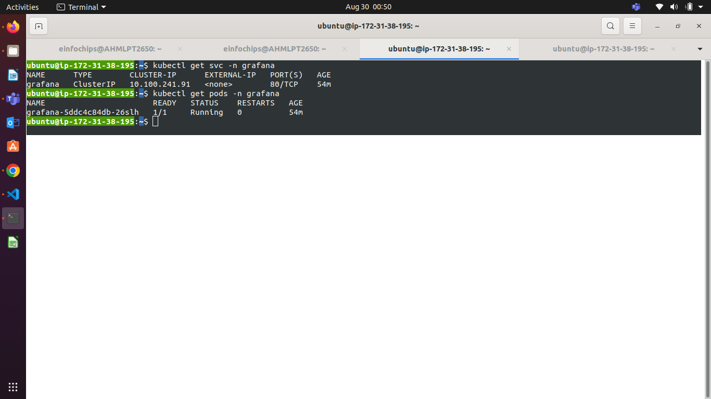
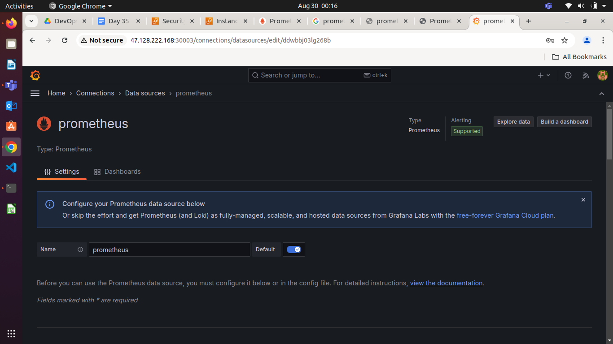
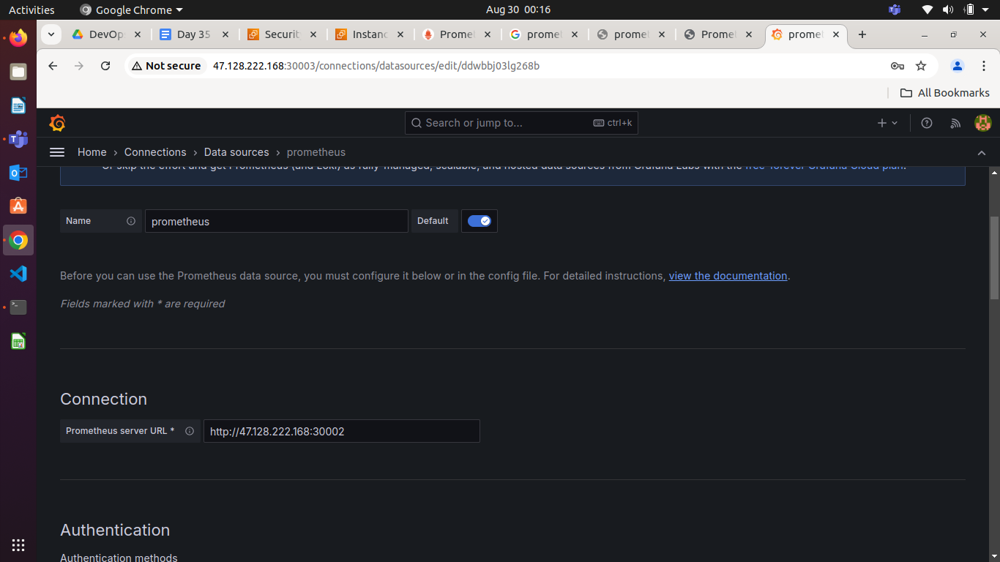
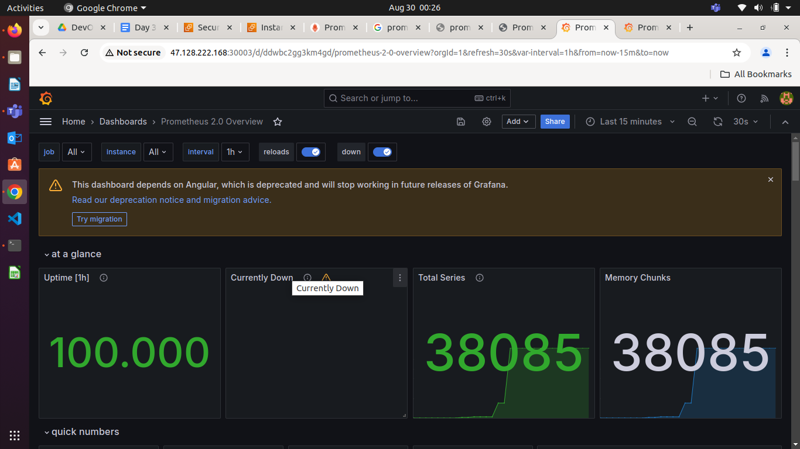
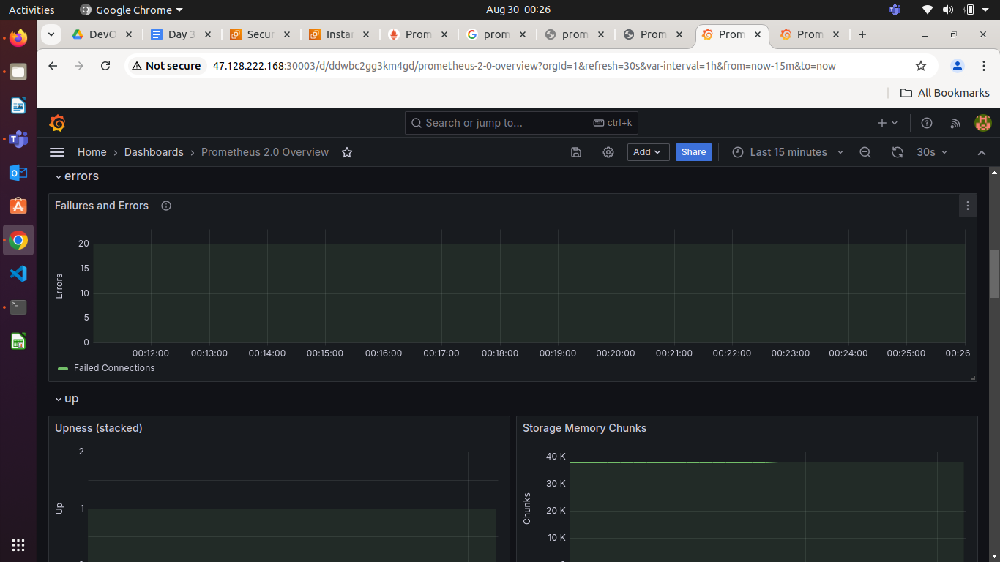
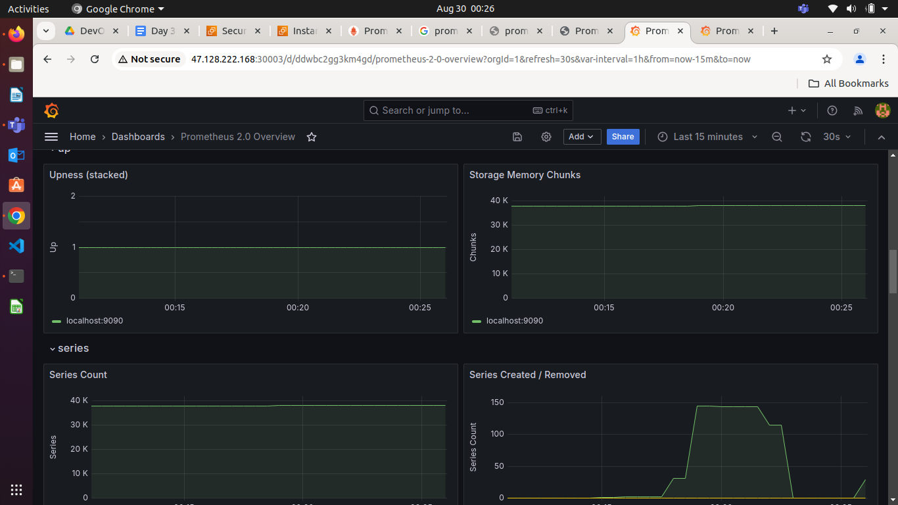
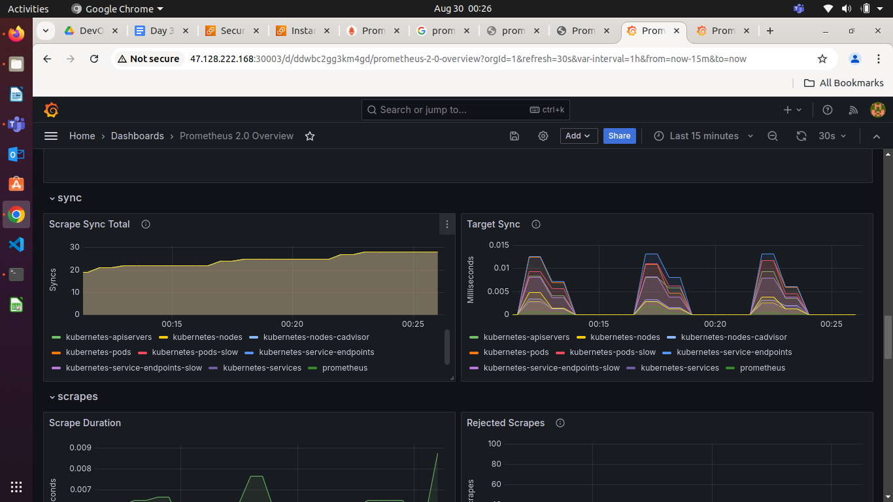

### **Project: Monitoring Kubernetes Applications Using Prometheus and Grafana on EC2 Instances (2 Hours)**

#### **Lab Credentials:** same as before (in ap-northeast-1, ap-northeast2, ap-southeast-1, ap-southeast-2)

#### **Project Overview**

In this project, you will deploy a Kubernetes application on AWS EC2 instances and set up a monitoring stack using Prometheus and Grafana. The goal is to monitor the application's performance and visualize metrics using Grafana dashboards. This project is designed to test your knowledge of deploying and configuring monitoring solutions in a Kubernetes environment on AWS.

#### **Project Objectives**

* Deploy a Kubernetes cluster on EC2 instances.  
* Install Prometheus to monitor Kubernetes cluster metrics.  
* Install Grafana and configure it to visualize metrics from Prometheus.  
* Create custom Grafana dashboards to monitor specific application metrics.  
* Demonstrate how to set up alerts in Grafana based on specific thresholds.  
* Terminate all AWS resources after completing the project.

#### **Project Requirements**

* **AWS EC2 Instances**: Launch a minimum of 3 t2.micro instances for the Kubernetes master and worker nodes.  
* **Kubernetes Cluster**: Set up a Kubernetes cluster using Kubeadm on the EC2 instances.  
* **Prometheus**: Deploy Prometheus on the Kubernetes cluster to collect metrics.  

* **Grafana**: Deploy Grafana on the Kubernetes cluster and configure it to use Prometheus as a data source.  
* **Custom Dashboards**: Create custom Grafana dashboards to monitor application metrics.  
* **Alerting**: Set up basic alerts in Grafana for key metrics (e.g., CPU usage, memory usage).  
* **Termination**: Ensure all AWS resources are terminated after the project is complete.

#### **Step-by-Step Project Tasks**

**1\. Launch AWS EC2 Instances (20 Minutes)**

* Launch three EC2 instances of type `t2.micro` in the same VPC and availability zone.  
* Configure security groups to allow SSH access (port 22\) and necessary ports for Kubernetes, Prometheus, and Grafana (e.g., ports 9090, 3000).  
* SSH into the instances and update the package manager.

**2\. Set Up a Kubernetes Cluster (30 Minutes)**

* On the master node, install Kubeadm, Kubelet, and Kubectl.  


* Initialize the Kubernetes cluster using Kubeadm.  
* Join the worker nodes to the master node to complete the cluster setup.  
* Verify that the cluster is working by deploying a sample application (e.g., Nginx).


**3\. Deploy Prometheus on Kubernetes (20 Minutes)**

* Create a Kubernetes namespace for monitoring tools.  

```
kubectl creat namespace prometheus
```
**Add prometheus charts**
```
helm repo add prometheus-community https://prometheus-community.github.io/helm-charts
```

**After add helm repo you have to update repo**

```
helm repo update
```

**Deploy Promethesu**
```
helm install prometheus prometheus-community/prometheus -f ~/prometheus-values.yml --namespace prometheus
```

**To See the pods are deploye**
```
kubectl get pods -n prometheus**
```



**To Access the prometheus from browser**
```
kubectl port-forward service/prometheus-server --address 0.0.0.0 30002:80 --namespace prometheus
```

**To Access prometheus from browser**

```
Public_ip:port

Pubilc_ip:30002
```



* Use a Helm chart to deploy Prometheus or manually deploy Prometheus using Kubernetes manifests.  
* Expose Prometheus using a Kubernetes service.  
* Verify that Prometheus is collecting metrics from the Kubernetes cluster.

**4\. Deploy Grafana on Kubernetes (20 Minutes)**

* Deploy Grafana in the monitoring namespace. 
```
kubectl create namespace grafana
```

**Add repo for grafana**

```
helm repo add grafana https://grafana.github.io/helm-charts
Grafana Community Kubernetes Helm Charts
```
**Update grafana repo**
```
helm repo update
```

**Deploy Grafana**

```
helm install grafana grafana/grafana --namespace grafana

```



**Ensure Prometheus Pods and Services is Running**



**To Access Grafana from Browser**

```
kubectl port-forward service/grafana --address 0.0.0.0 30003:80 --namespace grafana
```

**Try to access grafana on port 30003**
```
public_ip:30003
```

**Oh!, Grafana doesn't allow you to login**

Bydefault username is admin but password you have to create by using email and secrets

We will use secrets

```
kubectl get secret --namespace grafana grafana -o jsonpath="{.data.admin-password}" | base64 --decode
```

**A logn password will be see on screen copy it and use it into login**

Run Grafana service by forwarding port

```
kubectl port-forward service/grafana --address 0.0.0.0 30003:80 --namespace grafana
```

**Congrats! you can login into grafana and can see the web interface**


* Expose Grafana using a Kubernetes service and set up port forwarding or a LoadBalancer for external access.  
* Configure Grafana to use Prometheus as a data source.  

Go to connection>Datasource> choose Datasource as prometheus



Give hostname:port where your prometheus is running to get metrics for visualize.




* Verify that Grafana can visualize metrics from Prometheus.









**5\. Create and Configure Custom Dashboards (20 Minutes)**

* Create custom dashboards in Grafana to monitor key metrics such as CPU usage, memory usage, pod status, and network traffic.  
* Save the dashboards for future use.  
* Share the dashboard URLs for easy access.

**6\. Clean Up Resources (10 Minutes)**

* After completing the project, delete all Kubernetes resources (Prometheus, Grafana, and sample application).  
* Terminate all EC2 instances used in the project to avoid unnecessary charges.

#### **Deliverables**

* **Kubernetes Cluster**: A functioning Kubernetes cluster with at least one master node and two worker nodes.  
* **Prometheus Deployment**: Prometheus deployed on the Kubernetes cluster, collecting metrics.  
* **Grafana Deployment**: Grafana deployed on the Kubernetes cluster, configured with Prometheus as a data source.  
* **Custom Dashboards**: Custom Grafana dashboards displaying relevant metrics.  
* **Alerting Setup**: Basic alerting rules configured in Grafana.  
* **Clean-Up**: All AWS resources terminated upon completion.

**Resetting Password**

### **1\. Stop Jenkins Service**

First, stop the Jenkins service on your server. The command to do this will vary depending on your operating system. For example, on a Linux system using `systemd`:

bash  
Copy code  
`sudo systemctl stop jenkins`

### **2\. Access the Jenkins Home Directory**

Locate the Jenkins home directory, where the configuration files are stored. The default location is usually `/var/lib/jenkins`, but this may vary based on your installation.

### **3\. Reset the Admin Password**

Navigate to the `users` directory within the Jenkins home directory:

`cd /var/lib/jenkins/users`

1. 

If you know the username and just need to reset the password, find the directory corresponding to the username and edit the `config.xml` file inside it:  
bash  
Copy code  
`sudo nano <username>/config.xml`

2.   
3. Look for the `<passwordHash>` field. You can replace this with a hash of a known password or delete it entirely to set a new password via the Jenkins UI upon restarting.

### **4\. Delete the `config.xml` to Reset Username**

If you want to reset the username, delete the corresponding user directory under the `users` directory:

bash  
Copy code  
`sudo rm -r /var/lib/jenkins/users/<username>`

This will remove the user from Jenkins, and you'll be prompted to create a new user upon starting Jenkins again.

### **5\. Start Jenkins Service**

Once you've made the necessary changes, restart the Jenkins service:

bash  
Copy code  
`sudo systemctl start jenkins`

### **6\. Create New Admin User**

Open your web browser and navigate to your Jenkins URL. You should be prompted to set up a new admin user. Follow the on-screen instructions to create a new username and password.

