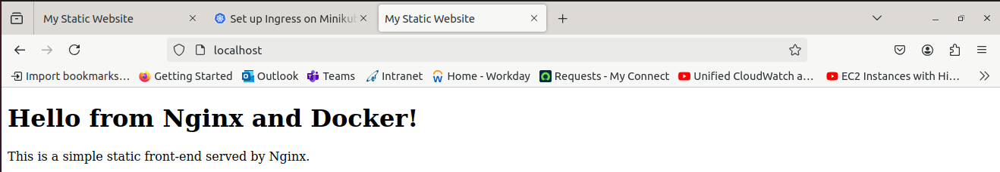
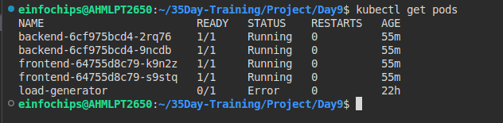
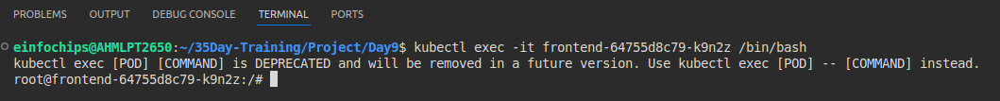
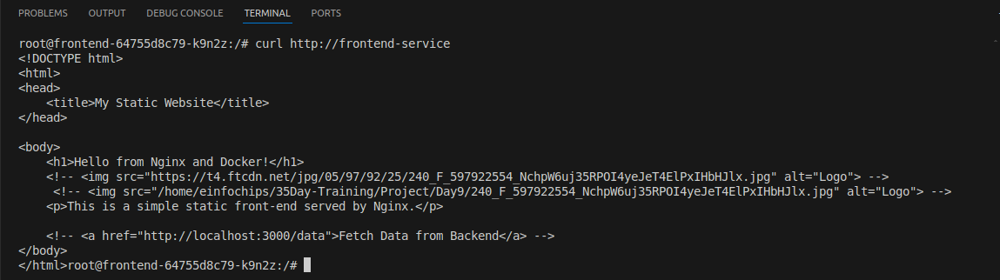
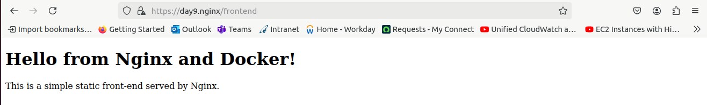
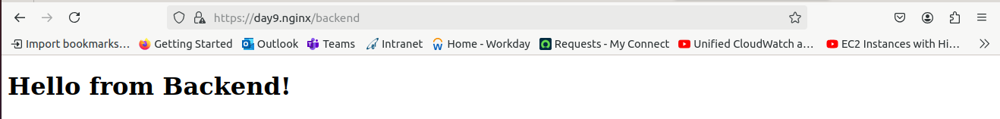
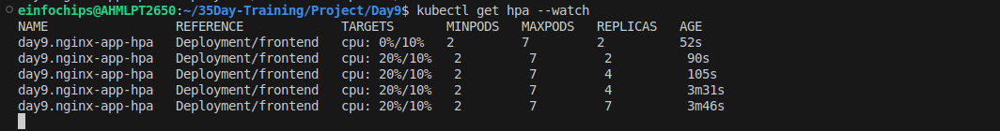

# Project 09 Overview

####  Deploy simple static web-app by kubernetes cluster.
- Setup Ingeress and make your own rules based on Path, Requests based.
- Deploy with Sticky Session.
- To make High availability when no. of requests / users are increase Use HPA or VPA.
- I will prefer HPA. Horizontal Pod Autoscaler.

 The project will be divided 4 stages, with each stage focusing on specific aspects of Kubernetes ingress, URL rewriting, sticky sessions, and autoscaling.


#### Stage 1. Deploy Static Web App and create kubernetes menifast.


○ Create a Dockerfile for a simple static web application (e.g., an HTML page
    served by Nginx).

####  First create index.html file to serve by nginx.
```html
        <!DOCTYPE html>
        <html>
        <head>
            <title>My Static Website</title>
        </head>

        <body>
            <h1>Hello from Nginx and Docker!</h1>
            <p>This is a simple static front-end served by Nginx.</p>

        </body>
        </html>
```
○ Build a Docker image for the static web application.
#### Use below command to create docker image.
    docker build -t "your_image_name" .

In my case

    docker build -t bhavin1099/bhavin1099/nginxwget:v1 . 

○ Push the Docker image to Docker Hub or a local registry to use it by kubernetes.

    docker push bhavin1099/nginxwget:v1 

###### Before use this image in kubernetes deployment Test this image in your local first.
###### If decker container starteed & exited that means your image is not run properly & if your image not running then your deployment will not be succesfull. it will give error ImagePullBack.

#### Create kubernetes menifast.

This is image of docker image is running locally.



First create front-end deployment.yml file where we will deploy our app. 


```yml
        apiVersion: apps/v1
        kind: Deployment
        metadata:
        name: frontend  # Is a Deoloyment Name
        spec:
        replicas: 2
        selector:
            matchLabels:
            app: frontend
        template:
            metadata:
            labels:
                app: frontend
            spec:
            containers:
            - name: frontend
                image: bhavin1099/nginxwget:v1
                ports:
                - containerPort: 80
                resources:
                requests:
                    cpu: "10m"
                limits:
                    cpu: "50m"
```

Now, create Front-end Service.yml
```yml
        apiVersion: v1
        kind: Service
        metadata:
        name: frontend-service
        spec:
        selector:
            app: frontend
        ports:
        - protocol: TCP
            port: 80
            targetPort: 80
```

Now, create Back-end-deployment.yml
Bcz, I will deploy my web-app for frontend and backend use.
Thatsfor i need to create front-end and back-end Deployment and Service of pods.

```yml
        # backend-deployment.yaml
        apiVersion: apps/v1
        kind: Deployment
        metadata:
        name: backend  # Deployment Name.
        spec:
        replicas: 2 
        selector:
            matchLabels:
            app: backend
        template:
            metadata:
            labels:
                app: backend
            spec:
            containers:
            - name: backend
                image: bhavin1099/nginxbackend:v1     
                ports:
                - containerPort: 80
```
                    

Now, create Backend-service.yml

```yml
        apiVersion: v1
        kind: Service
        metadata:
        name: backend-service
        spec:
        selector:
            app: backend
        ports:
            - protocol: TCP
            port: 80
            targetPort: 80
```

Now, apply this deployment and service by below commands.

    kubectl apply -f .

Now, check your frontend web-app is working in cluster.

you need get inside in pod and perform curl/
  To get lists of all pods.

    kubectl get pods

  

  see for pods created for frontend & copy it.

To get inside the pod run this command.

    kubectl exec -it "your frontend-pod-name" /bin/bash

  in my case

    kubectl exec -it frontend-64755d8c79-k9n2z /bin/bash

  

Run this command to ensure your frontend web-app is running in cluster only.

    curl http://"your frontend-service-name"

in my case

    curl http://frontend-service


   

This is clusterIP means, Only you can use this web-app internally only.
If your user want to access your web-app from any where means outside of your cluster.
They can't be able to access your web-app. Bcz, this is ClusterIP servie.

For that you have to use,
    1. NodePort -- if your pods are setup on your node.
    2. LoadBalancer -- if your infrastructure setup on your cloud provider platform.

#### Stage 2: Configuring Ingress Networking

What will we learn ?

If your user want to access your web-app , you have make your own rule like
  request based -- GET, POST, PUT 
  path based -- 
      Preset -- "your web-app url/path/sub-path/
      Actual -- "your web-app url/path
                here, only /path allowed, not sub-folder.

  sticky sessions
  tls certificate to ensure & encrypt your users requests.


To create Ingress, you have to write kind: Ingress
apiVersion: apiVersion: networking.k8s.io/v1
bcz, all types of api is availabel in this networking.k8s.io/v1

  To redirect your request on given path after url/path  & serve by nginx like proxy use, below syntax.
  
    nginx.ingress.kubernetes.io/rewrite-target: /


  To make cookies in sticky session , use below syntax,

    nginx.ingress.kubernetes.io/affinity: "cookie"
    nginx.ingress.kubernetes.io/session-cookie-name: "route"

  To ssl redirect use,

    nginx.ingress.kubernetes.io/ssl-redirect: "true"


Lets, create the final ingress-resource.yml
```yml
        apiVersion: networking.k8s.io/v1
        kind: Ingress
        metadata:
        name: example-ingress
        annotations:
            nginx.ingress.kubernetes.io/rewrite-target: /
            nginx.ingress.kubernetes.io/affinity: "cookie"
            nginx.ingress.kubernetes.io/session-cookie-name: "route"
            nginx.ingress.kubernetes.io/ssl-redirect: "true"
        spec:
        tls:
        - hosts:
            - day9.nginx
            secretName: tls-secret
        # spec:
        rules:
        - host: day9.nginx
            http:
            paths:
            - path: /frontend
                pathType: Prefix
                backend: 
                service:
                    name: frontend-service
                    port:
                    number: 80
            - path: /backend
                pathType: Prefix
                backend:
                service: 
                    name: backend-service
                    port: 
                    number: 80
```

To use Ingress , Bydefault Ingress is diabled in kuberntes

you have to enable Ingress first.

    minikube addons enable ingress


To use ssl certificate and you dont have it. you can generate for your self for Internally and Testing purose, by below command.

    openssl req -x509 -nodes -days 365 -newkey rsa:2048 -keyout tls.key -out tls.crt

Use this created tls.key and tls.crt in your kubernetes use below command

    kubectl create secret tls tls-secret --cert=tls.crt --key=tls.key

Here, tls-secret is your secret name. 
To see list of secrets use below command, and you will see the secrets name that is tls-secret.

    kubectl get secrets


You are using minikube for web deployment, to see on browser you have to give host name and minikube ip.

edit /etc/hosts file like below.

    "your minikube ip"    "your custom host name"

In my case,

    xx.xx.xx.xx     day9.nginx

Now apply this ingress by

    kubectl apply -f .

Now, varify your web is running on browser by typing

    "your-custom-host-name"/frontend

In my case,

     day9.nginx/frontend

   

In my case, for backend

     day9.nginx/backend

   


#### Stage 3: Implementing Horizontal Pod Autoscaling


Now, For High Availability as per traffics increase or decrease, use AutoScaling.

I will prefer Horizontal Autoscaling. bcz, this will add new pods/instance in your cluster.


In Hpa min replica is 2 and max replica is 7.
This will trigger while cpu utilization => 10%.

Create hpa.yml 

```yml
        apiVersion: autoscaling/v2

        kind: HorizontalPodAutoscaler

        metadata:
        name: day9.nginx-app-hpa 

        spec: 
        scaleTargetRef:
            apiVersion: apps/v1
            kind: Deployment
            name: frontend

        minReplicas: 2
        maxReplicas: 7
        metrics:
        - type: Resource
            resource:
            name: cpu
            target:
                type: Utilization
                averageUtilization: 10
```

To Apply this HPA use below command

    kubectl apply -f hpa.yml

To Ensure hpa is applied use below command

    kubectl get hpa

       

If you see **unknow**/10% in kubectl get hpa , that means your kubernets can't read your node resource metrics.

Bcz, metrics server is disabled.

You have to enable metrics server

    minikube addons enable metrics-server


#### Stage 4: Load Test

Test the HPA by send lot of traffics to check HPA is working for adding/removing replicas.

To delete load generator if it is exists

    kubectl delete pod load-generator --grace-period=0 --force

Create load generator

    kubectl run -i --tty --rm load-generator --image=busybox --restart=Never -- /bin/sh

Send infinites traffic on my hosts by,

    while true; do wget -q -O- http://day9.nginx; done

Monitor realtime HPA by below command

    kubectl get hpa --watch

   


